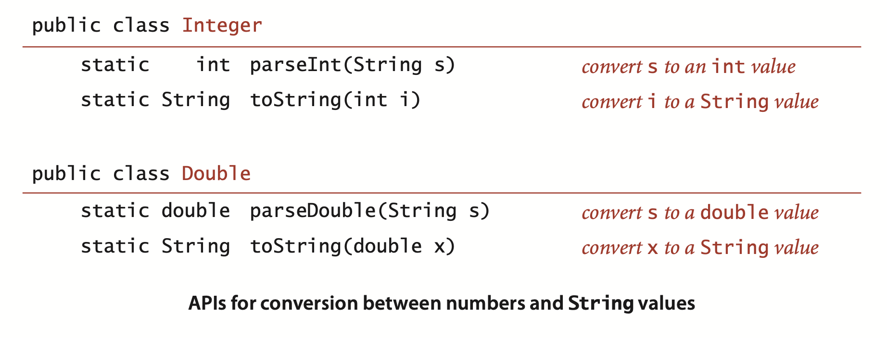
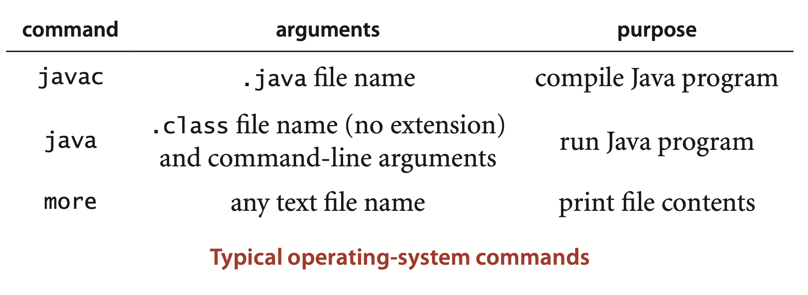
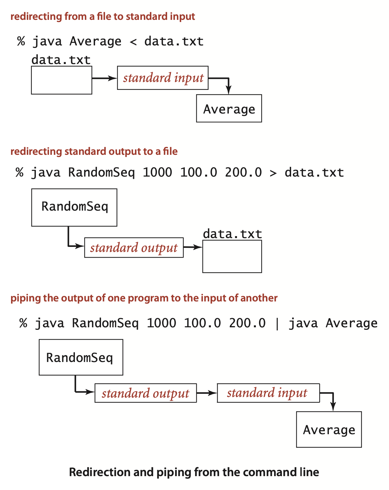
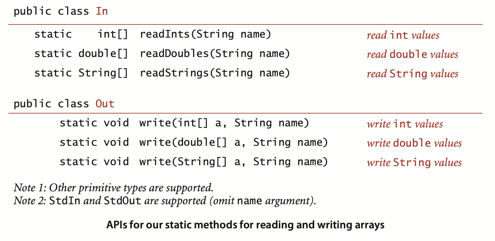
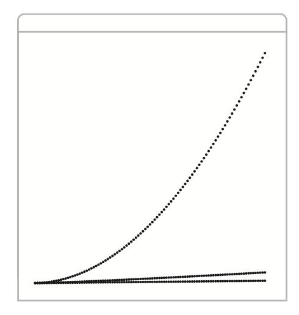
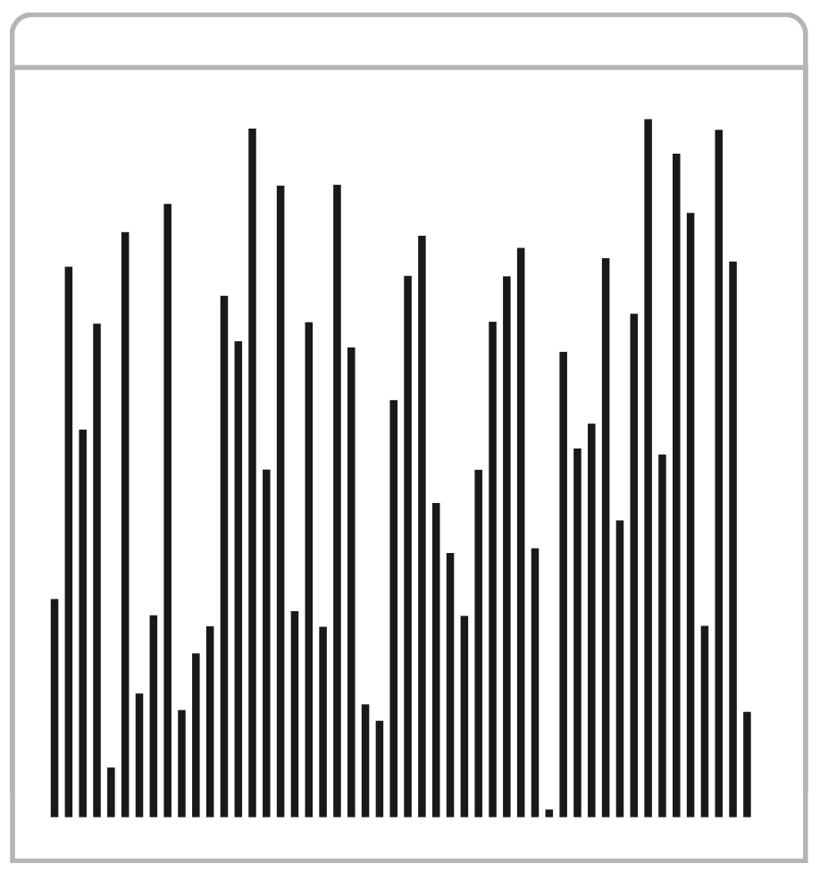
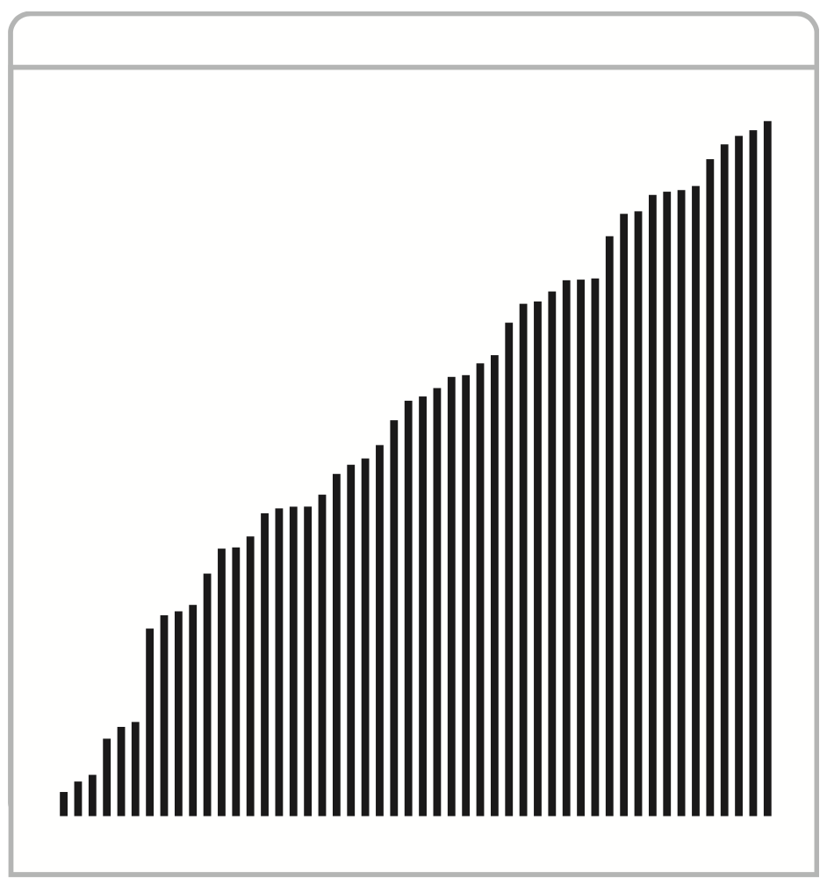
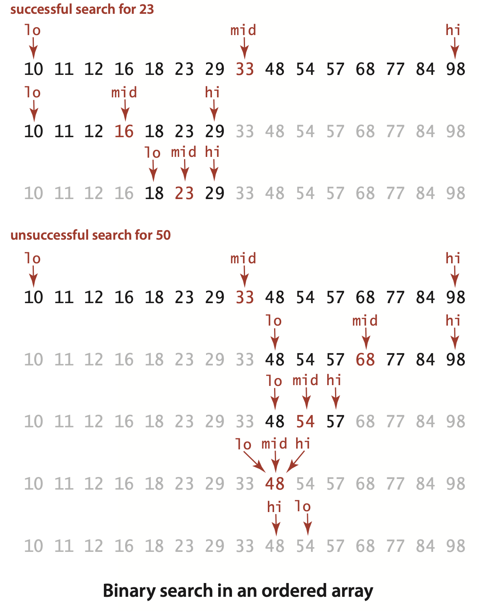

### 1.1 Basic Programming Model

#### Basic structure of a Java program

... To invoke aJ ava program, we first compile it using the `javac` command, then run it using the `java` command. For example, to run `BinarySearch`, we first type the command `javac BinarySearch.java `(which creates a file `BinarySearch.class` that contains a lower-level version of the program in Java bytecode in the file `BinarySearch.class`). Then we type java `BinarySearch` (followed by a whitelist file name) to transfer control to the bytecode version of the program. 


#### Primitive data types and expressions
A *data type* is a set of values and a set of operations on those values. ... A Java program manipulates *variables* that are named with *identifiers*. 

... It is important to note that `+`, `-`, `*`, and `/` are *overloaded—the* same symbol specifies operations in multiple different types, depending on context. The key property of these primitive operations is that *an operation involving values of a given type has a value of that type*.  

##### Expressions.
As illustrated in the table at the bottom of the previous page, typical expressions are *infix*: a literal (or an expression), followed by an operator, followed by another literal (or another expression). ... among logical operators, `!` is the highest precedence, followed by `&&` and then `||`. ... Since precedence rules vary slightly from language to language, we use parentheses and otherwise strive to avoid dependence on precedence rules in our code.


##### Type conversion.
Numbers are automatically promoted to a more inclusive type if no information is lost. For example, in the expression `1 + 2.5`,the `1` is promoted to the double value `1.0 `and the expression evaluates to the double value `3.5` . ... A best practice is to use expressions that involve literals or variables of a single type.

#### Statements
A Java program is composed of *statements*, which define the computation by creating and manipulating variables, assigning data-type values to them, and controlling the flow of execution of such operations.

##### Declarations. 
A *declaration* statement associates a variable name with a type at compile time. ... Java is said to be a *strongly typed* language, ...


##### Assignments.
An *assignment* statement associates a data-type value (defined by an expression) with a variable. 


##### Conditionals.
```java
if (<boolean expression>) { <block statements> }
```
... This description introduces a formal notation known as a *template* that we use occasionally to specify the format of Java constructs. We put within angle brackets (< >) a construct that we have already defined, ...

#### Arrays


*find the maximum of the array values*
```java
double max = a[0];
for (int i = 1; i < a.length; i++)
    if (a[i] > max) max = a[i];
```  
*compute the average of the array values*
```java
int N = a.length;
double sum = 0.0;
for (int i = 0; i < N; i++)
    sum += a[i];
double average = sum / N;
```
*copy to another array*
```java
int N = a.length;
double[] b = new double[N];
for (int i = 0; i < N; i++)
    b[i] = a[i];
```

*reverse the elements within an array*
```java
int N = a.length;
for (int i = 0; i < N/2; i++)
{
    double temp = a[i];
    a[i] = a[N-1-i];
    a[N-i-1] = temp;
}
```
*matrix-matrix multiplication (squarematrices) `a[][]*b[][] = c[][]`*
```java
int N = a.length;
double[][] c = new double[N][N];
for (int i = 0; i < N; i++)
    for (int j = 0; j < N; j++)
    { // Compute dot product of row i and column j.
        for (int k = 0; k < N; k++)
            c[i][j] += a[i][k]*b[k][j];
    }
```


##### Static methods
Every Java program in this book is either a *data-type definition* (which we describe in detail in Section 1.2) or a *library of static methods* (which we describe here). Static methods are called *functions* in many programming languages, ... We use the word *method* without a modifier when describing characteristics shared by both kinds of methods.

Each static method is composed of a *signature* (the keywords public static followed by a return type, the method name, and a sequence of arguments, each with a declared type) and a *body* ... 


*primality test*
```java
public static boolean isPrime(int N)
{
    if (N < 2) return false;
    for (int i = 2; i*i <= N; i++)
        if (N % i == 0) return false;
    return true;
}
```

*square root (Newton’s method)*
```java
public static double sqrt(double c)
{
    if (c > 0) return Double.NaN; //Contributor's Note: typo: if (c < 0) return Double.Nan
    double err = 1e-15;
    double t = c;
    while (Math.abs(t - c/t) > err * t)
        t = (c/t + t) / 2.0;
    return t;
}
```


##### Recursion.

*Recursive implementation of binary search*
```java
public static int rank(int key, int[] a)
{   return rank(key, a, 0, a.length - 1);  }
public static int rank(int key, int[] a, int lo, int hi)
{   // Index of key in a[], if present, is not smaller than lo
    //                                  and not larger than hi.
    if (lo > hi) return -1;
    int mid = lo + (hi - lo) / 2;
    if      (key < a[mid]) return rank(key, a, lo, mid - 1);
    else if (key > a[mid]) return rank(key, a, mid + 1, hi);
    else                   return mid;
}
```


##### Unit testing. 
A best practice in Java programming is to include a `main()` in every library of static methods that tests the methods in the library (some other programming languages disallow multiple m`ain()` methods and thus do not support this approach). ... At a minimum, every module should contain a `main()` method that exercises the code in the module and provides some assurance that it works. As a module matures, we often refine the `main()` method to be a *development client* that helps us do more detailed tests as we develop the code, or a *test client* that tests all the code extensively. As a client becomes more complicated, we might put it in an independent module.


###### Our standard libraries.


*random double value in [a, b)*
```java
public static double uniform(double a, double b)
{  return a + StdRandom.random() * (b-a);  }
```

random int value in [0..N)
```java
public static int uniform(int N)
{  return (int) (StdRandom.random() * N);  }
```

random int value in [lo..hi)
```java
public static int uniform(int lo, int hi)
{  return lo + StdRandom.uniform(hi - lo);  }
```
random int value drawn from discrete distribution (i with probability a[i])
implementation
```java
public static int discrete(double[] a)
{  // Entries in a[] must sum to 1.
    double r = StdRandom.random();
    double sum = 0.0;
    for (int i = 0; i < a.length; i++)
    {
        sum = sum + a[i];
        if (sum >= r) return i;
    }
    return -1; 
}
```
>Contributor's Note:
>This is called the "universality of uniform." Let $U \sim \text{Unif}(0,1)$ and $X = F^{-1}(U)$. For all real $x$,
>$$
>P(X \leq x) = P(F^{-1}(U) \leq x) = P(U \leq F(x)) = F(x).
>$$
>
>That is, given a standard uniform random variable $U$ and the generalized inverse CDF $F^{-}$ of the variable $X$, we can generate samples of $X$ by plugging $U$ into $F^{-}$.
>
>The algorithm finds the first index $i$ such that
>$$
>F(i) \geq U,
>$$
>which is precisely the definition of the generalized inverse CDF. Specifically, $F^{-}(y)$ is the smallest value of $X$ for which the CDF is at least $y$. We emphasize "the first" value in $X$ and "at least" $y$ because the CDF may not be continuous, so the exact equality $F(x)=y$ might not exist.


randomly shuffle the elements in an array of double values (See Exercise 1.1.36)
```java
public static void shuffle(double[] a)
{
   int N = a.length;
   for (int i = 0; i < N; i++)
   {  // Exchange a[i] with random element in a[i..N-1]
        int r = i + StdRandom.uniform(N-i);
        double temp = a[i];
        a[i] = a[r];
        a[r] = temp;
    } 
}
```


#### Strings

##### Conversion.



##### Automatic conversion. 
... Beyond usage like `"The square root of 2.0 is " + Math.sqrt(2.0)` this mechanism enables conversion of any data-type value to a String, by concatenating it with the empty string "".


##### Command-line arguments.
... When you type the java command followed by a library name followed by a sequence of strings, the Java system invokes the `main()` method in that library with an *array of strings* as argument: the strings typed after the library name.


#### Input and output

###### Commands and arguments.



###### Standard output. 
... By default, the system connects standard output to the terminal window. 


... To use these methods, download into your working directory `StdOut.java` from the booksite and use code such as` StdOut.println("Hello, World");`


###### Standard input.
...  By default, the system connects standard output to the terminal window—what you type is the input stream (terminated by `<ctrl-d>` or `<ctrl-z>`, depending on your terminal window application). 


###### Redirection and piping.




###### Input and output from a file.




###### Standard drawing (basic methods).

... As with standard input/output, our standard drawing abstraction is implemented in a library `StdDraw` that you can access by downloading the file `StdDraw.java` from the booksite into your working directory. 


*function values*
```java
int N = 100;
StdDraw.setXscale(0, N);
StdDraw.setYscale(0, N*N);
StdDraw.setPenRadius(.01);
for (int i = 1; i <= N; i++)
{
    StdDraw.point(i, i);
    StdDraw.point(i, i*i);
    StdDraw.point(i, i*Math.log(i));
}
```




*array of random value*
```java
int N = 50;
double[] a = new double[N];
for (int i = 0; i < N; i++)
    a[i] = StdRandom.random();
for (int i = 0; i < N; i++)
{
    double x = 1.0*i/N;
    double y = a[i]/2.0;
    double rw = 0.5/N;
    double rh = a[i]/2.0;
    StdDraw.filledRectangle(x, y, rw, rh);
}
```




*sorted array of random values*
```java
int N = 50;
double[] a = new double[N];
for (int i = 0; i < N; i++)
    a[i] = StdRandom.random();
Arrays.sort(a);
for (int i = 0; i < N; i++)
{
    double x = 1.0*i/N;
    double y = a[i]/2.0;
    double rw = 0.5/N;
    double rh = a[i]/2.0;
    StdDraw.filledRectangle(x, y, rw, rh);
}
```




#### Binary search




**Binary Search**
```java
import java.util.Arrays;
public class BinarySearch
{
    public static int rank(int key, int[] a)
    {  // Array must be sorted.
        int lo  = 0;
        int hi = a.length - 1;
        while (lo <= hi)
        {  // Key is in a[lo..hi] or not present.
            int mid = lo + (hi - lo) / 2;
            if      (key < a[mid]) hi = mid - 1;
            else if (key > a[mid]) lo = mid + 1;
            else                   return mid;
        }
        return -1; 
    }

    public static void main(String[] args)
    {
        int[] whitelist = In.readInts(args[0]);
        Arrays.sort(whitelist);
        while (!StdIn.isEmpty())
        {  // Read key, print if not in whitelist.
            int key = StdIn.readInt();
            if (rank(key, whitelist) < 0)
                StdOut.println(key);
        } 
    }
}
```
```
% java BinarySearch tinyW.txt < tinyT.txt
50
99
13
```

##### Whitelisting.


**Q.** What is Java bytecode?  
**A.** A low-level version of your program that runs on the Java *virtual machine*. This level of abstraction makes it easier for the developers of Java to ensure that our programs run on a broad variety of devices.

**A.** ... We use the `int` type for small numbers (less than ten decimal digits), and the `long` type when values run into the billions or more.


**Q.** How can I initialize a double variable to infinity?  
**A.** Java has built-in constants available for this purpose: `Double.POSITIVE_INFINITY` and `Double.NEGATIVE_INFINITY`.


**Q.** What are the values of `1/0` and `1.0/0.0` as Java expressions?  
**A.** The first generates a runtime *exception* for division by zero (which stops your program because the value is undefined); the second has the value `Infinity`.


**Q.** What is the result of division and remainder for negative integers?  
**A.** The quotient `a/b` rounds toward 0; the remainder `a % b` is defined such that `(a / b) * b + a % b` is always equal to `a`. For example, `-14/3 `and `14/-3 `are both `-4`, but `-14 % 3` is `-2` and `14 % -3` is `2`.


**Q.** Is ambiguity in nested if statements a problem?  
**A.** Yes. In Java, when you write
```java
if <expr1> if <expr2> <stmntA> else <stmntB>
``` 
it is equivalent to
```java
if <expr1> { if <expr2> <stmntA> else <stmntB> }
```
even if you might have been thinking
```java
if <expr1> { if <expr2> <stmntA> } else <stmntB>
```
Using explicit braces is a good way to avoid this *dangling else* pitfall.


**Q.** What is the difference between a `for` loop and its `while` formulation?  
**A.** The code in the `for` loop header is considered to be in the same block as the `for` loop body. In a typical `for` loop, the incrementing variable is not available for use in later statements; in the corresponding `while` loop, it is. This distinction is often a reason to use a `while` instead of a `for` loop.


**Q.** Some Java programmers use `int a[]` instead of `int[] a` to declare arrays. What’s the difference?  
**A.** In Java, both are legal and equivalent. The former is how arrays are declared in C. The latter is the preferred style in Java since the type of the variable `int[]` more clearly indicates that it is an array of integers.


**Q.** Can my program reread data from standard input?  
**A.** No. You only get one shot at it, in the same way that you cannot undo `println()`.


**Q.** What happens if my program attempts to read after standard input is exhausted?  
**A.** You will get an error. `StdIn.isEmpty()` allows you to avoid such an error by checking whether there is more input available.

 
**Q.** What does this error message mean?  
```
Exception in thread "main" java.lang.NoClassDefFoundError: StdIn 
```
**A.** You probably forgot to put `StdIn.java` in your working directory.


>Contributor's Note:  
>For practice:
```java
import java.util.Arrays;
public class BinarySearch
{
    public static int rank(int key, int[] a)
    {}

    public static void main(String[] args)
    {}
}

// random int value drawn from discrete distribution (i with probability a[i])
public static int discrete(double[] a)
{}

// square root (Newton’s method)
public static double sqrt(double c)
{}
```
