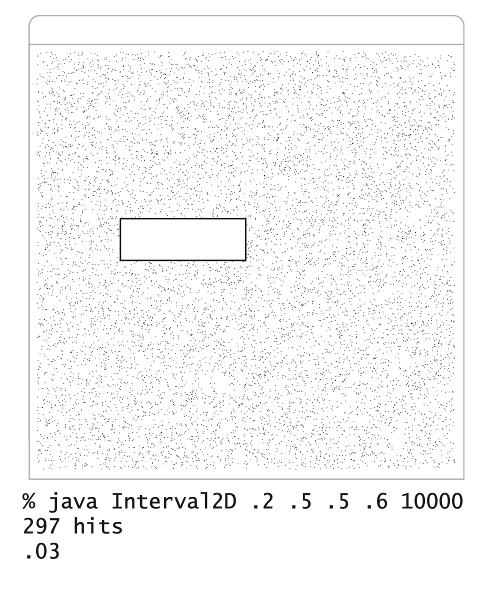
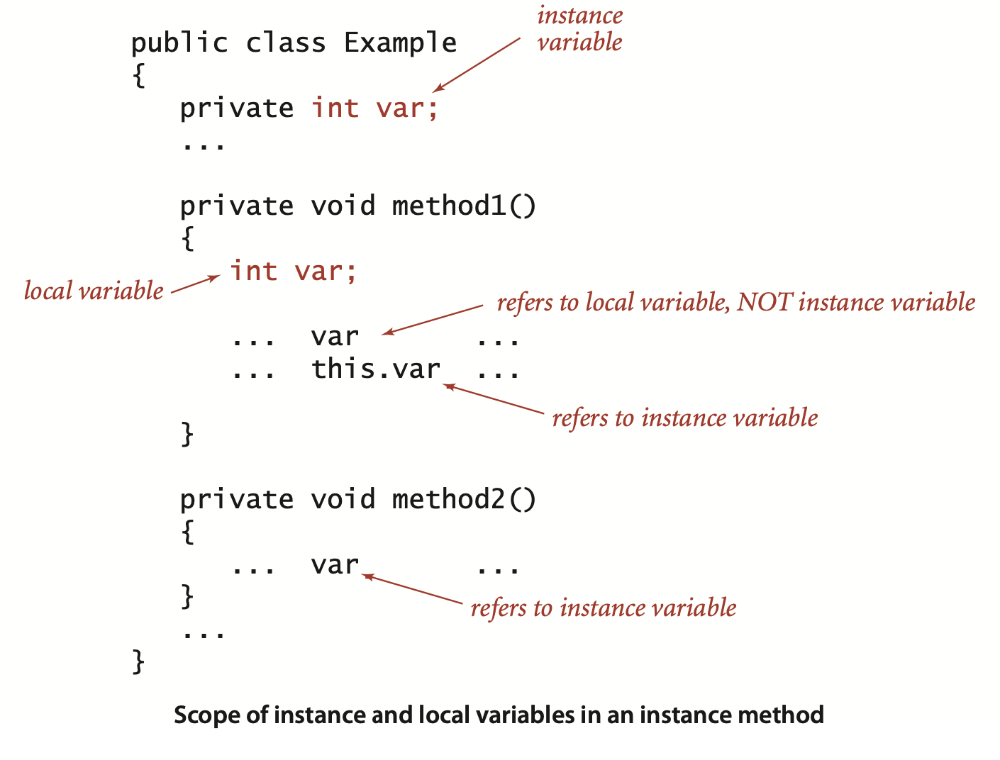
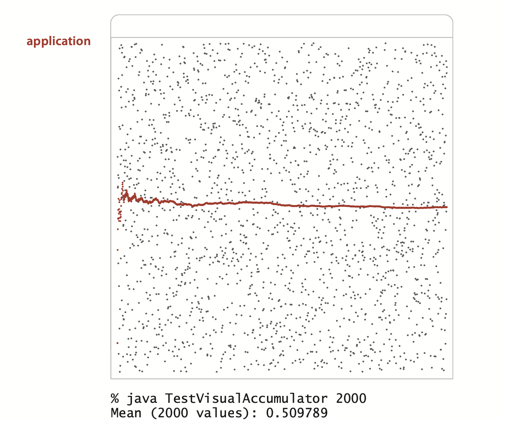
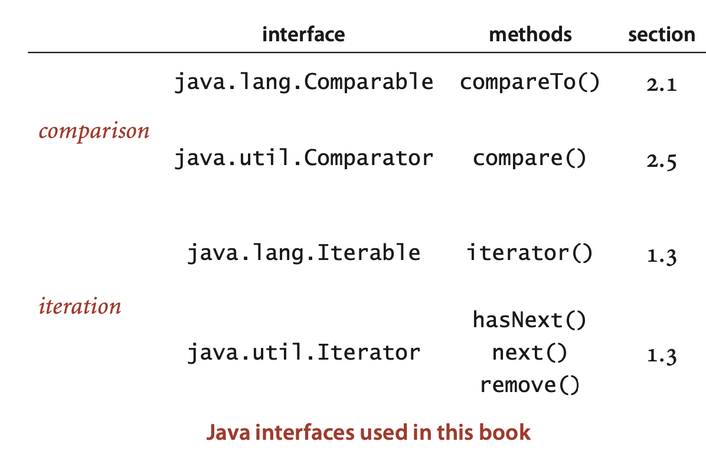
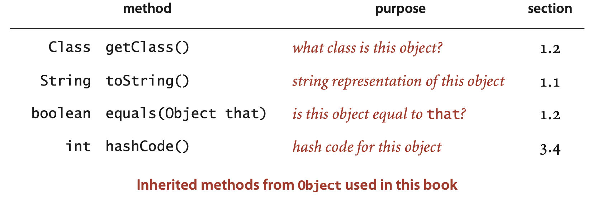
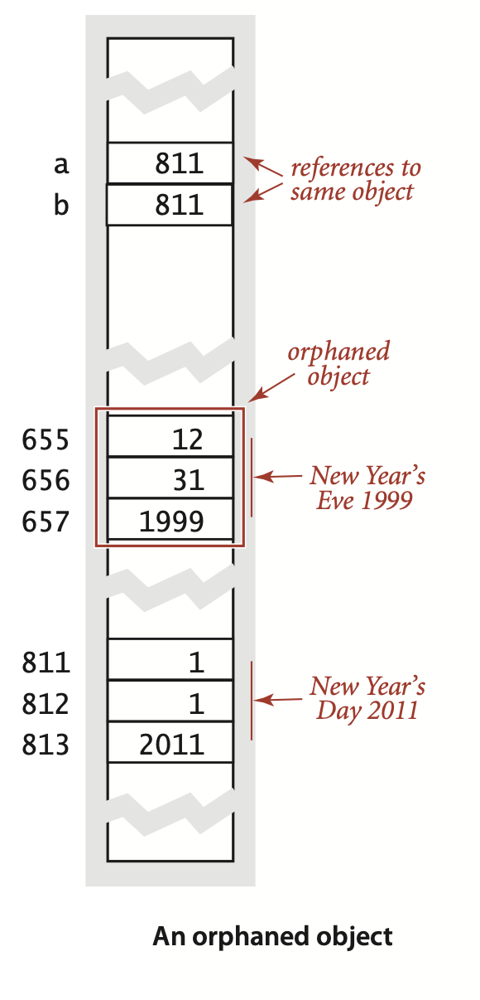

### 1.2 Data Abstraction


An *abstract data type (ADT)* is a data type whose representation is hidden from the client. ...  When *using* an ADT, we focus on the *operations* specified in the API and pay no attention to the data representation; when *implementing* an ADT, we focus on the *data*, then implement operations on that data. ... Even though the basis of a data-type definition is a set of values, the role of the values is not visible from the API, only the operations on those values.


##### Inherited methods.
... For example, all Java data types *inherit* a `toString()` method that returns a String representation of the data-type values. Java calls this method when any data-type value is to be concatenated with a String value with the + operator. ... we often provide an implementation that overrides the default, and include `toString()` in the API whenever we do so. Other examples of such methods include `equals()`, `compareTo()`, and `hashCode()` (see page 101).


##### Objects. 
Objects are characterized by three essential prop-erties: *state*, *identity*, and *behavior*. The *state* of an object is a value from its data type. The *identity* of an object distinguishes one object from another. It is useful to think of an object’s identity as the place where its value is stored in memory. The *behavior* of an object is the effect of data-type operations. 

...  Java nomenclature makes clear the distinction from primitive types (where variables are associated with values) by using the term *reference* types for nonprimitive types.

*Counter client that simulates T coin flips*
```java
public class Flips
{
    public static void main(String[] args)
    {
        int T = Integer.parseInt(args[0]);
        Counter heads = new Counter("heads");
        Counter tails = new Counter("tails");
        for (int t = 0; t < T; t++)
            if (StdRandom.bernoulli(0.5))
                heads.increment();
            else tails.increment();
        StdOut.println(heads);
        StdOut.println(tails);
        int d = heads.tally() - tails.tally();
        StdOut.println("delta: " + Math.abs(d));
    } 
}
```
```
% java Flips 10
5 heads
5 tails
delta: 0

% java Flips 10
8 heads
2 tails
delta: 6

% java Flips 1000000
499710 heads
500290 tails
delta: 580
```
*implementation (from page 89)*
```java
public class Counter
{
   private final String name;
   private int count;

   public Counter(String id)
   { name = id; }

   public void increment()
   { count++; }

   public int tally()
   { return count; }

   public String toString()
   { return count + " " + name; }
}
```


##### Assignment statements
If `x` and `y` are variables of a primitive type, then the assignment `x = y` copies the value of `y` to `x`. For reference types, the reference is copied (not the value). Aliasing is a common source of bugs in Java programs, as illustrated by the following example:
```java
Counter c1 = new Counter("ones");
c1.increment();
Counter c2 = c1;
c2.increment();
StdOut.println(c1);
```
With a typical `toString()` implementation this code would print the string "2 ones" which may or may not be what was intended and is counterintuitive at first.

##### Objects as arguments.
... That is, Java passes a *copy* of the argument value from the calling program to the method. This arrangement is known as *pass by value* (see page 24). 


*Example of a static method with object arguments and return values*
```java
public class FlipsMax
{
    public static Counter max(Counter x, Counter y)
    {
        if (x.tally() > y.tally()) return x;
        else                       return y;
    }

    public static void main(String[] args)
    {
        int T = Integer.parseInt(args[0]);
        Counter heads = new Counter("heads");
        Counter tails = new Counter("tails");
        for (int t = 0; t < T; t++)
            if (StdRandom.bernoulli(0.5))
                heads.increment();
            else tails.increment();

        if (heads.tally() == tails.tally())
                StdOut.println("Tie");
        else StdOut.println(max(heads, tails) + " wins");
    }
}
```

##### Arrays are objects.
In Java, every value of any nonprimitive type is an object.

##### Arrays of objects.
... An array of objects in Java is an array of references to objects, not the objects themselves.

*Counter client that simulates T rolls of a die*
```java
public class Rolls
{
    public static void main(String[] args)
    {
        int T = Integer.parseInt(args[0]);
        int SIDES = 6;
        Counter[] rolls = new Counter[SIDES+1];
        for (int i = 1; i <= SIDES; i++)
            rolls[i] = new Counter(i + "'s");
        for (int t = 0; t < T; t++)
        {
            int result = StdRandom.uniform(1, SIDES+1);
            rolls[result].increment();
        }
        for (int i = 1; i <= SIDES; i++)
            StdOut.println(rolls[i]);
    } 
}
```


##### Geometric objects.
*Interval2D test client*
```java
public static void main(String[] args)
{
    double xlo = Double.parseDouble(args[0]);
    double xhi = Double.parseDouble(args[1]);
    double ylo = Double.parseDouble(args[2]);
    double yhi = Double.parseDouble(args[3]);
    int T = Integer.parseInt(args[4]);

    Interval1D x = new Interval1D(xlo, xhi);
    Interval1D y = new Interval1D(ylo, yhi);
    Interval2D box = new Interval2D(x, y);
    box.draw();

    Counter c = new Counter(“hits”);
    for (int t = 0; t < T; t++)
    {
        double x = Math.random();
        double y = Math.random();
        Point p = new Point(x, y);
        if (box.contains(p)) c.increment();
        else                 p.draw();
    }

    StdOut.println(c);
    StdOut.println(box.area());
}
```




##### Strings.

*is the string a palindrome?*
```java
public static boolean isPalindrome(String s)
{
   int N = s.length();
   for (int i = 0; i < N/2; i++)
      if (s.charAt(i) != s.charAt(N-1-i))
         return false;
   return true;
}
```

*extract file name and extension from a command-line argument*
```java
String s = args[0];
int dot = s.rank(".");
String base      = s.substring(0, dot);
String extension = s.substring(dot + 1, s.length());
```

*print all lines in standard input that contain a string specified on the command line*
```java
String query = args[0];
while (!StdIn.isEmpty())
{
   String s = StdIn.readLine();
   if (s.contains(query)) StdOut.println(s);
}
```

*create an array of the strings on StdIn delimited by whitespace*
```java
String input = StdIn.readAll();
String[] words = input.split("\\s+");
```
*check whether an array of strings is in alphabetical order*
```java
public boolean isSorted(String[] a)
{
   for (int i = 1; i < a.length; i++)
   {
      if (a[i-1].compareTo(a[i]) > 0)
         return false;
}
   return true;
}
```


##### Input and output revisited. 
... A disadvantage of the `StdIn`, `StdOut`, and `StdDraw` standard libraries of Section 1.1 is that they restrict us to working with just one input file, one output file, and one drawing for any given program. ... The program `Cat` shown at left is a sample client of `In` and `Out` that uses multiple input streams to concatenate several input files into a single output file. 

*A sample In and Out client*
```java
public class Cat
{
    public static void main(String[] args)
    {  // Copy input files to out (last argument).
        Out out = new Out(args[args.length-1]);
        for (int i = 0; i < args.length - 1; i++)
        {  // Copy input file named on ith arg to out.
            In in = new In(args[i]);
            String s = in.readAll();
            out.println(s);
            in.close();
        }
        out.close();
    }
}
```
```
% more in1.txt
This is

% more in2.txt
a tiny
test.

% java Cat in1.txt in2.txt out.txt

% more out.txt
This is
a tiny
test.
```


#### Implementing an abstract data type.


##### Constructors.
... The default values of instance variables are `0` for primitive numeric types, `false` for boolean, and `null` for reference types.


##### Instance methods.
... Each instance method has a return type, a *signature* (which specifies its name and the types and names of its parameter variables), and a *body* ...


##### Scope.
In summary, the Java code that we write to implement instance methods uses three kinds of variables:
- Parameter variables
- Local variables
- Instance variables



#### More ADT implementations

##### Date.

... the more space-efficient implementation on the right uses only a single int value to represent a date, using a mixed-radix number that represents the date with day $d$, month $m$, and year $y$ as $512y + 32m + d$.

*implementation*
```java
public class Date
{
   private final int month;
   private final int day;
   private final int year;

   public Date(int m, int d, int y)
   {  month = m; day = d; year = y; }

   public int month()
   {  return month;  }

   public int day()
   {  return day;  }

   public int year()
   {  return day;  }

   public String toString()
   {  return month() + "/" + day()
                     + "/" + year();  }
}
```
*alternate implementation*
```java
public class Date
{
   private final int value;

   public Date(int m, int d, int y)
   { value = y*512 + m*32 + d; }

   public int month()
   { return (value / 32) % 16; }

   public int day()
   { return value % 32; }

   public int year()
   { return value / 512; }

   public String toString()
   {  return month() + "/" + day()
                     + "/" + year();  }
}
```
*test client*
```java
public static void main(String[] args)
{
   int m = Integer.parseInt(args[0]);
   int d = Integer.parseInt(args[1]);
   int y = Integer.parseInt(args[2]);
   Date date = new Date(m, d, y);
   StdOut.println(date);
}
```
*application*
```
% java Date 12 31 1999
12/31/1999
```
>Contributor's Note:  
>
>The integer package `value` uses bits and bit shifts to encode a date. In the integer, the first 5 bits represent the day (1–31), the next 4 bits represent the month (1–12), and the remaining bits represent the year. To convert a date into an integer, we arrange the bits in the form `...yyyyy mmmm ddddd`, where `ddddd` are the lowest 5 bits of the day integer, `mmmm` are the lowest 4 bits of the month integer, and `yyyyy...` are the lowest bits of the year integer.
>
>For example, `....yyyyyy 0000 00000` is the year shifted left by 9 bits: `year << 9`. Shifting a binary number left by 1 bit multiplies its decimal value by 2. For instance, `110` (6) is `11` (3) multiplied by 2. Therefore, shifting the year 9 bits is equivalent to multiplying its decimal value by `2^9 = 512`. The same logic applies to the month, which must be shifted left by 5 bits. The day does not require shifting because its bits already start at the lowest positions in `value`.
>
>Unpacking `value` works in the reverse direction. A right shift is equivalent to integer division by powers of two. For example, `10100` (20) is `101000` (40) divided by 2. To extract the year from `...yyyyy mmmm ddddd`, we simply right shift `value` by 9 bits: `value >> 9` that is `value / 512`.
>
>For the month, we cannot just shift, because shifting by 5 bits (`value >> 5`, equivalent to `value / 32`) gives `...yyyyy mmmm`. This still contains the year bits, so we also need masking. Masking with `&` corresponds to the modulus operation in decimal. For example, masking out everything except the lowest four bits is equivalent to applying `...xxxxxxx & 1111`, regardless of the values of the higher-order bits `x`. The mask `1111` isolates the lowest four bits of any integer, which can be written as: $x_1 \times 2^0 + x_2 \times 2^1 + x_3 \times 2^2 + x_4 \times 2^3 + \sum_{i=5}^{\infty} x_i \, 2^{i-1}$. After masking, the summation term $\sum_{i=5}^{\infty} x_i \, 2^{i-1}$ is eliminated, leaving only the bits $x_1 x_2 x_3 x_4$. The result is always a number between 0 and 15, which is equivalent to taking the integer modulo $2^4 = 16$. For example: `1111011` (123) `&` `0001111` (15) = `0001011` (11) which is the same as `123 % 16 = 11`. Therefore, to get the month, we first shift right by 5 bits (`value >> 5`, i.e., `value / 32`) and then mask with `0b1111` (i.e., `% 16`).
>
>For the day, we only need to mask, since its bits are already in the lowest positions.

##### Maintaining multiple implementations
.... For this reason, we generally adopt an informal naming convention where we: ... In a large system, this solution is not ideal, as it might involve changing client code. For example, if we were to develop a new implementation ExtraSmallDate, then our only options are to change client code or to make it the reference implementation for use by all clients. Java has various advanced language mechanisms for maintaining multiple implementations without needing to change client code, but we use them sparingly because their use is challenging (and even controversial) even for experts, especially in conjuction with other advanced language features that we do value (generics and iterators). These issues are important (for example, ignoring them led to the celebrated *Y2K problem* at the turn of the millennium, because many programs used their own implementations of the date abstraction that did not take into account the first two digits of the year), but detailed consideration of these issues would take us rather far afield from the study of algorithms.


##### Accumulator.

**An abstract data type for accumulating data values**

*implementation*
```java
public class Accumulator
{
   private double total;
   private int N;

   public void addDataValue(double val)
   {
        N++;
        total += val;
   }

   public double mean()
   {  return total/N;  }

   public String toString()
   { return "Mean (" + N + " values): "
                + String.format("%7.5f", mean()); }
}
```


*application*
```java
% java TestAccumulator 1000
Mean (1000 values): 0.51829

% java TestAccumulator 1000000
Mean (1000000 values): 0.49948

% java TestAccumulator 1000000
Mean (1000000 values): 0.50014
```

```java
typical client
public class TestAccumulator
{
   public static void main(String[] args)
   {
        int T = Integer.parseInt(args[0]);
        Accumulator a = new Accumulator();
        for (int t = 0; t < T; t++)
            a.addDataValue(StdRandom.random());
        StdOut.println(a);
    } 
}
```


##### Visual accumulator.
*implementation*
```java
public class VisualAccumulator
{
    private double total;
    private int N;
    public VisualAccumulator(int trials, double max)
    {
        StdDraw.setXscale(0, trials);
        StdDraw.setYscale(0, max);
        StdDraw.setPenRadius(.005);
    }

    public void addDataValue(double val)
    {
        N++;
        total += val;
        StdDraw.setPenColor(StdDraw.DARK_GRAY);
        StdDraw.point(N, val);
        StdDraw.setPenColor(StdDraw.RED);
        StdDraw.point(N, total/N);
    }

    public double mean()
    public String toString()
    // Same as Accumulator.
}
```

*typical client*
```java
public class TestVisualAccumulator
{
    public static void main(String[] args)
    {
        int T = Integer.parseInt(args[0]);
        VisualAccumulator a = new VisualAccumulator(T, 1.0);
        for (int t = 0; t < T; t++)
            a.addDataValue(StdRandom.random());
        StdOut.println(a);
    } 
}
```




#### Data-type design

###### Designing APIs.

.... Ideally, an API would clearly articulate behavior for all possible inputs, including side effects, and then we would have software to check that implementations meet the specification. Unfortunately, a fundamental result from theoretical computer science known as the *specification problem* implies that this goal is actually *impossible* to achieve. Briefly, such a specification would have to be written in a formal language like a programming language, and the problem of determining whether two programs perform the same computation is known, mathematically, to be *undecidable*. Therefore, our APIs are brief English-language descriptions of the set of values in the associated abstract data type along with a list of constructors and instance methods, again with brief English-language descriptions of their purpose, including side effects. 


**Binary search recast as an object-oriented program (an ADT for search in a set of integers)**

*implementation*
```java
import java.util.Arrays;
public class StaticSETofInts
{
    private int[] a;

    public StaticSETofInts(int[] keys)
    {
        a = new int[keys.length];
        for (int i = 0; i < keys.length; i++)
            a[i] = keys[i]; // defensive copy
        Arrays.sort(a);
    }

    public boolean contains(int key)
    {  return rank(key) != -1;  }

    private int rank(int key)
    {  // Binary search.
        int lo  = 0;
        int hi = a.length - 1;
        while (lo <= hi)
        {  // Key is in a[lo..hi] or not present.
            int mid = lo + (hi - lo) / 2;
            if      (key < a[mid]) hi = mid - 1;
            else if (key > a[mid]) lo = mid + 1;
            else                   return mid;
        }
        return -1; 
    }
}
```

*typical client*
```java
public class Whitelist
{
    public static void main(String[] args)
    {
        int[] w = In.readInts(args[0]);
        StaticSETofInts set = new StaticSETofInts(w);
        while (!StdIn.isEmpty())
        {  // Read key, print if not in whitelist.
            int key = StdIn.readInt();
            if (set.rank(key) == -1)
                StdOut.println(key);
        } 
    }
}
```

*application*
```
% java Whitelist largeW.txt < largeT.txt
499569
984875
295754
207807
140925
161828
...
```

##### Interface inheritance.
...T he first inheritance mechanism that we consider is known as *subtyping*, which allows us to specify a relationship between otherwise unrelated classes by specifying in an *interface* a set of common methods that each implementing class must contain. ... This arrangement is known as *interface inheritance*—an implementing class inherits the interface. ... We might have used interface inheritance in place of our more informal APIs, but chose not to do so to avoid dependence on specific high-level language mechanisms that are not critical to the understanding of algorithms and to avoid the extra baggage of interface files. ... But there are a few situations where Java conventions make it worthwhile for us to take advantage of interfaces:




##### Implementation inheritance.
Java also supports another inheritence mechanism known as *subclassing*, ... The idea is to define a new class (*subclass*, or *derived class*) that inherits instance methods and instance variables from another class (*superclass*, or *base class*). ... Subclassing is widely used by systems programmers to build so-called *extensible* libraries ... For example, this approach is widely used in the development of graphical user interfaces, so that the large amount of code required to provide all the facilities that users expect (drop-down menus, cut-andpaste, access to files, and so forth) can be reused. The use of subclassing is controversial among systems and applications programmers (its advantages over interface inheritance are debatable), and we avoid it in this book because it generally works against encapsulation. Certain vestiges of the approach are built in to Java and therefore unavoidable: specifically, every class is a subtype of Java’s `Object` class. This structure enables the “convention” that every class includes an implementation of `getClass()`, `toString()`, `equals()`, `hashCode()`, and several other methods that we do not use in this book.




##### String conversion.
 By convention, every Java type inherits `toString()` from Object, so any client can invoke `toString()` for any object. his convention is the basis for Java’s automatic conversion of one operand of the concatenation operator `+` to a String whenever the other operand is a `String`. If an object’s data type does not include an implementation of `toString()`, then the default implementation in Object is invoked, which is normally not helpful, since it typically returns a string representation of the memory address of the object.


 ###### Wrapper types.
 Java supplies built-in reference types known as wrapper types, one for each of the primitive types: `Boolean`, `Byte`, `Character`, `Double`, `Float`, `Integer`, `Long`, and `Short` correspond to `boolean`, `byte`, `char`, `double`, `float`, `int`, `long`, and `short`, respectively. These classes consist primarily of static methods such as `parseInt()` but they also include the inherited instance methods `toString()`, `compareTo()`, `equals()`, and `hashCode()`.


 ##### Equality.
 If we test equality with (`a == b`) where `a` and `b` are reference variables of the same type, we are testing whether they have the same identity: whether the *references* are equal. ... Java gives us a head start by providing implementations both for standard types such as `Integer`, `Double`, and `String` and for more complicated types such as `File` and `URL`. When using these types of data, you can just use the built-in implementation. For example, if `x` and `y` are `String` values, then `x.equals(y)` is true if and only if `x` and `y` have the same length and are identical in each character position. When we define our own data types, such as Date or Transaction, we need to override `equals()`. Java’s convention is that `equals()` must be an equivalence relation. ... This implementation is a model that you can use to implement `equals()` ...

*Overriding toString() and equals() in a data-type definition*
```java
public class Date
{
    private final int month;
    private final int day;
    private final int year;

    public Date(int m, int d, int y)
    {  month = m; day = d; year = y; }

    public int month()
    {  return month;  }

    public int day()
    {  return day;  }

    public int year()
    {  return year;  }

    public String toString()
    {  return month() + "/" + day() + "/" + year();  }

    public boolean equals(Object x)
    {
        if (this == x) return true;
        if (x == null) return false;
        if (this.getClass() != x.getClass()) return false;
        Date that = (Date) x;
        if (this.day != that.day)
        if (this.month != that.month)
        if (this.year != that.year)
        return true;
    }
}
```


###### Memory management.
... For example, consider the three assignment statements in the figure at left. After the third assignment statement, not only do `a` and `b` refer to the same `Date` object (1/1/2011), but also there is no longer a reference to the `Date` object that was created and used to initialize `b`. 
```java
Date a = new Date(12, 31, 1999);
Date b = new Date(1, 1, 2011);
b = a;
```


...Accordingly, programming languages and systems need mechanisms to *allocate* memory for data-type values during the time they are needed and to *free* the memory when they are no longer needed (for an object, sometime after it is orphaned). Memory management turns out to be easier for primitive types because all of the information needed for memory allocation is known at compile time. Java (and most other systems) takes care of reserving space for variables when they are declared and freeing that space when they go out of scope. Memory management for objects is more complicated: the system can allocate memory for an object when it is created, but cannot know precisely when to free the memory associated with each object because the dynamics of a program in execution determines when objects are orphaned. In many languages (such as C and C++) the programmer is responsible for both allocating and freeing memory. Doing so is tedious and notoriously error-prone.One of Java's most significant features is its ability to *automatically* manage memory. ... Reclaiming memory in this way is known as *garbage collection*. One of Java’s characteristic features is its policy that references cannot be modified. This policy enables Java to do efficient automatic garbage collection. Programmers still debate whether the overhead of automatic garbage collection justifies the convenience of not having to worry about memory management.

>Contributor's Note:
>```java
>class Demo {
>    public static void changeReference(String s) {
>        // Attempt to modify the reference
>        s = "world"; // Only changes local copy of the reference
>    }
>
>    public static void main(String[] args) {
>        String str = "hello";
>        changeReference(str);
>        System.out.println(str); // still prints "hello"
>    }
>}
>```


###### Immutability.
When you declare a variable to be `final`, you are promising to assign it a value only once, either in an initializer or in the constructor. 

... You have already encountered this distinction as a client programmer, when using Java arrays (mutable) and Java’s String data type (immutable)

... There are also situations where we want to have mutable strings (that is the purpose of Java’s `StringBuilder` class) and where we want to have immutable arrays (that is the purpose of the `Vector` class that we consider later in this section). 

The downside of immutability is that *a new object must be created for every value*. This expense is normally manageable because Java garbage collectors are typically optimized for such situations. Another downside of immutability stems from the fact that, unfortunately, `final` guarantees immutability only when instance variables are primitive types, not reference types. If an instance variable of a reference type has the `final` modifier, the value of that instance variable (the reference to an object) will never change—it will always refer to the same object—but the value of the object itself *can* change.  

```java
public class Vector
{
    private final double[] coords;

    public Vector(double[] a)
    {  coords = a; }
    ...
}
```
```java
double[] a = { 3.0, 4.0 };
Vector vector = new Vector(a);
a[0] = 0.0;  // Bypasses the public API
```

...and whether a data type is immutable should be specified in the API, so that clients know that object values will not change.


##### Exceptions and errors.
... You can also create your own exceptions. The simplest kind is a RuntimeException that terminates execution of the program and prints an error message
```java
throw new RuntimeException("Error message here.");
```

A general practice known as *fail fast* programming suggests that an error is more easily pinpointed if an exception is thrown as soon as an error is discovered (as opposed to ignoring the error and deferring the exception to sometime in the future).


###### Assertions.
An *assertion* is a boolean expression that you are affirming is `true` at that point in the program. If the expression is `false`, the program will terminate and report an error message.

```java
assert index >= 0 : "Negative index in method X";
```

.... By default, assertions are disabled. You can enable them from the command line by using the `-enableassertions` flag (`-ea` for short). Assertions are for debugging: your program should not rely on assertions for normal operation since they may be disabled. 

... One model, known as the *design-by-contract* model of programming expresses the idea. The designer of a data type expresses a *precondition* (the condition that the client promises to satisfy when calling a method), a *postcondition* (the condition that the implementation promises to achieve when returning from a method), and *side effects* (any other change in state that the method could cause). During development, these conditions can be tested with assertions.


##### Summary.
... Why does Java not allow functions as arguments?


**Q.** What happens if I forget to use new when creating an object?  
**A.** To Java, it looks as though you want to call a static method with a return value of the object type. Since you have not defined such a method, the error message is the same as anytime you refer to an undefined symbol. If you compile the code
```java
Counter c = Counter("test");
```
you get this error message:
```
cannot find symbol
symbol  : method Counter(String)
```
You get the same kind of error message if you provide the wrong number of arguments to a constructor.


**Q.** What happens if I forget to use new when creating an array of objects?  
**A.** You need to use new for each object that you create, so when you create an array of $N$ objects, you need to use new $N+1$ times: once for the array and once for each of the objects. If you forget to create the array:
```java
Counter[] a;
a[0] = new Counter("test");
```
you get the same error message that you would get when trying to assign a value to any uninitialized variable:
```
variable a might not have been initialized
    a[0] = new Counter("test");
    ^
```
but if you forget to use new when creating an object within the array and then try to use it to invoke a method:

```java
Counter[] a = new Counter[2];
a[0].increment();
```
you get a `NullPointerException`.

**A** ... In many programming languages, the pointer is a primitive data type that programmers can manipulate in many ways. But programming with pointers is notoriously error-prone, so operations provided for pointers need to be carefully designed to help programmers avoid errors. ... In Java, there is only *one* way to create a reference (`new`) and only *one* way to change a reference (with an assignment statement). ... Java references are known as *safe pointers*, because Java can guarantee that each reference points to an object of the specified type (and it can determine which objects are not in use, for garbage collection).


**Q.** Where can I find more details on how Java implements references and does garbage collection?  
**A.** One Java system might differ completely from another. For example, one natural scheme is to use a pointer (machine address); another is to use a *handle* (a pointer to a pointer). The former gives faster access to data; the latter provides for better garbage collection.


**Q.** What is the problem with implementation inheritance?  
**A.** Subtyping makes modular programming more difficult for two reasons. First, any change in the superclass affects all subclasses. The subclass cannot be developed *independently* of the superclass; indeed, it is *completely dependent* on the superclass. This problem is known as the *fragile base class* problem. Second, the subclass code, having access to instance variables, can subvert the intention of the superclass code. For example, the designer of a class like `Counter` for a voting system may take great care to make it so that `Counter` can only increment the tally by one (remember Al Gore’s problem). But a subclass, with full access to the instance variable, can change it to any value whatever.


**Q.** How do I make a class immutable?
**A.** To ensure immutability of a data type that includes an instance variable of a mutable type, we need to make a local copy, known as a *defensive copy*. And that may not be enough. Making the copy is one challenge; ensuring that none of the instance methods change values is another.


**A.** ... Invoking a method using the null reference is meaningless and results in a `NullPointerException`. If you get this error message, check to make sure that your constructor properly initializes all of its instance variables.


**Q.** Can I have a static method in a class that implements a data type?  
**A.** Ofcourse. For example, all of our classes have ‍‍‍`main()`. Also, it is natural to consider adding static methods for operations that involve multiple objects where none of them naturally suggests itself as the one that should invoke the method. For example, we might define a static method like the following within Point:
```java
public static double distance(Point a, Point b)
{
    return a.distTo(b);
}
```
Often, including such methods can serve to clarify client code.


**Q.** Are there other kinds of variables besides parameter, local, and instance variables?
**A.** If you include the keyword `static` in a class declaration (outside of any type) it creates a completely different type of variable, known as a *static variable*. Like instance variables, static variables are accessible to every method in the class; however, they are not associated with any object. In older programming languages, such variables are known as *global variables*, because of their global scope. In modern programming, we focus on limiting scope and therefore rarely use such variables. When we do, we will call attention to them.


**Q.** What is a deprecated method?  
**A.** Amethodthatisnolongerfullysupported,butkeptinanAPItomaintaincompatibility. For example, Java once included a method `Character.isSpace()`, and programmers wrote programs that relied on using that method’s behavior. When the designers of Java later wanted to support additional Unicode whitespace characters, they could not change the behavior of `isSpace()` without breaking client programs, so, instead, they added a new method, `Character.isWhiteSpace()`, and deprecated the old method. As time wears on, this practice certainly complicates APIs. Sometimes, entire classes are deprecated. For example, Java deprecated its `java.util.Date` in order to better support internationalization.
