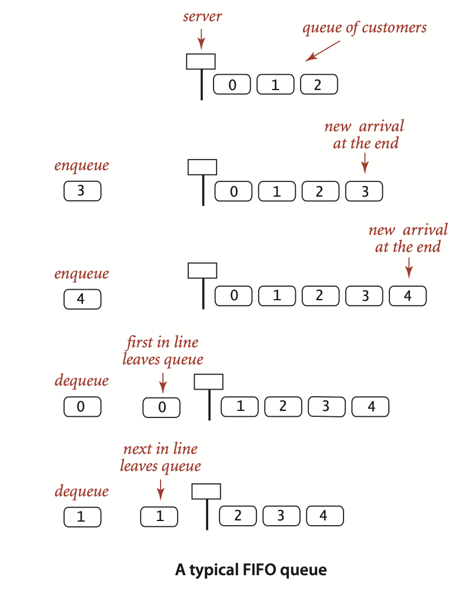
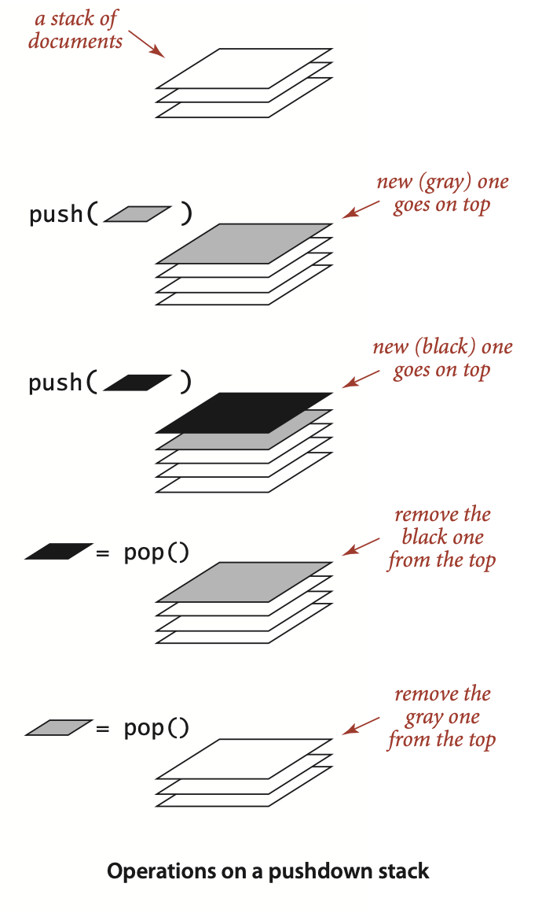
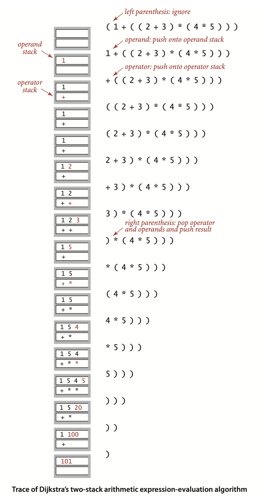
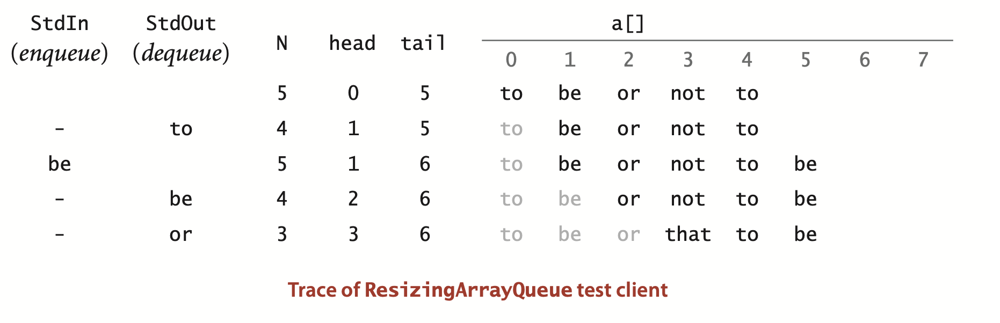
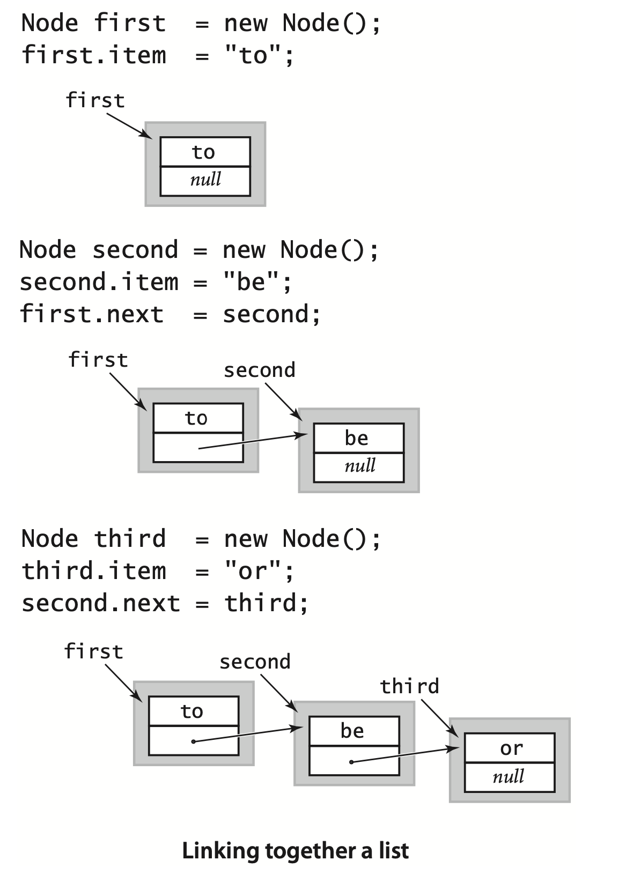
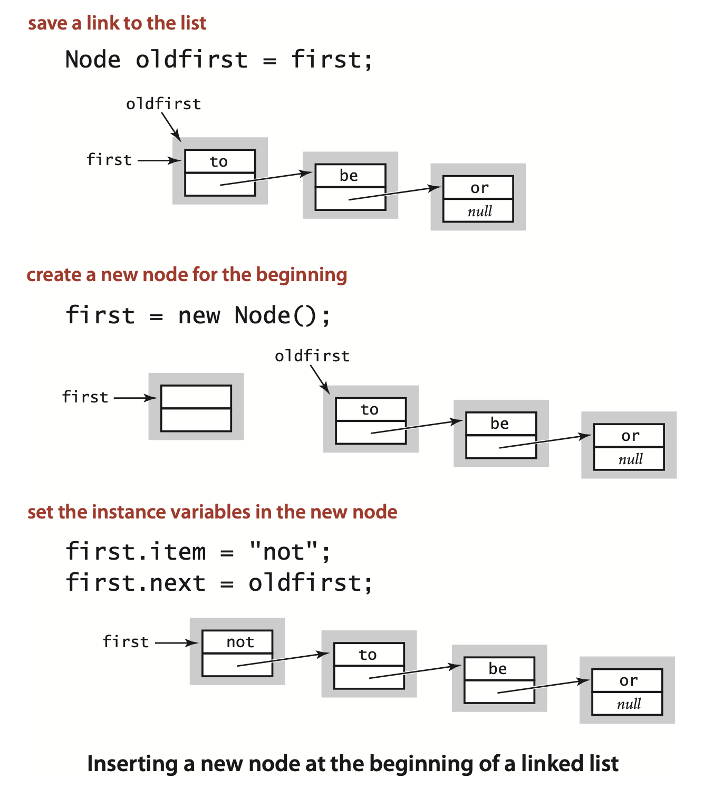
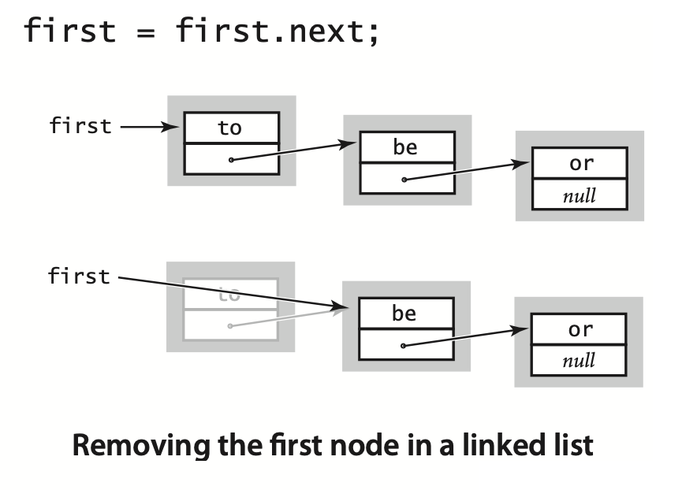
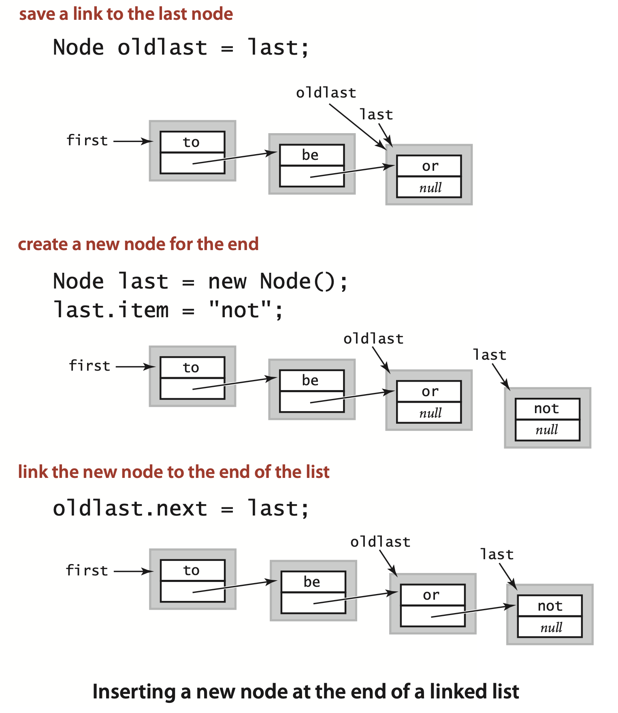
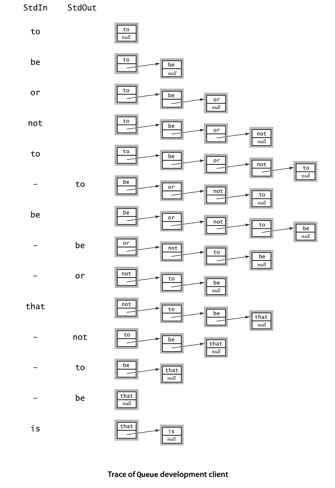
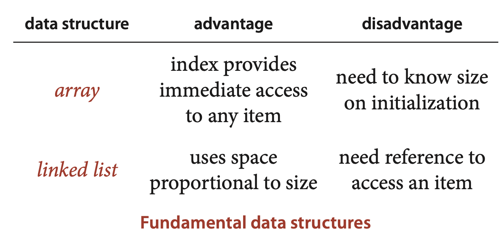

### 1.3 Bags, Queues, and Stacks


##### [Java Lang] Generics.
... A specific Java mechanism known as *generics*, also known as *parameterized types*, enables this capability. ... You can read `Stack<Item>` as “stack of items.” ... we can replace Item with the name of *any* reference data type ... you can write code such as
```java
Stack<String> stack = new Stack<String>();
stack.push("Test");
...
String next = stack.pop();
```
to use a stack for String objects and code such as
```java
Queue<Date> queue = new Queue<Date>();
queue.enqueue(new Date(12, 31, 1999));
...
Date next = queue.dequeue();
```

##### [Java Lang] Autoboxing.
Type parameters have to be instantiated as *reference* types, so Java has special mechanisms to allow generic code to be used with primitive types. ...  Automatically casting a primitive type to a wrapper type is known as *autoboxing*, and automatically casting a wrapper type to a primitive type is known as *auto-unboxing*.

```java
Stack<Integer> stack = new Stack<Integer>();
stack.push(17);      // auto-boxing (int -> Integer)
int i = stack.pop(); // auto-unboxing (Integer -> 
```

##### [Java Lang] Iterable collections.

... For example, suppose that a client maintains a collection of transactions in a Queue, as follows:
```java
Queue<Transaction> collection = new Queue<Transaction>();
```
If the collection is iterable, the client can print a transaction list with a single statement:
```java
for (Transaction t : collection)
{  StdOut.println(t);  }
```
This construct is known as the foreach statement: you can read the for statement as for each transaction t in the collection, execute the following block of code. 

###### Bags. 
A *bag* is a collection where removing items is not supported—its purpose is to provide clients with the ability to collect items and then to iterate through the collected items (the client can also test if a bag is empty and find its number of items). 

... Note : It is possible to compute the standard deviation without saving all the numbers (as we did for the average in Accumulator—see Exercise 1.2.18).

*typical Bag client*
```java
public class Stats
{
   public static void main(String[] args)
   {
        Bag<Double> numbers = new Bag<Double>();

        while (!StdIn.isEmpty())
            numbers.add(StdIn.readDouble());
        int N = numbers.size();

        double sum = 0.0;
        for (double x : numbers)
            sum += x;
        double mean = sum/N;

        sum = 0.0;
        for (double x : numbers)
            sum += (x - mean)*(x - mean);
        double std = Math.sqrt(sum/(N-1));

        StdOut.printf("Mean: %.2f\n", mean);
        StdOut.printf("Std dev: %.2f\n", std);
    } 
}
```
```
% java Stats
100
99
101
120
98
107
109
81
101
90

Mean: 100.60
Std dev: 10.51
```

#### FIFO queues.



```java
public static int[] readInts(String name)
{
    In in = new In(name);
    Queue<Integer> q = new Queue<Integer>();
    while (!in.isEmpty())
        q.enqueue(in.readInt());

    int N = q.size();
    int[] a = new int[N];
    for (int i = 0; i < N; i++)
        a[i] = q.dequeue();
    return a;
}
```


##### Pushdown stacks.
A *pushdown stack* (or just a *stack*) is a collection that is based on the *last-in-first-out* (LIFO) policy. 




*Sample Stack client*
```java
public class Reverse
{
    public static void main(String[] args)
    {
        Stack<Integer> stack;
        stack = new Stack<Integer>();
        while (!StdIn.isEmpty())
            stack.push(StdIn.readInt());
        for (int i : stack)
            StdOut.println(i);
    } 
}
```

##### Arithmetic expression evaluation.

... an *arithmetic expression* is either a number, or a left parenthesis followed by an arithmetic expression followed by an operator followed by another arithmetic expression followed by a right parenthesis. For simplicity, this definition is for *fully parenthesized* arithmetic expressions, ... A remarkably simple algorithm that was developed by E. W. Dijkstra in the 1960s uses two stacks (one for operands and one for operators) to do this job. 

Proceeding from left to right and taking these entities one at a time, we manipulate the stacks according to four possible cases, as follows:
- Push operands onto the operand stack.
- Push operators onto the operator stack.
- Ignore left parentheses.
- On encountering a right parenthesis, pop an operator, pop the requisite number of operands, and push onto the operand stack the result of applying that operator to those operands.

After the final right parenthesis has been processed, there is one value on the stack, which is the value of the expression.

... For example, the algorithm computes the same value for all of these expressions:
```
( 1 + ( ( 2 + 3 ) * ( 4 * 5 ) ) )
( 1 + ( 5 * ( 4 * 5 ) ) )
( 1 + ( 5 * 20 ) )
( 1 + 100 )
101
```
**Dijkstra’s Two-Stack Algorithm for Expression Evaluation**
```java
public class Evaluate
{
    public static void main(String[] args)
    {
        Stack<String> ops  = new Stack<String>();
        Stack<Double> vals = new Stack<Double>();
        while (!StdIn.isEmpty())
        {  // Read token, push if operator.
            String s = StdIn.readString();
            if      (s.equals("("))     ops.push(s);
            else if (s.equals("+"))     ops.push(s);
            else if (s.equals("-"))     ops.push(s);
            else if (s.equals("*"))     ops.push(s);
            else if (s.equals("/"))     ops.push(s);
            else if (s.equals("sqrt"))  ops.push(s);
            else if (s.equals(")"))
            {  // Pop, evaluate, and push result if token is ")".
                    String op = ops.pop();
                    double v = vals.pop();
                    if      (op.equals("+"))    v = vals.pop + V;
                    else if (op.equals("-"))    v = vals.pop - V;
                    else if (op.equals("*"))    v = vals.pop * V;
                    else if (op.equals("/"))    v = vals.pop / V;
                    else if (op.equals("sqrt")) v = Math.sqrt(v);
                    vals.push(v);
                }  // Token not operator or paren: push double value.
                else vals.push(Double.parseDouble(s));
        }
        StdOut.println(vals.pop());
    }
}
```
```
% java Evaluate 
(1 + ( ( 2 + 3 ) * ( 4 * 5 ) ) ) 
101.0

% java Evaluate
( ( 1 + sqrt ( 5.0 ) ) / 2.0 )
1.618033988749895
```




#### Implementing collections

##### Fixed-capacity stack.

*implementation*
```java
public class FixedCapacityStackOfStrings
{
    private String[] a; // stack entries
    private int N;      // size

    public FixedCapacityStackOfStrings(int cap)
    {  a = new String[cap];  }

    public boolean isEmpty() {  return N == 0; }
    public int size()        {  return N; }

    public void push(String item)
    {  a[N++] = item; }

    public String pop()
    {  return a[--N]; }
}
```
*application*
```
% more tobe.txt
to be or not to - be - - that - - - is

% java FixedCapacityStackOfStrings < tobe.txt
to be not that or be (2 left on stack)
```
*test client*
```java
public static void main(String[] args)
{
    FixedCapacityStackOfStrings s;
    s = new FixedCapacityStackOfStrings(100);
    while (!StdIn.isEmpty())
    {
        String item = StdIn.readString();
        if (!item.equals("-"))
            s.push(item);
        else if (!s.isEmpty()) StdOut.print(s.pop() + " ");
    }
    StdOut.println("(" + s.size() + " left on stack)");
}
```

... The primary performance characteristic of this implementation is that the *push and pop operations take time independent of the stack size*.


##### Generics.

... Concrete types must be reference types, but clients can depend on autoboxing to convert primitive types to their corresponding wrapper types.

... For historical and technical reasons beyond our scope, generic array creation is disallowed in Java. Instead, we need to use a cast: `a = (Item[]) new Object[cap];`


**An abstract data type for a fixed-capacity generic stack**
*implementation*
```java
public class FixedCapacityStack<Item>
{
    private Item[] a;   // stack entries
    private int N;      // size

    public FixedCapacityStack(int cap)
    {  a = (Item[]) new Object[cap];  }

    public boolean isEmpty() {  return N == 0; }
    public int size()        {  return N; }

    public void push(Item item)
    {  a[N++] = item; }

    public Item pop()
    {  return a[--N]; }
}
```
*application*
```
% more tobe.txt
to be or not to - be - - that - - - is

% java FixedCapacityStack < tobe.txt
to be not that or be (2 left on stack)
```
*test client*
```java
public static void main(String[] args)
{
    FixedCapacityStack<String> s;
    s = new FixedCapacityStack<String>(100);
    while (!StdIn.isEmpty())
    {
        String item = StdIn.readString();
        if (!item.equals("-"))
            s.push(item);
        else if (!s.isEmpty()) StdOut.print(s.pop() + " ");
    }
    StdOut.println("(" + s.size() + " left on stack)");
}
```


##### Array resizing.

... A client that chooses a large capacity risks wasting a large amount of memory at times when the collection is empty or nearly empty. ... Moreover, every client risks overflow if the collection grows larger than the array. For this reason, `push()` needs code to test for a full stack ,and we should have an `isFull()` method in the API to allow clients to test for that condition. We omit that code, because our desire is to relieve the client from having to deal with the concept of a full stack, as articulated in our original Stack API. 


##### Loitering. 
... In our `pop()` implementations, the reference to the popped item remains in the array. The item is effectively an orphan—it will be never be accessed again—but the Java garbage collector has no way to know this until it is overwritten. ...  This condition (holding a reference to an item that is no longer needed) is known as *loitering*. In this case, loitering is easy to avoid, by setting the array entry corresponding to the popped item to `null`, thus overwriting the unused reference and making it possible for the system to reclaim the memory associated with the popped item when the client is finished with it.

##### Iteration.

```java
Iterator<String> i = collection.iterator();
while (i.hasNext())
{
    String s = i.next();
    StdOut.println(s);
}
```
This code exposes the ingredients that we need to implement in any iterable collection:
- The collection must implement an `iterator()` method that returns an
Iterator object.
- The Iterator class must include two methods: `hasNext()` (which returns a
boolean value) and `next()` (which returns a generic item from the collection).

... In Java, we use the *interface* mechanism to express the idea that a class implements a specific method (see page 100).

... as defined in the following interface (which is in `java.util.Iterator`):
```java
public interface Iterator<Item>
{
    boolean hasNext();
    Item next();
    void remove();
}
```
... Although the interface specifies a `remove()` method, we always use an empty method for `remove()` in this book, because interleaving iteration with operations that modify the data structure is best avoided. 

Technically, to conform to the Iterator specification, we should throw exceptions in two cases: an `UnsupportedOperationException` if a client calls `remove()` and a `NoSuchElementException` if a client calls `next()` when `i` is 0. Since we only use iterators in the foreach construction where these conditions do not arise, we omit this code.


One crucial detail remains: we have to include
```java
import java.util.Iterator;
```
at the beginning of the program because (for historical reasons) `Iterator` is not part of java.lang (even though `Iterable` is part of `java.lang`). 


**ALGORITHM 1.1 Pushdown (LIFO) stack (resizing array implementation)**
```java
import java.util.Iterator;
public class ResizingArrayStack<Item> implements Iterable<Item>
{
    private Item[] a = (Item[]) new Object[1];  // stack items
    private int N = 0;                          // number of items

    public boolean isEmpty()  {  return N == 0; }
    public int size()         {  return N;      }

    private void resize(int max)
    {  // Move stack to a new array of size max.
        Item[] temp = (Item[]) new Object[max];
        for (int i = 0; i < N; i++)
            temp[i] = a[i];
        a = temp;
    }

    public void push(Item item)
    {  // Add item to top of stack.
        if (N == a.length) resize(2*a.length);
        a[N++] = item;
    }

    public Item pop()
    {  // Remove item from top of stack.
        Item item = a[--N];
        a[N] = null;  // Avoid loitering (see text).
        if (N > 0 && N == a.length/4) resize(a.length/2);
        return item;
    }

    public Iterator<Item> iterator()
    {   return new ReverseArrayIterator();  }
    
    private class ReverseArrayIterator implements Iterator<Item>
    {   // Support LIFO iteration.
        private int i = N;
        public boolean hasNext() {  return i > 0;   }
        public    Item next()    {  return a[--i];  }
        public    void remove()  {                  }
    } 
}
```





For example, we can implement the Queue API by maintaining two indices as instance variables, a variable `head` for the beginning of the queue and a variable `tail` for the end of the queue. To remove an item, use head to access it and then increment head; to insert an item, use `tail` to store it, and then increment `tail`. If incrementing an index brings it past the end of the array, reset it to 0. Developing the details of checking when the queue is empty and when the array is full and needs resizing is an interesting and worthwhile programming exercise (see Exercise 1.3.14).


#### Linked lists
... This is our first example of building a data structure that is not directly supported by the Java language. 


**Definition.** A linked list is a recursive data structure that is either empty (`null`) or a reference to a *node* having a generic item and a reference to a linked list.


...  To emphasize that we are just using the Node class to structure the data, we define no methods and we refer directly to the instance variables in code: ...  Classes of this kind are sometimes called *records*. They do not implement abstract data types because we refer directly to instance variables. However, Node and its client code are in the same class in all of our implementations and not accessible by clients of that class, so we still enjoy the benefits of data abstraction.


##### Building a linked list.




##### Insert at the beginning.


##### Remove from the beginning.


##### Insert at the end.
... To do so, we need a link to the last node in the list, because that node’s link has to be changed to reference a new node containing the item to be inserted. Maintaining an extra link is not something that should be taken lightly in linked-list code, because every method that modifies the list needs code to check whether that variable needs to be modified (and to make the necessary modifications). For example, the code that we just examined for removing the first node in the list might involve changing the reference to the last node in the list, since when there is only one node in the list, it is both the first one and the last one! Also, this code does not work (it follows a null link) in the case that the list is empty. Details like these make linked-list code notoriously difficult to debug.




##### Insert/remove at other positions.

... Other operations, such as the following, are not so easily handled:
- Remove a given node.
- Insert a new node before a given node.

For example, how can we remove the last node from a list? The link `last` is no help, because we need to set the link in the previous node in the list (the one with the same value as `last`) to `null`. In the absence of any other information, the only solution is to traverse the entire list looking for the node that links to `last` (see below and Exercise 1.3.19). Such a solution is undesirable because it takes time proportional to the length of the list. The standard solution to enable arbitrary insertions and deletions is to use a *doubly-linked list*, where each node has two links, one in each direction. We leave the code for these operations as an exercise (see Exercise 1.3.31). We do not need doubly linked lists for any of our implementations.


###### Stack implementation. 


*Test client for Stack*
```java
public static void main(String[] args)
{  // Create a stack and push/pop strings as directed on StdIn.
    Stack<String> s = new Stack<String>();

    while (!StdIn.isEmpty())
    {
        String item = StdIn.readString();
        if (!item.equals("-"))
                s.push(item);
        else if (!s.isEmpty()) StdOut.print(s.pop() + " ");
    }

    StdOut.println("(" + s.size() + " left on stack)");
}
```
```
% more tobe.txt
to be or not to - be - - that - - - is

% java Stack < tobe.txt
to be not that or be (2 left on stack)
```


**ALGORITHM 1.2 Pushdown stack (linked-list implementation)**
```java
public class Stack<Item> implements Iterable<Item>
{
    private Node first; // top of stack (most recently added node)
    private int N;      // number of items

    private class Node
    {  // nested class to define nodes
        Item item;
        Node next; 
    }

    public boolean isEmpty() {  return first == null; }  // Or: N == 0.
    public int size()        {  return N; }

    public void push(Item item)
    {  // Add item to top of stack.
        Node oldfirst = first;
        first = new Node();
        first.item = item;
        first.next = oldfirst;
        N++;
    }

    public Item pop()
    {  // Remove item from top of stack.
        Item item = first.item;
        first = first.next;
        N--;
        return item;
    }

    // See page 155 for iterator() implementation.

    // See page 147 for test client main().
}
```

##### Queue implementation.

*Test client for Queue*
```java
public static void main(String[] args)
{  // Create a queue and enqueue/dequeue strings.
    Queue<String> q = new Queue<String>();

    while (!StdIn.isEmpty())
    {
        String item = StdIn.readString();
        if (!item.equals("-"))
                q.enqueue(item);
        else if (!q.isEmpty()) StdOut.print(q.dequeue() + " ");
    }

    StdOut.println("(" + q.size() + " left on queue)");
}
```
```
% more tobe.txt
to be or not to - be - - that - - - is

% java Queue < tobe.txt
to be or not to be (2 left on queue)
```


... This implementation uses the same *data structure* as does Stack—a linked list—but it implements different *algorithms* for adding and removing items, which make the difference between LIFO and FIFO for the client.


**ALGORITHM 1.3 FIFO queue**
```java
public class Queue<Item> implements Iterable<Item>
{
    private Node first; // link to least recently added node
    private Node last;  // link to most recently added node
    private int N;      // number of items on the queue

    private class Node
    {  // nested class to define nodes
        Item item;
        Node next; 
    }

    public boolean isEmpty() {  return first == null;  }  // Or: N == 0.
    public int size()        {  return N;  }

    public void enqueue(Item item)
    {  // Add item to the end of the list.
        Node oldlast = last;
        last = new Node();
        last.item = item;
        last.next = null;
        if (isEmpty()) first = last;
        else           oldlast.next = last;
        N++;
    }

    public Item dequeue()
    {  // Remove item from the beginning of the list.
        Item item = first.item;
        first = first.next;
        if (isEmpty()) last = null;
        N--;
        return item;
    }

    // See page 155 for iterator() implementation.

    // See page 150 for test client main().
}
```
>Contributor's Note:  
>`if (isEmpty()) last = null;` handles the case where the list had only one node, because after `first = first.next;`, `first` becomes null and `public boolean isEmpty() {  return first == null;  }`.





... Programming with linked lists presents all sorts of challenges and is notoriously difficult to debug, as you can see in the exercises. In modern code, the use of safe pointers, automatic garbage collection (see page 111), and ADTs allows us to encapsulate list-processing code in just a few classes such as the ones presented here.


##### Bag implementation.

Implementing our Bag API using a linked-list data structure is simply a matter of changing the name of `push()` in `Stack` to `add()` and removing the implementation of `pop()`, as shown in Algorithm 1.4 on the facing page (doing the same for `Queue` would also be effective but requires a bit more code).


**ALGORITHM 1.4 Bag**
```java
import java.util.Iterator;
public class Bag<Item> implements Iterable<Item>
{
    private Node first;  // first node in list

    private class Node
    {
    Item item;
    Node next; 
    }

    public void add(Item item)
    {  // same as push() in Stack
        Node oldfirst = first;
        first = new Node();
        first.item = item;
        first.next = oldfirst;
    }

    public Iterator<Item> iterator()
    {  return new ListIterator();  }

    private class ListIterator implements Iterator<Item>
    {
        private Node current = first;

        public boolean hasNext()
        {  return current != null;  }

        public void remove() { }

        public Item next()
        {
            Item item = current.item;
            current = current.next;
            return item;
        } 
    }
}
```


#### Overview


##### Data structures.

... These two alternatives, often referred to as *sequential allocation* and *linked allocation*, are fundamental. 




**Q.** Not all programming languages have generics, even early versions of Java. What are the alternatives?  
**A.** One alternative is to maintain a different implementation for each type of data, as mentioned in the text. Another is to build a stack of Object values, then cast to the desired type in client code for `pop()`. The problem with this approach is that type mismatch errors cannot be detected until run time. But with generics, if you write code to push an object of the wrong type on the stack, like this:
```java
Stack<Apple> stack = new Stack<Apple>();
Apple  a = new Apple();
...
Orange b = new Orange();
...
stack.push(a);
...
stack.push(b);     // compile-time error
```
you will get a compile-time error:
```java
push(Apple) in Stack<Apple> cannot be applied to (Orange)
```
This ability to discover such errors at compile time is reason enough to use generics.


**Q.** Why does Java disallow generic arrays?  
A. Experts still debate this point. You might need to become one to understand it! For starters, learn about *covariant arrays* and *type erasure*.


**Q.** How do I create an array of stacks of strings?  
**A.** Useacast,suchasthefollowing:
```java
Stack<String>[] a = (Stack<String>[]) new Stack[N];
```
*Warning:* This cast, in client code, is different from the one described on page 134. You might have expected to use `Object` instead of `Stack`. When using generics, Java checks for type safety at compile time, but throws away that information at run time, so it is left with `Stack<Object>[]` or just `Stack[]`, for short, which we must cast to `Stack<String>[]`.


**Q.** What happens if my program calls `pop()` for an empty stack?  
**A.** It depends on the implementation. For our implementation on page 149, you will get a `NullPointerException`. In our implementations on the booksite, we throw a runtime exception to help users pinpoint the error. Generally, including as many such checks as possible is wise in code that is likely to be used by many people.


**Q.** Why do we care about resizing arrays, when we have `linkedlists`?  
**A.** We will see several examples of ADT implementations that need to use arrays to perform other operations that are not easily supported with linked lists. `ResizingArrayStack` is a model for keeping their memory usage under control.


**A.** ... One characteristic of a `private` nested class is that its instance variables can be directly accessed from within the enclosing class but nowhere else, so there is no need to declare the instance variables `public` or `private`. *Note for experts* : A nested class that is not static is known as an inner class, so technically our Node classes are *inner* classes, though the ones that are not generic could be static.


**Q.** When I type javac `Stack.java` to run Algorithm 1.2 and similar programs, I find `Stack.class` and a file `Stack$Node.class`. What is the purpose of that second one?  
**A.** That file is for the inner class `Node`. Java’s naming convention is to use `$` to separate the name of the outer class from the inner class.


**Q.** Are there Java libraries for stacks and queues?  
**A.** Yes and no. Java has a built-in library called` java.util.Stack`, but you should avoid using it when you want a stack. It has several additional operations that are not normally associated with a stack, e.g., getting the `i`th element. It also allows adding an element to the bottom of the stack (instead of the top), so it can implement a queue! Although having such extra operations may appear to be a bonus, it is actually a curse. We use data types not just as libraries of all the operations we can imagine, but also as a mechanism to precisely specify the operations we need. The prime benefit of doing so is that the system can prevent us from performing operations that we do not actually want. The `java.util.Stack` API is an example of a *wide interface*, which we generally strive to avoid.

**Q.** Should a client be allowed to insert `null` items onto a stack or queue?  
**A.** This question arises frequently when implementing collections in Java. Our implementation (and Java’s stack and queue libraries) do permit the insertion of `null` values.


Q. What should the Stack iterator do if the client calls `push()` or `pop() during iterator?  
A. Throw a `java.util.ConcurrentModificationException` to make it a *fail-fast iterator*. See 1.3.50.


**Q.** Can I use a *foreach* loop with arrays?  
**A.** Yes (even though arrays do not implement the `Iterable` interface). The following one-liner prints out the command-line arguments:
```java
public static void main(String[] args)
{  for (String s : args) StdOut.println(s);  }
```


**Q.** Can I use a foreach loop with strings?  
**A.** No. String does not implement `Iterable`.


**Q.** Why not have a single `Collection` data type that implements methods to add items, remove the most recently inserted, remove the least recently inserted, remove random, iterate, return the number of items in the collection, and whatever other operations we might desire? Then we could get them all implemented in a single class that could be used by many clients.  
**A.** Again, this is an example of a *wide interface*. Java has such implementations in its `java.util.ArrayList` and `java.util.LinkedList` classes. One reason to avoid them is that it there is no assurance that all operations are implemented efficiently. Throughout this book, we use APIs as starting points for designing efficient algorithms and data structures, which is certainly easier to do for interfaces with just a few operations as opposed to an interface with many operations. Another reason to insist on narrow interfaces is that they enforce a certain discipline on client programs, which makes client code much easier to understand. If one client uses `Stack<String>` and another uses `Queue<Transaction>,` we have a good idea that the LIFO discipline is important to the first and the FIFO discipline is important to the second.


>Contributor's Note:  
>For practice:
```java
// **Dijkstra’s Two-Stack Algorithm for Expression Evaluation**
public class Evaluate
{ 
    public static void main(String[] args)
    {
    }
}

public class FixedCapacityStackOfStrings
{
    public FixedCapacityStackOfStrings(int cap)
    {}

    public boolean isEmpty() {}
    public int size()        {}

    public void push(String item)
    {}

    public String pop()
    {}
}


public class FixedCapacityStack<Item>
{
    public FixedCapacityStack(int cap)
    {}

    public boolean isEmpty() {}
    public int size()        {}

    public void push(Item item)
    {}

    public Item pop()
    {}
}


import java.util.Iterator;
public class ResizingArrayStack<Item> implements Iterable<Item>
{
    public boolean isEmpty()  {}
    public int size()         {}

    private void resize(int max)
    {}

    public void push(Item item)
    {}

    public Item pop()
    {}

    public Iterator<Item> iterator()
    {}
    
    private class ReverseArrayIterator implements Iterator<Item>
    {} 
}

// ALGORITHM 1.2 Pushdown stack (linked-list implementation)
public class Stack<Item> implements Iterable<Item>
{
    private class Node
    {}

    public boolean isEmpty() {}  // Or: N == 0.
    public int size()        {}

    public void push(Item item)
    {}

    public Item pop()
    {}
}


//ALGORITHM 1.3 FIFO queue
public class Queue<Item> implements Iterable<Item>
{
    public boolean isEmpty() {}
    public int size()        {}

    public void enqueue(Item item)
    {}

    public Item dequeue()
    {}
}


// ALGORITHM 1.4 Bag
import java.util.Iterator;
public class Bag<Item> implements Iterable<Item>
{
    public void add(Item item)
    {}

    public Iterator<Item> iterator()
    {}

    private class ListIterator implements Iterator<Item>
    {}
}
```
