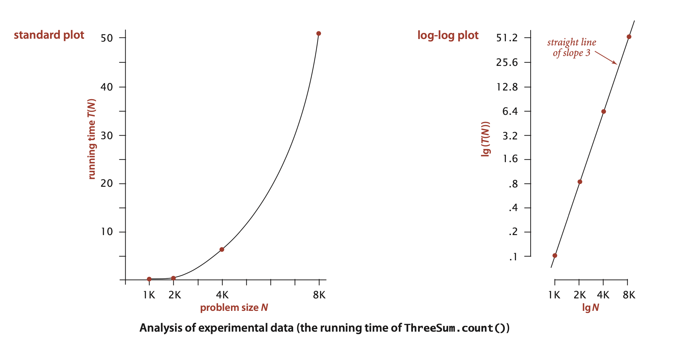
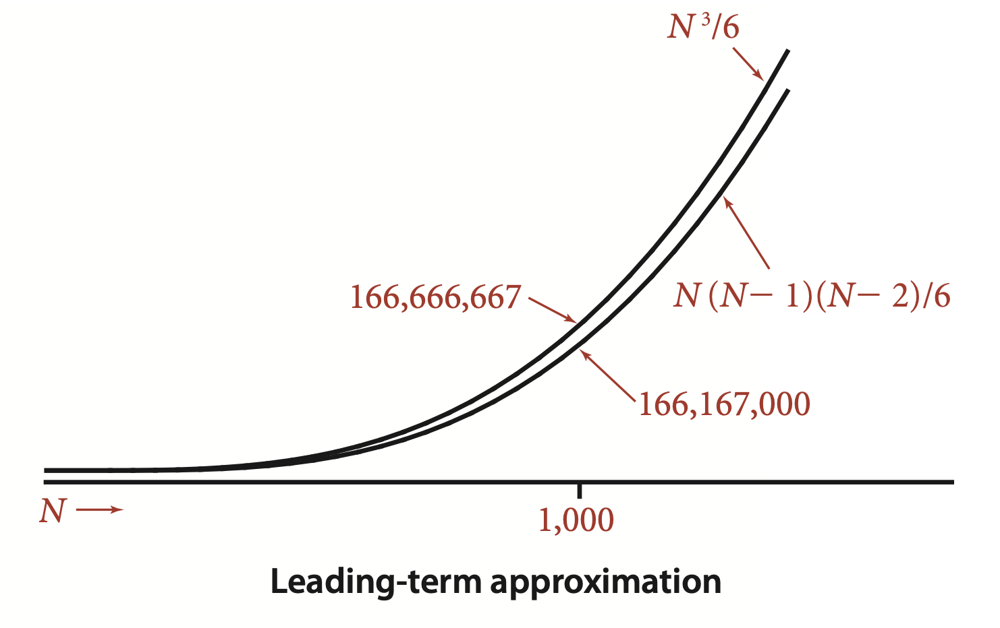
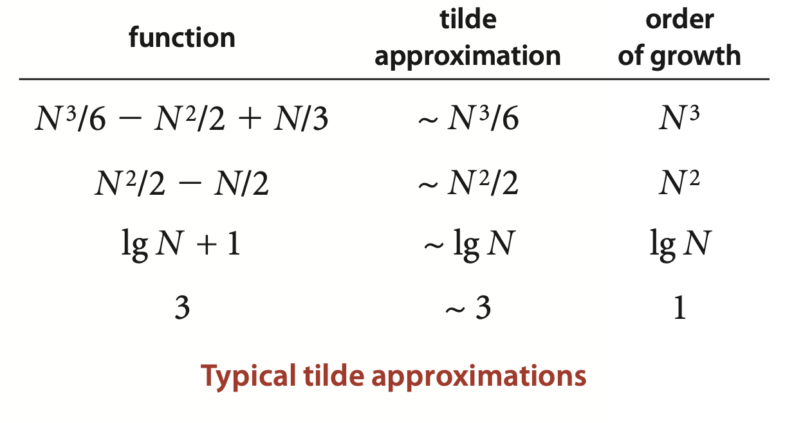
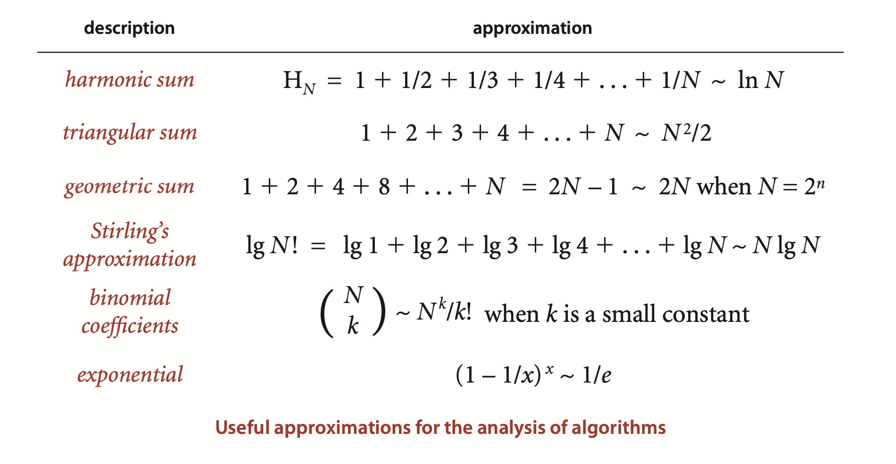
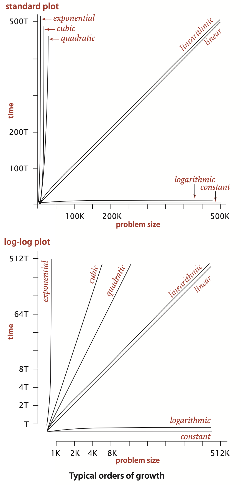
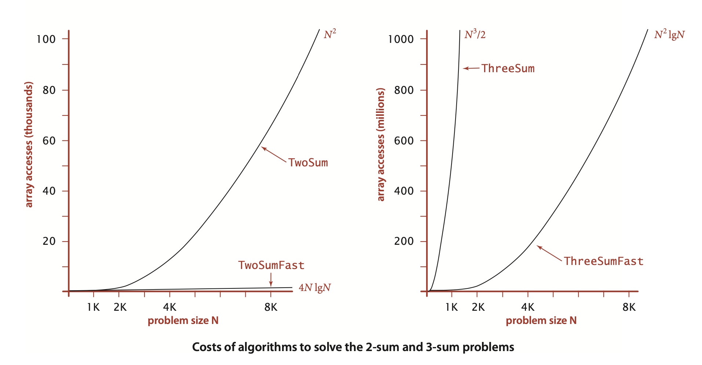
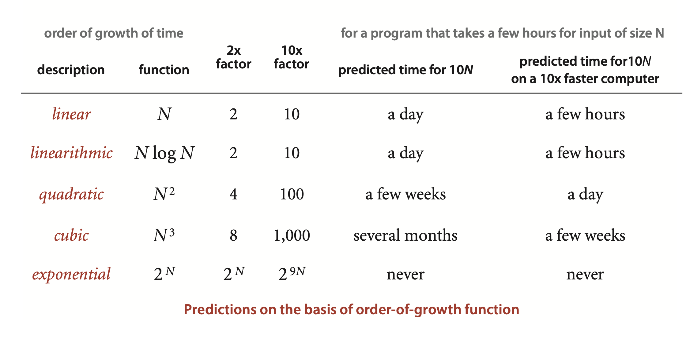
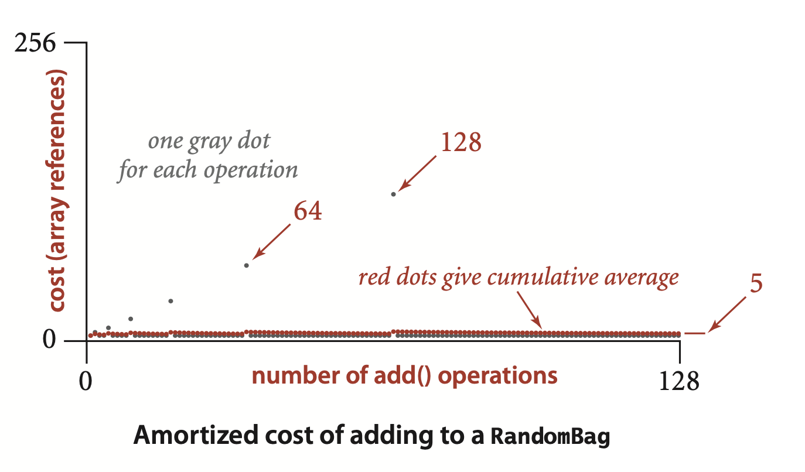
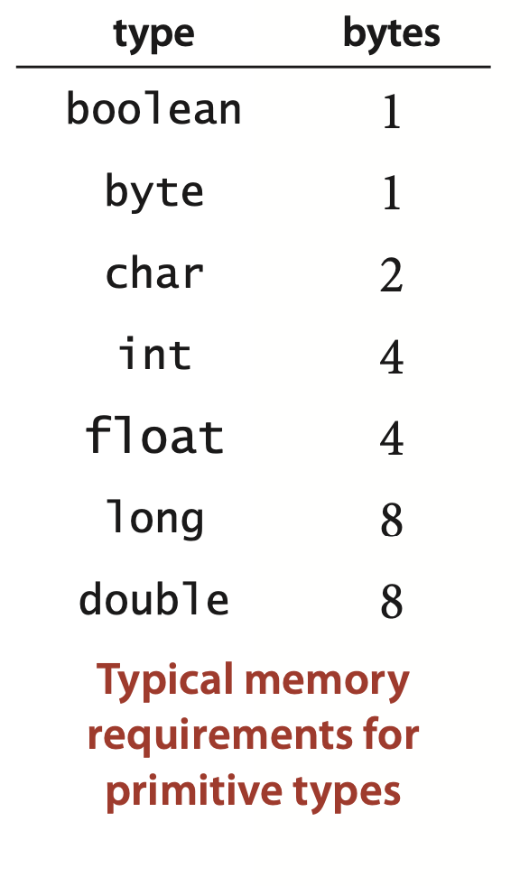
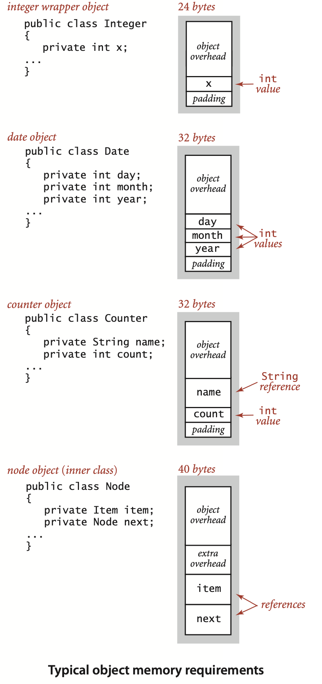

### 1.4 Analysis of Algorithms


... Another qualitative observation for many programs is that the running time is relatively insensitive to the input itself; it depends primarily on the problem size. If this relationship does not hold, we need to take steps to better understand and perhaps better control the running time’s sensitivity to the input. 

**Given N, how long will this program take?**
```java
public class ThreeSum
{
    public static int count(int[] a)
    {  // Count triples that sum to 0.
        int N = a.length;
        int cnt = 0;
        for (int i = 0; i < N; i++)
            for (int j = i+1; j < N; j++)
                for (int k = j+1; k < N; k++)
                    if (a[i] + a[j] + a[k] == 0)
                        cnt++;
        return cnt; 
    }

    public static void main(String[] args)
    {
        int[] a = In.readInts(args[0]);
        StdOut.println(count(a));
    }
}
```

**An abstract data type for a stopwatch**
*implementation*
```java
public class Stopwatch
{
   private final long start;

   public Stopwatch()
   {    start = System.currentTimeMillis();  }

   public double elapsedTime()
   {
        long now = System.currentTimeMillis();
        return (now - start) / 1000.0;
   }

}
```
*application*
```
% java Stopwatch 1000
51 triples 0.488 seconds

% java Stopwatch 2000
516 triples 3.855 seconds
```
*typical client*
```java
public static void main(String[] args)
{
   int N = Integer.parseInt(args[0]);
   int[] a = new int[N];
   for (int i = 0; i < N; i++)
      a[i] = StdRandom.uniform(-1000000, 1000000);
   Stopwatch timer = new Stopwatch();
   int cnt = ThreeSum.count(a);
   double time = timer.elapsedTime();
   StdOut.println(cnt + " triples " + time);
}
```


*program to perform experiments*
```java
public class DoublingTest
{
   public static double timeTrial(int N)
   {  // Time ThreeSum.count() for N random 6-digit ints.
      int MAX = 1000000;
      int[] a = new int[N];
      for (int i = 0; i < N; i++)
         a[i] = StdRandom.uniform(-MAX, MAX);
      Stopwatch timer = new Stopwatch();
      int cnt = ThreeSum.count(a);
      return timer.elapsedTime();
}
   public static void main(String[] args)
   {  // Print table of running times.
      for (int N = 250; true; N += N)
      {  // Print time for problem size N.
         double time = timeTrial(N);
         StdOut.printf("%7d %5.1f\n", N, time);
      }
} }
```
*results of experiments*
```
% java DoublingTest
    250     0.0
    500     0.0
    1000    0.1
    2000    0.8
    4000    6.4
    8000    51.1
...
```




... The log-log plot immediately leads to a hypothesis about the running time—the data fits a straight line of slope 3 on the log-log plot. The equation of such a line is
$$
\lg(T(N )) = 3 \lg N + \lg a 
$$
(where $a$ is a constant) which is equivalent to
$$
T(N) = aN^3
$$
the running time, as a function of the input size, as desired. We can use one of our data points to solve for a—for example, $T(8000) = 51.1 = a 8000^3$, so $a = 9.98 \times 10^{–11}$—and then use the equation
$$
T(N) = 9.98 \times 10^{–11} N^3
$$
to predict running times for large $N$. 


Knuth’s basic insight is simple: the total running time of a program is determined by two primary factors:
- The cost of executing each statement
- The frequency of execution of each statement

The former is a property of the computer, the Java compiler and the operating system; the latter is a property of the program and the input.

... Others require higher-level reasoning: for example, the if statement in ‍‍‍‍‍`ThreeSum.count()` is executed precisely
$$
N (N - 1)(N - 2)/6
$$
times (the number of ways to pick three different numbers from the input array—see Exercise 1.4.1).

>Contributor's Note:  
>$\binom{N}{3}$


##### Tilde approximations. 




**Definition.** We write $\sim f(N)$ to represent any function that, when divided by $f(N)$, approaches 1 as $N$ grows, and we write $g(N) ~ f(N)$ to indicate that $g(N)/f(N)$ approaches 1 as $N$ grows.



... Most often, we work with tilde approximations of the form $g(N) \sim af(N)$ where $f(N) = N^b(\log N)^c$ with $a$, $b$, and $c$ constants and refer to $f(N)$ as the order of growth of $g(N)$. When using the logarithm in the order of growth, we generally do not specify the base, since the constant $a$ can absorb that detail.


##### Approximate running time.
We classify blocks of Java statements by their frequency of execution, develop leading-term approximations for the frequencies, determine the cost of each statement, and then compute a total. 


A key observation from this exercise is to note that only the instructions that are executed the most frequently play a role in the final total—we refer to these instructions as the *inner loop* of the program. For `ThreeSum`, the inner loop is the statements that increment `k` and test that it is less than N and the statements that test whether the sum of three given numbers is 0 (and possibly the statement that implements the count, depending on the input). 

**Property A**. The order of growth of the running time of `ThreeSum`(to compute the number of triples that sum to 0 among $N$ numbers) is $N^3$.  
**Evidence:** Let $T(N)$ be the running time of `ThreeSum` for $N$ numbers. The mathematical model just described suggests that $T(N) \sim aN^3$ for some machine-dependent constant $a$; experiments on many computers (including yours and ours) validate that approximation.


##### Cost model.
**3-sum cost model.** When studying algorithms to solve the 3-sum problem, we count *array accesses* (the number of times an array entry is accessed, for read or write).


**Proposition B.** The brute-force 3-sum algorithm uses $\sim N^3/2$ array accesses to compute the number of triples that sum to 0 among $N$ numbers.  
**Proof:** The algorithm accesses each of the 3 numbers for each of the $\sim N^3/6$ triples.


**Summary.** For many programs, developing a mathematical model of running time reduces to the following steps:
- Develop an input model, including a definition of the problem size.
- Identify the inner loop.
- Define a cost model that includes operations in the inner loop.
- Determine the frequency of execution of those operations for the given input.  
Doing so might require mathematical analysis—we will consider some examples in the context of specific fundamental algorithms later in the book.

*Binary search.* The *input model* is the array `a[]` of size $N$; the *inner loop* is the statements in the single `while` loop; the *cost model* is the compare operation (compare the values of two array entries); and the *analysis*, discussed in Section 1.1 and given in full detail in Proposition B in Section 3.1, shows that the number of compares is at most $\lg N + 1$.  

*Whitelist.* The *input model* is the $N$ numbers in the whitelist and the $M$ numbers on standard input where we assume $M >> N$; the *inner loop* is the statements in the single `while` loop; the *cost model* is the compare operation (inherited from binary search); and the *analysis* is immediate given the analysis of binary search— the number of compares is at most $M (\lg N + 1)$.


Thus, we draw the conclusion that the order of growth of the running time of the whitelist computation is at most M lg N , subject to the following considerations:
- If $N$ is small, the input-output cost might dominate.
- The number of compares depends on the input—it lies between $\sim M$ and $\sim M \lg N$, depending on how many of the numbers on standard input are in the whitelist and on how long the binary search takes to find the ones that are (typically it is $\sim M \lg N$).
■ We are assuming that the cost of `Arrays.sort()` is small compared to $M \lg N$. `Arrays.sort()` implements the mergesort algorithm, and in Section 2.2, we will see that the order of growth of the running time of *mergesort* is $N \log N$ (see Proposition G in chapter 2), so this assumption is justified.




#### Order-of-growth classifications

##### Constant.
... Most Java operations take constant time.


##### Logarithmic.
A program whose running time’s order of growth is *logarithmic* is barely slower than a constant-time program. The classic example of a program whose running time is logarithmic in the problem size is *binary* search (see `BinarySearch` on page 47). The base of the logarithm is not relevant with respect to the order of growth (since all logarithms with a constant base are related by a constant factor), so we use $\log N$ when referring to order of growth.


##### Linear.
... its running time is proportional to N.

##### Linearithmic.
... The prototypical examples of linearithmic algorithms are `Merge.sort()` (see Algorithm 2.4) and `Quick.sort()` (see Algorithm 2.5).

##### Quadratic.
... The elementary sorting algorithms `Selection.sort()` (see Algorithm 2.1) and `Insertion.sort()` (see Algorithm 2.2) are prototypes of the programs in this classification.

##### Cubic.
... Our example for this section, ThreeSum, is a prototype.

##### Exponential.
In ChAPter 6 (but not until then!) we will consider programs whose running times are proportional to $2^N$ or higher. Generally, we use the term exponential to refer to algorithms whose order of growth is $b^N$ for any constant $b > 1$, even though different values of $b$ lead to vastly different running times. Exponential algorithms are extremely slow—you will never run one of them to completion for a large problem. Still, exponential algorithms play a critical role in the theory of algorithms because here exists a large class of problems for which it seems that an exponential algorithm is the best possible choice.




#### Designing faster algorithms

##### Warmup: 2-sum.

*Linearithmic solution to the 2-sum problem*
```java
import java.util.Arrays;
public class TwoSumFast
{
    public static int count(int[] a)
    {  // Count pairs that sum to 0.
        Arrays.sort(a);
        int N = a.length;
        int cnt = 0;
        for (int i = 0; i < N; i++)
            if (BinarySearch.rank(-a[i], a) > i)
                cnt++;
        return cnt; 
    }

    public static void main(String[] args)
    {
        int[] a = In.readInts(args[0]);
        StdOut.println(count(a));
    }
}
```

... This succinct test covers three cases:
- An unsuccessful binary search returns -1, so we do not increment the count.
- If the binary search returns `j > i`,wehave `a[i] + a[j] = 0`,so we increment the count.
- If the binary search returns `j` between 0 and i, we also have `a[i] + a[j] = 0` but do not increment the count, to avoid double counting.

The running time of the mergesort is proportional to $N \log N$, and the $N$ binary searches each take time proportional to $\log N$, so the running time of the whole algorithm is proportional to $N \log N$.


##### Fast algorithm for 3-sum.

*$N^2 \lg N$ solution to the 3-sum problem*
```java
import java.util.Arrays;

public class ThreeSumFast
{
    public static int count(int[] a)
    {  // Count triples that sum to 0.
        Arrays.sort(a);
        int N = a.length;
        int cnt = 0;
        for (int i = 0; i < N; i++)
            for (int j = i+1; j < N; j++)
            if (BinarySearch.rank(-a[i]-a[j], a) > j)
                cnt++;
        return cnt; 
    }

    public static void main(String[] args)
    {
        int[] a = In.readInts(args[0]);
        StdOut.println(count(a));
    }
}
```


##### Lower bounds.


Is there a linear algorithm for 2-sum or a linearithmic algorithm for 3-sum? The answer to this question is *no* for 2-sum (under a model that counts and allows only comparisons of linear or quadratic functions of the numbers) and *no one knows* for 3-sum, though experts believe that the best possible algorithm for 3-sum is quadratic.




#### Doubling ratio experiments

... the ratio of each running time with the previous. ... Run until the ratios approach a limit $2^b$. ... This test is not effective if the ratios do not approach a limiting value, but they do for many, many programs, implying the following conclusions:
- The order of growth of the running time is approximately $N^b$.
- To predict running times, multiply the last observed running time by $2^b$ and double $N$, continuing as long as desired. If you want to predict for an input size that is not a power of 2 times $N$, you can adjust ratios accordingly (see Exercise 1.4.9).

*program to perform experiments*
```java
public class DoublingRatio
    {
    public static double timeTrial(int N)
    // same as for DoublingTest (page 177)

    public static void main(String[] args)
    {
        double prev = timeTrial(125);
        for (int N = 250; true; N += N)
        {
            double time = timeTrial(N);
            StdOut.printf("%6d %7.1f ", N, time);
            StdOut.printf("%5.1f\n", time/prev);
            prev = time;
        }       
    }
}
```
*results of experiments*
```
% java DoublingRatio
    250     0.0     2.7
    500     0.0     4.8
    1000    0.1     6.9
    2000    0.8     7.7
    4000    6.4     8.0
    8000    51.1    8.0
```
*predictions*
```
16000   408.8   8.0
32000  3270.4   8.0
64000 26163.2   8.0
```

**Proposition C. (Doubling ratio)** If $T(N) \sim a N^b \lg N$ then $T(2N)/T(N) \sim 2b$. 
**Proof:** Immediate from the following alculation:
$$
T(2N)/T(N) = a(2N)^b \lg(2N)/aN^b \lg N =2^b (1+\lg 2/\lg N)
\sim 2^b
$$

Generally, the logarithmic factor cannot be ignored when developing a mathematical model, but it plays a less important role in predicting performance with a doubling hypothesis.


You should consider running doubling ratio experiments for every program that you write where performance matters—doing so is a very simple way to estimate the order of growth of the running time, perhaps revealing a performance bug where a program may turn out to be not as efficient as you might think. 


##### Estimating the value of using a faster computer.

... Generally, if the new computer is $x$ times faster than the old one, you can improve your running time by a factor of $x$. ... But it is usually the case that you can address larger problems with your new computer. How will that change affect the running time? 

... A famous rule of thumb known as *Moore’s Law* implies that you can expect to have a computer with about double the speed and double the memory 18 months from now, or a computer with about 10 times the speed and 10 times the memory in about 5 years. The table below demonstrates that you cannot keep pace with Moore’s Law if you are using a quadratic or a cubic algorithm, and you can quickly determine whether that is the case by doing a doubling ratio test and checking that the ratio of running times as the input size doubles approaches 2, not 4 or 8.



>Contributor's Note:  
> Suppose that with the current computer, you are able to process an input of size `N` in one hour. With a computer that is 10× faster, you can process a larger input (`N_new`) in the same one hour. If `N_new < 10 * N`, then *"you cannot keep pace with Moore’s Law"*.


#### Caveats

##### Large constants.

##### Nondominant inner loop.
... The cost model might miss the true inner loop, or the problem size N might not be sufficiently large to make the leading term in the mathematical description of the frequency of execution of instructions in the inner loop so much larger than lower-order terms that we can ignore them. 


##### Instruction time.
The assumption that each instruction always takes the same amount of time is not always correct. For example, most modern computer systems use a technique known as *caching* to organize memory, in which case accessing elements in huge arrays can take much longer if they are not close together in the array. You might observe the effect of caching for `ThreeSum` by letting `DoublingTest` run for a while. After seeming to converge to 8, the ratio of running times may jump to a larger value for large arrays because of caching.


##### System considerations.
...  A garbage collector or a just-in-time compiler or a download from the internet might drastically affect the results of experiments. Such considerations can interfere with the bedrock principle of the scientific method that experiments should be reproducible, since what is happening at this moment in your computer will never be reproduced again. Whatever else is going on in your system should *in principle* be negligible or possible to control.

##### Too close to call.
Often, when we compare two different programs for the same task, one might be faster in some situations, and slower in others. 


##### Strong dependence on inputs.
... When that is not the case, we may get inconsistent results or be unable to validate our hypotheses. For example, suppose that we modify ThreeSum to answer the question *Does the input have a triple that sums to 0* ? by changing it to return a `boolean` value, replacing `cnt++` by return `true` and adding return `false` as the last statement. The order of growth of the running time of this program is *constant* if the first three integers sum to 0 and *cubic* if there are no such triples in the input.

##### Multiple problem parameters.
... A typical example arises when an algorithm involves building a data structure and then performing a sequence of operations that use that data structure. Both the size of the data structure and the number of operations are parameters for such applications. We have already seen an example of this in our analysis of the problem of whitelisting using binary search, where we have $N$ numbers in the whitelist and $M$ numbers on standard input and a typical running time proportional to $M \log N$.


#### Coping with dependence on inputs

##### Worst-case performance guarantees.


**Proposition D.** In the linked-list implementations of `Bag` (Algorithm1.4), `Stack` (Algorithm 1.2), and `Queue` (Algorithm 1.3), all operations take constant time in the worst case.  
**Proof:** Immediate from the code. The number of instructions executed for each operation is bounded by a small constant. *Caveat* : This argument depends upon the (reasonable) assumption that the Java system creates a new Node in constant time.


##### Randomized algorithms. 
... For example, the quicksort algorithm for sorting that we study in Section 2.3 (perhaps the most widely used sorting algorithm) is quadratic in the worst case, but randomly ordering the input gives a probabilistic guarantee that its running time is linearithmic. Every time you run the algorithm, it will take a different amount of time, but the chance that the time will not be linearithmic is so small as to be negligible. Similarly, the hashing algorithms for symbol tables that we study in Section 3.4 (again, perhaps the most widely used approach) are linear-time in the worst case, but constant-time under a probabilistic guarantee.


##### Sequences of operations.
... For example, a pushdown stack where the client pushes N values, then pops them all, may have quite different performance characteristics from one where the client issues an alternating sequence N of push and pop operations. Our analysis has to take both situations into account (or to include a reasonable model of the sequence of operations).


##### Amortized analysis.
Accordingly, another way to provide a performance guarantee is to *amortize* the cost, by keeping track of the total cost of all operations, divided by the number of operations. In this setting, we can allow some expensive operations, while keeping the average cost of operations low. The prototypical example of this type of analysis is the study of the resizing array data structure for Stack that we considered in Section 1.3 (Algorithm 1.1 on page 141). For simplicity, suppose that $N$ is a power of 2. Starting with an empty structure, how many array entries are accessed for $N$ consecutive calls to `push()`? This quantity is easy to calculate: the number of array accesses is
$$
N + 4 + 8 + 16 + ... + 2N = 5N - 4
$$

The first term accounts for the array access within each of the $N$ calls to `push()`; the subsequent terms account for the array accesses to initialize the data structure each time it doubles in size. 


>Contributor's Note:  
>Creating the new array with double the size, even before assigning the values, is assumed to involve array accesses.




**Proposition E.** In the resizing array implementation of Stack (Algorithm 1.1), the average number of array accesses for any sequence of operations starting from an empty data structure is constant in the worst case.  
**Proof sketch:** For each `push()` that causes the array to grow (say from size $N$ to size $2N$), consider the $N/2 - 1$ `push()` operations that most recently caused the stack size to grow to $k$, for $k$ from $N/2 + 2$ to $N$. Averaging the $4N$ array accesses to grow the array with $N/2$ array accesses (one for each push), we get an average cost of 9 array accesses per operation. Proving that the number of array accesses used by any sequence of $M$ operations is proportional to $M$ is more intricate (see Exercise 1.4.32)


#### Memory



... For example, since the Java `int` data type is the set of integer values between -2,147,483,648 and 2,147,483,647, a grand total of $2^{32}$ different values, typical Java implementations use 32 bits to represent `int` values. 

... and each `boolean` value with 1 byte (since computers typically access memory one byte at a time).

On the other hand, analyzing memory usage is subject to various differences in machine hardware and in Java implementations, ... For example, many data structures involve representation of machine addresses, and the amount of memory needed for a machine address varies from machine to machine. For consistency, we assume that 8 bytes are needed to represent addresses, as is typical for 64-bit architectures that are now widely used, recognizing that many older machines use a 32-bit architecture that would involve just 4 bytes per machine address.


##### Objects.
... we add the amount of memory used by each instance variable to the overhead associated with each object, typically 16 bytes. The overhead includes a reference to the object’s class, garbage collection information, and synchronization information. Moreover, the memory usage is typically padded to be a multiple of 8 bytes (machine words, on a 64-bit machine). For example, an Integer object uses 24 bytes (16 bytes of overhead, 4 bytes for its int instance variable, and 4 bytes of padding). Similarly, a Date (page 91) object also uses 32 bytes: 16 bytes of overhead, 4 bytes for each of its three int instance variables, and 4 bytes of padding. A reference to an object typically is a memory address and thus uses 8 bytes of memory. For example, a Counter (page 89) object uses 32 bytes: 16 bytes of overhead, 8 bytes for its String instance variable (a reference), 4 bytes for its int instance variable, and 4 bytes of padding. When we account for the memory for a reference, we account separately for the memory for the object itself, so this total does not count the memory for the String value.





##### Linked lists. 
A nested non-static (inner) class such as our Node class (page 142) requires an extra 8 bytes of overhead (for a reference to the enclosing instance). Thus, a Node object uses 40 bytes (16 bytes of object overhead, 8 bytes each for the references to the Item and Node objects, and 8 bytes for the extra overhead). Thus, since an Integer object uses 24 bytes, a stack with $N$ integers built with a linked-list representation (Algorithm 1.2) uses $32 + 64N$ bytes, the usual 16 for object overhead for Stack, 8 for its reference instance variable, 4 for its int instance variable, 4 for padding, and 64 for each entry, 40 for a Node and 24 for an Integer.

>Contributor's Note:  
>the "the extra overhead" is for hidden outer reference (this$0), that’s the automatic field the compiler injects so that a Node can access fields/methods of its enclosing LinkedList object.

##### Arrays.
... Arrays in Java are implemented as objects, typically with extra overhead for the length. An array of primitive-type values typically requires 24 bytes of header information (16 bytes of object overhead, 4 bytes for the length, and 4 bytes of padding) plus the memory needed to store the values. For example, an array of $N$ int values uses $24 + 4N$ bytes (rounded up to be a multiple of 8), and an array of $N$ double values uses $24 + 8N$ bytes. An array of objects is an array of references to the objects, so we need to add the space for the references to the space required for the objects. For example, an array of $N$ Date objects (page 91) uses 24 bytes (array overhead) plus $8N$ bytes (references) plus 32 bytes for each object and 4 bytes of padding, for a grand total of $24 + 40N$ bytes. A two-dimensional array is an array of arrays (each array is an object). For example, a two-dimensional $M$-by-$N$ array of double values uses 24 bytes (overhead for the array of arrays) plus $8 M$ bytes (references to the row arrays) plus $M$ times 16 bytes (overhead from the row arrays) plus $M$ times $N$ times 8 bytes (for the $N$ double values in each of the $M$ rows) for a grand total of $8NM + 32M + 24 \sim 8NM$ bytes.


##### String objects.
... The standard `String` implementation has four instance variables: a reference to a character array (8 bytes) and three int values (4 bytes each). The first int value is an offset into the character array; the second is a count (the string length). ... the string that is represented consists of the characters `value[offset]` through `value[offset + count - 1]`.The third `int` value in `String` objects is a hash code that saves recomputation in certain circumstances that need not concern us now. Therefore, each `String` object uses a total of 40 bytes (16 bytes for object overhead plus 4 bytes for each of the three int instance variables plus 8 bytes for the array reference plus 4 bytes of padding). This space requirement is in addition to the space needed for the characters themselves, which are in the array. The space needed for the characters is accounted for separately because the `char` array is often shared among strings. Since `String` objects are immutable, this arrangement allows the implementation to save memory when `String` objects have the same underlying `value[]`. 


##### String values and substrings.
A `String` of length $N$ typically uses 40 bytes (for the `String` object) plus $24 + 2N$ bytes (for the array that contains the characters) for a total of $64 + 2N$ bytes. ... When you use the `substring()` method, you create a new String object (40 bytes) but reuse the same `value[]` array, so a substring of an existing string takes just 40 bytes. ... In other words, *a substring takes constant extra memory and forming a substring takes constant time*, even when the lengths of the string and the substring are huge.


... there are numerous complicating factors that can make the task significantly more difficult. We have already noted the potential effect of aliasing. Moreover, memory consumption is a complicated dynamic process when function calls are involved because the system memory allocation mechanism plays a more important role, with more system dependencies. For example, when your program calls a method, the system allocates the memory needed for the method (for its local variables) from a special area of memory called the *stack* (a system pushdown stack), and when the method returns to the caller, the memory is returned to the stack. For this reason, creating arrays or other large objects in recursive programs is dangerous, since each recursive call implies significant memory usage. When you create an object with new, the system allocates the memory needed for the object from another special area of memory known as the *heap* (not the same as the binary heap data structure we consider in Section 2.4), and you must remember that every object lives until no references to it remain, at which point a system process known as *garbage collection* reclaims its memory for the heap. Such dynamics can make the task of precisely estimating memory usage of a program challenging.


#### Perspective
... Perhaps the most common mistake made in programming is to pay too much attention to performance characteristics. Your first priority is to make your code clear and correct. Modifying a program for the sole purpose of speeding it up is best left for experts. Indeed, doing so is often counterproductive, as it tends to create code that is complicated and difficult to understand. C. A. R. Hoare (the inventor of quicksort and a leading proponent of writing clear and correct code) once summarized this idea by saying that *“premature optimization is the root of all evil,”* to which Knuth added the qualifier *“(or at least most of it) in programming.”* Beyond that, improving the running time is not worthwhile if the available cost benefits are insignificant. For example, improving the running time of a program by a factor of 10 is inconsequential if the running time is only an instant. Even when a program takes a few minutes to run, the total time required to implement and debug an improved algorithm might be substantially more than the time required simply to run a slightly slower one—you may as well let the computer do the work. Worse, you might spend a considerable amount of time and effort implementing ideas that should in theory improve a program but do not do so in practice.


Perhaps the second most common mistake made in programming is to ignore performance characteristics.


**Q.** I’ve seen other notations for describing order of growth. What’s the story?  
**A.** The “big-Oh” notation is widely used: we say that $f(N)$ is $O(g(N))$ if there exist constants $c$ and $N_0$ such that $|f(N)| < c g(N)$ for all $N > N_0$. This notation is very useful in providing asymptotic upper bounds on the performance of algorithms, which is important in the theory of algorithms. But it is not useful for predicting performance or for comparing algorithms.


**Q.** Whynot?  
**A.** The primary reason is that it describes only an *upper bound* on the running time. Actual performance might be much better. The running time of an algorithm might be both $O(N^2)$ and $\sim a N \log N$. As a result, it cannot be used to justify tests like our doubling ratio test (see Proposition C on page 193).


**Q.** So why is the big-Oh notation so widely used?  
**A.** It facilitates development of bounds on the order of growth, even for complicated algorithms for which more precise analysis might not be feasible. Moreover, it is compatible with the “big-Omega” and “big-Theta” notations that theoretical computer scientists use to classify algorithms by bounding their worst-case performance. We say that $f(N)$ is $\Omega (g(N))$ if there exist constants $c$ and $N_0$ such that $|f(N)| > c g(N)$ for $N > N_0$; and if $f(N)$ is $O(g(N))$ and $\Omega(g(N))$, we say that $f(N)$ is $\Theta(g(N))$. The “bigOmega” notation is typically used to describe a *lower bound* on the worst case, and the “big-Theta” notation is typically used to describe the performance of algorithms that are *optimal* in the sense that no algorithm can have better asymptotic worst-case order of growth. Optimal algorithms are certainly worth considering in practical applications, but there are many other considerations, as you will see.


**Q.** Aren’t upper bounds on asymptotic performance important?  
**A.** Yes, but we prefer to discuss precise results in terms of frequency of statement exceution with respect to cost models, because they provide more information about algorithm performance and because deriving such results is feasible for the algorithms that we discuss. For example, we say “`ThreeSum` uses $\sim N^3/2$ array accesses” and “the number of times `cnt++` is executed in `ThreeSum` is $\sim N^3/6$ in the worst case,” which is a bit more verbose but much more informative than the statement “the running time of `ThreeSum` is $O(N^3)$.”


**Q.** When the order of growth of the running time of an algorithm is $N\log N$,thedoubling test will lead to the hypothesis that the running time is $\sim a N$ for a constant a. Isn’t that a problem?  
**A.** We have to be careful not to try to infer that the experimental data implies a particular mathematical model, but when we are just predicting performance, this is not really a problem. For example, when $N$ is between 16,000 and 32,000, the plots of $14N$ and $N \lg N$ are very close to one another. The data fits both curves. As $N$ increases, the curves become closer together. It actually requires some care to experimentally check the hypothesis that an algorithm’s running time is linearithmic but not linear.

**Q.** Does `int[] a = new int[N]` count as *N* array accesses (to initialize entries to 0)?  
**A.** Most likely yes, so we make that assumption in this book, though a sophisticated compiler implementation might try to avoid this cost for huge sparse arrays.
