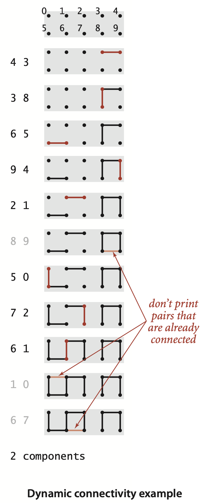
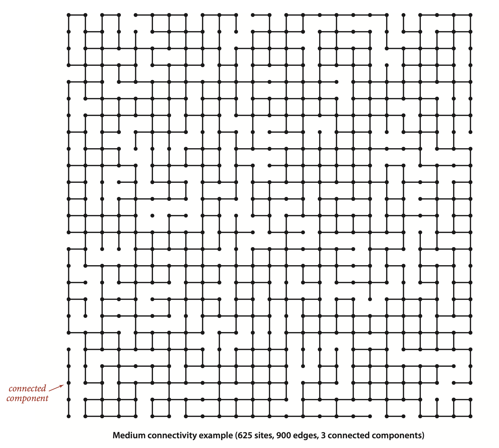
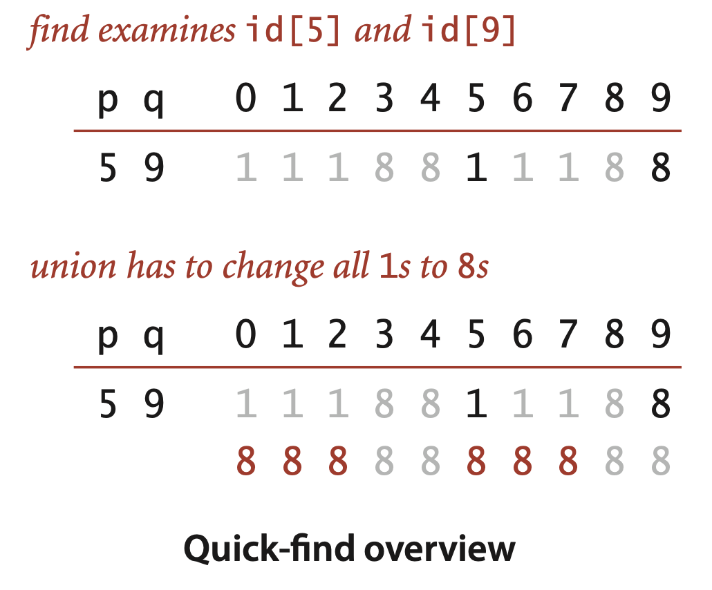
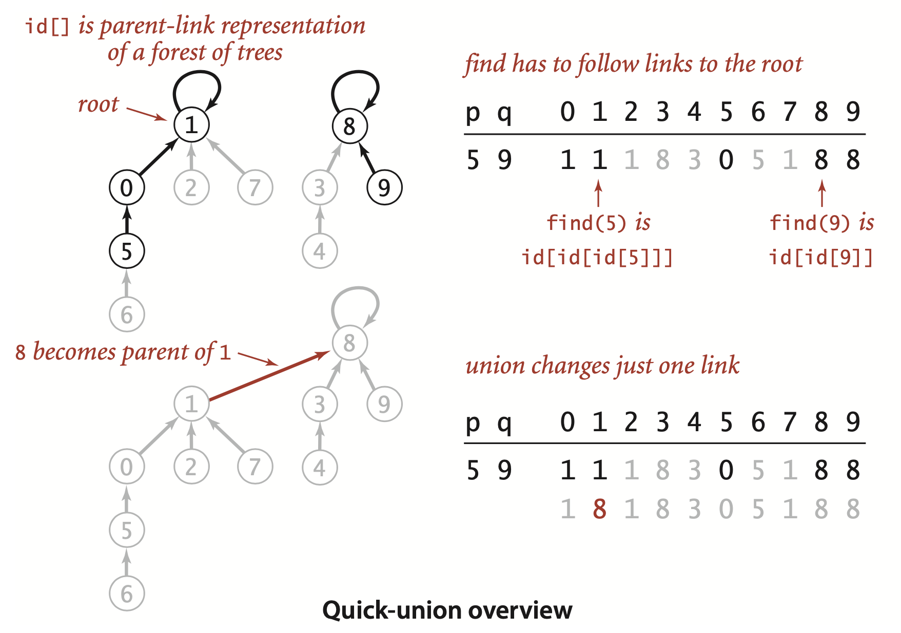
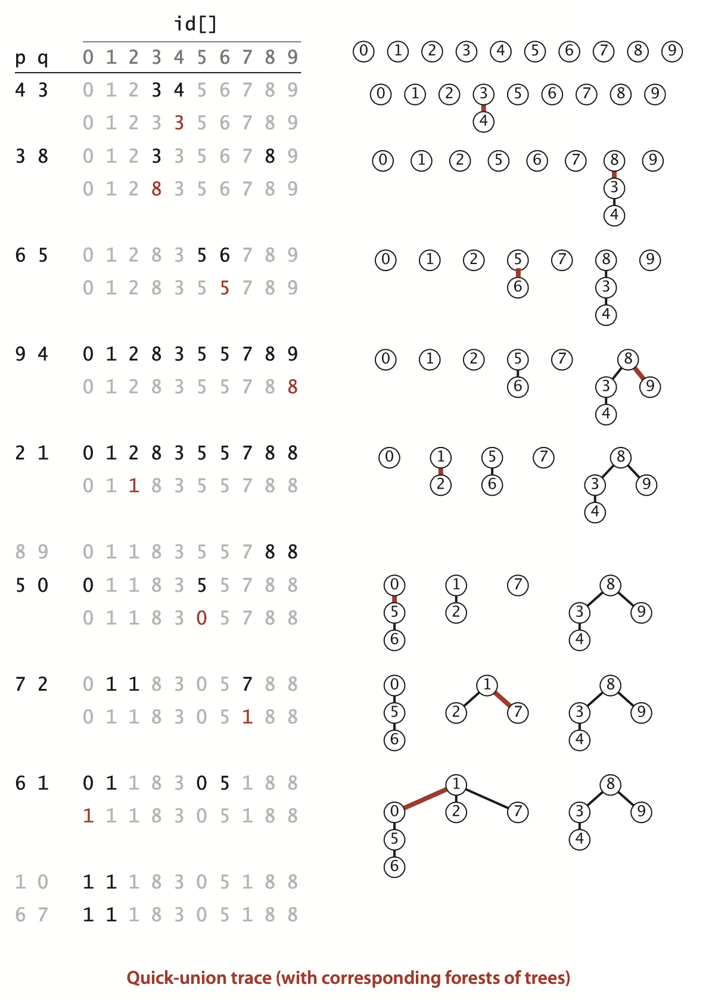
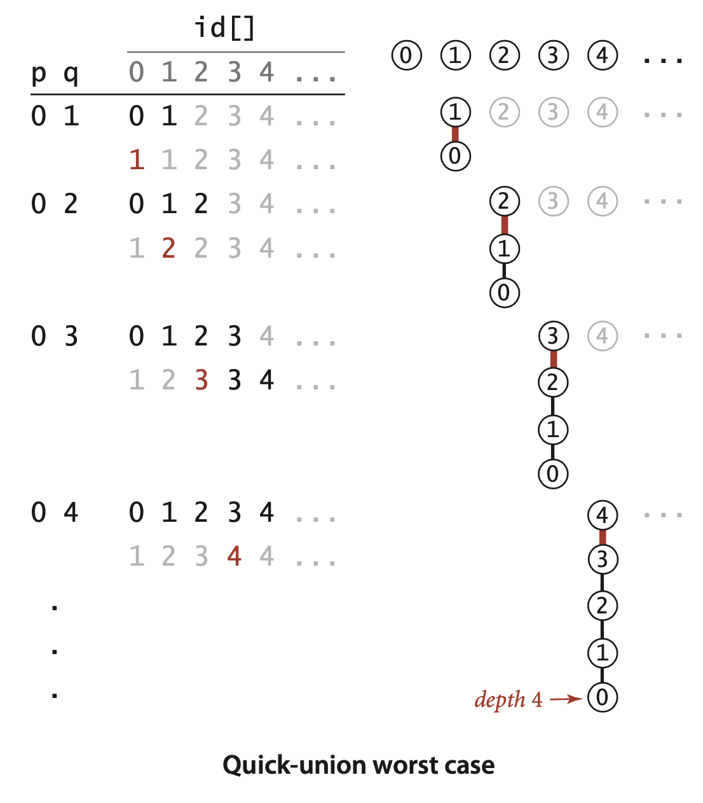
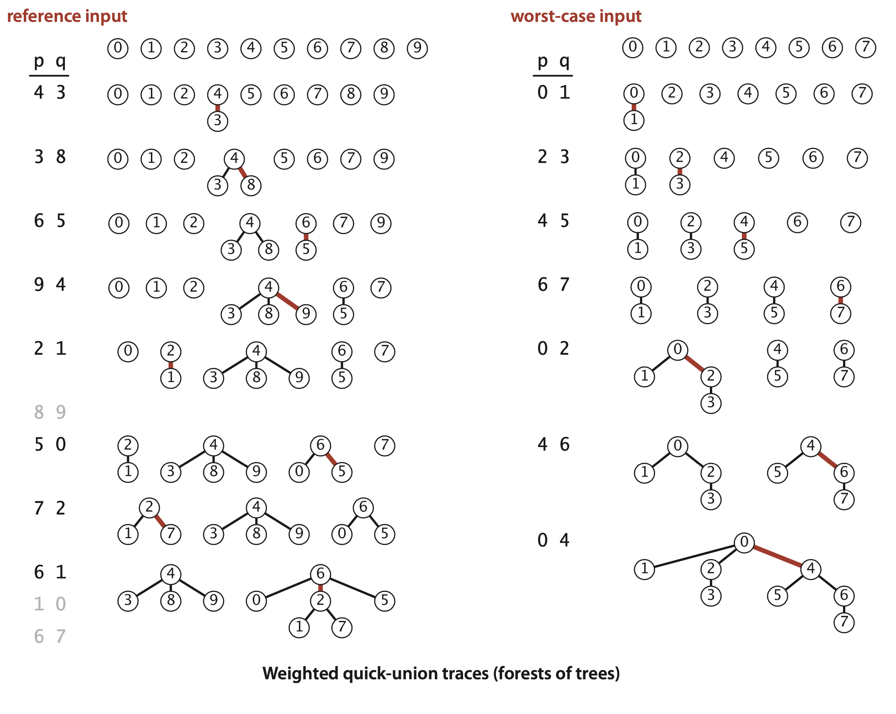
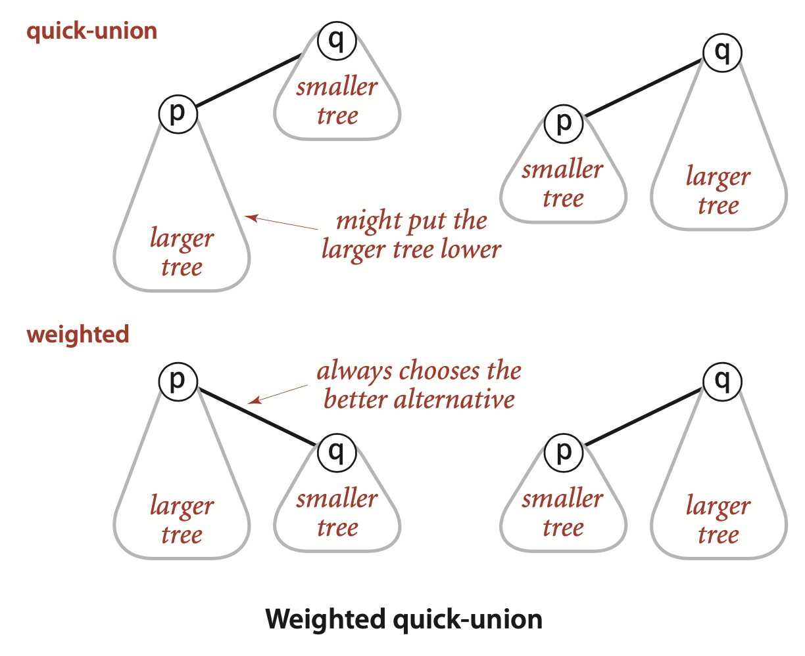
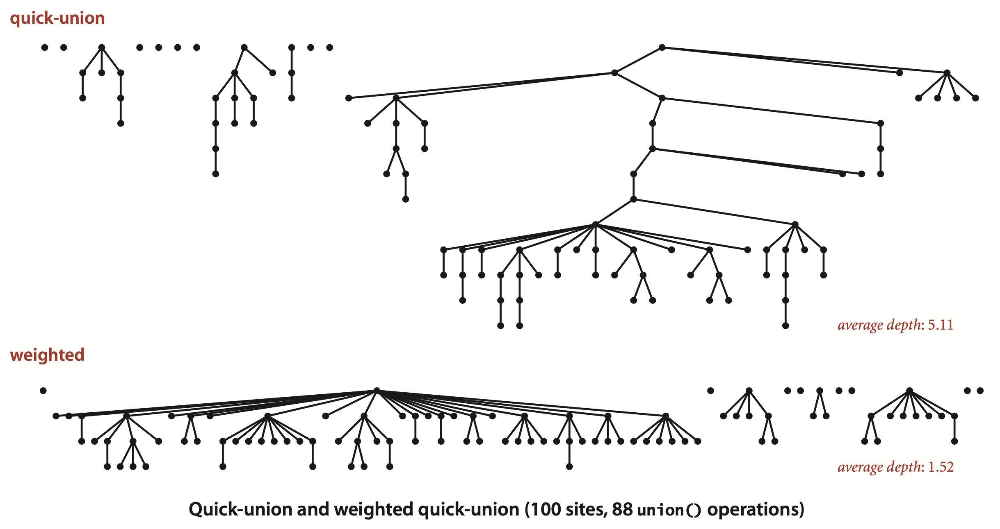
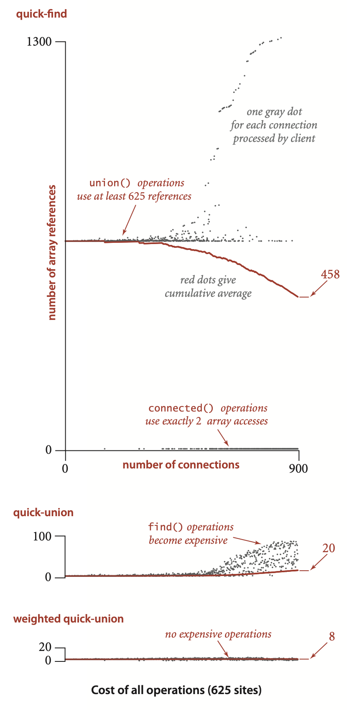

### 1.5 Case Study: Union-Find

#### Dynamic connectivity

The input is a sequence of pairs of integers, where each integer represents an object of some type and we are to interpret the pair `p q` as meaning “`p` is connected to `q`.”We assume that “is connected to” is an equivalence relation, which means that it is
- Reflexive : `p` is connected to `p`.
- Symmetric : If `p` is connected to `q`, then `q` is connected to `p`.
- Transitive : If `p` is connected to `q` and `q` is connected to `r`, then `p` is connected to `r`.

... Informally, we refer to the task of designing such a method as the *dynamic connectivity* problem. 



This problem arises applications such as the following:
- *Networks.* The integers might represent computers in a large network, and the pairs might represent connections in the network.
- *Variable-name equivalence.* In certain programming environments, it is possible to declare two variable names as being equivalent (references to the same object). After a sequence of such declarations, the system needs to be able to determine whether two given names are equivalent. This application is an early one (for the FORTRAN programming language) that motivated the development of the algorithms that we are about to consider.
- *Mathematical sets.* On a more abstract level, you can think of the integers as belonging to mathematical sets.


To fix ideas, we will use networking terminology for the rest of this section and refer to the objects as *sites*, the pairs as *connections*, and the equivalence classes as *connected components*, or just *components* for short.




**Union-find cost model.** When studying algorithms to implement the union-find API, we count *array accesses* (the number of times an array entry is accessed, for read or write).


```java
public class UF
{
        private int[] id;     // access to component id (site indexed)
        private int count;    // number of components

        public UF(int N)
        {  // Initialize component id array.
            count = N;
            id = new int[N];
            for (int i = 0; i < N; i++)
                id[i] = i;
        }

        public int count()
        {   return count;  }

        public boolean connected(int p, int q)
        {   return find(p) == find(q);  }

        public int  find(int p)
        public void union(int p, int q)
        // See page 222 (quick-find),page 224 (quick-union) andpage 228 (weighted).

        public static void main(String[] args)
        {  // Solve dynamic connectivity problem on StdIn.
            int N = StdIn.readInt();
            UF uf = new UF(N);
            while (!StdIn.isEmpty())
            {
                int p = StdIn.readInt();
                int q = StdIn.readInt();           // Read pair to connect. 
                if (uf.connected(p, q)) continue;  // Ignore if connected.
                uf.union(p, q);                    // Combine components
                StdOut.println(p + " " + q);       //   and print connection.
            }
            StdOut.println(uf.count() + " components");
        }
}
```
```
% more tinyUF.txt 
10
4 3
3 8
6 5   
9 4 
2 1 
8 9 
5 0 
7 2 
6 1 
1 0 
6 7

% java UF < tinyUF.txt 
4 3
3 8
6 5
9 4
2 1
5 0
7 2
6 1
2 components
```


#### Implementations

##### Quick-find.

...  This method is called quick-find because `find(p)` just returns `id[p]`, ...

```java
public int find(int p)
{  return id[p];  }

public void union(int p, int q)
{  // Put p and q into the same component.
    int pID = find(p);
    int qID = find(q);

    // Nothing to do if p and q are already in the same component.
    if (pID == qID) return;

    // Rename p’s component to q’s name.
    for (int i = 0; i < id.length; i++)
        if (id[i] == pID) id[i] = qID;
    count--; 
}
```



##### Quick-find analysis.
... But quick-find is typically not useful for large problems because `union()` needs to scan through the whole `id[]` array for each input pair.

**Proposition F.** The quick-find algorithm uses one array access for each call to `find()` and between $N + 3$ and $2N + 1$ array accesses for each call to `union()` that combines two components.  
**Proof:** Immediate from the code. Each call to `connected()` tests two entries in the `id[]` array, one for each of the two calls to `find()`. Each call to `union()` that combines two components does so by making two calls to `find()`, testing each of the $N$ entries in the `id[]` array, and changing between 1 and $N - 1$ of them.

In particular, suppose that we use quick-find for the dynamic connectivity problem and wind up with a single component. This requires at least $N - 1$ calls to `union()`, and, consequently, at least $(N + 3)(N - 1) ~ N^2$ array accesses—we are led immediately to the hypothesis that dynamic connectivity with quick-find can be a *quadratic*-time process. 


#### Quick-union.
```java
private int find(int p)
{  // Find component name.
    while (p != id[p]) p = id[p];
    return p; 
}

public void union(int p, int q)
{  // Give p and q the same root.
    int pRoot = find(p);
    int qRoot = find(q);
    if (pRoot == qRoot) return;
    
    id[pRoot] = qRoot;

    count--; 
}
```


... we follow links to find the roots associated with p and q, then rename one of the components by linking one of these roots to the other; hence the name *quick-union*. 

##### Forest-of-trees representation.




##### Quick-union analysis.
... In the best case, `find()` just needs one array access to find the identifier associated with a site, as in quick-find; in the worst case, it needs $2N + 1$ array accesses, as for 0 in the example at left (this count is conservative since compiled code will typically not do an array access for the second reference to `id[p]` in the `while` loop). Accordingly, it is not difficult to construct a best-case input for which the running time of our dynamic connectivity client is linear; on the other hand it is also not difficult to construct a worst-case input for which the running time is quadratic (see the diagram at left and Proposition G below).





...  but quick-union still has the liability that we cannot *guarantee* it to be substantially faster than quick-find in every case (for certain input data, quick-union is no faster than quick-find).

**Definition.** The *size* of a tree is its number of nodes. The *depth* of a node in a tree is the number of links on the path from it to the root. The *height* of a tree is the maximum depth among its nodes.

**Proposition G.** The number of array accesses used by `find()` in quick-union is 1 plus the twice the depth of the node corresponding to the given site. The number of array accesses used by `union()` and `connected()` is the cost of the two `find()` operations (plus 1 for `union()` if the given sites are in different trees).  
**Proof:** Immediate from the code.

>Contributor's Note:  
>Each "step" along the path requires two array accesses: `while (p != id[p]) p = id[p];`. We need 1 more array access to return the root value.


Again, suppose that we use quick-union for the dynamic connectivity problem and wind up with a single component. An immediate implication of Proposition G is that the running time is quadratic, in the worst case. Suppose that the input pairs come in the order `0-1`, then `0-2`, then `0-3`, and so forth. After $N - 1$ such pairs, we have $N$ sites all in the same set, and the tree that is formed by the quick-union algorithm has height $N - 1$, with `0` linking to `1`, which links to `2`, which links to `3`, and so forth (see the diagram on the facing page). By Proposition G, the number of array accesses for the `union()` operation for the pair `0 i` is exactly $2i+2$ (site `0` is at depth `i` and site `i` at depth `0`). Thus, the total number of array accesses for the `find()` operations for these $N$ pairs is $2 (1 + 2 + . . . + N )\sim N^2$.

>Contributor's Note:  
> find(0) = 2i + 1.  
> find(i) = 1.


##### Weighted quick-union.
Rather than arbitrarily connecting the second tree to the first for `union()`, we keep track of the size of each tree and always connect the smaller tree to the larger. This change requires slightly more code and another array to hold the node counts, as shown on page 228, but it leads to substantial improvements in efficiency.







**ALGORITHM 1.5 (continued) Union-find implementation (weighted quick-union)**
```java
public class WeightedQuickUnionUF
{
    private int[] id;       // parent link (site indexed)
    private int[] sz;       // size of component for roots (site indexed)
    private int count;      // number of components
    
    public WeightedQuickUnionUF(int N)
    {
        count = N;
        id = new int[N];
        for (int i = 0; i < N; i++) id[i] = i;
        sz = new int[N];
        for (int i = 0; i < N; i++) sz[i] = 1;
    }

    public int count()
    {   return count;  }

    public boolean connected(int p, int q)
    {   return find(p) == find(q);  }

    private int find(int p)
    {  // Follow links to find a root.
        while (p != id[p]) p = id[p];
        return p; 
    }

    public void union(int p, int q)
    {
        int i = find(p);
        int j = find(q);
        if (i == j) return;

        // Make smaller root point to larger one.
        if   (sz[i] < sz[j])    { id[i] = j; sz[j] += sz[i]; }
        else                    { id[j] = i; sz[i] += sz[j]; }
        count--; 
    }
}
```


##### Weighted quick-union analysis.
The figure at right on the top of page 229 illustrates the worst case for weighted quick union, when the sizes of the trees to be merged by union() are always equal (and a power of 2). These tree structures look complex, but they have the simple property that the height of a tree of $2^n$ nodes is $n$. Furthermore, when we merge two trees of $2^n$ nodes, we get a tree of $2^{n+1} nodes, and we increase the height of the tree to $n + 1$. This observation generalizes to provide a proof that the weighted algorithm can guarantee *logarithmic* performance.


>Contributor's Note:  
>Height only increases when the two trees are the same size. All number above are for merging equal sized trees.


**Proposition H.** The depth of any node in a forest built by weighted quick-union for $N$ sites is at most $\lg N$.  
**Proof:** We prove a stronger fact by (strong) induction: The height of every tree of size $k$ in the forest is at most $\lg k$. The base case follows from the fact that the tree height is 0 when $k$ is 1. By the inductive hypothesis, assume that the tree height of a tree of size $i$ is at most $\lg i$ for all $i < k$. When we combine a tree of size $i$ with a tree of size $j$ with $i \leq j$ and $i + j = k$, we increase the depth of each node in the smaller set by 1, but they are now in a tree of size $i + j = k$, so the property is preserved because $1+ \lg i = \lg(i + i) \leq \lg(i+j) = \lg k$.

**Corollary.** For weighted quick-union with $N$ sites, the worst-case order of growth of the cost of `find()`, `connected()`, and `union()` is $\log N$.  
**Proof.** Each operation does at most a constant number of array accesses for each node on the path from a node to a root in the forest.




The weighted quick-union algorithm uses at most $c M \lg N$ array accesses to process $M$ connections among $N$ sites for a small constant $c$. This result is in stark contrast to our finding that quick-find always (and quick-union sometimes) uses *at least* $MN$ array accesses


... Indeed it is frequently the case that a 1-node tree is merged with a larger tree, which puts the node just one link from the root. Empirical studies on huge problems tell us that weighted quick-union typically solves practical problems in *constant* time per operation.


##### Optimal algorithms.

... For example, the following method, known as *path compression*, is easy to implement. Ideally, we would like every node to link directly to the root of its tree, but we do not want to pay the price of changing a large number of links, as we did in the quick-find algorithm. ... To implement path compression, we just add another loop to `find()` that sets the `id[]` entry corresponding to each node encountered along the way to link directly to the root. The net result is to flatten the trees almost completely, approximating the ideal achieved by the quick-find algorithm. The method is simple and effective, but you are not likely to be able to discern any improvement over weighted quick-union in a practical situation (see Exercise 1.5.24). 

*Weighted quick union with path compression is optimal but not quite constant-time per operation.* That is, not only is weighted quick-find with path compression not constant-time per operation in the worst case (amortized), but also there exists *no* algorithm that can guarantee to perform each union-find operation in amortized constant time (under the very general “cell probe” model of computation). Weighted quick-union with path compression is very close to the best that we can do for this problem.


##### Amortized cost plots.

... For the $i\text{th}$ connection processed, we maintain a variable cost that counts the number of array accesses (to `id[]` or `sz[]`) and a variable total that is the sum of the total number of array accesses so far. Then we plot a gray dot at `(i, cost)` and a red dot at `(i, total/i)`. The red dots are the average cost per operation, or amortized cost.


For quick-find, every `union()` operation uses at least 625 accesses (plus 1 for each component merged, up to another 625) and every `connected()` operation uses 2 accesses. Initially, most of the connections lead to a call on `union()`, so the cumulative average hovers around 625; later, most connections are calls to `connected()` that cause the call to union() to be skipped, so the cumulative average decreases, but still remains relatively high. 


 For quick-union, all operations initially require only a few array accesses; eventually, the height of the trees becomes a significant factor and the amortized cost grows noticably.

 For weighted quick-union, the tree height stays small, none of the operations are expensive, and the amortized cost is low. These experiments validate our conclusion that weighted quick-union is certainly worth implementing
and that there is not much further room for improvement for practical problems.




**Q.** I’d like to add a delete() method to the API that allows clients to delete connections. Any advice on how to proceed?  
**A.** No one has devised an algorithm as simple and efficient as the ones in this section that can handle deletions. This theme recurs throughout this book. Several of the data structures that we consider have the property that deleting something is much more difficult than adding something.

**Q.** What is thec ell-probe model?  
**A.** A model of computation where we only count accesses to a random-access memory large enough to hold the input and consider all other operations to be free.


>Contributor's Note:  
>For practice:


```java

public class UF
{
        public UF(int N)
        {}

        public int count()
        {}

        public boolean connected(int p, int q)
        {}

        public int  find(int p)
        public void union(int p, int q)
        // See page 222 (quick-find),page 224 (quick-union) andpage 228 (weighted).

        public static void main(String[] args)
        {  // Solve dynamic connectivity problem on StdIn.
            int N = StdIn.readInt();
            UF uf = new UF(N);
            while (!StdIn.isEmpty())
            {
                int p = StdIn.readInt();
                int q = StdIn.readInt();           // Read pair to connect. 
                if (uf.connected(p, q)) continue;  // Ignore if connected.
                uf.union(p, q);                    // Combine components
                StdOut.println(p + " " + q);       //   and print connection.
            }
            StdOut.println(uf.count() + " components");
        }
}

//quick-find
public int find(int p)
{}
public void union(int p, int q)
{}


//quick-union
private int find(int p)
{}
public void union(int p, int q)
{}


public class WeightedQuickUnionUF
{
    public WeightedQuickUnionUF(int N)
    {}

    public int count()
    {}

    public boolean connected(int p, int q)
    {}

    private int find(int p)
    {}

    public void union(int p, int q)
    {}
}
```
