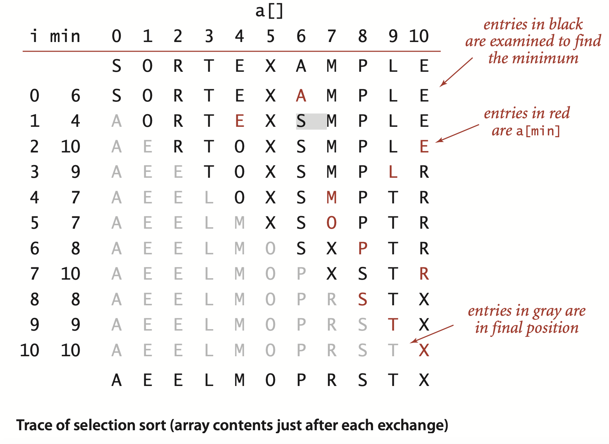
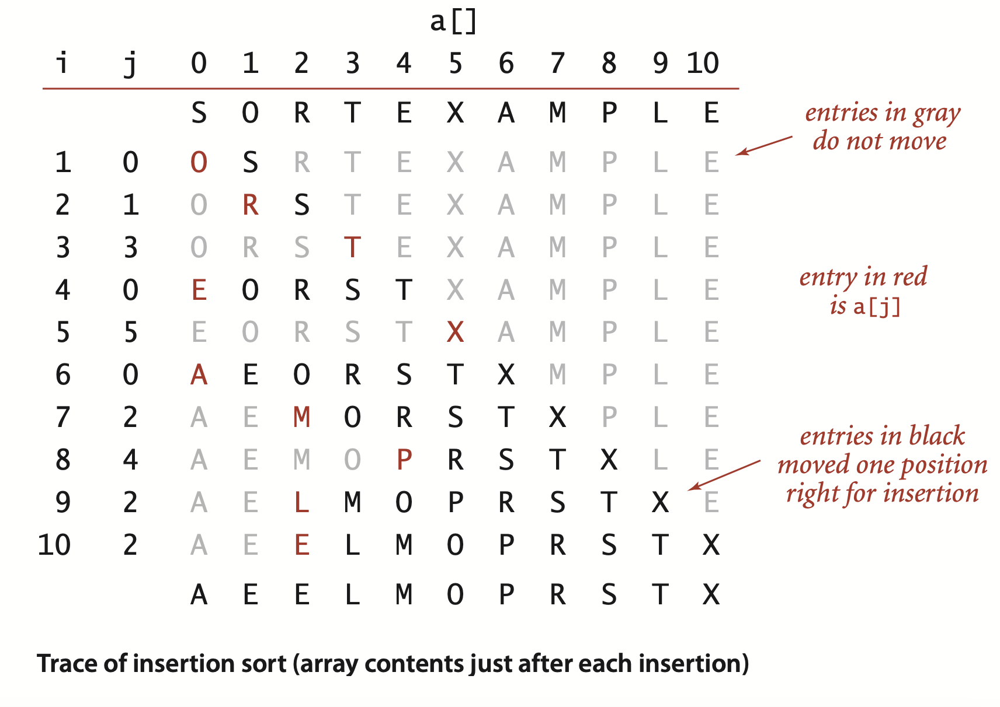
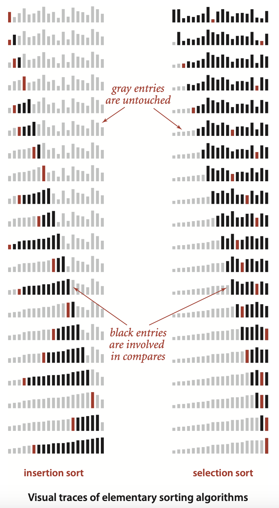
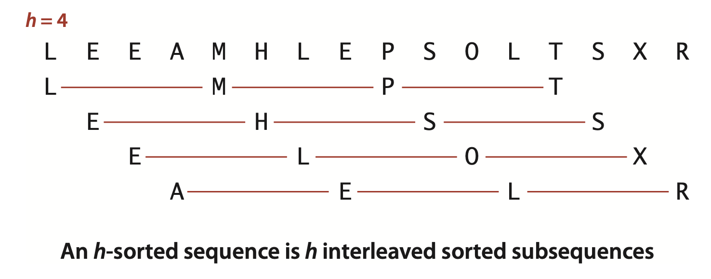
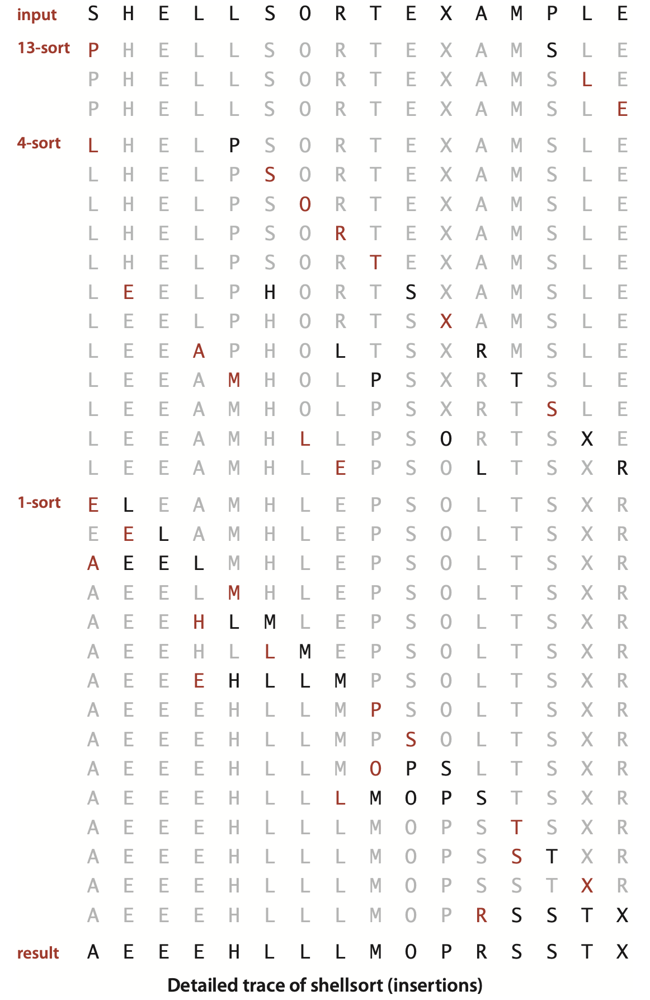

### 2.1 Elementary Sorts


... In the early days of computing, the common wisdom was that up to 30 percent of all computing cycles was spent sorting. 


**Template for sort classes**
```java
public class Example
{
    public static void sort(Comparable[] a)
    {  /* See Algorithms 2.1, 2.2, 2.3, 2.4, 2.5, or 2.7. */  }

    private static boolean less(Comparable v, Comparable w)
    {   return v.compareTo(w) < 0;  }

    private static void exch(Comparable[] a, int i, int j)
    {   Comparable t = a[i]; a[i] = a[j]; a[j] = t;  }

    private static void show(Comparable[] a)
    {   // Print the array, on a single line.
        for (int i = 0; i < a.length; i++)
            StdOut.print(a[i] + " ");
        StdOut.println();
    }

    public static boolean isSorted(Comparable[] a)
    {  // Test whether the array entries are in order.
        for (int i = 1; i < a.length; i++)
            if (less(a[i], a[i-1]))  return false;
        return true;
    }

    public static void main(String[] args)
    {   // Read strings from standard input, sort them, and print.
        String[] a = In.readStrings();
        sort(a);
        assert isSorted(a);
        show(a);
    } 
}
```
```
% more tiny.txt
S O R T E X A M P L E 

% java Example < tiny.txt 
A E E L M O P R S T X

% more words3.txt
bed bug dad yes zoo ... all bad yet

% java Example < words.txt
all bad bed bug dad ... yes yet zoo
```

##### Certification
.... As a conservative practice, we include the statement assert `isSorted(a)`; ...


##### Running time.
**Sorting cost model.** When studying sorting algorithms, we count *compares* and *exchanges*. For algorithms that do not use exchanges, we count *array accesses*.


##### Extra memory.
... The sorting algorithms divide into two basic types: those that sort *in place* and use no extra memory except perhaps for a small functioncall stack or a constant number of instance variables, and those that need enough extra memory to hold another copy of the array to be sorted.


##### Types of data.
Our sort code is effective for any item type that implements the `Comparable` interface. ....  Java’s convention is that the call `v.compareTo(w)` returns an integer that is negative, zero, or positive (usually -1, 0, or +1) when `v<w`, `v=w`,
or `v>w`, respectively. ... By convention, `v.compareTo(w)` throws an exception if `v` and `w` are incompatible types or either is null. 


**Defining a comparable type**
```java
public class Date implements Comparable<Date>
{
    private final int day;
    private final int month;
    private final int year;
    
    public Date(int d, int m, int y)
    {    day = d; month = m; year = y; }

    public int day()   {  return day;    }
    public int month() {  return month;  }
    public int year()  {  return year;    }

    public int compareTo(Date that)
    {
        if (this.year  > that.year ) return +1;
        if (this.year  < that.year ) return -1;
        if (this.month > that.month) return +1;
        if (this.month < that.month) return -1;
        if (this.day   > that.day  ) return +1;
        if (this.day   < that.day  ) return -1;
        return 0;
    }

    public String toString()
    { return month + "/" + day + "/" + year; }
}
```

#### Selection sort
...  This method is called *selection sort* because it works by repeatedly selecting the smallest remaining item.

```java
public class Selection
{
    public static void sort(Comparable[] a)
    {  // Sort a[] into increasing order.
        int N = a.length;               // array length
        for (int i = 0; i < N; i++)
        {  // Exchange a[i] with smallest entry in a[i+1...N).
            int min = i;                 // index of minimal entr.
            for (int j = i+1; j < N; j++)
                if (less(a[j], a[min])) min = j;
            exch(a, i, min);
        } 
    }
        // See page 245 for less(), exch(), isSorted(), and main().
}
```

**Proposition A.** Selection sort uses $\sim N^2/2$ compares and $N$ exchanges to sort an array of length $N$.  
**Proof:** You can prove this fact by examining the trace, which is an $N$-by-$N$ table in which unshaded letters correspond to compares. About one-half of the entries in the table are unshaded—those on and above the diagonal. The entries on the diagonal each correspond to an exchange. More precisely, examination of the code reveals that, for each `i` from 0 to $N-1$,there is one exchange and $N-1-i$ compares, so the totals are $N$ exchanges and $(N - 1) + (N - 2) + . . . + 2 + 1 + 0 = N(N - 1) / 2 \sim N^2 / 2$ compares.





#### Insertion sort

**ALGORITHM 2.2 Insertion sort**
```java
public class Insertion
{
    public static void sort(Comparable[] a)
    {  // Sort a[] into increasing order.
        int N = a.length;
        for (int i = 1; i < N; i++)
        {  // Insert a[i] among a[i-1], a[i-2], a[i-3]... ..
            for (int j = i; j > 0 && less(a[j], a[j-1]); j--)
                exch(a, j, j-1);
        } 
    }
    // See page 245 for less(), exch(), isSorted(), and main().
}
```




... Unlike that of selection sort, the running time of insertion sort depends on the initial order of the items in the input. For example, if the array is large and its entries are already in order (or nearly in order), then insertion sort is much, much faster than if the entries are randomly ordered or in reverse order.


**Proposition B.** Insertion sort uses $\sim N^2/4$ compares and $\sim N^2/4$ exchanges to sort a randomly ordered array of length $N$ with distinct keys, on the average. The worst case is $\sim N^2/2$ compares and $N^2/2$ exchanges and the best case is $N - 1$ compares and 0 exchanges.  
**Proof:** Just as for Proposition A, the number of compares and exchanges is easy to visualize in the $N$-by-$N$ diagram that we use to illustrate the sort. We count entries below the diagonal—all of them, in the worst case, and none of them, in the best case. For randomly ordered arrays, we expect each item to go about halfway back, on the average, so we count one-half of the entries below the diagonal.  
The number of compares is the number of exchanges plus an additional term equal to $N$ minus the number of times the item inserted is the smallest so far. In the worst case (array in reverse order), this term is negligible in relation to the total; in the best case (array in order) it is equal to $N - 1$.

> Contributor's Note:  
> The minus term in the comparison count accounts for the last comparison when `less(a[j], a[i-1])` evaluates to false.


Insertion sort works well for certain types of nonrandom arrays that often arise in practice, even if they are huge. For example, as just mentioned, consider what happens when you use insertion sort on an array that is already sorted. Each item is immediately determined to be in its proper place in the array, and the total running time is linear. (The running time of selection sort is quadratic for such an array.) The same is true for arrays whose keys are all equal (hence the condition in Proposition B that the keys must be distinct).


... If the number of inversions in an array is less than a constant multiple of the array size, we say that the array is *partially sorted*. ... Insertion sort is an efficient method for such arrays; selection sort is not.

**Proposition C.** The number of exchanges used by insertion sort is equal to the number of inversions in the array, and the number of compares is at least equal to the number of inversions and at most equal to the number of inversions plus the array size minus 1.  
**Proof:** Every exchange involves two inverted adjacent entries and thus reduces the number of inversions by one, and the array is sorted when the number of inversions reaches zero. Every exchange corresponds to a compare, and an additional compare might happen for each value of `i` from `1` to `N-1` (when `a[i]` does not reach the left end of the array).


It is not difficult to speed up insertion sort substantially, by shortening its inner loop to move the larger entries to the right one position rather than doing full exchanges (thus cutting the number of array accesses in half ). We leave this improvement for an exercise (see Exercise 2.1.25).


#### Visualizing sorting algorithms



... Moreover, it is clear from the visual traces that, since insertion sort also does not touch entries smaller than the inserted item, it uses about half the number of compares as selection sort, on the average.


#### Comparing two sorting algorithms


...  In applications where significant numbers of equal key values are present we will need a more complicated model.


**Property D.** The running times of insertion sort and selection sort are quadratic and within a small constant factor of one another for randomly ordered arrays of distinct values.  
**Evidence: **This statement has been validated on many different computers over the past half-century. Insertion sort was about twice as fast as selection sort when the first edition of this book was written in 1980 and it still is today, even though it took several hours to sort 100,000 items with these algorithms then and just several seconds today. Is insertion sort a bit faster than selection sort on your computer? To find out, you can use the class SortCompare on the next page, which uses the `sort()` methods in the classes named as command-line arguments to perform the given number of experiments (sorting arrays of the given size) and prints the ratio of the observed running times of the algorithms.


**Comparing two sorting algorithms**
```java
public class SortCompare
{
    public static double time(String alg, Double[] a)
    {  
        Stopwatch timer = new Stopwatch();
        if (alg.equals("Insertion")) Insertion.sort(a);
        if (alg.equals("Selection")) Selection.sort(a);
        if (alg.equals("Shell"))
        if (alg.equals("Merge"))
        if (alg.equals("Quick"))
        if (alg.equals("Heap"))
        return timer.elapsedTime();
    }

    public static double timeRandomInput(String alg, int N, int T)
    {  // Use alg to sort T random arrays of length N.
        double total = 0.0;
        Double[] a = new Double[N];
        for (int t = 0; t < T; t++)
        {  // Perform one experiment (generate and sort an array).
            for (int i = 0; i < N; i++)
                a[i] = StdRandom.uniform();
            total += time(alg, a);
        }
        return total;
    }

    public static void main(String[] args)
    {
        String alg1 = args[0];
        String alg2 = args[1];
        int N = Integer.parseInt(args[2]);
        int T = Integer.parseInt(args[3]);
        double t1 = timeRandomInput(alg1, N, T); // total for alg1
        double t2 = timeRandomInput(alg2, N, T); // total for alg2
        StdOut.printf("For %d random Doubles\n    %s is", N, alg1);
        StdOut.printf(" %.1f times faster than %s\n", t2/t1, alg2);
    } 
}
```
```
% java SortCompare Insertion Selection 1000 100
For 1000 random Doubles
  Insertion is 1.7 times faster than Selection
```


#### Shellsort

...  Insertion sort is slow for large unordered arrays because ...if the item with the smallest key happens to be at the end of the array, $N - 1$ exchanges are needed to get that one item where it belongs. 

The idea is to rearrange the array to give it the property that taking every $h$th entry (starting anywhere) yields a sorted subsequence. Such an array is said to be $h$-sorted. Put another way, an $h$-sorted array is $h$ independent sorted subsequences, interleaved together. By $h$-sorting for some large values of $h$, we can move items in the array long distances and thus make it easier to $h$-sort for smaller values of $h$. Using such a procedure for any sequence of values of $h$ that ends in 1 will produce a sorted array: that is shellsort. The implementation in Algorithm 2.3 on the facing page uses the sequence of decreasing values $1⁄2(3^k - 1)$, starting at the largest increment less than $N/3$ and decreasing to 1. We refer to such a sequence as an *increment sequence*. Algorithm 2.3 computes its increment sequence; another alternative is to store an increment sequence in an array.




**ALGORITHM 2.3 Shellsort**
```java
public class Shell
{
    public static void sort(Comparable[] a)
    {  // Sort a[] into increasing order.
        int N = a.length;
        int h = 1;
        while (h < N/3) h = 3*h + 1; // 1, 4, 13, 40, 121, 364, 1093, ...
        while (h >= 1)
        {  // h-sort the array.
            for (int i = h; i < N; i++)
            {  // Insert a[i] among a[i-h], a[i-2*h], a[i-3*h]... .
                for (int j = i; j >= h && less(a[j], a[j-h]); j -= h)
                    exch(a, j, j-h);
            }
            h = h/3; 
        }
    }
    // See page 245 for less(), exch(), isSorted(), and main().
}
```
```
% java SortCompare Shell Insertion 100000 100
For 100000 random Doubles
  Shell is 600 times faster than Insertion
```



Shellsort gains efficiency by making a tradeoff between size and partial order in the subsequences. At the beginning, the subsequences are short; later in the sort, the subsequences are partially sorted.  ... Indeed, Algorithm 2.3 is the only sorting method we consider whose performance on randomly ordered arrays has not been precisely characterized.


>Contributor's Note:
>
>Consider the homogeneous recurrence
>
>$$
>h_{k+1}^{(h)} = 3\,h_k^{(h)}.
>$$
>
>Unrolling or by induction gives
>
>$$
>h_k^{(h)} = C\cdot 3^{k}
>$$
>
>for some constant $C$ (where $C$ is determined by an initial value). Because the non-homogeneous term is a constant $+1$, try a constant particular solution
>
>$$
>h_k^{(p)} = A \quad\text{(for all \(k\)).}
>$$
>
>Substitute into the recurrence:
>
>$$
>A = 3A + 1.
>$$
>
>Solve for $A$:
>
>$$
>A - 3A = 1 \quad\Rightarrow\quad -2A = 1 \quad\Rightarrow\quad A = -\tfrac{1}{2}.
>$$
>
>So a particular solution is $h_k^{(p)} = -\tfrac{1}{2}.$
>
>
>The general solution is the sum of homogeneous and particular solutions:
>
>$$
>h_k = h_k^{(h)} + h_k^{(p)} = C\cdot 3^{k} - \tfrac{1}{2}.
>$$
>
>Use $h_1 = 1$:
>
>$$
>h_1 = C\cdot 3^{1} - \tfrac{1}{2} = 1.
>$$
>
>Solve:
>
>$$
>3C - \tfrac{1}{2} = 1 \quad\Rightarrow\quad 3C = 1 + \tfrac{1}{2} = \tfrac{3}{2} \quad\Rightarrow\quad C = \tfrac{1}{2}.
>$$
>
>Substitute $C=\tfrac{1}{2}$:
>
>$$
>\,h_k = \tfrac{1}{2}\,3^{k} - \tfrac{1}{2} \;=\; \dfrac{3^{k}-1}{2}
>$$

How do we decide what increment sequence to use? ... no provably best sequence has been found. The increment sequence that is used in Algorithm 2.3 is easy to compute and use, and performs nearly as well as more sophisticated increment sequences that have been discovered that have provably better worst-case performance.


Shellsort is useful even for large arrays, particularly by contrast with selection sort and insertion sort. It also performs well on arrays that are in arbitrary order (not necessarily random). ... You will see that shellsort makes it possible to address sorting problems that could not be addressed with the more elementary algorithms. 

The study of the performance characteristics of shellsort requires mathematical arguments that are beyond the scope of this book. ... As for the performance of Algorithm 2.3, the most important result in the present context is the knowledge that the running time of shellsort is not necessarily quadratic—for example, it is known that the worst-case number of compares for Algorithm 2.3 is proportional to $N^{3/2}$.

No mathematical results are available about the average-case number of compares for shellsort for randomly ordered input. Increment sequences have been devised that drive the asymptotic growth of the worst-case number of compares down to $N^{4/3}$, $N^{5/4}$, $N^{6/5}$, . . . , but many of these results are primarily of academic interest because these functions are hard to distinguish from one another (and from a constant factor of $N$ ) for practical values of $N$.


**Property E.** The number of compares used by shellsort with the increments 1, 4, 13, 40, 121, 364, . . . is bounded by a small multiple of N times the number of increments used.  
**Evidence:** Instrumenting Algorithm 2.3 to count compares and divide by the number of increments used is a straightforward exercise (see Exercise 2.1.12). Extensive experiments suggest that the average number of compares per increment might be $N^{1/5}$, but it is quite difficult to discern the growth in that function unless $N$ is huge. This property also seems to be rather insensitive to the input model.

Experienced programmers sometimes choose shellsort because it has acceptable running time even for moderately large arrays; it requires a small amount of code; and it uses no extra space. ... If you need a solution to a sorting problem, and are working in a situation where a system sort may not be available (for example, code destined for hardware or an embedded system), you can safely use shellsort, then determine sometime later whether it will be worthwhile to replace it with a more sophisticated method.


**Q.** Why so many sorting algorithms?  
**A.** One reason is that the performance of many algorithms depends on the input values, so different algorithms might be appropriate for different applications having different kinds of input. For example, insertion sort is the method of choice for partially sorted or tiny arrays. Other constraints, such as space and treatment of equal keys, also come into play. We will revisit this question in Section 2.5.


> Contributor's Note:  
> For Practice

```java
public class Selection
{
    public static void sort(Comparable[] a)
    {  // Sort a[] into increasing order. 
    }
}

public class Insertion
{
    public static void sort(Comparable[] a)
    {  // Sort a[] into increasing order.
    }
}

public class Shell
{
    public static void sort(Comparable[] a)
    {  // Sort a[] into increasing order.
    }
}
```
