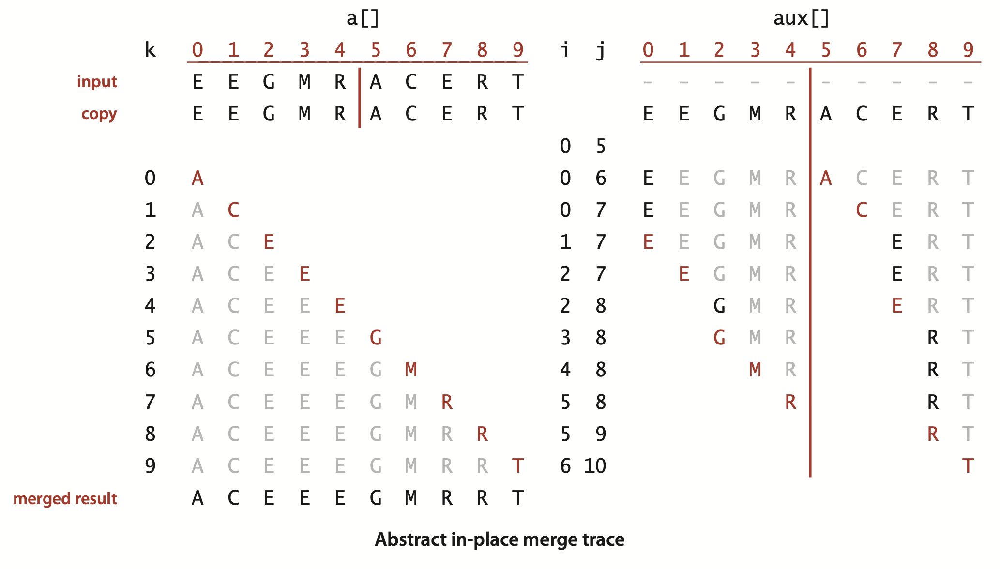
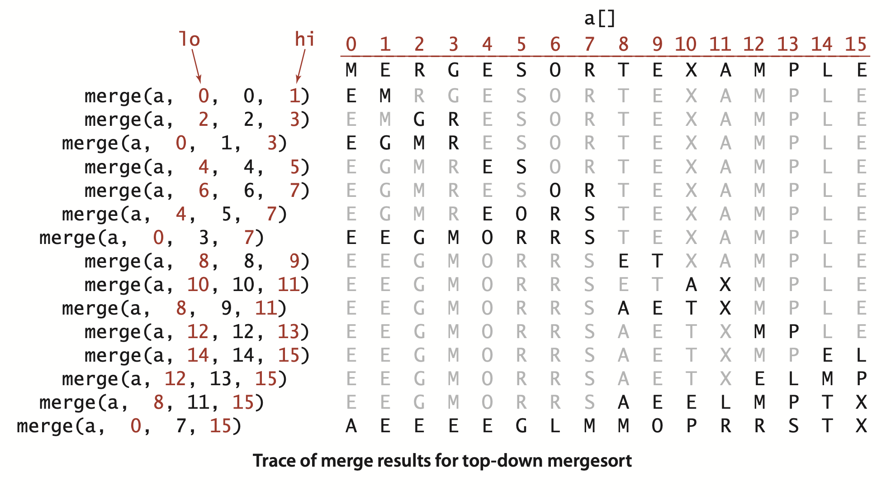
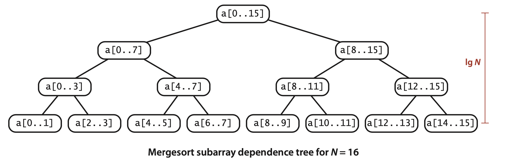
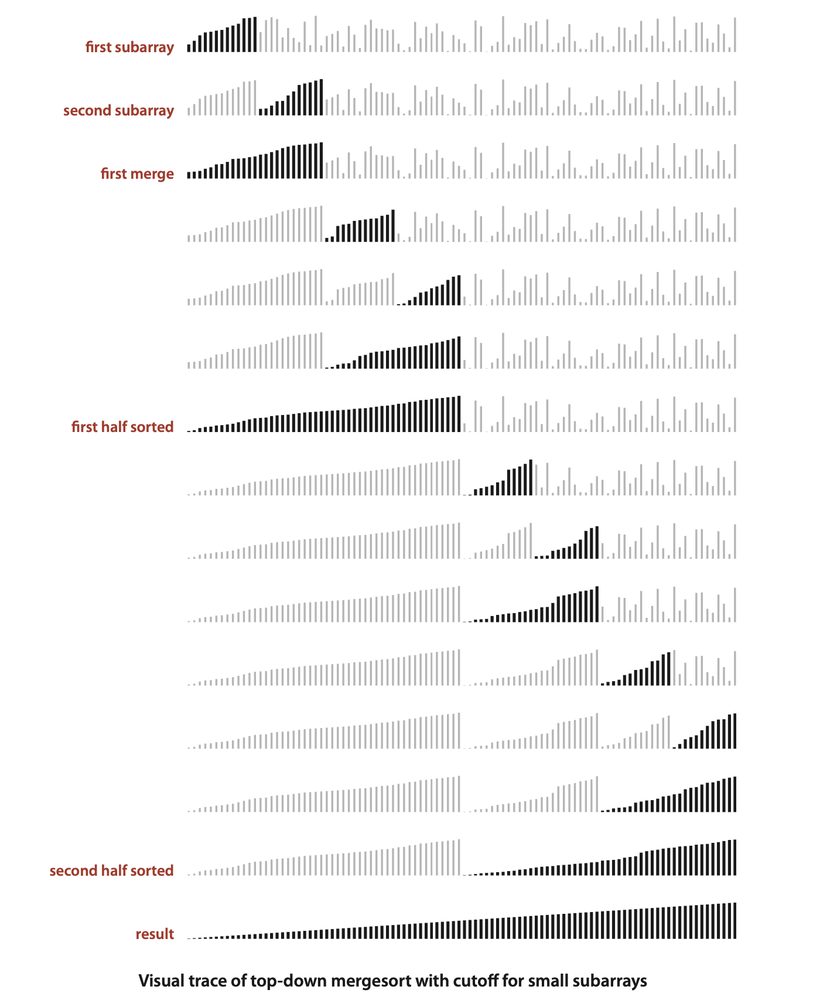
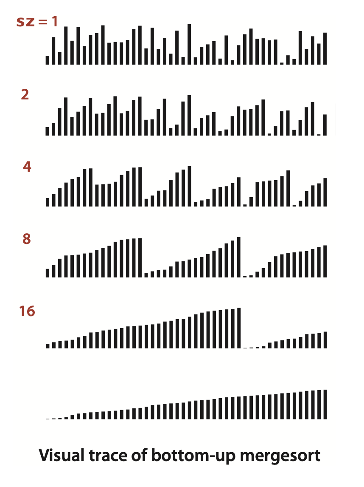
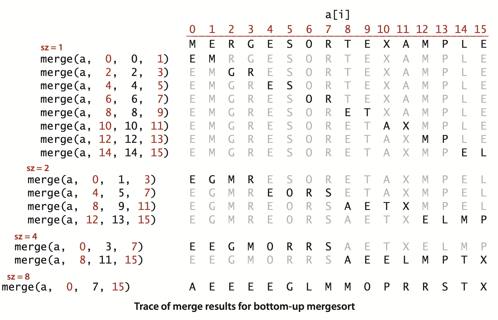
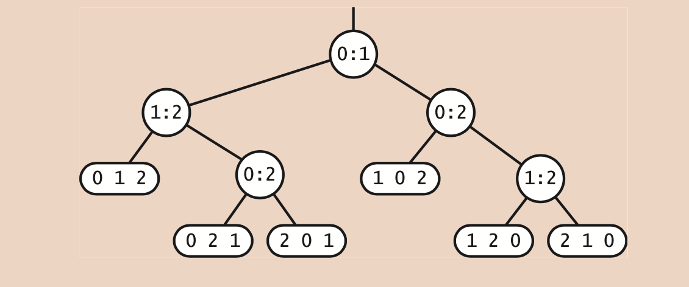
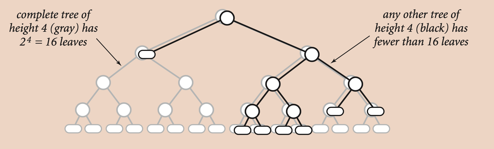
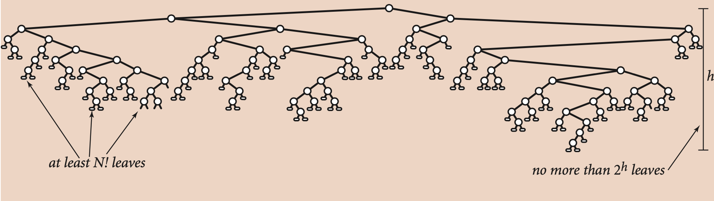

### 2.2 Mergesort

... to sort an array, divide it into two halves, sort the two halves (recursively), and then merge the results. As you will see, one of mergesort’s most attractive properties is that it guarantees to sort any array of $N$ items in time proportional to $N \log N$. Its prime disadvantage is that it uses extra space proportional to $N$.


#### Abstract in-place merge


The straightforward approach to implementing merg- ing is to design a method that merges two disjoint ordered arrays of Comparable ob- jects into a third array. This strategy is easy to implement: create an output array of the requisite size and then choose successively the smallest remaining item from the two input arrays to be the next item added to the output array.   
However, when we mergesort a large array, we are doing a huge number of merges, so the cost of creating a new array to hold the output every time that we do a merge is problematic. It would be much more desirable to have an in-place method so that we could sort the first half of the array in place, then sort the second half of the array in place, then do the merge of the two halves by moving the items around within the ar- ray, without using a significant amount of other extra space.

**Abstract in-place merge**
```java
public static void merge(Comparable[] a, int lo, int mid, int hi)
{  // Merge a[lo..mid] with a[mid+1..hi].
    int i = lo, j = mid+1;

    for (int k = lo; k <= hi; k++)  // Copy a[lo..hi] to aux[lo..hi].
        aux[k] = a[k];

    for (int k = lo; k <= hi; k++)  // Merge back to a[lo..hi].
        if      (i > mid)              a[k] = aux[j++];
        else if (j > hi )              a[k] = aux[i++];
        else if (less(aux[j], aux[i])) a[k] = aux[j++];
        else                           a[k] = aux[i++];
}
```
>Contributor's Note:  
> `i` is the current pointer in the left half, and `j` is the current pointer in the right half.

This method merges by first copying into the auxiliary array aux[] then merging back to a[]. In the merge (the second for loop), there are four conditions: left half exhausted (take from the right), right half exhausted (take from the left), current key on right less than current key on left (take from the right), and current key on right greater than or equal to current key on left (take from the left).




#### Top-down mergesort


**ALGORITHM 2.4 Top-down mergesort**
```java
public class Merge
{
    private static Comparable[] aux;      // auxiliary array for merges

    public static void sort(Comparable[] a)
    {
        aux = new Comparable[a.length];    // Allocate space just once.
        sort(a, 0, a.length - 1);
    }

    private static void sort(Comparable[] a, int lo, int hi)
    {  // Sort a[lo..hi].
        if (hi <= lo) return;
        int mid = lo + (hi - lo)/2;
        sort(a, lo, mid);       // Sort left half.
        sort(a, mid+1, hi);     // Sort right half.
        merge(a, lo, mid, hi);  // Merge results (code on page 271).
    } 
}
```





**Proposition F.** Top-down mergesort uses between $1/2 N \lg N$ and $N \lg N$ compares to sort any array of length $N$.

**Proof:** Let $C(N)$ be the number of compares needed to sort an array of length $N$. We have $C(0) = C(1) = 0$ and for $N > 0$ we can write a recurrence relationship that directly mirrors the recursive `sort()` method to establish an upper bound:
$$C(N) \le C(\lfloor N/2 \rfloor) + C(\lceil N/2 \rceil) + N$$
The first term on the right is the number of compares to sort the left half of the array, the second term is the number of compares to sort the right half, and the third term is the number of compares for the merge. The lower bound
$$C(N) \ge C(\lfloor N/2 \rfloor) + C(\lceil N/2 \rceil) + \lfloor N/2 \rfloor$$
follows because the number of compares for the merge is at least $\lfloor N/2 \rfloor$.
>Contributor's Note:  
>The lower bound for merge occurs when one half is completely larger than the other.

We derive an exact solution to the recurrence when equality holds and $N$ is a power of 2 (say $N=2^n$). First, since $\lfloor N/2 \rfloor = \lceil N/2 \rceil = 2^{n-1}$, we have
$$C(2^n) = 2C(2^{n-1}) + 2^n$$
Dividing both sides by $2^n$ gives
$$C(2^n)/2^n = C(2^{n-1})/2^{n-1} + 1$$
Applying the same equation to the first term on the right, we have
$$C(2^n)/2^n = C(2^{n-2})/2^{n-2} + 1 + 1$$
Repeating the previous step $n-1$ additional times gives
$$C(2^n)/2^n = C(2^0)/2^0 + n$$
which, after multiplying both sides by $2^n$, leaves us with the solution
$$C(N) = C(2^n) = n2^n = N \lg N$$
Exact solutions for general $N$ are more complicated, but it is not difficult to apply the same argument to the inequalities describing the bounds on the number of compares to prove the stated result for all values of $N$. This proof is valid no matter what the input values are and no matter in what order they appear.


Another way to understand Proposition F is to examine the tree drawn below, where each node depicts a subarray for which `sort()` does a `merge()`. The tree has precisely $n$ levels. For $k$ from 0 to $n - 1$, the $k\text{th}$ level from the top depicts $2^k$ subarrays, each of length $2^{n - k}$, each of which thus requires at most $2^{n - k}$ compares for the merge. Thus we have $2^k · 2^{n - k} = 2^n$ total cost for each of the $n$ levels, for a total of $n2^n =NlgN$.




>Contributor's Note:
> In the text, $n$ denotes the tree level, therefore $N = 2^n$, and $n = \lg N$.


**Proposition G.** Top-down merge sort uses at most $6N\lgN$ array accesses to sort an array of length $N$.  
**Proof:** Each merge (Contributor's Note: in each level) uses at most $6N$ array accesses ($2N$ for the copy, $2N$ for the move back, and at most $2N$ for compares). The result follows from the same argu- ment as for Proposition F.


...  The primary drawback of mergesort is that it requires extra space proportional to $N$, for the auxiliary array for merging. 


... On the other hand, we can cut the running time of mergesort substantially with some carefully considered modifications to the implementation.  
*Use insertion sort for small subarrays.* ...Switching to insertion sort for small subarrays (length 15 or less, say) will improve the running time of a typical mergesort implementation by 10 to 15 percent (see Exercise 2.2.23).  
*Test whether the array is already in order.* We can reduce the running time to be linear for arrays that are already in order by adding a test to skip the call to `merge()` if `a[mid]` is less than or equal to `a[mid+1]`. With this change, we still do all the recursive calls, but the running time for any sorted subarray is linear (see Exercise 2.2.8).  
*Eliminate the copy to the auxiliary array.* ... To do so, we use two invocations of the sort method: one takes its input from the given array and puts the sorted output in the auxiliary array; the other takes its input from the auxiliary array and puts the sorted output in the given array. With this approach, in a bit of recursive trickery, we can arrange the recursive calls such that the computation switches the roles of the input array and the auxiliary array at each level (see Exercise 2.2.11).




... When addressing a new problem, your best bet is to use the simplest implementation with which you are comfortable and then refine it if it becomes a bottleneck. 

#### Bottom-up mergesort
... Another way to implement mergesort is to organize the merges so that we do all the merges of tiny subarrays on one pass, then do a second pass to merge those sub- arrays in pairs, and so forth, continuing until we
do a merge that encompasses the whole array. 




**Bottom-up mergesort**
```java
public class MergeBU
{
    private static Comparable[] aux;      // auxiliary array for merges

    // See page 271 for merge() code.

    public static void sort(Comparable[] a)
    {  // Do lg N passes of pairwise merges.
        int N = a.length;
        aux = new Comparable[N];
        for (int sz = 1; sz < N; sz = sz+sz)            // sz: subarray size                   
            for (int lo = 0; lo < N-sz; lo += sz+sz)    // lo: subarray index; Contributor's Note: The left subarray is always of size sz, while the right subarray may be empty.
                merge(a, lo, lo+sz-1, Math.min(lo+sz+sz-1, N-1)); // Contributor's Note: mid must be the last index of the left subarray. 
    } 
}
```





**Proposition H.** Bottom-up merge sort uses between $\frac{1}{2} N \lg N$ and $N \lg N$ compares and at most $6N \lg N$ array accesses to sort an array of length $N$.  
**Proof:** The number of passes through the array is precisely $\lfloor \lg N \rfloor$ (that is precisely the value of $n$ such that $2^n \leq N \geq 2^{n+1}$). For each pass, the number of array accesses is exactly 6N and the number of compares is at most $N$ and no less than $N/2$.


When the array length is a power of 2, top-down and bottom-up mergesort per- form precisely the same compares and array accesses, just in a different order. When the array length is not a power of 2, the sequence of compares and array accesses for the two algorithms will be different (see Exercise 2.2.5).

A version of bottom-up mergesort is the method of choice for sorting data orga- nized in a *linked list*. Consider the list to be sorted sublists of size 1, then pass through to make sorted subarrays of size 2 linked together, then size 4, and so forth. This method rearranges the links to sort the list *in place* (without creating any new list nodes).


#### The complexity of sorting
... the field of *computational complexity* that helps us understand the intrinsic difficulty of sorting.


**Proposition I.** No compare-based sorting algorithm can guarantee to sort $N$ items with fewer than $\lg(N !) \sim N \lg N$ compares.

**Proof:** First, we assume that the keys are all distinct, since any algorithm must be able to sort such inputs. Now, we use a binary tree to describe the sequence of com- pares. Each *node* in the tree is either a leaf $i_0 i_1 i_2 ... i_{N-1}$ that indicates that the sort is complete and has discovered that the original inputs were in the order $a[i_0]$, $a[i_1]$, ...$a[i_{N-1}]$, or an *internal node* $i:j$ that corresponds to a com- pare operation between `a[i]` and `a[j]`, with a left subtree corresponding to the sequence of compares in the case that `a[i]` is less than `a[j]`, and a right subtree corresponding to what happens if `a[i]` is greater than `a[j]`. Each path from the root to a leaf corresponds to the sequence of compares that the algorithm uses to establish the ordering given in the leaf. For example, here is a compare tree for N = 3:



We never explicitly construct such a tree—it is a mathematical device for describ- ing the compares used by any algorithm.  
The first key observation in the proof is that the tree must have at least $N !$ leaves because there are $N !$ different permutations of $N$ distinct keys. If there are fewer than $N !$ leaves, then some permutation is missing from the leaves, and the algo- rithm would fail for that permutation.  
The number of internal nodes on a path from the root to a leaf in the tree is the number of compares used by the algorithm for some input. We are interested in the length of the longest such path in the tree (known as the tree *height*) since it mea- sures the worst-case number of compares used by the algorithm. Now, it is a basic combinatorial property of binary trees that a tree of height $h$ has no more than $2^h$ leaves—the tree of height $h$ with the maximum number of leaves is perfectly bal- anced, or *complete*. An example for $h = 4$ is diagrammed on the next page.



Combining the previous two paragraphs, we have shown that any compare-based sorting algorithm corresponds to a compare tree of height h with
$$N! \leq \text{number of leaves} \leq 2^h$$




The value of $h$ is precisely the worst-case number of compares, so we can take the logarithm (base 2) of both sides of this equation and conclude that the number of compares used by any algorithm must be at least lg N ! . The approximation $lg N ! \sim N lg N$ follows immediately from Stirling’s approximation to the factorial function (see page 185).


**Proposition J.** Mergesort is an asymptotically optimal compare-based sorting algorithm.  
**Proof:** Precisely, we mean byt hiss tatement that *both the number of compares used by mergesort in the worst case and the minimum number of compares that any com- pare-based sorting algorithm can guarantee are $\sim N \lg N$*. Propositions H and I es- tablish these facts.


**Q.** Why not make the `aux[]` array local to `merge()`?  
A. To avoid the overhead of creating an array for every merge, even the tiny ones. This cost would dominate the running time of mergesort (see Exercise 2.2.26). A more proper solution (which we avoid in the text to reduce clutter in the code) is to make `aux[]` local to `sort()` and pass it as an argument to `merge()` (see Exercise 2.2.9).


**Q.** How does merge sort fare when there are duplicate values in th earray?  
**A.** If all the items have the same value, the running time is linear (with the extra test to skip the merge when the array is sorted), but if there is more than one duplicate value, this performance gain is not necessarily realized. For example, suppose that the input array consists of $N$ items with one value in odd positions and $N$ items with another value in even positions. The running time is linearithmic for such an array (it satisfies the same recurrence as for items with distinct values), not linear.

**Q.** Is mergesort faster than shellsort?  
**A.** In practice, their running times are within a small constant factor of one another... In theory, no one has been able to prove that shellsort is linearithmic for random data, so there remains the possibility that the asymptotic growth of the average-case perfor- mance of shellsort is higher. Such a gap has been proven for worst-case performance, but it is not relevant in practice.


>Contributor's Note:  
>For practice:

*Abstract in-place merge*
```java
public static void merge(Comparable[] a, int lo, int mid, int hi)
{}
```

```java
public class Merge
{
    public static void sort(Comparable[] a)
    {}
}

public class MergeBU
{
    public static void sort(Comparable[] a)
    { } 
}
```
