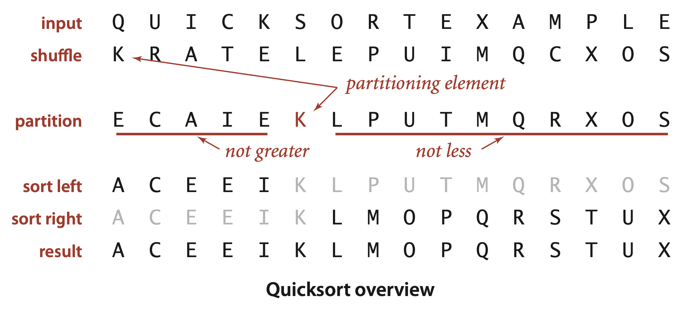
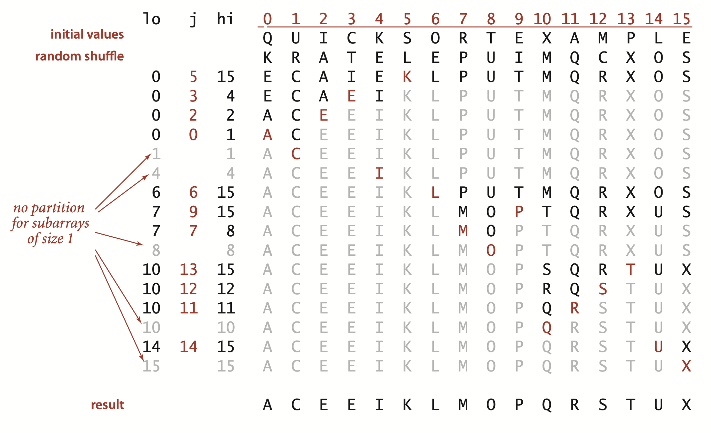
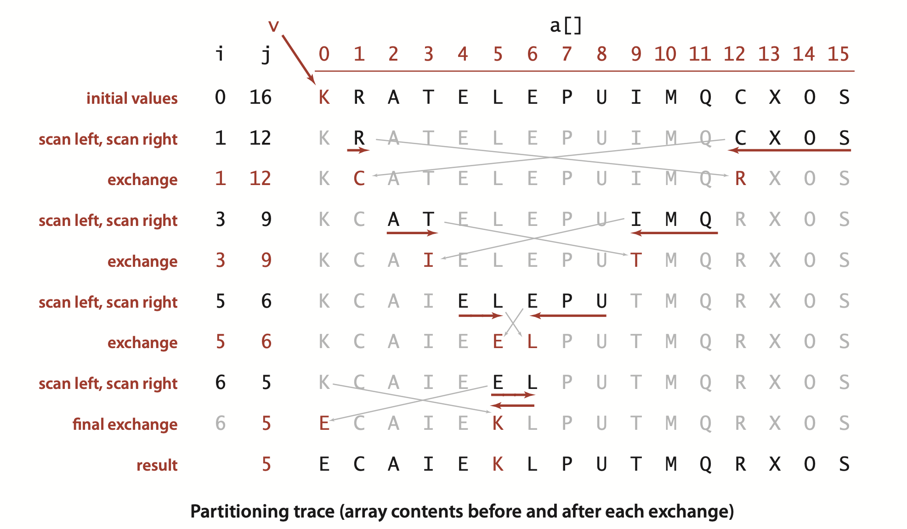
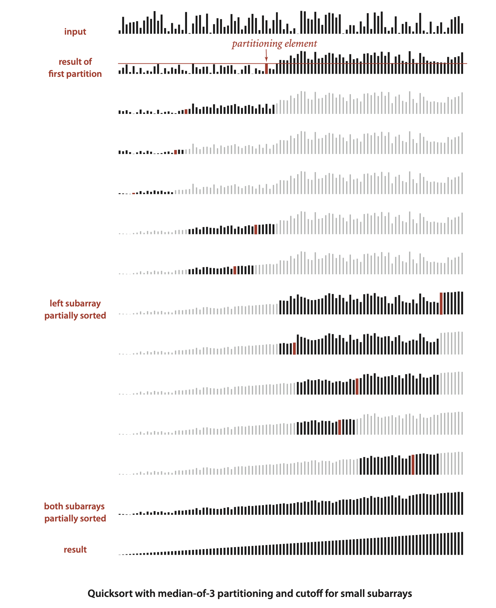
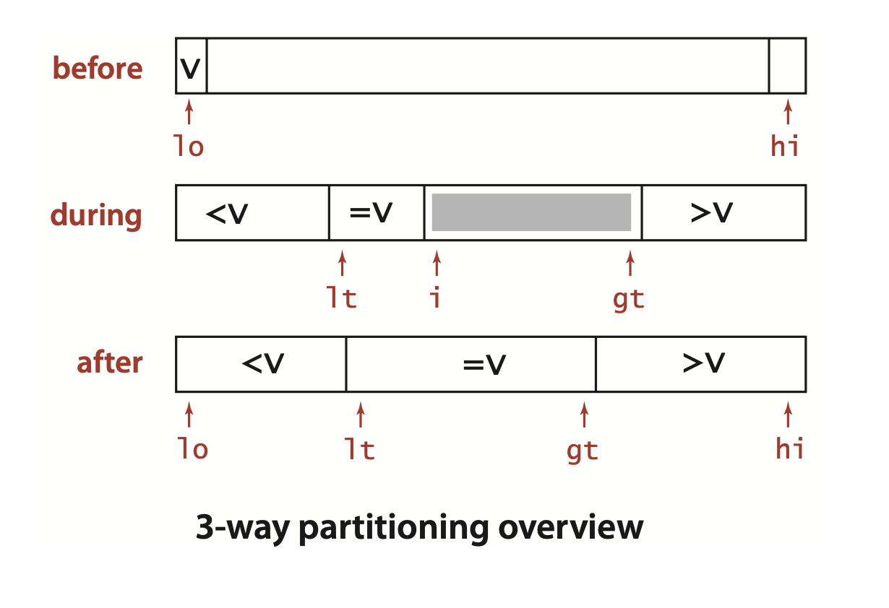
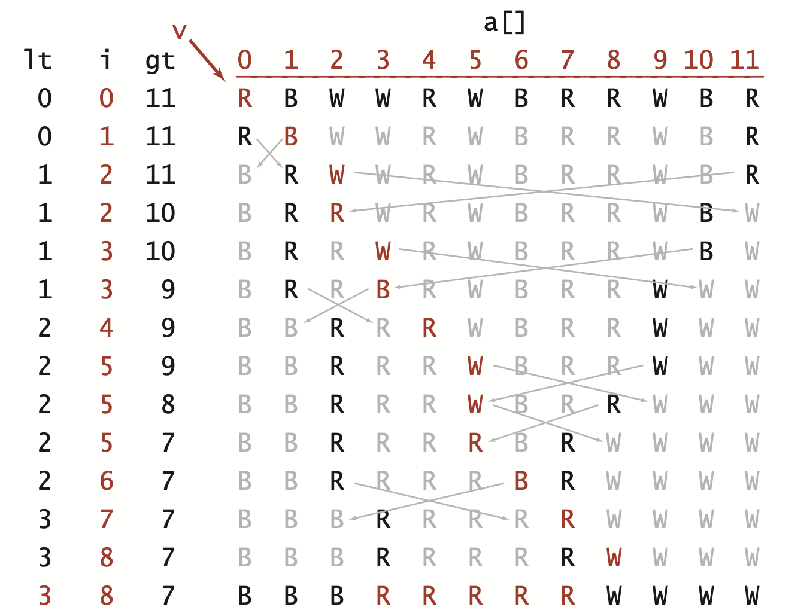
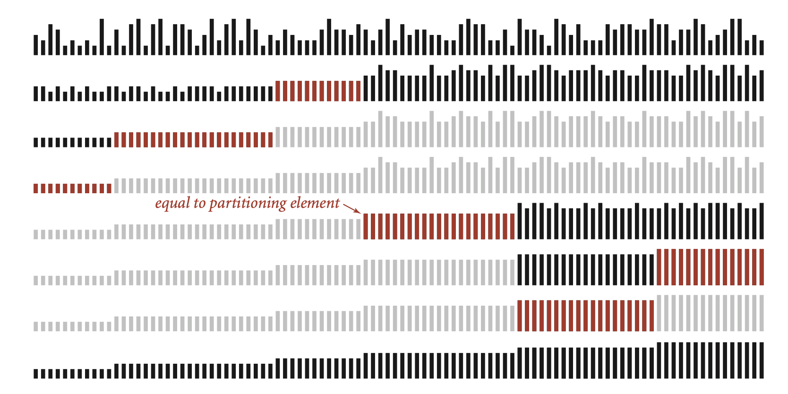

### 2.3 Quicksort

The subject of this section is the sorting algorithm that is probably used more widely than any other, ... The quicksort algorithm’s desirable features are that it is in-place (uses only a small auxiliary stack) and that it requires time proportional to $N log N$ on the average to sort an array of length $N$. ... Furthermore, quicksort has a shorter inner loop than most other sorting algorithms, which means that it is fast in practice as well as in theory. ... Its primary drawback is that it is fragile in the sense that some care is involved in the implementation to be sure to avoid bad performance. Numerous examples of mistakes leading to quadratic performance in practice are documented in the literature.





**ALGORITHM 2.5 Quicksort**
```java
public class Quick
{
    public static void sort(Comparable[] a)
    {
        StdRandom.shuffle(a);          // Eliminate dependence on input.
        sort(a, 0, a.length - 1);
    }

    private static void sort(Comparable[] a, int lo, int hi)
    {
        if (hi <= lo) return;
        int j = partition(a, lo, hi);  // Partition (see page 291).
        sort(a, lo, j-1);              // Sort left part a[lo .. j-1].
        sort(a, j+1, hi);              // Sort right part a[j+1 .. hi].
    } 
}
```




... The entry `a[j]` is in its final place in the array, for some `j`.

... Algorithm 2.5 ...  is a *randomized* algorithm, because it randomly shuffles the array before sorting it. Our reason for doing so is to be able to predict (and depend upon) its performance characteristics, as discussed below.


**Quicksort partitioning**
```java
private static int partition(Comparable[] a, int lo, int hi)
{  // Partition into a[lo..i-1], a[i], a[i+1..hi].
    int i = lo, j = hi+1;            // left and right scan indices
    Comparable v = a[lo];            // partitioning item
    while (true)
    {  // Scan right, scan left, check for scan complete, and exchange.
        while (less(a[++i], v)) if (i == hi) break;
        while (less(v, a[--j])) if (j == lo) break;
        if (i >= j) break;
        exch(a, i, j);
    }
    exch(a, lo, j);                 // Put v = a[j] into position
    return j;                       // with a[lo..j-1] <= a[j] <= a[j+1..hi].
}
```




There are several subtle issues with respect to implementing quicksort ....
- *Partitioning in place.* If we use an extra array, partitioning is easy to implement, but not so much easier that it is worth the extra cost of copying the partitioned version back into the original. 
- *Staying in bounds.* If the smallest item or the largest item in the array is the partitioning item, we have to take care that the pointers do not run off the left or right ends of the array, respectively. Our `partition()` implementation has explicit tests to guard against this circumstance.The test`(j == lo)` is redundant, since the partitioning item is at `a[lo]` and not less than itself. With a similar technique on the right it is not difficult to eliminate both tests (see Exercise 2.3.17).
- *Preserving randomness.* ... Since it treats all items in the subarrays uniformly, Algorithm 2.5 has the property that its two subarrays are also in random order. This fact is crucial to the predictability of the algorithm’s running time. An alternate way to preserve randomness is to choose a random item for partitioning within `partition()`.
- *Terminating the loop.* ... Properly testing whether the pointers have crossed is a bit trickier than it might seem at first glance. A common error is to fail to take into account that the array might contain other items with the same key value as the partitioning item.
- *Handling items with keys equal to the partitioning item’s key.* It is best to stop the left scan for items with keys greater than *or equal* to the partitioning item’s key and the right scan for items with key less than *or equal* to the partitioning item’s key, as in Algorithm 2.5. Even though this policy might seem to create unnecessary exchanges involving items with keys equal to the partitioning item’s key, it is crucial to avoiding quadratic running time in certain typical applications (see Exercise 2.3.11).

>Contributor's Note:  
>If equal elements are present, additional comparisons occur before each exchange.

- *Terminating the recursion.* ...  For instance, a common mistake in implementing quicksort involves not ensuring that one item is always put into position, then falling into an infinite recursive loop when the partitioning item happens to be the largest or smallest item in the array.


#### Performance characteristics
... The inner loop of quicksort (in the partitioning method) increments an index and compares an array entry against a fixed value. This simplicity is one factor that makes quicksort quick: it is hard to envision a shorter inner loop in a sorting algorithm. For example, mergesort and shellshort are typically slower than quicksort because they also do data movement within their inner loops.  

The second factor that makes quicksort quick is that it uses few compares. Ultimately, the efficiency of the sort depends on how well the partitioning divides the array, which in turn depends on the value of the partitioning item’s key. Partitioning divides a large randomly ordered array into two smaller randomly ordered subarrays, but the actual split is equally likely (for distinct keys) to be anywhere in the array.

The best case for quicksort is when each partitioning stage divides the array exactly in half. This circumstance would make the number of compares used by quicksort satisfy the divide-and-conquer recurrence $C_N = 2C_{N/2} + N$. The $2C_{N/2}$ term covers the cost of sorting the two subarrays; the $N$ is the cost of examining each entry, using one partitioning index or the other. As in the proof of Proposition F for mergesort, we know that this recurrence has the solution $C_N \sim N \lg N$. Although things do not always go this well, it is true that the partition falls in the middle *on the average*. Taking into account the precise probability of each partition position makes the recurrence more complicated and more difficult to solve, but the final result is similar. 

**Proposition K.** Quicksort uses $\sim 2N \ln N$ compares (and one-sixth that many exchanges) on the average to sort an array of length N with distinct keys.  

**Proof**: Let $C_N$ be the average number of compares needed to sort $N$ items with distinct values. We have $C_0=C_1=0$ and for $N > 1$ we can write a recurrence relationship that directly mirrors the recursive program:

$$C_N = N+1 + (C_0 + C_1 + ... + C_{N-2} + C_{N-1})/N + (C_{N-1} + C_{N-2} + ... + C_0)/N$$

>Contributor's Note:  
>$N - 1$ comparisons for exchanges in the worst case, plus $2$ for the two failed while loop comparisons.

The first term is the cost of partitioning (always $N + 1$), the second term is the average cost of sorting the left subarray (which is equally likely to be any size from $0$ to $N-1$), and the third term is the average cost for the right subarray (which is the same as for the left subarray). Multiplying by $N$ and collecting terms transforms this equation to

$$NC_N = N(N + 1) + 2(C_0 + C_1 + ... + C_{N-2} + C_{N-1})$$

Subtracting this from the same equation for $N-1$ gives

$$NC_N - (N-1)C_{N-1} = 2N + 2C_{N-1}$$

Rearranging terms and dividing by $N(N + 1)$ leaves

$$C_N / (N + 1) = C_{N-1} / N + 2 / (N + 1)$$

which telescopes to give the result

$$C_N \sim 2(N+1)(1/3 + 1/4 + ... + 1/(N+1))$$


>Contributor's Note:  
>For the lat step:  
>start with
>$$
>\frac{C_N}{N+1}=\frac{C_{N-1}}{N}+\frac{2}{N+1}
>$$
>Set $A_N:=\dfrac{C_N}{N+1}$ Then the recurrence becomes
>
>$$
>A_N=A_{N-1}+\frac{2}{N+1}
>$$
>
>so
>
>$$
>A_N-A_1=2\sum_{k=2}^N\frac{1}{k+1}=2\sum_{j=3}^{\,N+1}\frac{1}{j}
>$$
>
>Using the base $C_1=0$ (hence $A_1=C_1/2=0$) we get
>
>$$
>A_N=2\sum_{j=3}^{\,N+1}\frac{1}{j}
>$$
>
>Multiply by $N+1$:
>
>$$
>C_N=2(N+1)\sum_{j=3}^{\,N+1}\frac{1}{j}=2(N+1)\Big(\tfrac13+\tfrac14+\cdots+\tfrac{1}{N+1}\Big)
>$$
>
>as required.


The parenthesized quantity is the discrete estimate of the area under the curve $2/x$ from $3$ to $N$, $+ 1$ and $C_N \sim 2NInN$ by integration. Note that $2NInN \approx 1.39Nlg N$, so the average number of compares is only about $39$ percent higher than in the best case.

A similar (but much more complicated) analysis is needed to establish the stated result for exchanges.


When keys may not be distinct, as is typical in practical applications, precise anaysis is considerably more complicated, but it is not difficult to show that the average number of compares is no greater than than $C_N$ , even when duplicate keys may be present (on page 296, we will look at a way to *improve* quicksort in this case).


Despite its many assets, the basic quicksort program has one potential liability: it can be extremely inefficient if the partitions are unbalanced. For example, it could be the case that the first partition is on the smallest item, the second partition on the next smallest item, and so forth, so that the program will remove just one item for each call, leading to an excessive number of partitions of large subarrays. Avoiding this situation is the primary reason that we randomly shuffle the array before using quicksort. 


**Proposition L.** Quicksort uses $\sim N^2/2$ compares in the worst case, but random shuffling protects against this case.  
**Proof:** By the argument just given, the number of compares used when one of the subarrays is empty for every partition is
$$
N + (N - 1) + (N - 2) + . . . + 2 + 1 = (N + 1) N / 2
$$

>Contributor's Note:  
>$N + 1$ for each.

This behavior means not only that the time required will be quadratic but also that the space required to handle the recursion (Contributor's Note: call stack) will be linear, which is unacceptable for large arrays. But (with quite a bit more work) it is possible to extend the analysis that we did for the average to find that the standard deviation of the number of compares is about .65 N, so the running time tends to the average as N grows and is unlikely to be far from the average. For example, even the rough estimate provided by Chebyshev’s inequality says that the probability that the running time is more than ten times the average for an array with a million elements is less than .00001 (and the true probability is far smaller). The probability that the running time for a large array is close to quadratic is so remote that we can safely ignore the possibility (see Exercise 2.3.10). For example, the probability that quicksort will use as many compares as insertion sort or selection sort when sorting a large array on your computer is much less than the probability that your computer will be struck by lightning during the sort!


In summary, you can be sure that the running time of Algorithm 2.5 will be within a constant factor of $1.39N \lg N$ whenever it is used to sort $N$ items. The same is true of mergesort, but quicksort is typically faster because (even though it does 39 percent more compares) it does much less data movement. 

>Contributor's Note:  
>in mergesort, every merge step copies elements into an auxiliary array and back. in quicksort, partitioning only swaps elements in place to put them on the correct side of the pivot.

#### Algorithmic improvements


If your sort code is to be used a great many times or to sort a huge array (or, in particular, if it is to be used as a library sort that will be used to sort arrays of unknown characteristics), then it is worthwhile to consider the improvements that are discussed in the next few paragraphs.

- *Cutoff to insertion sort.* Accordingly, it pays to switch to insertion sort for tiny subarrays. ... in `sort()` with a statement that invokes insertion sort for small subarrays: `if (hi <= lo + M) { Insertion.sort(a, lo, hi); return; }` ... The optimum value of the cutoff `M` is system-dependent, but any value between 5 and 15 is likely to work well in most situations (see Exercise 2.3.25).

- *Median-of-three partitioning.* A second easy way to improve the performance of quicksort is to use the median of a small sample of items taken from the subarray as the partitioning item. Doing so will give a slightly better partition, but at the cost of computing the median. It turns out that most of the available improvement comes from choosing a sample of size 3 and then partitioning on the middle item (see Exercises 2.3.18 and 2.3.19). As a bonus, we can use the sample items as sentinels at the ends of the array and remove both array bounds tests in `partition()`.

>Contributor's Note:  
>The median of a 3-element subarray is more likely to be closer to the smallest or largest element than a randomly chosen element. In a 3-element subarray, the two elements other than the median are guaranteed to be smaller and larger. So if we place the larger one at the end, the while loop is guaranteed to break from the low side.



- *Entropy-optimal sorting.* ...  In a situation where there are large numbers of duplicate keys in the input array, the recursive nature of quicksort ensures that subarrays consisting solely of items with keys that are equal will occur often. There is potential for significant improvement, from the linearithmic-time performance of the implementations seen so far to linear-time performance.

One straightforward idea is to partition the array into three parts, one each for items with keys smaller than, equal to, and larger than the partitioning item’s key. ... It was a classical programming exercise popularized by E. W. Dijkstra as the *Dutch National Flag* problem, because it is like sorting an array with three possible key values, which might correspond to the three colors on the flag.




**Quicksort with 3-way partitioning**
```java
public class Quick3way
{
    private static void sort(Comparable[] a, int lo, int hi)
    {  // See page 289 for public sort() that calls this method.
        if (hi <= lo) return;
        int lt = lo, i = lo+1, gt = hi;
        Comparable v = a[lo];
        while (i <= gt)
        {
            int cmp = a[i].compareTo(v);
            if      (cmp < 0) exch(a, lt++, i++);
            else if (cmp > 0) exch(a, i, gt--);
            else              i++;
        }  // Now a[lo..lt-1] < v = a[lt..gt] < a[gt+1..hi].
        sort(a, lo, lt - 1);
        sort(a, gt + 1, hi);
    } 
}
```




... It is based on a single left-to-right pass through the array that maintains a pointer lt such that a[lo..lt-1] is less than v, a pointer gt such that a[gt+1, hi]isgreaterthanv,andapointerisuchthata[lt..i-1]areequaltovand a[i..gt] are not yet examined. ... Furthermore, every item encountered leads to an exchange *except* for those items with keys equal to the partitioning item’s key.


Though this code was developed not long after quicksort in the 1970s, it fell out of favor because it uses many more exchanges than the standard 2-way partitioning method for the common case when the number of duplicate keys in the array is not high. In the 1990s J. Bentley and D. McIlroy developed a clever implementation that overcomes this problem (see Exercise 2.3.22), and observed that 3-way partitioning makes quicksort asymptotically faster than mergesort and other methods in practical situations involving large numbers of equal keys. 


>Contributor's Note:  
>Array = [5, 1, 9, 3]
>Pivot = 5
>
>i = 2, element = 9 (bigger than pivot).
>
>In 2-way quicksort: 9 is already to the right side → no swap needed.
>
>In 3-way quicksort: it executes `exch(a, i, gt--)`, so 9 is swapped with itself or another element at gt, even though it’s already in the right region.


Mergesort does not guarantee optimal performance for any given distribution of duplicates in the input: for example, mergesort is linearithmic for a randomly ordered array that has only a constant number of distinct key values, but quicksort with 3-way partitioning is linear for such an array. 

>Contributor's Note:  
>3-way quicksort collapses duplicates into one region immediately, reducing recursion dramatically, becaise we have only `sort(a, lo, lt - 1);` and `sort(a, gt + 1, hi);`.


Given $N$ keys with $k$ distinct key values, for each $i$ from 1 to $k$ define $f_i$ to be frequency of occurrence of the $i\text{th}$ key value and $p_i$ to be $f_i / N$, the probability that the $i\text{th}$ key value is found when a random entry of the array is sampled. The *Shannon entropy* of the keys (a classic measure of their information content) is defined as
$$
H = - ( p_1 \lg p_1 + p_2 \lg p_2 + . . . + p_k \lg p_k )
$$

**Proposition M.** No compare-based sorting algorithm can guarantee to sort $N$ items with fewer than $NH - N$ compares, where $H$ is the Shannon entropy, defined from the frequencies of key values.  

**Proof sketch:** This result follows from a (relatively easy) generalization of the lower bound proof of Proposition I in Section 2.2.


**Proposition N.** Quicksort with 3-way partitioning uses $\sim (2 \ln2)NH$ compares to sort $N$ items, where $H$ is the Shannon entropy, defined from the frequencies of key values.  
**Proof sketch:** This result follows from a (relatively difficult) generalization of the average-case analysis of quicksort in Proposition K. As with distinct keys, this costs about 39 percent more than the optimum (but within a constant factor)

Note that $H = \lg N$ when the keys are all distinct (all the probabilities are $1/N$), which is consistent with Proposition I in Section 2.2 and Proposition K. The worst case for 3-way partitioning happens when the keys are distinct; when duplicate keys are present, it can do much better than mergesort. More important, these two properties together imply that quicksort with 3-way partitioning is *entropy-optimal*, in the sense that the average number of compares used by the best possible compare-based sorting algorithm and the average number of compares used by 3-way quicksort are within a constant factor of one another, for any given distribution of input key values.

... so that you can depend on 3-way quicksort’s running time to be proportional to $N$ times the entropy of the distribution of input key values. This property of the algorithm is important in practice because *it reduces the time of the sort from linearithmic to linear for arrays with large numbers of duplicate keys*. The order of the keys is immaterial, because the algorithm shuffles them to protect against the worst case. The distribution of keys defines the entropy and no compare-based algorithm can use fewer compares than defined by the entropy. This ability to adapt to duplicates in the input makes 3-way quicksort the algorithm of choice for a library sort—clients that sort arrays containing large numbers of duplicate keys are not unusual.


A carefully tuned version of quicksort is likely to run significantly faster on most computers for most applications than will any other compare-based sorting method.


**Q.** Is there some way to just divide the array into two halves, rather than letting the partitioning element fall where it may?  
A. That is a question that stumped experts for over a decade. It is tantamount to finding the median key value in the array and then partitioning on that value. We discuss the problem of finding the median on page 346. It is possible to do so in linear time, but the cost of doing so with known algorithms (which are based on quicksort partitioning!) far exceeds the 39 percent savings available from splitting the array into equal parts.


>Cotributor's Note:  
>For practice:
```java
public class Quick
{
    public static void sort(Comparable[] a)
    {}

    private static void sort(Comparable[] a, int lo, int hi)
    {} 

    private static int partition(Comparable[] a, int lo, int hi)
    {}
}


public class Quick3way
{
    private static void sort(Comparable[] a, int lo, int hi)
    {} 
}
```
