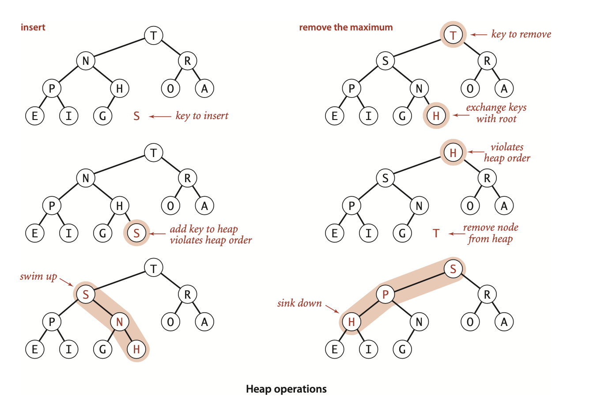

### 2.4 Priority Queues

 **Array representation (unordered)**. Perhaps the simplest priority-queue implementation is based on our code for pushdown stacks in Section 2.1. The code for insert in the priority queue is the same as for push in the stack. To implement remove the maximum, we can add code like the inner loop of selection sort to exchange the maximum item with the item at the end and then delete that one, as we did with pop() for stacks. As with stacks, we can add resizing-array code to ensure that the data structure is always at least one-quarter full and never overflows.
| insert | remove maximum |
| :----: |      :----:    |
| 1      | N              |


 **Array representation (ordered).** Another approach is to add code for insert to move larger entries one position to the right, thus keeping the keys in the array in order (as in insertion sort). Thus, the largest element is always at the end, and the code for remove the maximum in the priority queue is the same as for pop in the stack.
| insert | remove maximum |
| :----: | :----:         |
| N      | 1              |

 **Linked-listrepresentations.** Similarly,we can start with our linked-list code for push- down stacks, modifying either the code for pop() to find and return the maximum or the code for push() to keep keys in reverse order and the code for pop() to unlink and return the first (maximum) item on the list.


**Definition.** A *binary tree* is heap-ordered if the key in each node is larger than or equal to the keys in that node’s two children (if any).


**Definition.** A *binary heap* is a collection of keys arranged in a complete heap-or- dered binary tree, represented in level order in an array (not using the first entry).


In a heap, the parent of the node in position k is in position ⎣k /2⎦ and, conversely, the two children of the node in position k are in positions 2k and 2k + 1. To move up the tree from a[k] we set k to k/2; to move down the tree we set k to 2*k or 2*k+1.

**Proposition P.** The height of a complete binary tree of size N is ⎣ lg N ⎦ .

**Bottom-up reheapify (swim)**

```java
private void swim(int k)
{
    while (k > 1 && less(k/2, k)) # parent is at k/2
    {
        exch(k/2, k);
        k = k/2; 
    }
  }
```

**Top-down reheapify (sink).**

```java
private void sink(int k)
{
    while (2*k <= N)
    {
        int j = 2*k;
        if (j < N && less(j, j+1)) j++;
        if (!less(k, j)) break;
        exch(k, j);
        k = j;
    } 
}
```

**Insert.** We add the new key at the end of the array, increment the size of the heap, and then swim up through the heap with that key to restore the heap condition.

**Remove the maximum.** We take the largest key off the top, put the item from the end of the heap at the top, decrement the size of the heap, and then sink down through the heap with that key to restore the heap condition.



**ALGORITHM 2.6** *Heap priority queue* 
```java
public class MaxPQ<Key extends Comparable<Key>>
{
    private Key[] pq;             // heap-ordered complete binary tree
    private int N = 0;            //    in pq[1..N] with pq[0] unused
    public MaxPQ(int maxN)
    {  pq = (Key[]) new Comparable[maxN+1];  }
    public boolean isEmpty()
    {  return N == 0;  }
    public int size()
    {  return N;  }
    public void insert(Key v)
    {
        pq[++N] = v;
        swim(N); 
    }
    public Key delMax()
    {
        Key max = pq[1];
        exch(1, N--);
        pq[N+1] = null;
        sink(1);
        return max; 
    }
    // Retrieve max key from top.
    // Exchange with last item.
    // Avoid loitering.
    // Restore heap property.
    // See pages 145-147 for implementations of these helper methods.
    private boolean less(int i, int j)
    private void exch(int i, int j)
    private void swim(int k)
    private void sink(int k)
}
```


**Proposition Q.** In an N-key priority queue, the heap algorithms require no more than 1 + lg N compares for insert and no more than 2lg N compares for remove the maximum.
**Proof:** By Proposition P, both operations involve moving along a path between the root and the bottom of the heap whose number of links is no more than lg N. The remove the maximum operation requires two compares for each node on the path (except at the bottom): one to find the child with the larger key, the other to decide whether that child needs to be promoted.


**Multiway heaps.** It is not difficult to modify our code to build heaps based on an array representation of complete heap-ordered ternary trees, with an entry at position k larger than or equal to entries at positions $3k-1$, $3k$, and $3k+1$ and smaller than or equal to entries at position $⎣(k+1)/ 3⎦$, for all indices between $1$ and $N$ in an array of $N$ items, and not much more difficult to use d-ary heaps for any given $d$. There is a tradeoff between the lower cost from the reduced tree height $(\log_d N)$ and the higher cost of finding the largest of the d children at each node. This tradeoff is dependent on details of the implementation and the expected relative frequency of operations.

**Array resizing.** We can add a no-argument constructor, code for array doubling in insert(), and code for array halving in delMax(), just as we did for stacks in Section 1.3. Thus, clients need not be concerned about arbitrary size restrictions. The logarith- mic time bounds implied by PROPOSITION Q are amortized when the size of the priority queue is arbitrary and the arrays are resized (see Exercise 2.4.22).


**Proposition Q (continued).** In an index priority queue of size N, the number of compares required is proportional to at most log N for insert, change priority, delete, and remove the minimum.
**Proof:** Immediate from inspection of the code and the fact that all paths in a heap are of length at most ~lg N.

partial solution for *Index priority-queue*
```java
public class IndexMinPQ<Key extends Comparable<Key>>
{
    private int N;                  // number of elements on PQ
    private int[] pq;               //  binary heap using 1-based indexing
    private int[] qp;               // inverse: qp[pq[i]] = pq[qp[i]] = i
    private Key[] keys;             // items with priorities
    public IndexMinPQ(int maxN)
    {
        keys = (Key[]) new Comparable[maxN + 1];
        pq   = new int[maxN + 1];
        qp   = new int[maxN + 1];
        for (int i = 0; i <= maxN; i++) qp[i] = -1;
    }
    public boolean isEmpty()
    {  return N == 0;  }
    public boolean contains(int k)
    {  return qp[k] != -1;  }
    public void insert(int k, Key key)
    {
        N++;
        qp[k] = N;
        pq[N] = k;
        keys[k] = key;
        swim(N);
    }
    public Item min()
    {  return keys[pq[1]];  }
    public int delMin()
    {
        int indexOfMin = pq[1];
        exch(1, N--);
        sink(1);
        keys[pq[N+1]] = null;
        qp[pq[N+1]] = -1;
        return indexOfMin;
    }
    public int minIndex()
    {  return pq[1];  }
    public void change(int k, Item item)
    {
        keys[k] = key;
        swim(qp[k]);
        sink(qp[k]);
    }
     public void delete(int k)
    {
        exch(k, N--);
        swim(qp[k]);
        sink(qp[k]);
        keys[pq[N+1]] = null;
        qp[pq[N+1]] = -1;
    }
}
```


```java
public class Multiway
{
    public static void merge(In[] streams)
    {
        int N = streams.length;
        IndexMinPQ<String> pq = new IndexMinPQ<String>(N);
        for (int i = 0; i < N; i++)
            if (!streams[i].isEmpty())
                pq.insert(i, streams[i].readString());
        while (!pq.isEmpty())
        {
            StdOut.println(pq.min());
            int i = pq.delMin();
            if (!streams[i].isEmpty())
                pq.insert(i, streams[i].readString());
        } 
    }
    public static void main(String[] args)
    {
        int N = args.length;
        In[] streams = new In[N];
        for (int i = 0; i < N; i++)
            streams[i] = new In(args[i]);
        merge(streams);
    } 
}

```


**Heapsort** We can use any priority queue to develop a sorting method. We insert all the items to be sorted into a minimum-oriented priority queue, then repeatedly use remove the minimum to remove them all in order. 
Heapsort breaks into two phases: heap construction, where we reorganize the original array into a heap, and the sortdown, where we pull the items out of the heap in decreasing order to build the sorted result.
**Heapconstruction.** Certainly we can accomplish this task in time proportional to $N log N$, by proceeding from left to right through the array, using swim() to ensure that the items to the left of the scanning pointer make up a heap-ordered complete tree, like successive priority-queue insertions. A clever method that is much more efficient is to proceed from right to left, using sink() to make subheaps as we go.... The scan starts halfway back through the array because we can skip the subheaps of size 1.


**Proposition R.** Sink-based heap construction uses fewer than 2N compares and fewer than N exchanges to construct a heap from N items.

>Contributor's Note   
>
>Let $h_k$ be the height of node $k$. A single **sink(k)** moves the key down at most $h_k$ levels. Each level costs **≤ 1 compare** to pick the larger child + **≤ 1 compare** to test with that child, and **≤ 1 exchange**.
>So across all nodes:
>
>$$
>\text{exchanges} \le \sum_k h_k \equiv S,\qquad
>\text{compares} \le 2\sum_k h_k = 2S.
>$$
>
>Bound $S$. In a complete binary tree the multiset $\{h_k\}$ is maximized by the perfect tree with height $H$ and $N=2^{H+1}-1$. Then the count of nodes of height $i$ is $2^{H-i}$, so
>
>$$
>S=\sum_{i=0}^{H} i\,2^{H-i} = 2^{H+1}-H-2 = N-H-1 \le N-1 < N.
>$$
>
>(For non-perfect $N$, $S$ is smaller; one can also write $S\le N-\lceil \log_2(N+1)\rceil < N$.)
>
>Therefore:
>$$
>\text{exchanges} \le S < N,\qquad
>\text{compares} \le 2S < 2N.
>$$

**ALGORITHM 2.7 Heapsort**
```java
  public static void sort(Comparable[] a)
  {
    int N = a.length;
    for (int k = N/2; k >= 1; k--)
        sink(a, k, N);
    while (N > 1)
    {
        exch(a, 1, N--);
        sink(a, 1, N);
    }
}
```


**Proposition S.** Heapsort uses fewer than 2N lg N + 2N compares (and half that many exchanges) to sort N items.
**Proof:** The 2N term covers the cost of heap construction (see Proposition R). The 2 N lg N term follows from bounding the cost of each sink operation during the sortdown by 2lg N (see Proposition PQ [typo? meant Q]).


**Sink to the bottom,** then swim. Most items reinserted into the heap during sortdown go all the way to the bottom. Floyd observed in 1964 that we can thus save time by avoiding the check for whether the item has reached its position, simply promoting the larger of the two children until the bottom is reached, then moving back up the heap to the proper position. This idea cuts the number of compares by a factor of 2 asymptotically—close to the number used by mergesort (for a randomly-ordered array). The method requires extra bookkeeping, and it is useful in practice only when the cost of compares is relatively high (for example, when we are sorting items with strings or other types of long keys).

>Contributor's Note:  
>You save one comparison at each step downward, and the swim typically stops before reaching the top.


**Heapsort is significant** in the study of the complexity of sorting (see page 279) because it is the only method that we have seen that is optimal (within a constant factor) in its use of both time and space—it is guaranteed to use ~2N lg N compares and constant extra space in the worst case. When space is very tight (for example, in an embedded system or on a low-cost mobile device) it is popular because it can be implemented with just a few dozen lines (even in machine code) while still providing optimal performance. However, it is rarely used in typical applications on modern systems because it has **poor cache performance:** array entries are rarely compared with nearby array entries, so the number of cache misses is far higher than for quicksort, mergesort, and even shellsort, where most compares are with nearby entries.
On the other hand, the use of heaps to implement priority queues plays an increas- ingly important role in modern applications, because it provides an easy way to guarantee logarithmic running time for **dynamic situations** where large numbers of insert and remove the maximum operations are intermixed. 

Why not use a[0] in the heap representation? Doing so simplifies the arithmetic a bit.


