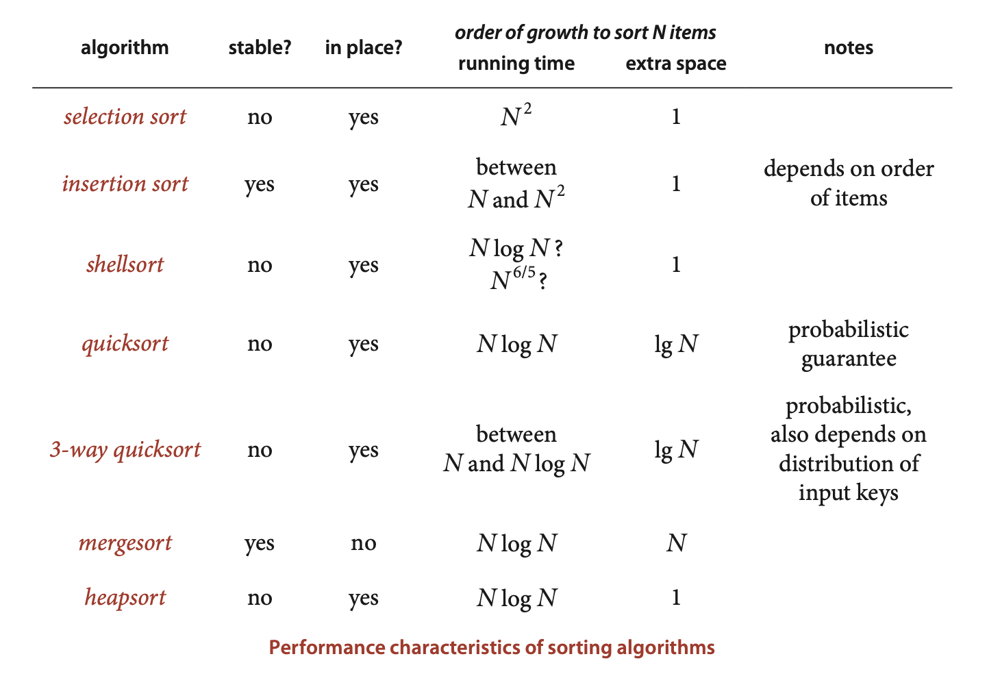

**Items with multiple keys.**
```java
 public static void sort(Object[] a, Comparator c)
{
    int N = a.length;
    for (int i = 1; i < N; i++)
        for (int j = i; j > 0 && less(c, a[j], a[j-1]); j--)
            exch(a, j, j-1);
}
private static boolean less(Comparator c, Object v, Object w)
{  return c.compare(v, w) < 0;  }
private static void exch(Object[] a, int i, int j)
{  Object t = a[i]; a[i] = a[j]; a[j] = t; }

Insertion.sort(a, new Transaction.WhenOrder())
Insertion.sort(a, new Transaction.HowMuchOrder()).
```


**Insertion sorting with a Comparator**
...you could build different priority queues with Transaction keys,...
```java
import java.util.Comparator;
public class Transaction
{
    ...
    private final String who;
    private final Date when;
    private final double amount;
    ...
    public static class WhoOrder implements Comparator<Transaction>
    {
        public int compare(Transaction v, Transaction w)
        {  return v.who.compareTo(w.when);  }
    }
    public static class WhenOrder implements Comparator<Transaction>
    {
        public int compare(Transaction v, Transaction w)
        {  return v.when.compareTo(w.when);  }
    }
    public static class HowMuchOrder implements Comparator<Transaction>
    {
        public int compare(Transaction v, Transaction w)
        {
            if (v.amount < w.amount) return -1;
            if (v.amount > w.amount) return +1;
            return 0;
        }   
    }
}
```

**Stability.** A sorting method is stable if it preserves the relative order of equal keys in the array. ... If the sort is unstable, the transactions for each city may not necessarily be in order by timestamp after the sort.  


>Contributor's Note:   
>Events are grouped by location but still in timestamp order within each location.


 In all cases but shellsort (where the growth rate is only an estimate), insertion sort (where the growth rate depends on the order of the input keys), and both versions of quicksort (where the growth rate is probabilitic and may depend on the distribution of input key values), multiplying these growth rates by appropriate constants gives an effective way to predict running time.

 

**Property T.** Quicksort is the fastest general-purpose sort.
**Evidence:** This hypothesis is supported by countless implementations of quick-sort on countless computer systems since its invention decades ago. Generally, the reason that quicksort is fastest is that it has only a few instructions in its inner loop (and it does well with cache memories because it most often references data sequentially) so that its running time is ~c N lg N with the value of c smaller than the corresponding constants for other linearithmic sorts. With 3-way partitioning, quicksort becomes linear for certain key distributions likely to arise in practice, where other sorts are linearithmic.


**Sorting primitive types** ... If we are doing nothing more than sorting a huge array of numbers, we avoid paying the cost of storing an equal number of references plus the extra cost of accessing the numbers through the references, not to mention the cost of invoking compareTo() and less() methods.

Java’s systems programmers have chosen to use quicksort (with 3-way partitioning) to implement the primitive-type methods, and mergesort for reference-type methods. The primary practical implications of these choices are, as just discussed, to trade speed and memory usage (for primitive types) for stability (for reference types).


**Reduction**

*Duplicates*
Counting the distinct keys in a[]
```java
Quick.sort(a);
int count = 1; // Assume a.length > 0.
for (int i = 1; i < a.length; i++)
    if (a[i].compareTo(a[i-1]) != 0)
    count++;
```

*Rankings.* A permutation (or ranking) is an array of N integers where each of the integers between 0 and N-1 appears exactly once. The Kendall tau distance between two rankings is the number of pairs that are in different order in the two rankings. For example, the Kendall tau distance between 0 3 1 6 2 5 4 and 1 0 3 6 4 2 5 is four because the pairs 0-1, 3-1, 2-4, 5-4 are in different relative order in the two rankings, but all other pairs are in the same relative order. 


**Selecting the k smallest elements in a[]**
```java
public static Comparable select(Comparable[] a, int k)
{
    StdRandom.shuffle(a);
    int lo = 0, hi = a.length - 1;
    while (hi > lo)
    {
        int j = partition(a, lo, hi);
        if     (j == k)  return a[k];
        else if (j > k)  hi = j - 1;
        else if (j < k)  lo = j + 1;
    }
    return a[k];
}
```
Finding the k smallest values in an array is easy when k is very small or very large, but more challenging when k is a constant fraction of the array size, such as finding the median $(k = N/2)$. You might be surprised to learn that it is possible to solve this problem in linear time, as in the `select()` method above. ... Recall that `partition()` rearranges an array `a[lo]` through `a[hi]` and returns an integer `j` such that `a[lo]` through `a[j-1]` are less than or equal to `a[j]`, and `a[j+1]` through `a[hi]` are greater than or equal to `a[j]`. 

**Proposition U.** Partitioning-based selection is a linear-time algorithm,on average.
**Proof:** An analysis similar to, but significantly more complex than, the proof of Proposition K for quicksort leads to the result that the average number of compares is $~ 2N + 2k \ln(N/k) + 2(N - k) \ln(N/(N - k))$, which is linear for any allowed value of k. For example, this formula says that finding the median $(k = N/2)$ requires $~ (2 + 2 \ln 2)N$ compares, on the average. Note that the worst case is quadratic but randomization protects against that possibility, as with quicksort.


***Operations research.*** The field of operations research(OR) develops and applies mathematical models for problem-solving and decision-making. ... a classic OR problem known as scheduling. Suppose that we have N jobs to complete, where job $j$ requires $t_j$ seconds of processing time. We need to complete all of the jobs but want to maximize customer satisfaction by minimizing the average completion time of the jobs. The *shortest processing time first* rule, where we schedule the jobs in increasing order of processing time, is known to accomplish this goal. ... As another example, consider the load-balancing problem, where we have $M$ identical processors and $N$ jobs to complete, and our goal is to schedule all of the jobs on the processors so that the time at which the last job completes is as early as possible. This specific problem is $NP$-hard (see Chapter 6) so we do not expect to find a practical way to compute an optimal schedule. One method that is known to produce a good schedule is the longest processing time first rule, where we consider the jobs in descending order of processing time, assigning each job to the processor that becomes available first. To implement this algorithm, we first sort the jobs in reverse order. Then we maintain a priority queue of M processors, where the priority is the sum of the processing times of its jobs. At each step, we delete the processor with the minimum priority, add the next job to the processor, and reinsert that processor into the priority queue.


***Numerical computations.*** Some numerical algorithms use priority queues and sorting to control accuracy in calculations. For example, one way to do numerical integration (quadrature), where the goal is to estimate the area under a curve, is to maintain a priority queue with accuracy estimates for a set of subintervals that comprise the whole interval. The process is to remove the least accurate subinterval, split it in half (thus achieving better accuracy for the two halves), and put the two halves back onto the priority queue, continuing until a desired tolerance is reached.


***Combinatorial search.*** ... The well-known *A\* algorithm* is a problem-solving process where we put the start configuration on the priority queue, then do the following until reaching the goal: remove the highest-priority configuration and add to the queue all configurations that can be reached from that with one move (excluding the one just removed). As with event-driven simulation, this process is tailor-made for priority queues. It reduces solving the problem to defining an effective priority function. See Exercise 2.5.32 for an example.
