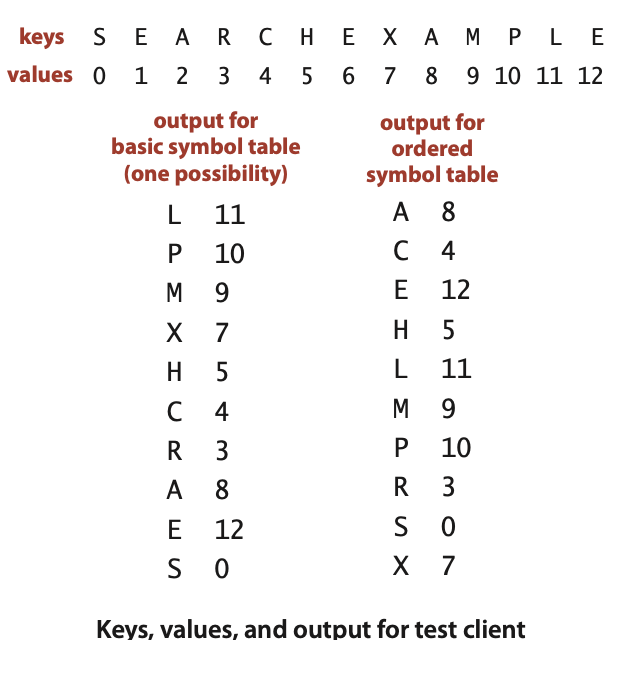
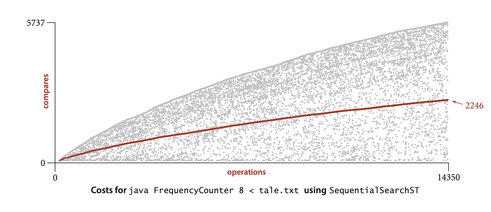
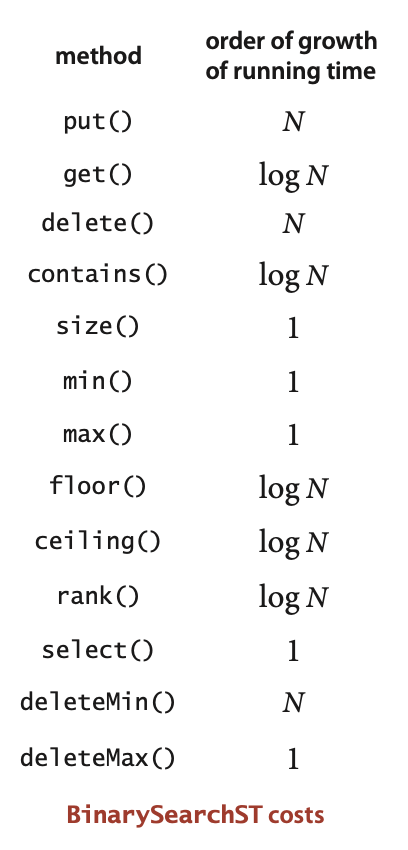
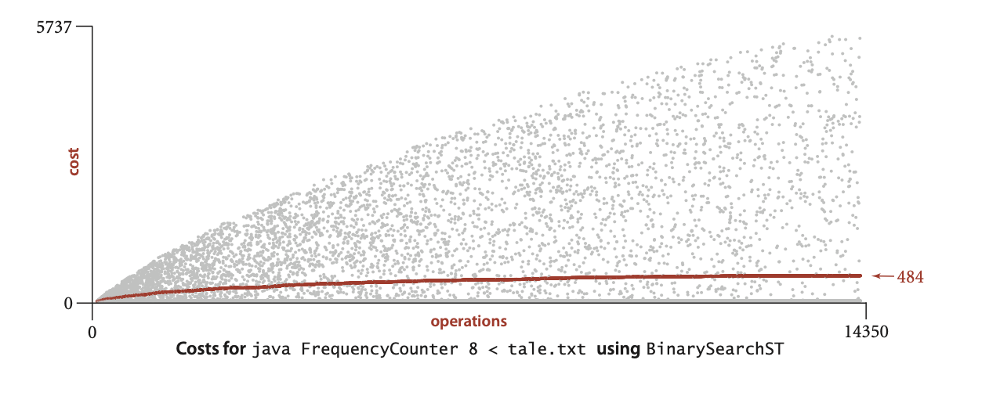
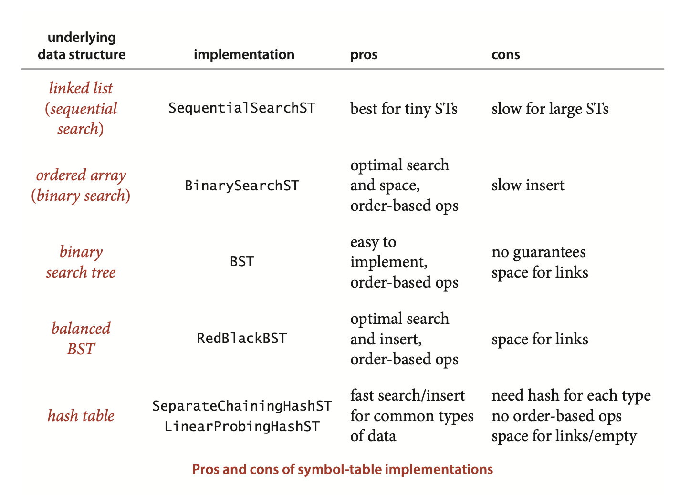

### 3.1 Symbol Tables

... Symbol tables are sometimes called *dictionaries*, ... . Symbol tables are also sometimes called *indices*.

**Definition.** A symbol table is a data structure for key-value pairs that supports two operations: insert (put) a new pair into the table and search for (get) the value associated with a given key.

**Null values.** We also adopt the convention that no key can be associated with the value null. This convention is directly tied to our specification in the API that get() should return null for keys not in the table, effectively associating the value null with every key not in the table. This convention has two (intended) consequences: First, we can test whether or not the symbol table defines a value associated with a given key by testing whether get() returns null. Second, we can use the operation of calling put() with null as its second (value) argument to implement deletion, as described in the next paragraph.

**Deletion.** Deletion in symbol tables generally involves one of two strategies: lazy deletion, where we associate keys in the table with null, then perhaps remove all such keys at some later time; and eager deletion, where we remove the key from the table immediately. As just discussed, the code put(key, null) is an easy (lazy) implementation of delete(key). 


**Shorthand methods.**
```java
        void deleteMin()                delete(min());
        void deleteMax()                delete(max());
         int size(Key lo, Key hi)       if (hi.compareTo(lo) < 0)
                                            return 0;
                                        else if (contains(hi))   // Contributor's note: hi doesnt get counted in rank(hi) - rank(lo)
                                            return rank(hi) - rank(lo) + 1;
                                        else
                                            return rank(hi) - rank(lo);
Iterable<Key> keys()                    return keys(min(), max());
```


**Key equality (revisited).** The best practice in Java is to make compareTo() consistent with `equals()` in all Comparable types. ... To avoid any potential ambiguities, we avoid the use of `equals()` in ordered symbol-table implementations. Instead, we use `compareTo()` exclusively to compare keys: we take the boolean expression `a.compareTo(b) == 0` to mean “Are a and b equal ?”...

**Basic symbol-table test client**
```java
public static void main(String[] args)
{
    ST<String, Integer> st;
    st = new ST<String, Integer>();
    for (int i = 0; !StdIn.isEmpty(); i++)
    {
        String key = StdIn.readString();
        st.put(key, i);
    }
    for (String s : st.keys())
        StdOut.println(s + " " + st.get(s));
}

```


**Performance client.** FrequencyCounter (on the next page) is a symbol-table client that finds the number of occurrences of each string (having at least as many characters as a given threshold length) in a sequence of strings from standard input, then iterates through the keys to find the one that occurs the most frequently. This client is an example of a dictionary client, ...

**A symbol-table client**
This ST client counts the frequency of occurrence of the strings in standard input, then prints out one that occurs with highest frequency. The command-line argument specifies a lower bound on the length of keys considered.
```java
public class FrequencyCounter
{
    public static void main(String[] args)
    {
        int minlen = Integer.parseInt(args[0]);
        ST<String, Integer> st = new ST<String, Integer>();
        while (!StdIn.isEmpty())
        {  // Build symbol table and count frequencies.
            String word = StdIn.readString();
            if (word.length() < minlen) continue;  // Ignore short keys.
            if (!st.contains(word)) st.put(word, 1);
            else                    st.put(word, st.get(word) + 1);
        }
        // Find a key with the highest frequency count.
        String max = "";
        st.put(max, 0);
        for (String word : st.keys())
            if (st.get(word) > st.get(max))
                max = word;
        StdOut.println(max + " " + st.get(max));
    }
}
```

```
// key-length cutoff
% java FrequencyCounter 1 < tinyTale.txt
it 10
% java FrequencyCounter 8 < tale.txt
business 122
% java FrequencyCounter 10 < leipzig1M.txt
government 24763
```


***Sequential search in an unordered linked list***
... This method is known as sequential search: we search by considering the keys in the table one after another, using equals() to test for a match with our search key.
ALGORITHM 3.1 Sequential search (in an unordered linked list) 
```java
public class SequentialSearchST<Key, Value>
{
    private Node first;     // first node in the linked list
    private class Node
    {  // linked-list node
        Key key;
        Value val;
        Node next;
        public Node(Key key, Value val, Node next)
        {
        this.key  = key;
        this.val  = val;
        this.next = next;
        } 
    }
    public Value get(Key key)
    {  // Search for key, return associated value.
        for (Node x = first; x != null; x = x.next)
           if (key.equals(x.key))
              return x.val;    // search hit
        return null;           // search miss
    }
     public void put(Key key, Value val)
     {  // Search for key. Update value if found; grow table if new.
        for (Node x = first; x != null; x = x.next)
           if (key.equals(x.key))
           {  x.val = val; return;  }      // Search hit: update val.
        first = new Node(key, val, first); // Search miss: add new node.
     }
}
```

...  For economy, we use the term search hit to refer to a successful search and search miss to refer to an unsuccessful search.


**Proposition A.** ***Search misses*** and ***insertions*** in an (unordered) linked-list symbol table having $N$ key-value pairs both require N compares, and search hits $N$ compares in the worst case. In particular, inserting $N$ distinct keys into an initially empty linked-list symbol table uses $ \sim N^2/2$ compares.

**Proof:** When searching for a key that is not in the list,we test every key in the table against the search key. Because of our policy of disallowing duplicate keys, we need to do such a search before each insertion.

**Corollary.** Inserting $N$ distinct keys into an initially empty linked-list symboltable uses $ \sim N^2/2$ compares.

---
**Contributor's Note:**
At each step, $k$ is the current length of the list:
$$
\sum_{k=0}^{N-1} k = \frac{N(N-1)}{2}.
$$
---

It is true that searches for keys that are in the table need not take linear time. ... This quantity is precisely the expected number of compares required for a search under the condition that searches for each key in the table are equally likely. We refer to such a search as a *random search hit*. It is easy to show that the average number of compares for a random search hit is $ \sim N/2$: the `get(`)` method in Algorithm 3.1 uses 1 compare to find the first key, 2 compares to find the second key, and so forth, for an average cost of $(1 + 2 + ... + N )/ N = (N + 1)/2 \sim N/2$.

This analysis strongly indicates that a linked-list implementation with sequential search is too slow for it to be used to solve huge problems such as our reference inputs with clients like FrequencyCounter. The total number of compares is proportional to the product of the number of searches and the number of inserts, which is more than 10 9 for Tale of Two Cities and more than 1014 for the Leipzig Corpora.

... (recall that every word in the input leads to a `put()`, to update its frequency, and we ignore the cost of easily avoided calls to `contains()`). 


... for the i th put() operation we plot a gray point with x coordinate i and y coordinate the number of key compares it uses and a red point with x coordinate i and y coordinate the cumulative average number of key compares used for the first i put() operations. ... (this plot has 14,350 gray points and 14,350 red points). ... the plot validates our hypothesis that about half the list is accessed for the average put() operation. The actual total is slightly lower than half, but this fact (and the precise shape of the curves) is perhaps best explained by characteristics of the application, not our algorithms (see Exercise 3.1.36).



***Binary search in an ordered array***

**ALGORITHM 3.2 Binary search (in an ordered array)**
```java
public class BinarySearchST<Key extends Comparable<Key>, Value>
{
    private Key[] keys;
    private Value[] vals;
    private int N;
    public BinarySearchST(int capacity)
    {   // See Algorithm 1.1 for standard array-resizing code.
        keys = (Key[]) new Comparable[capacity];
        vals = (Value[]) new Object[capacity];
    }
    public int size()
    {  return N;  }
    public Value get(Key key)
    {
        if (isEmpty()) return null;
        int i = rank(key);
        if (i < N && keys[i].compareTo(key) == 0) return vals[i];
        else                                      return null;
    }
    public int rank(Key key)
    {
        if (hi < lo) return lo;
        int mid = lo + (hi - lo) / 2;
        int cmp = key.compareTo(keys[mid]);
        if      (cmp < 0)
            return rank(key, lo, mid-1);
        else if (cmp > 0)
            return rank(key, mid+1, hi);
        else return mid;
    }
      
    public int rank(Key key)
    {
        int lo = 0, hi = N-1;
        while (lo <= hi)
        {
            int mid = lo + (hi - lo) / 2;
            int cmp = key.compareTo(keys[mid]);
            if      (cmp < 0) hi = mid - 1;
            else if (cmp > 0) lo = mid + 1;
            else return mid;
        }
        return lo; 
    }


    public void put(Key key, Value val)
    {  // Search for key. Update value if found; grow table if new.
        int i = rank(key);
        if (i < N && keys[i].compareTo(key) == 0)
        {  vals[i] = val; return;  }
        for (int j = N; j > i; j--)
        {  keys[j] = keys[j-1]; vals[j] = vals[j-1];  }
        keys[i] = key; vals[i] = val;
        N++;
    }
    public void delete(Key key)
        // See Exercise 3.1.16 for this method.
    public Key min()
    {  return keys[0];  }
    public Key max()
    {  return keys[N-1];  }
    public Key select(int k)
    {  return keys[k];  }
    public Key ceiling(Key key)
    {
        int i = rank(key);
        return keys[i];
    }
    public Key floor(Key key)
    // See Exercise 3.1.17.
    public Key delete(Key key)
    // See Exercise 3.1.16.
    public Iterable<Key> keys(Key lo, Key hi)
    {
        Queue<Key> q = new Queue<Key>();
        for (int i = rank(lo); i < rank(hi); i++)
        q.enqueue(keys[i]);
        if (contains(hi))
            q.enqueue(keys[rank(hi)]);
        return q;
    }
}
```

**Proposition B.** Binary search in an ordered array with N keys uses no more than $\lg N + 1$ compares for a search (successful or unsuccessful).
**Proof:** This analysis is similar to (but simpler than) the analysis of mergesort (Proposition F in Chapter 2). Let $C(N)$ be the number of compares needed to search for a key in a symbol table of size N. We have $C(0)=0$, $C(1)=1$, and for $N > 0$ we can write a recurrence relationship that directly mirrors the recursive method: 
$$C(N) \leq C(\lfloor N/2 \rfloor) + 1$$
Whether the search goes to the left or to the right, the size of the subarray is no more than $\lfloor N/2 \rfloor$, and we use one compare to check for equality and to choose whether to go left or right. When $N$ is one less than a power of $2$ (say $N = 2^n - 1$), this recurrence is not difficult to solve. First, since $\lfloor N/2\rfloor = 2^{n - 1} - 1$, we have
$$C(2^n - 1) \leq C(2^{n - 1} - 1) + 1$$
Applying the same equation to the first term on the right, we have
$$C(2^n - 1) \leq C(2^{n - 1} - 1) + 1 + 1$$
Repeating the previous step $n - 2$ additional times gives
$$C(2^n - 1) \leq C(2^0) + n $$
which leaves us with the solution
$$C(N) = C(2^n) \leq n + 1 < \lg N + 1$$
Exact solutions for general $N$ are more complicated, but it is not difficult to extend this argument to establish the stated property for all values of $N$ (see Exercise 3.1.20). With binary search, we achieve a logarithmic-time search guarantee.





**Proposition B (continued)**. Inserting a new key into an ordered array of size $N$ uses $\sim 2N$ array accesses in the worst case, so inserting $N$ keys into an initially empty table uses $\sim N^2$ array accesses in the worst case.
**Proof:** Same as for Proposition A.

---
Contributor's Note:
Find the position (LgN) and shift the elements (N).
---




Despite its guaranteed logarithmic search, BinarySearchST still does not enable us to use clients like FrequencyCounter to solve huge problems, because the put() method is too slow. 



