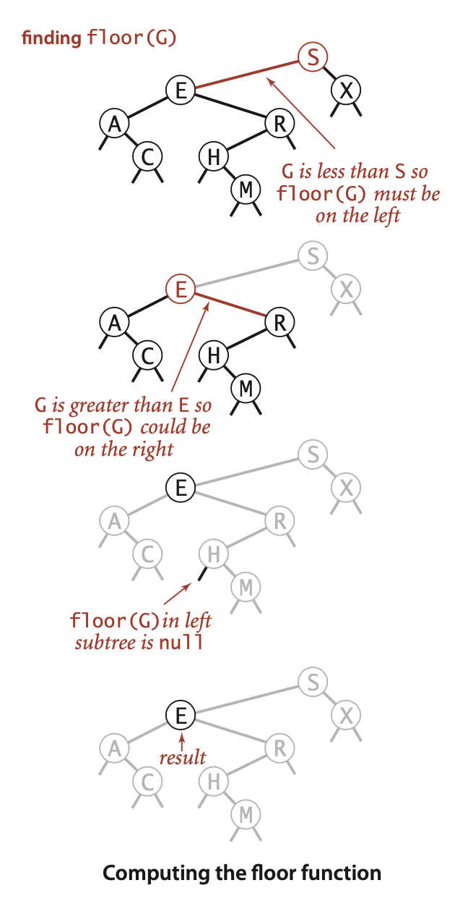
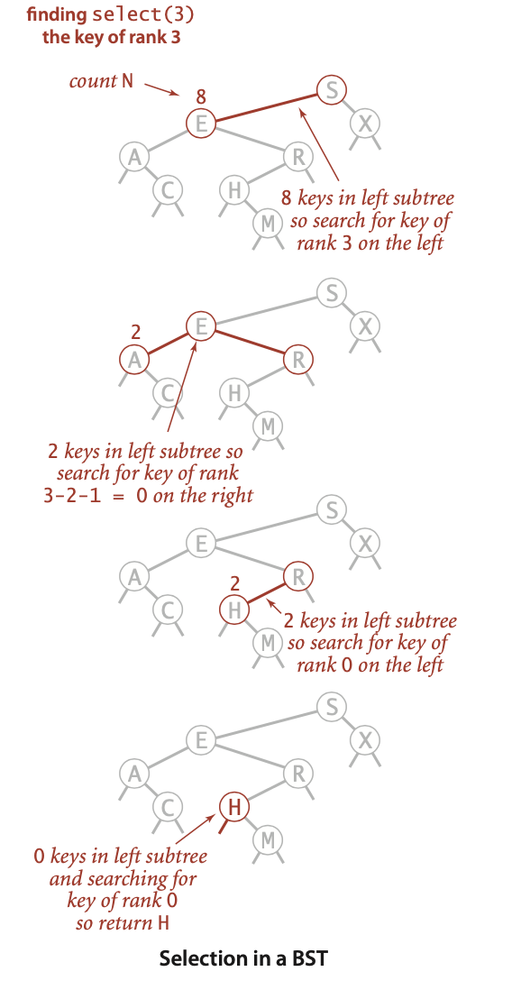
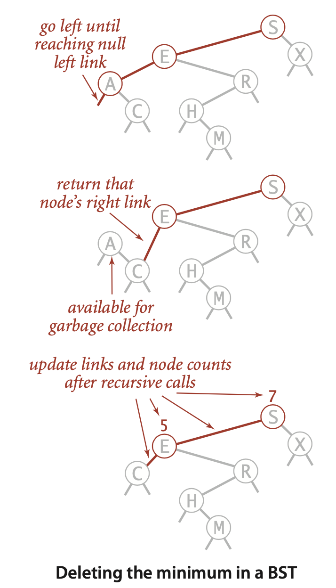
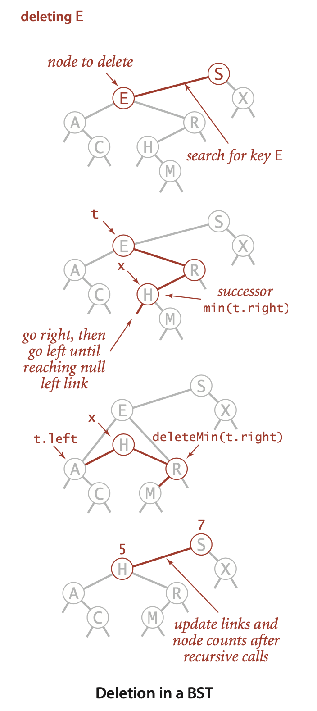
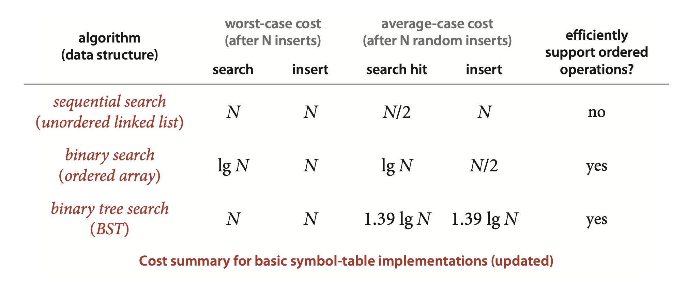

### 3.2 Binary Search Trees

In this section, we will examine a symbol-table implementation that combines the flexibility of insertion in a linked list with the efficiency of search in an ordered array.

Although links point to nodes, we can view each link as pointing to a binary tree, the tree whose root is the referenced node.

**Definition.** A binary search tree (BST) is a binary tree where each node has a Comparable key (and an associated value) and satisfies the restriction that the key in any node is larger than the keys in all nodes in that node’s left subtree and smaller than the keys in all nodes in that node’s right subtree.


ALGORITHM 3.3 Binary search tree symbol table
```java
public class BST<Key extends Comparable<Key>, Value>
{
    private Node root;
    private class Node
    {
        private Key key;
        private Value val;
        private Node left, right;
        private int N;
        // root of BST
        // key
        // associated value
        // links to subtrees
        // # nodes in subtree rooted here
        public Node(Key key, Value val, int N)
        {  this.key = key; this.val = val; this.N = N; }
    }
    public int size()
    {  return size(root);  }
    private int size(Node x)
    {
    if (x == null) return 0;
    else           return x.N;
    }
    public Value get(Key key)
    {  return get(root, key);  }
    private Value get(Node x, Key key)
    {   // Return value associated with key in the subtree rooted at x;
        // return null if key not present in subtree rooted at x.
        if (x == null) return null;
        int cmp = key.compareTo(x.key);
        if      (cmp < 0) return get(x.left, key);
        else if (cmp > 0) return get(x.right, key);
        else return x.val;
    }
    public void put(Key key, Value val)
    {  // Search for key. Update value if found; grow table if new.
        root = put(root, key, val);
    }
    private Node put(Node x, Key key, Value val)
    {
        // Change key’s value to val if key in subtree rooted at x.
        // Otherwise, add new node to subtree associating key with val.
        if (x == null) return new Node(key, val, 1);
        int cmp = key.compareTo(x.key);
        if      (cmp < 0) x.left  = put(x.left,  key, val);
        else if (cmp > 0) x.right = put(x.right, key, val);
        else x.val = val;
        x.N = size(x.left) + size(x.right) + 1;
        return x;
    }

    // See page 407 for min(), max(), floor(), and ceiling().
    // See page 409 for select() and rank().
    // See page 411 for delete(), deleteMin(), and deleteMax().
    // See page 413 for keys().
}
```


**Recursion.** ...You can think of the code before the recursive calls as happening on the way down the tree: it compares the given key against the key at each node and moves right or left accordingly. Then, think of the code after the recursive calls as happening on the way up the tree.


**Analysis** ... In the best case, a tree with $N$ nodes could be perfectly balanced, with $\sim \lg N$ nodes between the root and each null link. In the worst case there could be $N$ nodes on the search path. 


**Proposition C.** Search hits in a BST built from $N$ random keys require $\sim 2 \ln N$ (about 1.39 lg N) compares, on the average.  
**Proof:** The number of compares used for a search hit ending at a given node is 1 plus the depth. Adding the depths of all nodes, we get a quantity known as the *internal path length* of the tree. Thus, the desired quantity is 1 plus the average internal path length of the BST, which we can analyze with the same argument that we used for Proposition K in Section 2.3: Let CN be the total internal path length of a BST built from inserting $N$ randomly ordered distinct keys, so that the average cost of a search hit is $1 + C_N /N$.We have $C_0=C_1=0$ and for $N>1$ we can write a recurrence relationship that directly mirrors the recursive BST structure:
$$C_N = N - 1 + (C_0 + C_{N - 1}) / N + (C_1 + C_{N - 2})/N + . . . (C_{N - 1} + C_0 )/N$$
The $N - 1$ term takes into account that the root contributes 1 to the path length of each of the other $N - 1$ nodes in the tree; the rest of the expression accounts for the subtrees, which are equally likely to be any of the $N$ sizes. After rearranging terms, this recurrence is nearly identical to the one that we solved in Section 2.3 for quicksort, and we can derive the approximation $C_N \sim 2N \ln N$.

---
Contributor's Note:
in the sum, we are averaging internal paths over all possible random BSTs on $N$ nodes. $C_N$ is expected path length over all BSTs of size $N$. Each parenthesis represents one possible split of the remaining $N−1$ nodes under the root.
---


**Proposition D.** Insertions and search misses in a BST built from $N$ random keys require $\sim 2 \ln N$ (about $1.39 \lg N$) compares, on the average.  
**Proof:** Insertions and search misses take one more compare, on the average, than search hits. This fact is not difficult to establish by induction (see Exercise 3.2.16).

*Proposition C* says that we should expect the BST search cost for random keys to be about 39 percent higher than that for binary search. Proposition D says that the extra cost is well worthwhile, because the cost of inserting a new key is also expected to be logarithmic—flexibility not available with binary search in an ordered array, where the number of array accesses required for an insertion is typically linear. As with quicksort, the standard deviation of the number of compares is known to be low, so that these formulas become increasingly accurate as $N$ increases.


**Minimum and maximum.** If the left link of the root is null, the smallest key in a BST is the key at the root; if the left link is not null, the smallest key in the BST is the smallest key in the subtree rooted at the node referenced by the left link. ... Finding the maximum key is similar, moving to the right instead of to the left.


**Floor and ceiling.** If a given key key is less than the key at the root of a BST, then the floor of key (the largest key in the BST less than or equal to key) must be in the left subtree. If key is greater than the key at the root, then the floor of key could be in the right subtree, but only if there is a key smaller than or equal to key in the right subtree; if not (or if key is equal to the key at the root), then the key at the root is the floor of key.

--- 
Contributor's Note:  
If the key is greater than the root, you move to the root’s right subtree, where all nodes are greater than the root. Any node in this subtree that is less than key is a better candidate than the root.

---



**ALGORITHM 3.3 (continued) Min, max, floor, and ceiling in BSTs**
```java
public Key min()
{
    return min(root).key;
}
private Node min(Node x)
{
    if (x.left == null) return x;
    return min(x.left);
}
public Key floor(Key key)
{
    Node x = floor(root, key);
    if (x == null) return null;
    return x.key;
}
private Node floor(Node x, Key key)
{
    if (x == null) return null;
    int cmp = key.compareTo(x.key);
    if (cmp == 0) return x;
    if (cmp < 0)  return floor(x.left, key);
    Node t = floor(x.right, key);
    if (t != null) return t;
    else           return x;
}
```


**Selection.** Suppose that we seek the key of rank k (the key such that precisely k other keys in the BST are smaller). If the number of keys $t$ in the left subtree is larger than $k$, we look (recursively) for the key of rank $k$ in the left subtree; if $t$ is equal to $k$, we return the key at the root; and if $t$ is smaller than $k$, we look (recursively) for the key of rank $k - t - 1$ in the right subtree. 


---
Contributor's Note:  
For $k - t - 1$, the `1` accounts for the root, and `t` is the number of nodes in the left subtree, which are all guaranteed to be smaller than every node in the right subtree.

---


**Rank.** The inverse method ‍`rank()` that returns the rank of a given key is similar: if the given key is equal to the key at the root, we return the number of keys t in the left subtree; if the given key is less than the key at the root, we return the rank of the key in the left subtree (recursively computed); and if the given key is larger than the key at the root, we return `t` plus one (to count the key at the root) plus the rank of the key in the right subtree (recursively computed).


ALGORITHM 3.3 (continued) Selection and rank in BSTs
```java
public Key select(int k)
{
    return select(root, k).key;
}
private Node select(Node x, int k)
{   // Return Node containing key of rank k.
    if (x == null) return null;
    int t = size(x.left);
    if      (t > k) return select(x.left,  k);
    else if (t < k) return select(x.right, k-t-1);
    else            return x;
}
public int rank(Key key)
{   return rank(key, root);  }
private int rank(Key key, Node x)
{  // Return number of keys less than x.key in the subtree rooted at x.
    if (x == null) return 0;
    int cmp = key.compareTo(x.key);
    if      (cmp < 0) return rank(key, x.left);
    else if (cmp > 0) return 1 + size(x.left) + rank(key, x.right);
    else              return size(x.left);
}
```


**Delete the minimum/maximum.** The most difficult BST operation to implement is the delete() method that removes a key-value pair from the symbol table. 




**Delete.** ... to delete a node `x` by replacing it with its successor. Because x has a right child, its successor is the node with the smallest key in its right subtree. The replacement preserves order in the tree because there are no keys between `x.key` and the successor’s key. We can accomplish the task of replacing `x` by its successor in four (!) easy steps:
- Save a link to the node to be deleted in t.
- Set `x` to point to its successor `min(t.right)`.
- Set the right link of `x` (which is supposed to point to the BST containing all the keys larger than `x.key`) to `deleteMin(t.right)`, the link to the BST containing all the keys that are larger than `x.key` after the deletion.
- Set the left link of `x` (which was null) to `t.left` (all the keys that are less than both the deleted key and its successor). 

... The problem is that the choice of using the successor is arbitrary and not symmetric. Why not use the predecessor? In practice, it is worthwhile to choose at random between the predecessor and the successor. See Exercise 3.2.42 for details.



--- 
Contributor's Note:

all `deleteMin()`s return the node itself, except the one whose `.left` is `null`, which returns its `.right`.  

---


**ALGORITHM 3.3 (continued) Deletion in BSTs** (eager Hibbard deletion in BSTs)
```java
public void deleteMin()
{
    root = deleteMin(root);
}
private Node deleteMin(Node x)
{
    if (x.left == null) return x.right;
    x.left = deleteMin(x.left);
    x.N = size(x.left) + size(x.right) + 1;
    return x;
}
public void delete(Key key)
{   root = delete(root, key);  }
private Node delete(Node x, Key key)
{
    if (x == null) return null;
    int cmp = key.compareTo(x.key);
    if      (cmp < 0) x.left  = delete(x.left,  key);
    else if (cmp > 0) x.right = delete(x.right, key);
    else
    {
        if (x.right == null) return x.left;
        if (x.left == null) return x.right;
        Node t = x;
        x = min(t.right);  // See page 407.
        x.right = deleteMin(t.right);
        x.left = t.left;
    }
    x.N = size(x.left) + size(x.right) + 1;
    return x;
}
```


**Range queries.** To implement the `keys()` method that returns the keys in a given range, we begin with a basic recursive BST traversal method, known as *inorder traversal*.

ALGORITHM 3.3 (continued) Range searching in BSTs 
```java
public Iterable<Key> keys()
{   return keys(min(), max());  }
public Iterable<Key> keys(Key lo, Key hi)
{
    Queue<Key> queue = new Queue<Key>();
    keys(root, queue, lo, hi);
    return queue;
}
private void keys(Node x, Queue<Key> queue, Key lo, Key hi)
{
    if (x == null) return;
    int cmplo = lo.compareTo(x.key);
    int cmphi = hi.compareTo(x.key);
    if (cmplo < 0) keys(x.left, queue, lo, hi);
    if (cmplo <= 0 && cmphi >= 0) queue.enqueue(x.key);
    if (cmphi > 0) keys(x.right, queue, lo, hi);
}
```


**Analysis.**

**Proposition E.** InaBST,alloperationstaketimeproportionaltotheheightofthe tree, in the worst case.  
**Proof:** All of these methods go down one or two paths in the tree. The length of any path is no more than the height, by definition.

... Good performance of the basic BST implementation is dependent on the keys being sufficiently similar to random keys that the tree is not likely to contain many long paths.




... nonrecursive implementations are a bit more efficient. ... . If trees are unbalanced, the depth of the function-call stack could be a problem in a recursive implementation


--- 

Contributor's Note:

For Practice:

```java
public class BST<Key extends Comparable<Key>, Value>
{
    private Node root;
    private class Node
    {
        private Key key;
        private Value val;
        private Node left, right;
        private int N;
        // root of BST
        // key
        // associated value
        // links to subtrees
        // # nodes in subtree rooted here
        public Node(Key key, Value val, int N)
        {  this.key = key; this.val = val; this.N = N; }
    }
    public int size()
    { }
    private int size(Node x)
    { }
    public Value get(Key key)
    { }
    private Value get(Node x, Key key)
    { }
    public void put(Key key, Value val)
    { }
    private Node put(Node x, Key key, Value val)
    { }
    public Key min()
    { }
    private Node min(Node x)
    { }
    public Key floor(Key key)
    { }
    private Node floor(Node x, Key key)
    { }
    public Key select(int k)
    { }
    private Node select(Node x, int k)
    { }
    public int rank(Key key)
    { }
    private int rank(Key key, Node x)
    { }
    public void deleteMin()
    { }
    private Node deleteMin(Node x)
    { }
    public void delete(Key key)
    { }
    private Node delete(Node x, Key key)
    { }
    public Iterable<Key> keys()
    { }
    public Iterable<Key> keys(Key lo, Key hi)
    { }
    private void keys(Node x, Queue<Key> queue, Key lo, Key hi)
    { }
}
```
---
