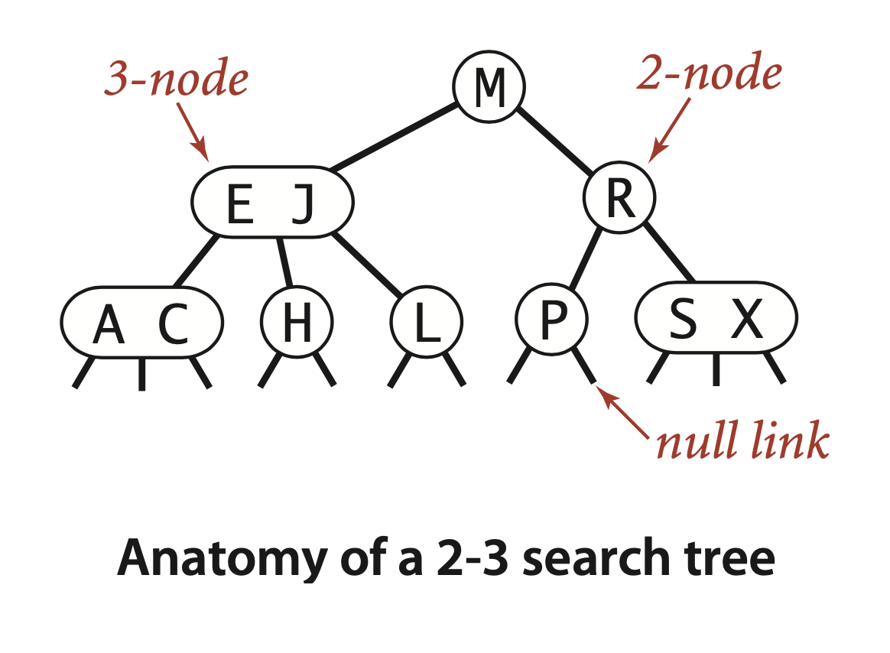
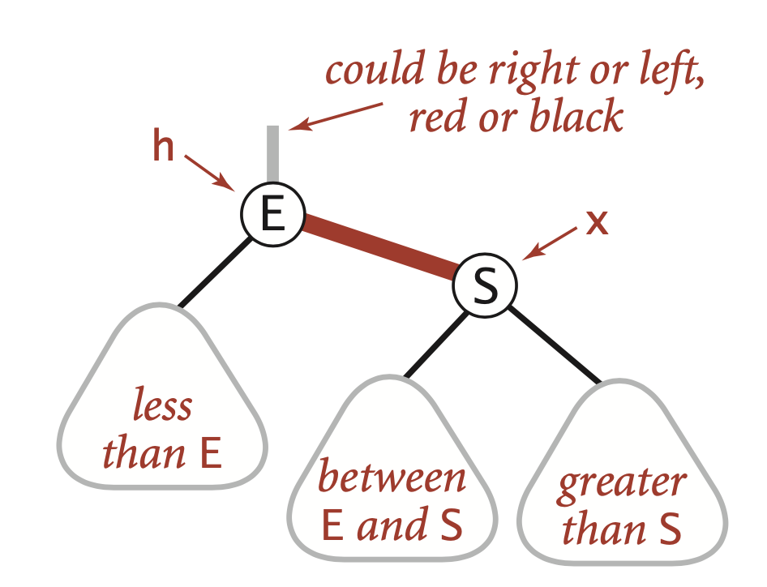
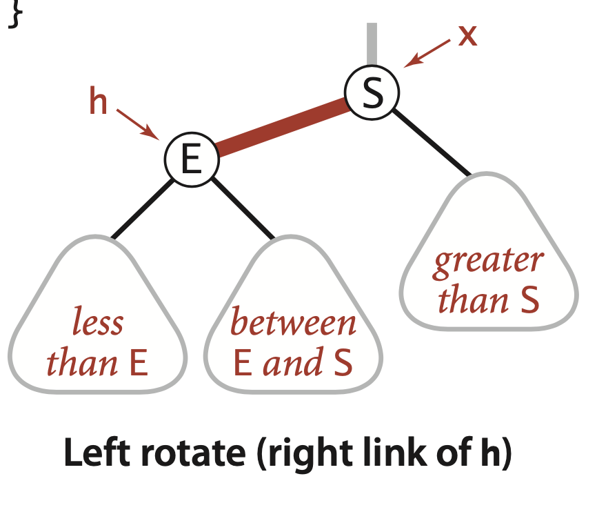
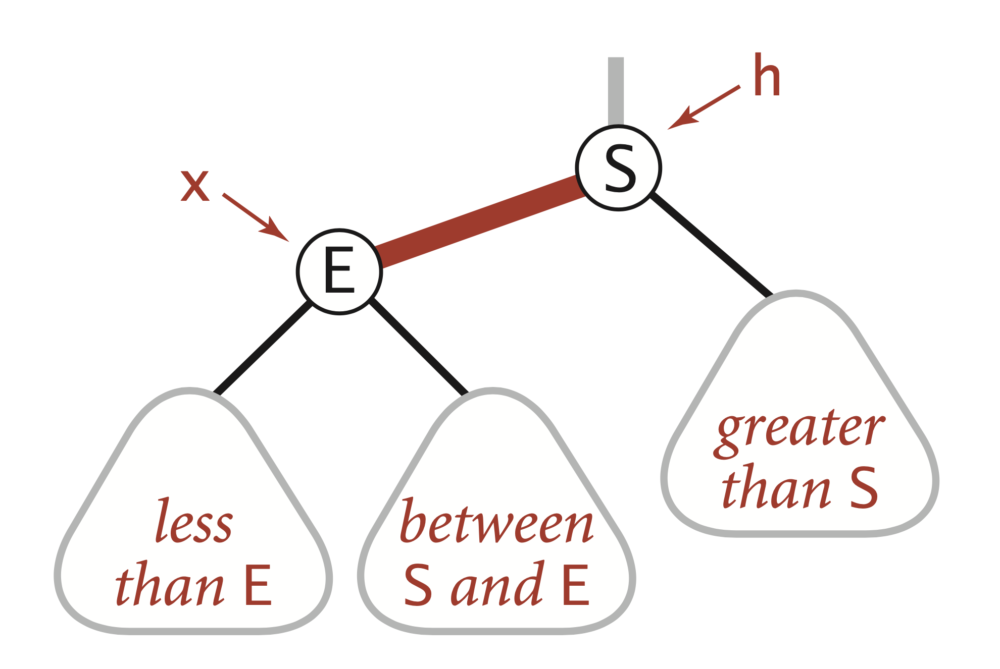
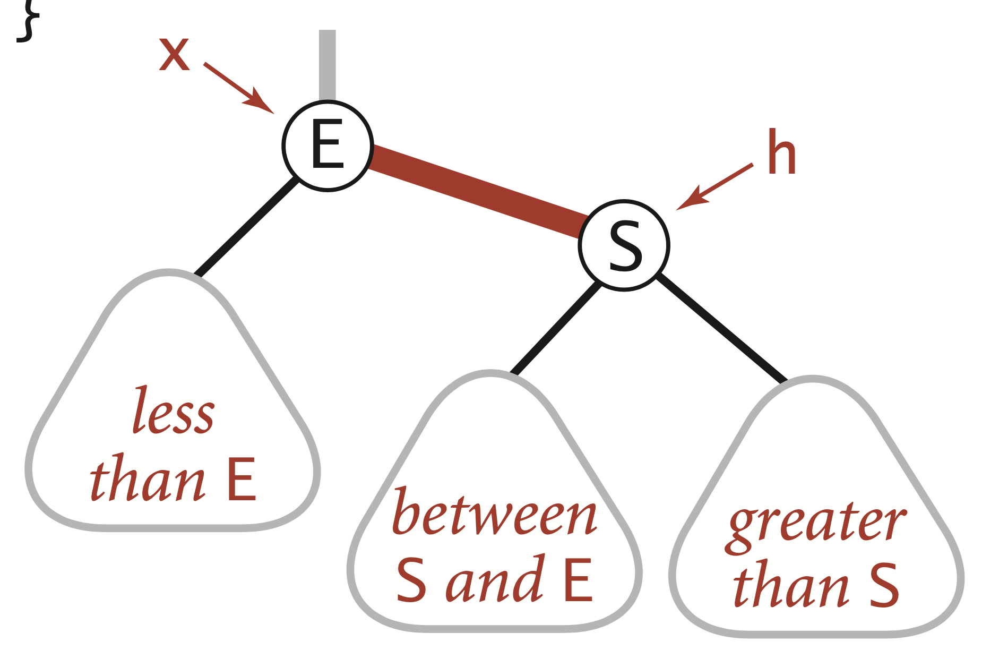
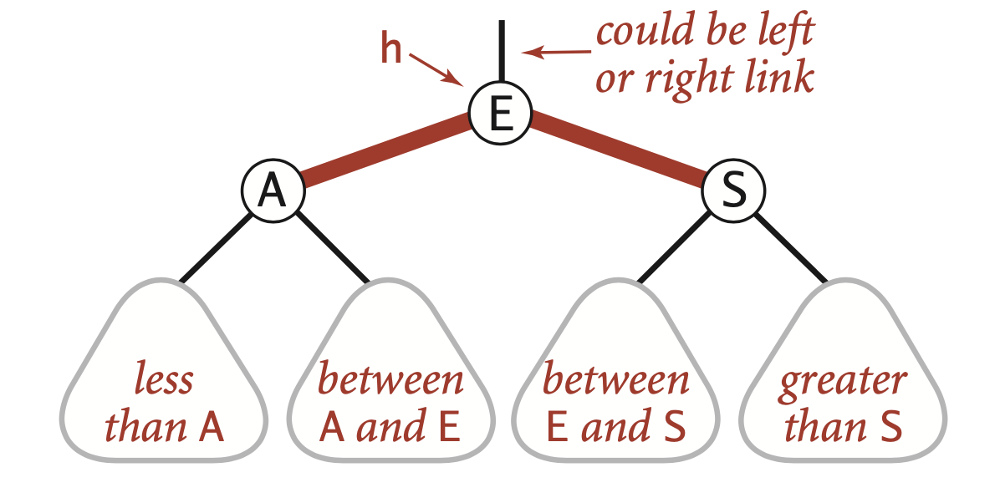
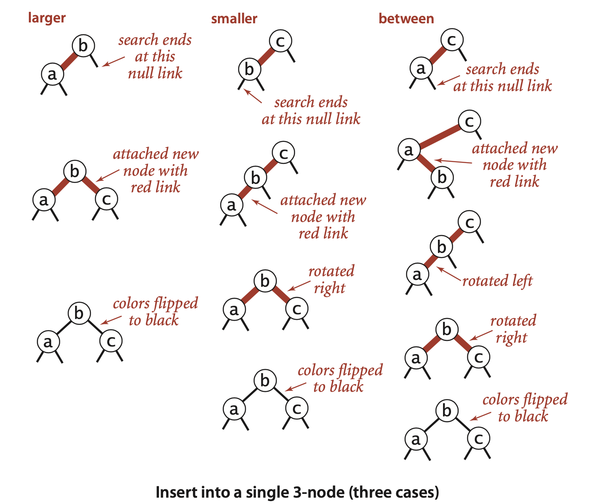
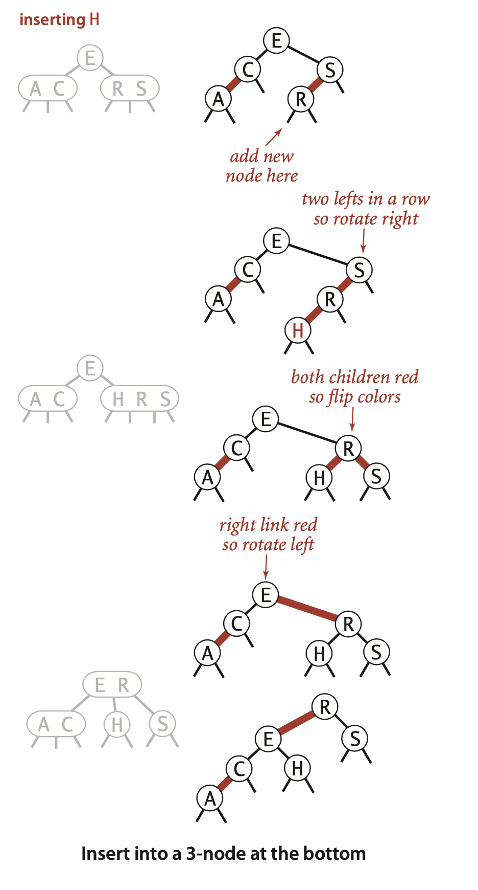
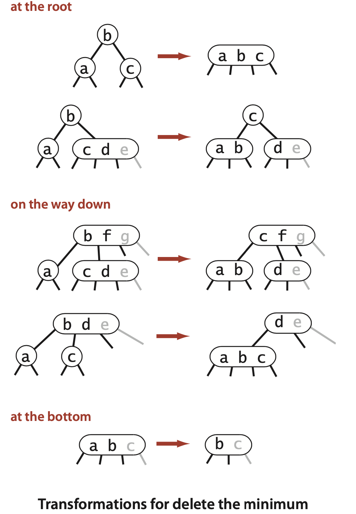

### 3.3 Balanced Search Trees

The algorithms in the previous section work well for a wide variety of applications, but they have poor worst-case performance. We introduce in this section a type of binary search tree where costs are guaranteed to be logarithmic, no matter what sequence of keys is used to construct them. 


**Definition.** A 2-3 search tree is a tree that is either empty or
- A 2-node, with one key (and associated value) and two links, a left link to a 2-3 search tree with smaller keys, and a right link to a 2-3 search tree with larger keys
- A 3-node, with two keys (and associated values) and three links, a left link to a 2-3 search tree with smaller keys, a middle link to a 2-3 search tree with keys between the node’s keys, and a right link to a 2-3 search tree with larger keys

As usual, we refer to a link to an empty tree as a null link.


A *perfectly balanced* 2-3 search tree is one whose null links are all the same distance from the root. 


The basis of the 2-3 tree insertion algorithm is that all of these transformations are purely local: no part of the tree needs to be examined or modified other than the specified nodes and links. ... Moreover, these local transformations preserve the global properties that the tree is ordered and perfectly balanced: the number of links on the path from the root to any null link is the same. ... If the length of every path from a root to a null link is $h$ before the transformation, then it is $h$ after the transformation. Each transformation preserves this property, even while splitting the 4-node into two 2-nodes and while changing the parent from a 2-node to a 3-node or from a 3-node into a temporary 4-node.


**Proposition F.** Search and insert operations in a 2-3 tree with $N$ keys are guaranteed to visit at most $\lg N$ nodes.  
**Proof:** The height of an N-node 2-3 tree is between $\lfloor \log_3 N \rfloor = \lfloor(\lg N)/(\lg 3)\rfloor$ (if the tree is all 3-nodes) and $\lfloor \lg N \rfloor$ (if the tree is all 2-nodes) 

>Contributor's Note:  
>For the all 3-nodes case:
>$$
>N = \sum_{i=0}^{h} 2 \cdot 3^i = 2 \cdot \frac{3^{h+1}-1}{2} = 3^{h+1}-1
>$$
>Therefore
>$$
>\begin{align*}
>3^{h+1} &= N + 1 \\
>h+1 &= \log_3 (N+1) \\
>h &= \log_3 (N+1) - 1 \\
>\end{align*}
>$$


***Red-black BSTs***
... We think of the links as being of two different types: red links, which bind together two 2-nodes to represent 3-nodes, and black links, which bind together the 2-3 tree. Specifically, we represent 3-nodes as two 2-nodes connected by a single red link that leans left (one of the 2-nodes is the left child of the other). 


**An equivalent definition.** 
- Red links lean left.
- No node has two red links connected to it.
- The tree has perfect black balance : every path from the root to a null link has the same number of black links.  

There is a 1-1 correspondence between red-black BSTs defined in this way and 2-3 trees.


... we encode the color of links innodes,byaddingabooleaninstancevariable color to our Node data type, which is true if the link from the parent is red and false if tit (it?) is black. By convention, null links are black.


```java
private static final boolean RED = true;
private static final boolean BLACK = false;
private class Node
{
   Key key;          // key
   Value val;        // associated data
   Node left, right; // subtrees
   int N;            // # nodes in this subtree
   boolean color;    // color of link from
                     //   parent to this node
   Node(Key key, Value val, int N, boolean color)
   {
      this.key
      this.val
      this.N
      this.color = color;
    } 
}
private boolean isRed(Node x)
{
   if (x == null) return false;
   return x.color == RED;
}
```


```java
Node rotateLeft(Node h)
{
    Node x = h.right;
    h.right = x.left;
    x.left = h;
    x.color = h.color;
    h.color = RED;
    x.N = h.N;
    h.N = 1 + size(h.left)
            + size(h.right);
    return x;
}
```



```java
Node rotateRight(Node h)
{
    Node x = h.left;
    h.left = x.right;
    x.right = h;
    x.color = h.color;
    h.color = RED;
    x.N = h.N;
    h.N = 1 + size(h.left)
            + size(h.right);
    return x;
}
```


```java
void flipColors(Node h)
{
h.color = RED; //Contributor's Note: to propagate the split upward
h.left.color = BLACK;
h.right.color = BLACK;
}
```

We always use the link returned by rotateRight() or rotateLeft() to reset the appropriate link in the parent (or the root of the tree).

... two defining properties of redblack BSTs (no consecutive red links on any path and no right-leaning red links).





In the case just considered (insert into a single 3-node), the color flip will color the root red. This can also happen in larger trees. Strictly speaking, a red root implies that the root is part of a 3-node, but that is not the case, so we color the root black after each insertion. (Contributor's Note: `flipColor` at root's children)




**ALGORITHM 3.4 Insert for red-black BSTs**
```java
public class RedBlackBST<Key extends Comparable<Key>, Value>
{
    private Node root;
    private class Node // BST node with color bit (see page 433)
    private boolean isRed(Node h)    // See page 433.
    private Node rotateLeft(Node h)  // See page 434.
    private Node rotateRight(Node h) // See page 434.
    private void flipColors(Node h)  // See page 436.
    private int size()               // See page 398.
    public void put(Key key, Value val)
    {  // Search for key. Update value if found; grow table if new.
        root = put(root, key, val);
        root.color = BLACK;
    }
    private Node put(Node h, Key key, Value val)
    {
        if (h == null)  // Do standard insert, with red link to parent.
            return new Node(key, val, 1, RED);
        int cmp = key.compareTo(h.key);
        if      (cmp < 0) h.left  = put(h.left,  key, val);
        else if (cmp > 0) h.right = put(h.right, key, val);
        else h.val = val;
        if (isRed(h.right) && !isRed(h.left))    h = rotateLeft(h);
        if (isRed(h.left) && isRed(h.left.left)) h = rotateRight(h);
        if (isRed(h.left) && isRed(h.right))     flipColors(h);
        h.N = size(h.left) + size(h.right) + 1;
        return h; 
    }
}
```


...The insertion algorithm is based on doing transformations on the way down the path to maintain the invariant that the current node is not a 4-node (so we are assured that there will be room to insert the new key at the bottom) and transformations on the way up the path to balance any 4-nodes that may have been created. .... Remarkably, you can implement top-down 2-3-4 trees by moving one line of code in put() in Algorithm 3.4: move the colorFlip() call (and accompanying test) to before the recursive calls (between the test for null and the comparison). This algorithm has some advantages over 2-3 trees in applications where multiple processes have access to the same tree, because it always is operating within a link or two of the current node.


The basic idea is based on the observation that we can easily delete a key from a 3-node at the bottom of the tree, but not from a 2-node. Deleting the key from a 2-node leaves a node on the way down with no keys; the natural thing to do would be to replace the node with a null link, but that operation would violate the perfect balance condition. So, we adopt the following approach: to ensure that we do not end up on a 2-node, we perform appropriate transformations on the way down the tree to preserve the invariant that the current node is not a at the bottom 2-node (it might be a 3-node or a temporary 4-node).


**Delete.** ...If the search key is at the bottom, we can just remove it. If the key is not at the bottom, then we have to exchange it with its successor as in regular BSTs. Then, since the current node is not a 2-node, we have reduced the problem to deleting the minimum in a subtree whose root is not a 2-node, and we can use the procedure just described for that subtree.


The end result is that all symbol-table operations in red-black BSTs are guaranteed to be logarithmic in the size of the tree (except for range search, which additionally costs time proportional to the number of keys returned).


**Proposition G.** The height of a red-black BST with Nnodes is no more than $2\lg N$.  
**Proof sketch:** The worst case is a 2-3 tree that is all 2-nodes except that the left most path is made up of 3-nodes. The path taking left links from the root is twice as long as the paths of length $\sim \lg N$ that involve just 2-nodes. It is possible, but not easy, to develop key sequences that cause the construction of red-black BSTs whose average path length is the worst-case 2 lg N. If you are mathematically inclined, you might enjoy exploring this issue by working Exercise 3.3.24.


**Property H.** The average length of a path from the root to a node in a red-black BST with $N$ nodes is $\sim 1.00 \lg N$.  
**Evidence:** Typical trees, such as the one at the bottom of the previous page (and even the one built by inserting keys in increasing order at the bottom of this page) are quite well-balanced, by comparison with typical BSTs (such as the tree depicted on page 405). The table at the top of this page shows that path lengths (search costs) for our FrequencyCounter application are about 40 percent lower than from elementary BSTs, as expected. This performance has been observed in countless applications and experiments since the invention of red-black BSTs.


The get() method in red-black BSTs does not examine the node color, so the balancing mechanism adds no overhead; search is faster than in elementary BSTs because the tree is balanced. 

**Proposition I.** In a red-black BST, the following operations take logarithmic time in the worst case: search, insertion, finding the minimum, finding the maximum, floor, ceiling, rank, select, delete the minimum, delete the maximum, delete, and range count.  
**Proof:** We have just discussed get(), put(), and the deletion operations. For the others, the code from Section 3.2 can be used verbatim (it just ignores the node color). Guaranteed logarithmic performance follows from Propositions E and G, and the fact that each algorithm performs a constant number of operations on each node examined.


***3.3.39*** Delete the minimum. Implement the deleteMin() operation for red-black BSTs by maintaining the correspondence with the transformations given in the text for moving down the left spine of the tree while maintaining the invariant that the current node is not a 2-node.
Solution:
```java
private Node moveRedLeft(Node h)
{  // Assuming that h is red and both h.left and h.left.left
   // are black, make h.left or one of its children red.
   flipColors(h);
   if (isRed(h.right.left))
   {
      h.right = rotateRight(h.right);
      h = rotateLeft(h);
   }
return h; }
public void deleteMin()
{
   if (!isRed(root.left) && !isRed(root.right))
      root.color = RED;
   root = deleteMin(root);
   if (!isEmpty()) root.color = BLACK;
}
private Node deleteMin(Node h)
{
   if (h.left == null)
      return null;
   if (!isRed(h.left) && !isRed(h.left.left))
      h = moveRedLeft(h);
   h.left = deleteMin(h.left);
   return balance(h);
}
```
This code assumes a `balance()` method that consists of the line of code 
```java
if (isRed(h.right)) h = rotateLeft(h);
```
followed by the last five lines of the recursive `put()` in Algorithm 3.4 and a `flipColors()` implementation that complements the three colors, instead of the method given in the text for insertion. For deletion, we set the parent to BLACK and the two children to RED.


**3.3.40** Delete the maximum. Implement the deleteMax() operation for red-black BSTs. Note that the transformations involved differ slightly from those in the previous exercise because red links are left-leaning.
```java
Solution:
public void deleteMax()
{
    if (!isRed(root.left) && !isRed(root.right))
        root.color = RED;
    root = deleteMax(root);
    if (!isEmpty()) root.color = BLACK;
}
private Node deleteMax(Node h)
{
    if (isRed(h.left))
        h = rotateRight(h);
    if (h.right == null)
        return null;
    if (!isRed(h.right) && !isRed(h.right.left))
        h = moveRedRight(h);
    h.right = deleteMax(h.right);
    return balance(h);
}
```


**3.3.41** Delete. Implement the delete() operation for red-black BSTs, combining the methods of the previous two exercises with the delete() operation for BSTs.
Solution :
```java
public void delete(Key key)
{
   if (!isRed(root.left) && !isRed(root.right))
      root.color = RED;
   root = delete(root, key);
   if (!isEmpty()) root.color = BLACK;
}
private Node delete(Node h, Key key)
{
    if (key.compareTo(h.key) < 0)
    {
        if (!isRed(h.left) && !isRed(h.left.left))
            h = moveRedLeft(h);
        h.left =  delete(h.left, key);
    }
    else {
        if (isRed(h.left))
            h = rotateRight(h);
        if (key.compareTo(h.key) == 0 && (h.right == null))
            return null;
        if (!isRed(h.right) && !isRed(h.right.left))
            h = moveRedRight(h);
        if (key.compareTo(h.key) == 0)
        {
            h.val = get(h.right, min(h.right).key);
            h.key = min(h.right).key;
            h.right = deleteMin(h.right);
        }
        else h.right = delete(h.right, key);
    }
    return balance(h);
}
```
