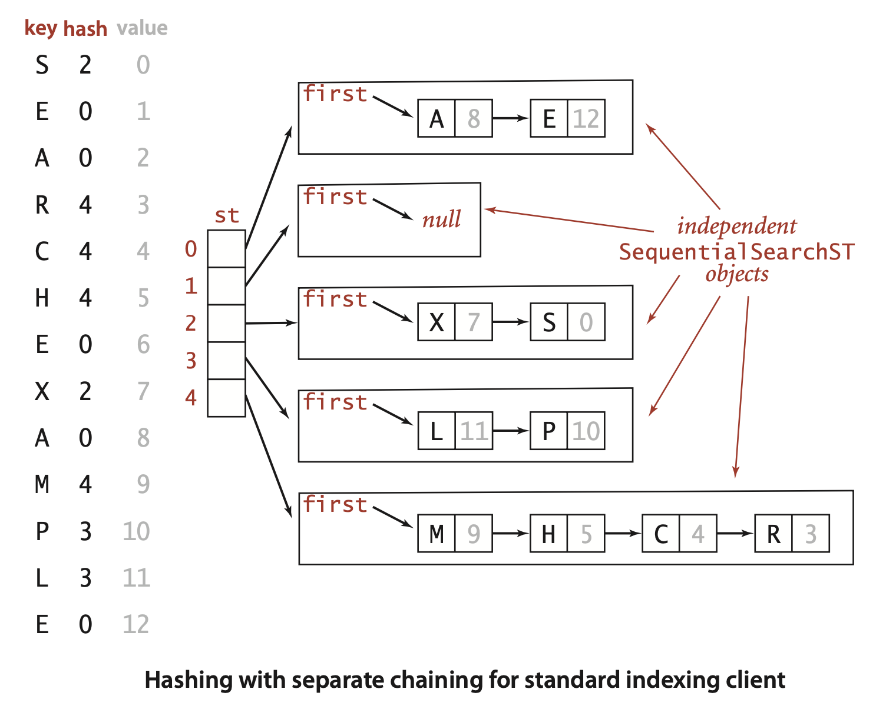

### 3.4 Hash Tables

Search algorithms that use hashing consist of two separate parts. The first part is to compute a *hash function* that transforms the search key into an array index. Ideally, different keys would map to different indices. This ideal is generally beyond our reach, so we have to face the possibility that two or more different keys may hash to the same array index. Thus, the second part of a hashing search is a *collision-resolution* process that deals with this situation. After describing ways to compute hash functions, we shall consider two different approaches to collision resolution: *separate chaining* and *linear probing*.

Hashing is a classic example of a time-space tradeoff. If there were no memory limitation, then we could do any search with only one memory access by simply using the key as an index in a (potentially huge) array. This ideal often cannot be achieved, however, because the amount of memory required is prohibitive when the number of possible key values is huge. On the other hand, if there were no time limitation, then we can get by with only a minimum amount of memory by using sequential search in an unordered array. ... With hashing, you can implement search and insert for symbol tables that require *constant* (amortized) time per operation in typical applications, making it the method of choice for implementing basic symbol tables in many situations.


**Hash functions** 
Strictly speaking, we need a different hash function for each key type that we use.  

*Positive integers.* The most commonly used method for hashing integers is called modular hashing : we choose the array size $M$ to be prime and, for any positive integer key $k$, compute the remainder when dividing $k$ by $M$. ... If M is not prime, it may be the case that not all of the bits of the key play a role, which amounts to missing an opportunity to disperse the values evenly. For example, if the keys are base-10 numbers and $M$ is $10 k$, then only the $k$ least significant digits are used. As a simple example where such a choice might be problematic, suppose that the keys are telephone area codes and $M = 100$. For historical reasons, most area codes in the United States have middle digit 0 or 1, so this choice strongly favors the values less than 20, where the use of the prime value 97 better disperses them (a prime value not close to 100 would do even better).

*Floating-point numbers.* If the keys are real numbers between 0 and 1, we might just multiply by $M$ and round off to the nearest integer to get an index between $0$ and $M – 1$. Although this approach is intuitive, it is defective because it gives more weight to the most significant bits of the keys; the least significant bits play no role. One way to address this situation is to use modular hashing on the binary representation of the key (this is what Java does).

*Strings.* 

```java
int hash = 0;
for (int i = 0; i < s.length(); i++)
    hash = (R * hash + s.charAt(i)) % M;
```
If R is greater than any character value, this computation would be equivalent to treating the String as an N-digit base-R integer, computing the remainder that results when dividing that number by M. A classic algorithm known as Horner’s method gets the job done with N multiplications, additions, and modulus operations. If the value of R is sufficiently small that no overflow occurs, the result is an integer between 0 and M – 1, as desired. The use of a small prime integer such as 31 ensures that the bits of all the characters play a role. Java’s default implementation for String uses a method like this.


*Compound keys.* 
```java
int hash = (((day * R + month) % M ) * R + year) % M;
```
*Java conventions.* ... by ensuring that every data type inherits a method called `hashCode()` that returns a 32-bit integer. The implementation of `hashCode()` for a data type must be consistent with equals. That is, if `a.equals(b)` is true, then `a.hashCode()` must have the same numerical value as `b.hashCode()`. Conversely, if the `hashCode()` values are different, then we know that the objects are not equal. If the `hashCode()` values are the same, the objects may or may not be equal, and we must use `equals()` to decide which condition holds.


*Converting a `hashCode()` to an array index.* 
```java
private int hash(Key x)
{  return (x.hashCode() & 0x7fffffff) % M;  }
```
This code masks off the sign bit (to turn the 32-bit number into a 31-bit nonnegative integer) and then computes the remainder when dividing by $M$, as in modular hashing.


*User-defined `hashCode()`.* Client code expects that `hashCode()` disperses the keys uniformly among the possible 32-bit result values. That is, for any object x, you can write `x.hashCode()` and, in principle, expect to get any one of the 232 possible 32-bit values with equal likelihood. 

>Contributor's Note  
> In Java, the `hashCode()` method always returns an `int` which is 32 bits wide.

... one way to proceed: make integers from the instance variables and use modular hashing.
```java
public class Transaction
{
    ...
    private final String who;
    private final Date when;
    private final double amount;
    public int hashCode()
    {
        int hash = 17;
        hash = 31 * hash + who.hashCode();
        hash = 31 * hash + when.hashCode();
        hash = 31 * hash
            + ((Double) amount).hashCode();
        return hash;
    }
... 
}
```
*Software caching.* If computing the hash code is expensive, it may be worthwhile to cache the hash for each key. That is, we maintain an instance variable hash in the key type that contains the value of hashCode() for each key object (see Exercise 3.4.25). ... Java uses this technique to reduce the cost of computing hashCode() for String objects.

... Perhaps the easiest way to ensure uniformity is to make sure that all the bits of the key play an equal role in computing every hash value; perhaps the most common mistake in implementing hash functions is to ignore significant numbers of the key bits. 

... With all of the arbitrary choices that we have made, we certainly do not have hash functions that uniformly and independently distribute keys in this strict mathematical sense.


**Hashing with separate chaining**

 The basic idea is to choose M to be sufficiently large that the lists are sufficiently short to enable efficient search through a two-step process: hash to find the list that could contain the key, then sequentially search through that list for the key.


*ALGORITHM 3.5 Hashing with separate chaining*
```java
public class SeparateChainingHashST<Key, Value>
{
    private int N;                           // number of key-value pairs
    private int M;                           // hash table size
    private SequentialSearchST<Key, Value>[] st;  // array of ST objects
    public SeparateChainingHashST()
    {  this(997);  }
    public SeparateChainingHashST(int M)
    {  // Create M linked lists.
        this.M = M;
        st = (SequentialSearchST<Key, Value>[]) new SequentialSearchST[M];
    for (int i = 0; i < M; i++)
        st[i] = new SequentialSearchST();
}
    private int hash(Key key)
    {   return (key.hashCode() & 0x7fffffff) % M; }
    public Value get(Key key)
    {   return (Value) st[hash(key)].get(key);  }
    public void put(Key key, Value val)
    {   st[hash(key)].put(key, val);  }
    public Iterable<Key> keys()
    // See Exercise 3.4.19.
}
```


... Separate chaining is useful in practice because each list is extremely likely to have about $N/M$ key-value pairs. 


Proposition K. In a separate-chaining hash table with $M$ lists and $N$ keys, the probability (under ASSUMPTION 1) that the number of keys in a list is within a small constant factor of $N/M$ is extremely close to 1.

Proof sketch: ASSUMPTION J makes this an application of classical probability theory. We sketch the proof, for readers who are familiar with basic probabilistic analysis. The probability that a given list will contain exactly $k$ keys is given by the *binomial distribution*
$$
\binom{N}{k} \left(\frac{1}{M}\right)^k \left(\frac{M-1}{M}\right)^{N-k}
$$
by the following argument: Choose $k$ out of the $N$ keys. Those $k$ keys hash to the given list with probability $1/M$, and the other $N-k$ keys do not hash to the given list with probability $1 - (1/M)$. In terms of $\alpha = N/M$, we can rewrite this expression as
$$
\binom{N}{k} \left(\frac{\alpha}{N}\right)^k \left(1 - \frac{\alpha}{N}\right)^{N-k}
$$
which (for small $\alpha$) is closely approximated by the classical *Poisson distribution*
$$
\frac{\alpha^k e^{-\alpha}}{k!}
$$

It follows that the probability that a list has more than $t \alpha$ keys on it is bounded by the quantity $(\alpha e/t)^t e^{-\alpha}$. This probability is extremely small for practical ranges of the parameters. For example, if the average length of the lists is 10, the probability that we will hash to some list with more than 20 keys on it is less than $(10 \, e/2)^{2} e^{-10} \approx 0.0084$, and if the average length of the lists is 20, the probability that we will hash to some list with more than 40 keys on it is less than $(20 \, e/2)^{2} e^{-20} \approx 0.000016$. This concentration result does not guarantee that \textit{every} list will be short. Indeed it is known that, if $\alpha$ is a constant, the average length of the longest list grows with $\log N / \log \log N$.


>Contributor's Note  
>Expected maximum chain length  
>Let $L$ = length of the longest list.
>$$
>\mathbb{P}(L \ge k) \le M \cdot P(X_i \ge k) \approx M \cdot \frac{e^{-\alpha} \alpha^k}{k!}
>$$
>We want $k$ such that this probability $\sim 1$ (so it’s likely that some slot reaches this length). If this value is $\sim 1$, then the expected number of lists longer than $k$ is about 1, which corresponds to the maximum chain. Therefore, when this quantity is $\sim 1$, the value of $k$ gives an approximate estimate of the longest chain length.  
>with $k! \approx \sqrt{2\pi k} \left(\frac{k}{e}\right)^k$:
>$$
>M \cdot \frac{e^{-\alpha} \alpha^k}{k!} \approx M \cdot \frac{e^{-\alpha} \alpha^k}{\sqrt{2\pi k} (k/e)^k} = M \cdot \frac{e^{-\alpha} (e \alpha / k)^k}{\sqrt{2\pi k}}
>$$
>Set this ≈ 1:
>$$
>M \cdot (e \alpha / k)^k \approx 1 \quad \implies \quad k \ln(k/(e \alpha)) \approx \ln M
>$$
>Let’s denote $k \sim \frac{\ln M}{\ln \ln M}$. Since $M = N / \alpha = \Theta(N)$, we have:
>$$
>k \sim \frac{\ln N}{\ln \ln N}
>$$


**Property L.** In a separate-chaining hash table with $M$ lists and $N$ keys,the number of compares (equality tests) for search miss and insert is $\sim N / M$.  
**Evidence:** Good performance of the algorithms in practice does not require the hash function to be fully uniform in the technical sense of Assumption J. Countless programmers since the 1950s have seen the speedups predicted by Proposition K, even for hash functions that are certainly not uniform. For example, the diagram on page 468 shows that list length distribution for our FrequencyCounter example (using our `hash()` implementation based on the `hashCode()` from Java’s String data type) precisely matches the theoretical model. One exception that has been documented on numerous occasions is poor performance due to hash functions not taking all of the bits of the keys into account. Otherwise, the preponderance of the evidence from the experience of practical programmers puts us on solid ground in stating that hashing with separate chaining using an array of size $M$ speeds up search and insert in a symbol table by a factor of $M$.


*Table size.* In a separate-chaining implementation, our goal is to choose the table size M to be sufficiently small that we do not waste a huge area of contiguous memory with empty chains but sufficiently large that we do not waste time searching through long chains. 


*Ordered operations.* ... If you need to quickly find the maximum or minimum key, find keys in a given range, or implement any of the other operations in the ordered symbol-table API on page 366, then hashing is not appropriate, since these operations will all take linear time.


Hashing with separate chaining is easy to implement and probably the fastest (and most widely used) symbol-table implementation for applications where key order is not important. 


***Hashing with linear probing*** Another approach to implementing hashing is to store $N$ key-value pairs in a hash table of size $M > N$, relying on empty entries in the table to help with collision resolution. Such methods are called *open-addressing* hashing methods

The simplest open-addressing method is called* linear probing*: when there is a collision (when we hash to a table index that is already occupied with a key different from the search key), then we just check the next entry in the table (by incrementing the index). Linear probing is characterized by identifying three possible outcomes:
- Key equal to search key: search hit
- Empty position (null key at indexed position): search miss
- Key not equal to search key: try next entry  

We hash the key to a table index, check whether the search key matches the key there, and continue (incrementing the index, wrapping back to the beginning of the table if we reach the end) until finding either the search key or an empty table entry. 


**ALGORITHM 3.6 Hashing with linear probing**
```java
public class LinearProbingHashST<Key, Value>
{
    private int N;         // number of key-value pairs in the table
    private int M = 16;    // size of linear-probing table
    private Key[] keys;    // the keys
    private Value[] vals;  // the values
    public LinearProbingHashST()
    {
        keys = (Key[])   new Object[M];
        vals = (Value[]) new Object[M];
    }
    private int hash(Key key)
    {  return (key.hashCode() & 0x7fffffff) % M; }
    private void resize()        // See page 474.
    public void put(Key key, Value val)
    {
        if (N >= M/2) resize(2*M);  // double M (see text)
        int i;
        for (i = hash(key); keys[i] != null; i = (i + 1) % M)
            if (keys[i].equals(key)) { vals[i] = val; return; }
        keys[i] = key;
        vals[i] = val;
        N++; 
    }
    public Value get(Key key)
    {
        for (int i = hash(key); keys[i] != null; i = (i + 1) % M)
            if (keys[i].equals(key))
                return vals[i];
        return null;
    } 
}
```

**Deletion for linear probing**
```java
public void delete(Key key)
{
    if (!contains(key)) return;
    int i = hash(key);
    while (!key.equals(keys[i]))
        i = (i + 1) % M;
    keys[i] = null;
    vals[i] = null;
    i = (i + 1) % M;
    while (keys[i] != null)
    {
        Key   keyToRedo = keys[i];
        Value valToRedo = vals[i];
        keys[i] = null;
        vals[i] = null;
        N--;
        put(keyToRedo, valToRedo);
        i = (i + 1) % M;
    }
    N--;
    if (N > 0 && N == M/8) resize(M/2);
}
```


... We refer to $\alpha =  N / M$ as the load factor of a hash table. For separate chaining, $\alpha$ is the average number of keys per list and is generally larger than 1; for linear probing, is the percentage of table entries that are occupied; it cannot be greater than 1. In fact, we cannot let the load factor reach 1 (completely full table) in LinearProbingHashST because a search miss would go into an infinite loop in a full table. 


**Clustering.** ... Short clusters are certainly a requirement for efficient performance. This requirement can be problematic as the table fills, because long clusters are common. Moreover, since all table positions are equally likely to be the hash value of the next key to be inserted (under the uniform hashing assumption), long clusters are more likely to increase in length than short ones, because a new key hashing to any entry in the cluster will cause the cluster to increase in length by 1 (and possibly much more, if there is just one table entry separating the cluster from the next one).


**Proposition M.** In a linear-probing hash table with $M$ lists and $N= \alpha M$ keys, the average number of probes (under Assumption J) required is
$$
\approx \frac{1}{2}\left(1 + \frac{1}{1 - \alpha}\right) \quad \text{and} \quad \approx \frac{1}{2}\left(1 + \frac{1}{(1 - \alpha)^2}\right)
$$
for search hits and search misses (or inserts), respectively. In particular, when $\alpha$ is about $1/2$, the average number of probes for a search hit is about $3/2$ and for a search miss is about $5/2$. These estimates lose a bit of precision as approaches 1, but we do not need them for that case, because we will only use linear probing for less than one-half.
**Discussion:** We compute the average by computing the cost of a search miss starting at each position in the table, then dividing the total by $M$. All search misses take at least 1 probe, so we count the number of probes after the first. Consider the following two extremes in a linear-probing table that is half full $(M = 2N)$: In the best case, table positions with even indices could be empty, and table positions with odd indices could be occupied. In the worst case, the first half of the table positions could be empty, and the second half occupied. The average length of the clusters in both cases is $N/(2N) = 1/2$, but the average number of probes for a search miss is 1(all searches take at least 1 probe) plus $(0+1+0+1+. . .)/(2N)=1/2$ in the best case,and is 1 plus $(N+(N–1) +...) (2N) \sim N/4$ in the worst case.This argument generalizes to show that the average number of probes for a search miss is proportional to the squares of the lengths of the clusters: If a cluster is of length t, then the expression $(t + (t – 1) + . . . + 2 + 1) / M = t(t + 1)/(2M)$ counts the contribution of that cluster to the grand total. The sum of the cluster lengths is N, so, adding this cost for all entries in the table, we find that the total average cost for a search miss is $1+N / (2M)$ plus the sum of the squares of the lengths of the clusters, divided by $2M$. Thus, given a table, we can quickly compute the average cost of a search miss in that table (see Exercise 3.4.21). In general, the clusters are formed by a complicated dynamic process (the linear-probing algorithm) that is difficult to characterize analytically, and quite beyond the scope of this book.

Proposition M tells us (under our usual Assumption J) that we can expect a search to require a huge number of probes in a nearly full table (as approaches 1 the values of the formulas describing the number of probes grow very large) but that the expected number of probes is between 1.5 and 2.5 if we can ensure that the load factor $\alpha$ is less than 1/2. 


**Array resizing**

```java
private void resize(int cap)
{
    LinearProbingHashST<Key, Value> t;
    t = new LinearProbingHashST<Key, Value>(cap);
    for (int i = 0; i < M; i++)
        if (keys[i] != null)
            t.put(keys[i], vals[i]);
    keys = t.keys;
    vals = t.vals;
    M    = t.M;
}
```

With array resizing, we are assured that $\alpha \leq 1/2$.


*Separate chaining.* The same method works to keep lists short (of average length between 2 and 8) in separate chaining: replace `LinearProbingHashST` by `SeparateChainingHashST` in `resize()`,call `resize(2*M)` when `(N >= M/2)` in `put()`, and call `resize(M/2)` when `(N > 0 && N <= M/8)` in `delete()`.For separate chaining, array resizing is optional and not worth your trouble if you have a decent estimate of the client’s $N$: just pick a table size M based on the knowledge that search times are proportional to $1+ N/M$. For linear probing, array resizing is necessary. A client that inserts more key-value pairs than you expect will encounter not just excessively long search times, but an infinite loop when the table fills.


**Proposition N**. Suppose a hash table is built with array resizing, starting with an empty table. Under Assumption J, any sequence of t search, insert, and delete symbol-table operations is executed in expected time proportional to t and with memory usage always within a constant factor of the number of keys in the table.  
**Proof.:** For both separate chaining and linear probing,this fact follows from a simple restatement of the amortized analysis for array growth that we first discussed in Chapter 1, coupled with Proposition K and Proposition M.

... Each time the array doubles, the cumulative average increases by about 1, because each key in the table needs to be rehashed; then it decreases because about half as many keys hash to each table position, with the rate of decrease slowing as the table fills again.

**Memory** . Not counting the memory for keys and values, our implementation `SeparateChainingHashST` uses memory for $M$ references to `SequentialSearchST` objects plus $M$ `SequentialSearchST` objects. Each `SequentialSearchST` object has the usual 16 bytes of object overhead plus one 8-byte reference (first), and there are a total of $N$ Node objects, each with 24 bytes of object overhead plus 3 references (key, value, and next). This compares with an extra reference per node for binary search trees. With array resizing to ensure that the table is between one-eighth and one-half full, linear probing uses between 4N and 16N references. Thus, choosing hashing on the basis of memory usage is not normally justified.

... Detailed comparison of separate chaining and linear probing depends on myriad implementation details and on client space and time requirements. It is not normally justified to choose separate chaining over linear probing on the basis of performance (see Exercise 3.5.31). In practice, the primary performance difference between the two methods has to do with the fact that separate chaining uses a small block of memory for each key-value pair, while linear probing uses two large arrays for the whole table. For huge tables, these needs place quite different burdens on the memory management system. In modern systems, this sort of tradeoff is best addressed by experts in extreme performance-critical situations.


Q. How does Java implement hashCode() for Integer, Double, and Long?
A. For Integer it just returns the 32-bit value. For Double and Long it returns the exclusive or of the first 32 bits with the second 32 bits of the standard machine representation of the number. These choices may not seem to be very random, but they do serve the purpose of spreading out the values.


