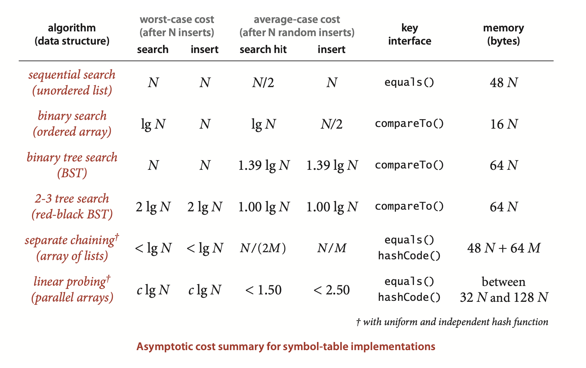
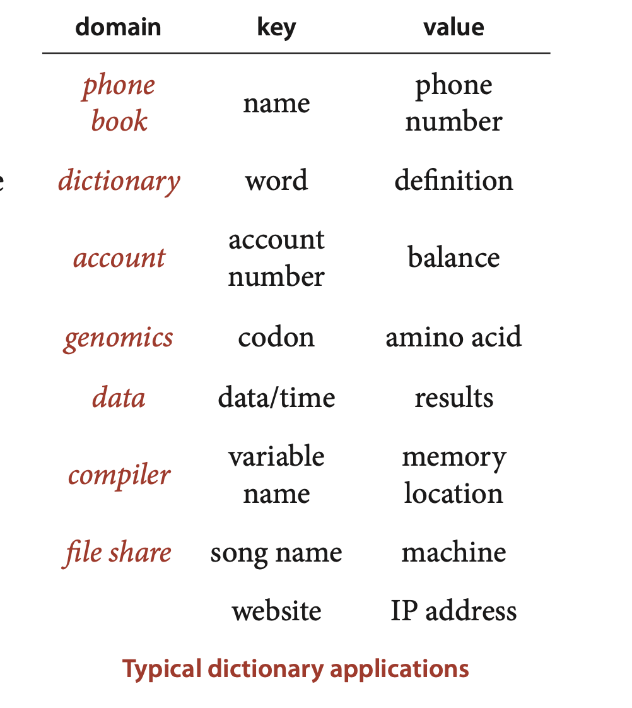
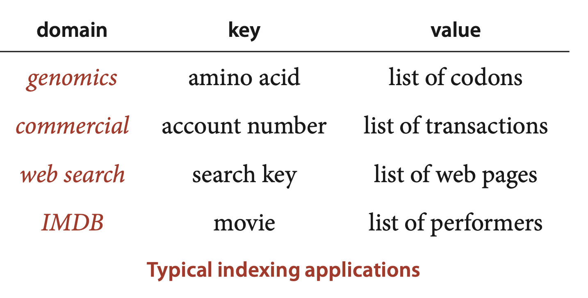
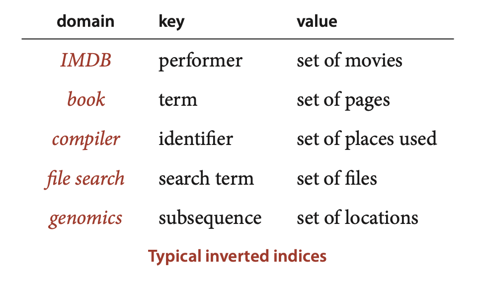
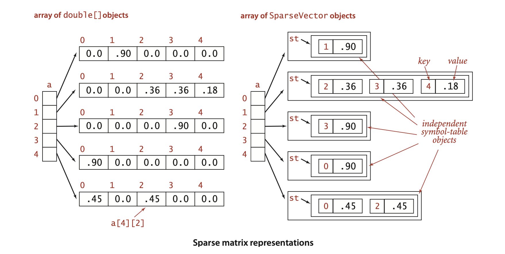

### 3.5 Applications


... symbol tables allowed programmers to progress from using numeric addresses in machine language to using symbolic names in assembly language, ....

It is clear from the table that, for typical applications, your decision comes down to a choice between hash tables and binary search trees.



The advantages of hashing over BST implementations are that the code is simpler and search times are optimal (constant), if the keys are of a standard type or are sufficiently simple that we can be confident of developing an efficient hash function for them that (approximately) satisfies the uniform hashing assumption. The advantages of BSTs over hashing are that they are based on a simpler abstract interface (no hash function need be designed); red-black BSTs can provide guaranteed worst-case performance; and they support a wider range of operations (such as rank, select, sort, and range search). As a rule of thumb, most programmers will use hashing except when one or more of these factors is important, when red-black BSTs are called for.


*Primitive types.* ... Using a primitive type instead of Key would save one reference per key-value pair. When the associated value is also primitive, we can eliminate another reference....


*Duplicate keys.* ... In many
of our implementations, we could consider the alternative of leaving key-value pairs with duplicate keys in the primary search data structure and to return any value with the given key for a search. We might also add methods to return all values with the given key. ...


To illustrate uses of SET, we consider *filter* clients that read a sequence of strings from standard input and write some of them to standard output.

*Dedup.* ... It is customary to refer to this operation as dedup. ... This process takes space proportional to the number of distinct keys in the input stream (which is typically far smaller than the total number of keys).
```java
public class DeDup
{
   public static void main(String[] args)
   {
        HashSET<String> set;
        set = new HashSET<String>();
        while (!StdIn.isEmpty())
        {
            String key = StdIn.readString();
            if (!set.contains(key))
            {
                set.add(key);
                StdOut.println(key);
            } 
        }
    }
}
```
*Whitelist and blacklist.* ... 

```java
public class WhiteFilter
{
   public static void main(String[] args)
   {
        HashSET<String> set;
        set = new HashSET<String>();
        In in = new In(args[0]);
        while (!in.isEmpty())
            set.add(in.readString());
        while (!StdIn.isEmpty())
        {
            String word = StdIn.readString();
            if (set.contains(word))
        } 
    }
}
```
```
% java WhiteFilter list.txt < tinyTale.txt
```





**Dictionary lookup**
```java
public class LookupCSV
{
    public static void main(String[] args)
    {
        In in = new In(args[0]);
        int keyField = Integer.parseInt(args[1]);
        int valField = Integer.parseInt(args[2]);
        ST<String, String> st = new ST<String, String>();
        while (in.hasNextLine())
        {
            String line = in.readLine();
            String[] tokens = line.split(",");
            String key = tokens[keyField];
            String val = tokens[valField];
            st.put(key, val);
        }
        while (!StdIn.isEmpty())
        {
            String query = StdIn.readString();
            if (st.contains(query))
                StdOut.println(st.get(query));
        } 
    }
}
```
```
% java LookupCSV ip.csv 1 0
128.112.136.35
www.cs.princeton.edu

% java LookupCSV amino.csv 0 3
TCC
Serine

% java LookupCSV DJIA.csv 0 3
29-Oct-29
230.07

% java LookupCSV UPC.csv 0 2
0002100001086
Kraft Parmesan
```


**Indexing clients** ... We use the term *index* to describe symbol tables that associate multiple values with each key.




Index (and inverted index) 
```java
public class LookupIndex
{
    public static void main(String[] args)
    {
        In in = new In(args[0]);   // index database
        String sp = args[1];       // separator
        ST<String, Queue<String>> st = new ST<String, Queue<String>>();
        ST<String, Queue<String>> ts = new ST<String, Queue<String>>();
        while (in.hasNextLine())
        {
            String[] a = in.readLine().split(sp);
            String key = a[0];
            for (int i = 1; i < a.length; i++)
            {
                String val = a[i];
                if (!st.contains(key)) st.put(key, new Queue<String>());
                if (!ts.contains(val)) ts.put(val, new Queue<String>());
                st.get(key).enqueue(val);
                ts.get(val).enqueue(key);
            } 
        }
        while (!StdIn.isEmpty())
        {
            String query = StdIn.readLine();
            if (st.contains(query))
                for (String s : st.get(query))
                StdOut.println("  " + s);
            if (ts.contains(query))
                for (String s : ts.get(query))
        } 
    }
}
```

```
% java LookupIndex aminoI.txt ","
Serine
  TCT
  TCA
  TCG
  AGT
  AGC
TCG Serine

% java LookupIndex movies.txt "/"
Bacon, Kevin
  Mystic River (2003)
  Friday the 13th (1980)
  Flatliners (1990)
  Few Good Men, A (1992)
  ...
Tin Men (1987)
  Blumenfeld, Alan
  DeBoy, David
  ...
```

*Inverted index.* 



**File indexing**
```java
import java.io.File;
public class FileIndex
{
    public static void main(String[] args)
        {
        ST<String, SET<File>> st = new ST<String, SET<File>>();
        for (String filename : args)
        {
            File file = new File(filename);
            In in = new In(file);
            while (!in.isEmpty())
            {
                String word = in.readString();
                if (!st.contains(word)) st.put(word, new SET<File>());
                SET<File> set = st.get(word);
                set.add(file);
            } 
        }
        while (!StdIn.isEmpty())
        {
            String query = StdIn.readString();
            if (st.contains(query))
        } 
    }
}
```

```
% java FileIndex ex*.txt
age
    ex3.txt
    ex4.txt 
best
    ex1.txt 
was
    ex1.txt
    ex2.txt
    ex3.txt
    ex4.txt
```


**Sparse vectors** ... matrix-vector multiplication: ... requiring time proportional to N 2, for the N multiplications to compute each of the N entries in the result vector, which also matches the space proportional to N 2 that is required to store the matrix. ... At the time PageRank was developed, that was in the tens or hundreds of billions and it has skyrocketed since, so the value of N 2 would be far more than 10 20. No one can afford that much time or space, so a better algorithm is needed.


... Instead of using the code `a[i][j]` to refer to the element in row `i` and column `j`, we use `a[i].put(j, val)` to set a value in the matrix and `a[i].get(j)` to retrieve a value.  ... More important, it only requires time proportional to N plus the number of nonzero elements in the matrix.

..  To fix ideas, consider a huge application (like the one faced by Brin and Page) where N is 10 billion or 100 billion, but the average number of nonzero elements per row is less than 10. For such an application, using symbol tables speeds up matrix-vector multiplication by a factor of a billion or more.
**Sparse vector with dot product**
```java
public class SparseVector
{
    private HashST<Integer, Double> st;
    public SparseVector()
    {  st = new HashST<Integer, Double>();  }
    public int size()
    {  return st.size();  }
    public void put(int i, double x)
    {  st.put(i, x);  }
    public double get(int i)
    {
        if (!st.contains(i)) return 0.0;
        else return st.get(i);
    }
    public double dot(double[] that)
    {
        double sum = 0.0;
        for (int i : st.keys())
            sum += that[i]*this.get(i);
        return sum;
    }
}
```

```java
SparseVector[] a;
a = new SparseVector[N];
double[] x = new double[N];
double[] b = new double[N];
...
// Initialize a[] and x[].
...
for (int i = 0; i < N; i++)
   b[i] = a[i].dot(x);
```


Building the matrix for the Google application is a graph-processing application (and a symbol-table client!), albeit for a huge sparse matrix. Given the matrix, the PageRank calculation is nothing more than doing a matrix-vector multiplication, replacing the source vector with the result vector, and iterating the process until it converges (as guaranteed by fundamental theorems in probability theory). 
