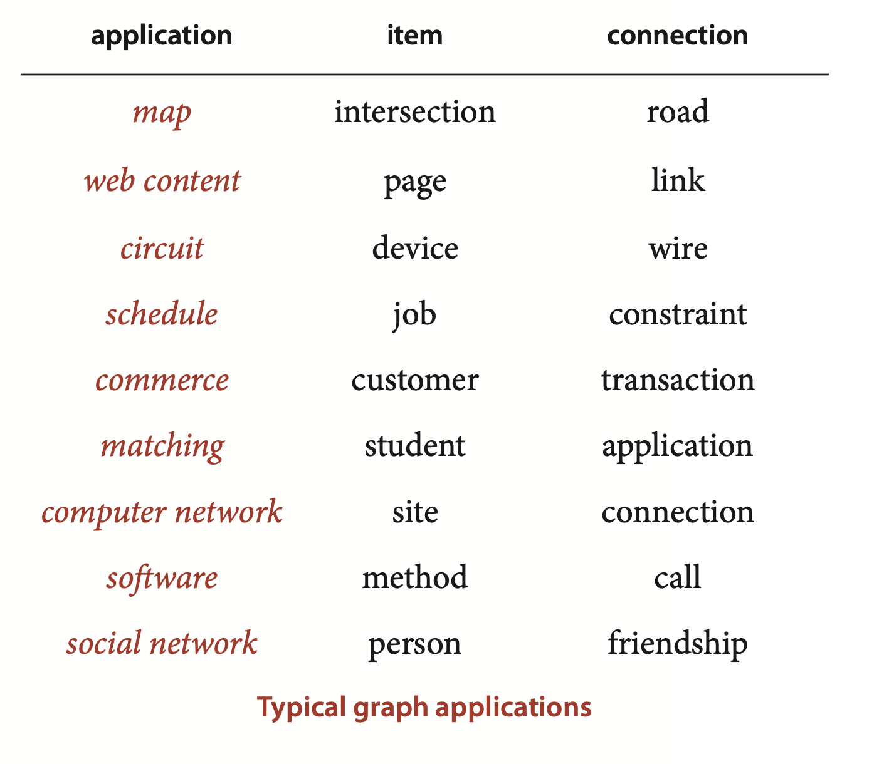
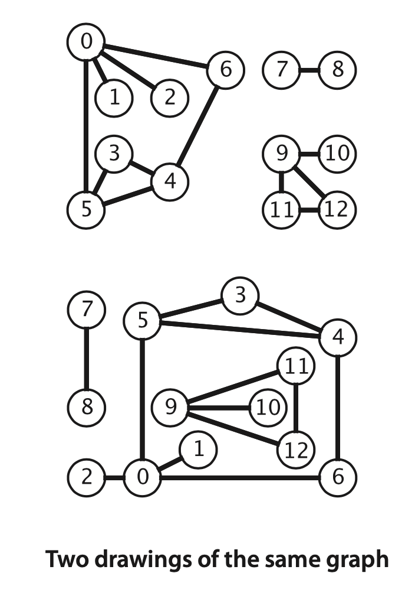
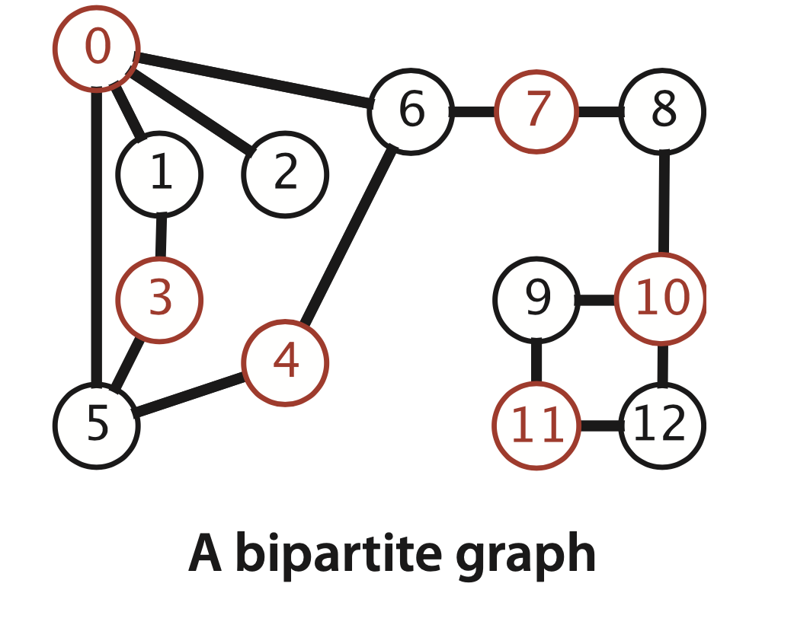
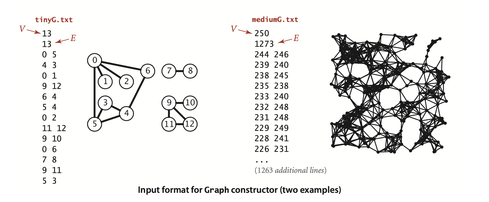
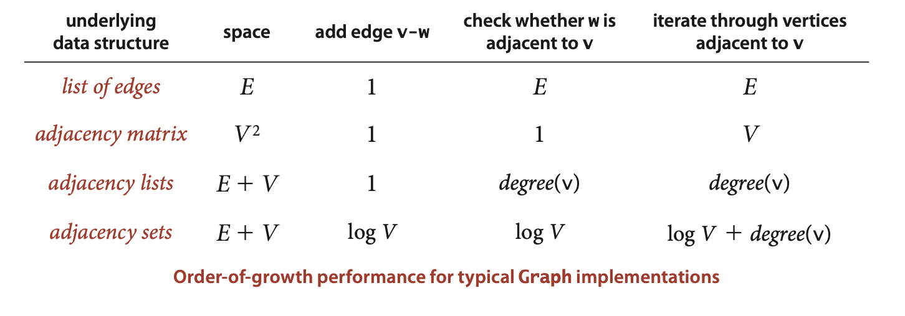
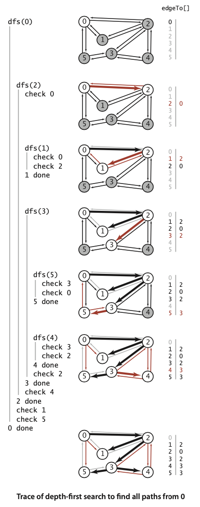
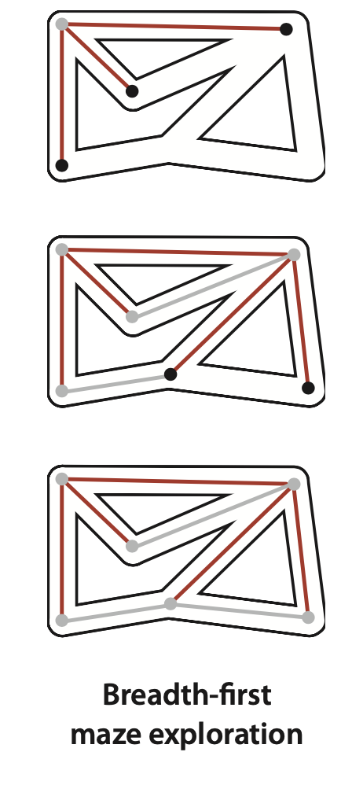

### 4.1 Undirected Graphs



... graph models where *edges* are nothing more than connections between *vertices*. We use the term *undirected graph* ...

**Definition**. A graph is a set of vertices and a collection of edges that each connect a pair of vertices.

By convention, we use the names 0 through $V-1$ for the vertices in a $V$-vertex graph. 



#### Anomalies.

- A self-loop is an edge that connects a vertex to itself.
- Two edges that connect the same pair of vertices are parallel.

Mathematicians sometimes refer to graphs with parallel edges as *multigraphs* and graphs with no parallel edges or self-loops as *simple* graphs. 


When there is an edge connecting two vertices, we say that the vertices are *adjacent* to one another and that the edge is *incident* to both vertices. The *degree* of a vertex is the number of edges incident to it. A *subgraph* is a subset of a graph’s edges (and associated vertices) that constitutes a graph. ... Of particular interest are edges that take us through a *sequence* of vertices in a graph.


**Definition.** A *path* in a graph is a sequence of vertices connected by edges. A *simple path* is one with no repeated vertices. A *cycle* is a path with at least one edge whose first and last vertices are the same. A *simple cycle* is a cycle with no repeated edges or vertices (except the requisite repetition of the first and last vertices). The *length* of a path or a cycle is its number of edges.

Most often, we work with simple cycles and simple paths and drop the simple modifer; when we want to allow repeated ver-
tices, we refer to *general* paths and cycles. We say that one vertex is *connected* to another if there exists a path that contains both of them. We use notation like u-v-w-x to represent a path from u to x and u-v-w-x-u to represent a cycle from u to v to w to x and back to u again. 

**Definition.** A graph is *connected* if there is a path from every vertex to every other vertex in the graph. A graph that is *not connected* consists of a set of *connected components*, which are maximal connected subgraphs.

Intuitively, if the vertices were physical objects, such as knots or beads, and the edges were physical connections, such as strings or wires, a connected graph would stay in one piece if picked up by any vertex, and a graph that is not connected comprises two or more such pieces.

An *acyclic* graph is a graph with no cycles.


**Definition.** A *tree* is an acyclic connected graph. A disjoint set of trees is called a *forest*. A spanning tree of a connected graph is a subgraph that contains all of that graph’s vertices and is a single tree. A *spanning forest* of a graph is the union of spanning trees of its connected components.


...a graph $G$ with $V$ vertices is a tree if and only if it satisfies any of the following five conditions:
- G has $V-1$ edges and no cycles.
- G has $V-1$ edges and is connected.
- G is connected, but removing any edge disconnects it.
- G is acyclic, but adding any edge creates a cycle.
- Exactly one simple path connects each pair of vertices in G.


The *density* of a graph is the proportion of possible pairs of vertices that are connected by edges. A *sparse* graph has relatively few of the possible edges present; a *dense* graph has relatively few of the possible edges missing. Generally, we think of a graph as being sparse if its number of different edges is within a small constant factor of $V$ and as being dense otherwise. ... The applications that we consider nearly always involve sparse graphs.

A *bipartite graph* is a graph whose vertices we can divide into two sets such that all edges connect a vertex in one set with a vertex in the other set.



The second constructor assumes an input format consisting of $2E + 2$ integer values: $V$, then $E$, then $E$ pairs of values between $0$ and $V - 1$, each pair denoting an edge.



**Typical graph-processing code**  

*compute the degree of v*
```java
public static int degree(Graph G, int v)
{
   int degree = 0;
   for (int w : G.adj(v)) degree++;
   return degree;
}
```  
*compute maximum degree*
```java
public static int maxDegree(Graph G)
{
   int max = 0;
   for (int v = 0; v < G.V(); v++)
      if (degree(G, v) > max)
         max = degree(G, v);
    return max; 
}
```

*compute average degree*
```java
public static int avgDegree(Graph G)
{   return 2 * G.E() / G.V();  }
```

*count self-loops*
```java
public static int numberOfSelfLoops(Graph G)
{
    int count = 0;
    for (int v = 0; v < G.V(); v++)
        for (int w : G.adj(v))
            if (v == w) count++;
    return count/2;   // each edge counted twice
}
```

*string representation of the graph’s adjacency lists (instance method in Graph)*
```java
public String toString()
{
    String s = V + " vertices, " + E + " edges\n";
    for (int v = 0; v < V; v++)
    {
        s += v + ": ";
        for (int w : this.adj(v))
            s += w + " ";
        s += "\n";
}
return s; }
```


 ... three data structures that immediately suggest themselves for representing graphs:

- An *adjacency matrix*, where we maintain a $V$-by-$V$ boolean array, with the entry in row $v$ and column $w$ defined to be true if there is an edge adjacent to both vertex $v$ and vertex $w$ in the graph, and to be false otherwise. This representation fails on the first count— graphs with millions of vertices are common and the space cost for the $V^2$ boolean values needed is prohibitive.
- An *array of edges*, using an Edge class with two instance variables of type `int`. This direct representation is simple, but it fails on the second count — implementing `adj()` would involve examining all the edges in the graph.
- An *array of adjacency lists*, where we maintain a vertex-indexed array of lists of the vertices adjacent to each vertex. This data structure satisfies both requirements for typical applications and is the one that we will use throughout this chapter.

... allowing parallel edges precludes the use of an adjacency matrix, since the adjacency matrix has no way to represent them.


#### Adjacency-lists data structure. 
The standard graph representation for graphs that are not dense is called the adjacency-lists data structure, where we keep track of all the vertices adjacent to each vertex on a linked list that is associated with that vertex.  ... To add an edge connecting v and w, we add w to v’s adjacency list and v to w’s adjacency list. 

This Graph implementation achieves the following performance characteristics:
- Space usage proportional to $V + E$
- Constant time to add an edge
- Time proportional to the degree of $v$ to iterate through vertices adjacent to $v$ (constant time per adjacent vertex processed)

... Parallel edges and self-loops are allowed (we do not check for them). ... Many different arrays of adjacency lists can represent the same graph.


**Graph data type**
```java
public class Graph {
    private final int V; // number of vertices
    private int E;       // number of edges
    private Bag<Integer>[] adj; // adjacency lists

    public Graph(int V) {
        this.V = V;
        this.E = 0;
        adj = (Bag<Integer>[]) new Bag[V]; // Create array of lists.
        for (int v = 0; v < V; v++) {      // Initialize all lists
            adj[v] = new Bag<Integer>();   // to empty.
        }
    }

    public Graph(In in) {
        this(in.readInt());     // Read V and construct this graph.
        int E = in.readInt();   // Read E.
        for (int i = 0; i < E; i++) {
            // Add an edge.
            int v = in.readInt();   // Read a vertex,
            int w = in.readInt();   // read another vertex,
            addEdge(v, w);          // and add edge connecting them.
        }
    }

    public int V() {
        return V;
    }

    public int E() {
        return E;
    }

    public void addEdge(int v, int w) {
        adj[v].add(w); // Add w to v's list.
        adj[w].add(v); // Add v to w's list.
        E++;
    }

    public Iterable<Integer> adj(int v) {
        return adj[v];
    }
}
```



> Contributor's Note
> adjacency list is a ST instead of edges array.


##### Design pattern for graph processing. 
Since we consider a large number of graph-processing algorithms, our initial design goal is to decouple our implementations from the graph representation. To do so, we develop, for each given task, a task-specific class so that clients can create objects to perform the task.

**Sample graph-processing client (warmup)**
```java
public class TestSearch
{
    public static void main(String[] args)
    {
        Graph G = new Graph(new In(args[0]));
        int s = Integer.parseInt(args[1]);
        Search search = new Search(G, s);
        for (int v = 0; v < G.V(); v++)
            if (search.marked(v))
                StdOut.print(v + " ");
        StdOut.println();

        if (search.count() != G.V())
            StdOut.print("NOT ");
        StdOut.println("connected"); 
    }
}
```
```
% java TestSearch tinyG.txt 0 
0 1 2 3 4 5 6
NOT connected

% java TestSearch tinyG.txt 9
9 10 11 12
NOT connected
```

#### Depth-first search

```java
public class DepthFirstSearch
{
    private boolean[] marked;
    private int count;
    public DepthFirstSearch(Graph G, int s)
    {
        marked = new boolean[G.V()];
        dfs(G, s); 
    }
    private void dfs(Graph G, int v)
    {
        marked[v] = true;
        count++;
        for (int w : G.adj(v))
            if (!marked[w]) dfs(G, w);
    }
    public boolean marked(int w)
    {   return marked[w];  }
    public int count()
    {   return count;  }
}
```
**Proposition A.** DFS marks all the vertices connected to a given source in time proportional to the sum of their degrees.  
**Proof:** First, we prove that the algorithm marks all the vertices connected to the source s (and no others). Every marked vertex is connected to s, since the algorithm finds vertices only by following edges. Now, suppose that some unmarked vertex w is connected to s. Since s itself is marked, any path from s to w must have at least one edge from the set of marked vertices to the set of unmarked vertices, say v-x. But the algorithm would have discovered x after marking v, so no such edge can exist, a contradiction. The time bound follows because marking ensures that each vertex is visited once (taking time proportional to its degree to check marks).

##### Tracing DFS. 
... DFS traverses each edge in the graph twice, always finding a marked vertex the second time. 


The question “Are two given vertices connected?” is equivalent to the question “Is there a path connecting two given vertices?” and might be named the *path detection* problem. However, the union-find data structures that we considered in Section 1.5 do not address the problems of finding such a path. Depth-first search is the first of several approaches that we consider to solve this problem, as well:


##### Finding paths

**Test client for paths implementations**
```java
public static void main(String[] args)
{
    Graph G = new Graph(new In(args[0]));
    int s = Integer.parseInt(args[1]);
    Paths search = new Paths(G, s);
    for (int v = 0; v < G.V(); v++)
    {
        StdOut.print(s + " to " + v + ": ");
        if (search.hasPathTo(v))
            for (int x : search.pathTo(v))
                if (x == s) StdOut.print(x);
                else StdOut.print("-" + x);
        StdOut.println();
    }
}
```
``` 
java Paths tinyCG.txt 0
0 to 0: 0
0 to 1: 0-2-1
0 to 2: 0-2
0 to 3: 0-2-3
0 to 4: 0-2-3-4
0 to 5: 0-2-3-5
```


**ALGORITHM 4.1 Depth-first search to find paths in a graph**
```java
public class DepthFirstPaths {
    private boolean[] marked; // Has dfs() been called for this vertex?
    private int[] edgeTo;    // last vertex on known path to this vertex
    private final int s;     // source

    public DepthFirstPaths(Graph G, int s) {
        marked = new boolean[G.V()];
        edgeTo = new int[G.V()];
        this.s = s;
        dfs(G, s);
    }

    private void dfs(Graph G, int v) {
        marked[v] = true;
        for (int w : G.adj(v)) {
            if (!marked[w]) {
                edgeTo[w] = v;
                dfs(G, w);
            }
        }
    }

    public boolean hasPathTo(int v) {
        return marked[v];
    }

    public Iterable<Integer> pathTo(int v) {
        if (!hasPathTo(v)) return null;
        Stack<Integer> path = new Stack<Integer>();
        for (int x = v; x != s; x = edgeTo[x]) {
            path.push(x);
        }
        path.push(s);
        return path;
    }
}
```


**Proposition A (continued).** DFS allows us to provide clients with a path from a given source to any marked vertex in time proportional its length.  
**Proof:** By induction on the number of vertices visited, it follows that the `edgeTo[]` array in `DepthFirstPaths` represents a tree rooted at the source. The `pathTo()` method builds the path in time proportional to its length.




#### Breadth-first search

Naturally, we are often interested in solving the following problem:  
*Single-source shortest paths.* Given a graph and a source vertex s, support queries of the form Is there a path from s to a given target vertex v? If so, find a shortest such path (one with a minimal number of edges).  
The classical method for accomplishing this task, called breadth-first search (BFS)... DFS is analogous to one person exploring a maze. BFS is analogous to a group of searchers exploring by fanning out in all directions, each unrolling his or her own ball of string.


ALGORITHM 4.2 Breadth-first search to find paths in a graph 
```java
public class BreadthFirstPaths
{
    private boolean[] marked; // Is a shortest path to this vertex known?
    private int[] edgeTo;     // last vertex on known path to this vertex
    private final int s;      // source
    public BreadthFirstPaths(Graph G, int s)
    {
        marked = new boolean[G.V()];
        edgeTo = new int[G.V()];
        this.s = s;
        bfs(G, s);
    }
    private void bfs(Graph G, int s)
    {
        Queue<Integer> queue = new Queue<Integer>();
        marked[s] = true;          // Mark the source
        queue.enqueue(s);          //   and put it on the queue.
        while (!q.isEmpty()) // Contributor's Note: typo: !queque.isEmpty
        {
            int v = queue.dequeue(); // Remove next vertex from the queue.
            for (int w : G.adj(v))
                if (!marked[w])       // For every unmarked adjacent vertex,
                {
                    edgeTo[w] = v;     // save last edge on a shortest path,
                    marked[w] = true;  // save last edge on a shortest path,
                    queue.enqueue(w);  // and add it to the queue.
                } 
        }
    }
    public boolean hasPathTo(int v)
    {   return marked[v];  }
    public Iterable<Integer> pathTo(int v)
        // Same as for DFS (see page 536).
}
```

**Proposition B.** For any vertex v reachable from s, BFS computes a shortest path from s to v (no path from s to v has fewer edges).  
**Proof:** It is easy to prove by induction that the queue always consists of zero or more vertices of distance $k$ from the source, followed by zero or more vertices of distance $k+1$ from the source, for some integer $k$, starting with $k$ equal to 0. This property implies, in particular, that vertices enter and leave the queue in order of their distance from s. When a vertex v enters the queue, no shorter path to v will be found before it comes off the queue, and no path to v that is discovered after it comes off the queue can be shorter than v’s tree path length.

**Proposition B (continued).** BFS takes time proportional to $V+E$ in the worst case.
**Proof:** As for Proposition A(page531),BFS marks all the vertices connected to s in time proportional to the sum of their degrees. If the graph is connected, this sum is the sum of the degrees of all the vertices, or $2E$.


##### Connected components 

**Test client for connected components API**
```java
public static void main(String[] args)
{
    Graph G = new Graph(new In(args[0]));
    CC cc = new CC(G);
    int M = cc.count();
    StdOut.println(M + " components");

    Bag<Integer>[] components;
    components = (Bag<Integer>[]) new Bag[M];
    for (int i = 0; i < M; i++)
        components[i] = new Bag<Integer>();
    for (int v = 0; v < G.V(); v++)
        components[cc.id(v)].add(v);
    for (int i = 0; i < M; i++)
    {
        for (int v: components[i])
            StdOut.print(v + " ");
        StdOut.println();
    }
}
```

**ALGORITHM 4.3 Depth-first search to find connected components in a graph**
```java
public class CC {
    private boolean[] marked;
    private int[] id;
    private int count;

    public CC(Graph G) {
        marked = new boolean[G.V()];
        id = new int[G.V()];
        for (int s = 0; s < G.V(); s++) {
            if (!marked[s]) {
                dfs(G, s);
                count++;
            }
        }
    }

    private void dfs(Graph G, int v) {
        marked[v] = true;
        id[v] = count;
        for (int w : G.adj(v)) {
            if (!marked[w]) {
                dfs(G, w);
            }
        }
    }

    public boolean connected(int v, int w) {
        return id[v] == id[w];
    }

    public int id(int v) {
        return id[v];
    }

    public int count() {
        return count;
    }
}
```
```
% more tinyG.txt
13 vertices, 13 edges
0: 6 2 1 5
1: 0
2: 0
3: 5 4
4: 5 6 3
5: 3 4 0
6: 0 4
7: 8
8: 7
9: 11 10 12
10: 9
11: 9 12
12: 11 9

% java CC tinyG.txt 
3 components 
6 5 4 3 2 1 0
8 7
12 11 10 9
```


**Proposition C.** DFS uses preprocessing time and space proportional to $V+E$ to support constant-time connectivity queries in a graph.  
Proof: Immediate from the code. Each adjacency-list entry is examined exactly once, and there are $2E$ such entries (two for each edge). Instance methods examine or return one or two instance variables.


In theory, DFS is faster than union-find because it provides a constant-time guarantee, which union-find does not; in practice, this difference is negligible, and union-find is faster because it does not have to build a full representation of the graph. More important, union-find is an online algorithm (we can check whether two vertices are connected in near-constant time at any point, even while adding edges), whereas the DFS solution must first preprocess the graph. Therefore, for example, we prefer union-find when determining connectivity is our only task or when we have a large number of queries intermixed with edge insertions but may find the DFS solution more appropriate for use in a graph ADT because it makes efficient use of existing infrastructure.


*is G acyclic? (assumes no self-loops or parallel edges)*
```java
public class Cycle
{
    private boolean[] marked;
    private boolean hasCycle;
    public Cycle(Graph G)
    {
        marked = new boolean[G.V()];
        for (int s = 0; s < G.V(); s++)
            if (!marked[s])
            dfs(G, s, s);
    }

    private void dfs(Graph G, int v, int u)
    {
        marked[v] = true;
        for (int w : G.adj(v))
            if (!marked[w])
                dfs(G, w, v);
        else if (w != u) hasCycle = true;
    }
    public boolean hasCycle()
    {  return hasCycle;  }
}
```
>Contributor's Note:  
>  Every revisit to w implies a cycle unless it comes from a child of w.

*is G bipartite? (two-colorable)*
```java
public class TwoColor
{
    private boolean[] marked;
    private boolean[] color;
    private boolean isTwoColorable = true;
    public TwoColor(Graph G)
    {
        marked = new boolean[G.V()];
        color = new boolean[G.V()];
        for (int s = 0; s < G.V(); s++)
            if (!marked[s])
        dfs(G, s);
    }
    private void dfs(Graph G, int v)
    {
        marked[v] = true;
        for (int w : G.adj(v))
        if (!marked[w])
        {
            color[w] = !color[v];
            dfs(G, w); 
        }
        else if (color[w] == color[v]) isTwoColorable = false;
    }
    public boolean isBipartite()
    {   return isTwoColorable;  }
}
```

**Test client for symbol graph API**
```java
public static void main(String[] args)
{
    String filename = args[0];
    String delim = args[1];
    SymbolGraph sg = new SymbolGraph(filename, delim);
    Graph G = sg.G();
    while (StdIn.hasNextLine())
    {
        String source = StdIn.readLine();
        for (int w : G.adj(sg.index(source)))
            StdOut.println("   " + sg.name(w));
    } 
}
```
```
% java SymbolGraph routes.txt " "
JFK
    ORD 
    ATL 
    MCO
LAX 
    LAS
    PHX
```

... This client immediately provides the useful inverted index functionality that we considered in Section 3.5.


```java
public class SymbolGraph
{
    private ST<String, Integer> st;    // String -> index
    private String[] keys;             // index -> String
    private Graph G;                   // the graph

    public SymbolGraph(String stream, String sp)
    {
        st = new ST<String, Integer>();
        In in = new In(stream);        // First pass
        while (in.hasNextLine())       // builds the index
        {
            String[] a = in.readLine().split(sp);   // by reading strings
            for (int i = 0; i < a.length; i++)      // to associate each        
                if (!st.contains(a[i]))             // distinct string
                    st.put(a[i], st.size());        // with an index.
        }                                       

        keys = new String[st.size()];   // Inverted index
        for (String name : st.keys())   // to get string keys
            keys[st.get(name)] = name;  // is an array.

        G = new Graph(st.size());       // Second pass
        in = new In(stream);            // builds the graph
        while (in.hasNextLine())
        {
            String[] a = in.readLine().split(sp);
            int v = st.get(a[0]);
            for (int i = 1; i < a.length; i++)
                G.addEdge(v, st.get(a[i])); // by connecting the
        }                                   // first vertex
    }                                       // on each line
                                            // to all the others.

    public boolean contains(String s) { return st.contains(s); }
    public int index(String s)        { return st.get(s);    }
    public String name(int v)         { return keys[v];      }
    public Graph G()                  { return G;            }
}
```


##### Degrees of separation. 


```java
Degrees of separation
public class DegreesOfSeparation
{
    public static void main(String[] args)
    {
        SymbolGraph sg = new SymbolGraph(args[0], args[1]);
        Graph G = sg.G();

        String source = args[2];
        if (!sg.contains(source))
        {  StdOut.println(source + " not in database."); return;  }

        int s = sg.index(source);
        BreadthFirstPaths bfs = new BreadthFirstPaths(G, s);

        while (!StdIn.isEmpty())
        {
            String sink = StdIn.readLine();
            if (sg.contains(sink))
            {
                int t = sg.index(sink);
                if (bfs.hasPathTo(t))
                    for (int v : bfs.pathTo(t))
                    StdOut.println("   " + sg.name(v));
                else StdOut.println("Not connected");
            }
            else StdOut.println("Not in database.");
        }
    } 
}

```
```
% java DegreesOfSeparation routes.txt " " JFK
LAS
    JFK
    ORD
    PHX
    LAS
DFW 
    JFK
    ORD 
    DFW
```
```
% java DegreesOfSeparation movies.txt "/" "Animal House (1978)"
Titanic (1997)
    Animal House (1978)
    Allen, Karen (I)
    Raiders of the Lost Ark (1981)
    Taylor, Rocky (I)
    Titanic (1997)
To Catch a Thief (1955)
    Animal House (1978)
    Vernon, John (I)
    Topaz (1969)
    Hitchcock, Alfred (I)
    To Catch a Thief (1955)
```
