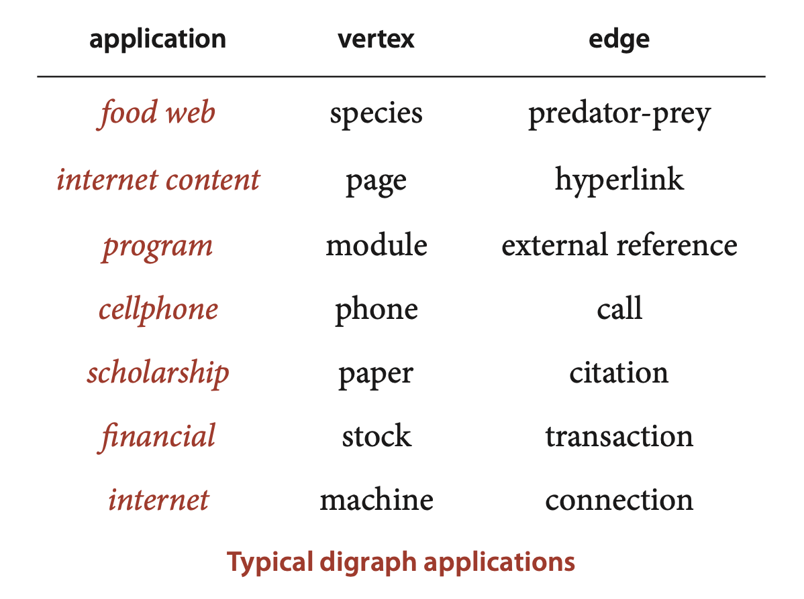
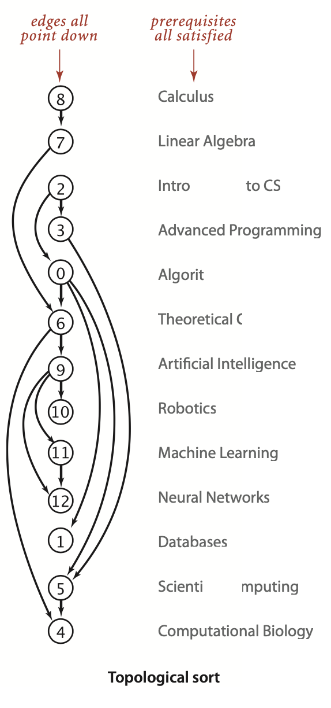
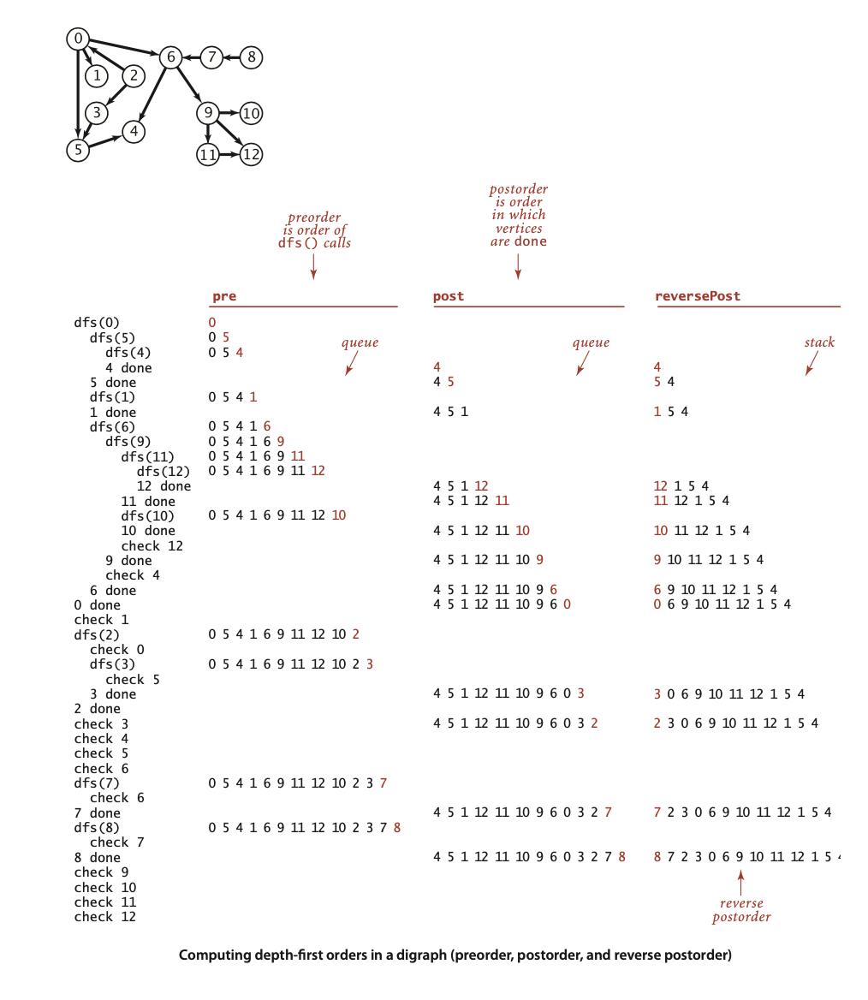

### 4.2 Directed Graphs



Definition. A *directed graph* (or digraph) is a set of *vertices* and a collection of *directed edges*. Each directed edge connects an ordered pair of vertices.


We say that a directed edge *points* from the first vertex in the pair and *points* to the second vertex in the pair. The *outdegree* of a vertex in a digraph is the number of edges going from it; the *indegree* of a vertex is the number of edges going to it. ... The first vertex in a directed edge is called its *head*; the second vertex is called its *tail*. 

**Definition.** A *directed path* in a digraph is a sequence of vertices in which there is a (directed) edge pointing from each vertex in the sequence to its successor in the sequence. A *directed cycle* is a directed path with at least one edge whose first and last vertices are the same. A *simple cycle* is a cycle with no repeated edges or vertices (except the requisite repetition of the first and last vertices). The *length* of a path or a cycle is its number of edges.


We say that a vertex w is *reachable* from a vertex v if there is a directed path from v to w. Also, we adopt the convention that each vertex is reachable from itself. Except for this case, the fact that w is reachable from v in a digraph indicates nothing about whether v is reachable from w. 


**Directed graph (digraph) data type**
```java
public class Digraph {
    private final int V;
    private int E;
    private Bag<Integer>[] adj;

    public Digraph(int V) {
        this.V = V;
        this.E = 0;
        adj = (Bag<Integer>[]) new Bag[V];
        for (int v = 0; v < V; v++) {
            adj[v] = new Bag<Integer>();
        }
    }

    public int V() {
        return V;
    }

    public int E() {
        return E;
    }

    public void addEdge(int v, int w) {
        adj[v].add(w);
        E++;
    }

    public Iterable<Integer> adj(int v) {
        return adj[v];
    }

    public Digraph reverse() {
        Digraph R = new Digraph(V);
        for (int v = 0; v < V; v++) {
            for (int w : adj(v)) {
                R.addEdge(w, v);
            }
        }
        return R;
    }
}
```


#### Reachability in digraphs
**Proposition D.** DFS marks all the vertices in a digraph reachable from a given seto f sources in time proportional to the sum of the outdegrees of the vertices marked.
**Proof:** Same as Proposition A on page 531.

**ALGORITHM 4.4 Reachability in digraphs**
```java
Public class DirectedDFS
{
    private boolean[] marked;

    public DirectedDFS(Digraph G, int s)
    {
        marked = new boolean[G.V()];
        dfs(G, s); 
    }
    public DirectedDFS(Digraph G, Iterable<Integer> sources)
    {
        marked = new boolean[G.V()];
        for (int s : sources)
            if (!marked[s]) dfs(G, s);
    }
    private void dfs(Digraph G, int v)
    {
        marked[v] = true;
        for (int w : G.adj(v))
            if (!marked[w]) dfs(G, w);
    }
    public boolean marked(int v)
    {   return marked[v];  }
    public static void main(String[] args)
    {
        Digraph G = new Digraph(new In(args[0]));
       
        Bag<Integer> sources = new Bag<Integer>();
        for (int i = 1; i < args.length; i++)
            sources.add(Integer.parseInt(args[i]));
       
        DirectedDFS reachable = new DirectedDFS(G, sources);
        
        for (int v = 0; v < G.V(); v++)
            if (reachable.marked(v)) StdOut.print(v + " ");
        StdOut.println();
    }
}
```
```
% java DirectedDFS tinyDG.txt 1
1

% java DirectedDFS tinyDG.txt 2 
0 1 2 3 4 5

% java DirectedDFS tinyDG.txt 1 2 6
0 1 2 3 4 5 6 9 10 11 12
```

##### Mark-and-sweep garbage collection. 
An important application of multiple-source reachability is found in typical memory-management systems, including many implementations of Java. A digraph where each vertex represents an object and each edge represents a reference to an object is an appropriate model for the memory usage of a running Java program. At any point in the execution of a program, certain objects are known to be directly accessible, and any object not reachable from that set of objects can be returned to available memory. A markand-sweep garbage collection strategy reserves one bit per object for the purpose of garbage collection, then periodically *marks* the set of potentially accessible objects by running a digraph reachability algorithm like DirectedDFS and *sweeps* through all objects, collecting the unmarked ones for use for new object


##### Finding paths in digraphs.

*Single-source directed paths.* Given a digraph and a source vertex s, support queries of the form Is there a directed path from s to a given target vertex v? If so, find such a path.
```java
public class DepthFirstDirectedPaths {
    private boolean[] marked;  // marked[v] = true iff v is reachable from s
    private int[] edgeTo;      // edgeTo[v] = last edge on path from s to v
    private final int s;       // source vertex
    
    public DepthFirstDirectedPaths(Digraph G, int s) {
        marked = new boolean[G.V()];
        edgeTo = new int[G.V()];
        this.s = s;
        validateVertex(s);
        dfs(G, s);
    }

    private void dfs(Digraph G, int v) {
        marked[v] = true;
        for (int w : G.adj(v)) {
            if (!marked[w]) {
                edgeTo[w] = v;
                dfs(G, w);
            }
        }
    }

    public boolean hasPathTo(int v) {
        validateVertex(v);
        return marked[v];
    }
    public Iterable<Integer> pathTo(int v) {
        validateVertex(v);
        if (!hasPathTo(v)) return null;
        Stack<Integer> path = new Stack<Integer>();
        for (int x = v; x != s; x = edgeTo[x])
            path.push(x);
        path.push(s);
        return path;
    }

    // throw an IllegalArgumentException unless {@code 0 <= v < V}
    private void validateVertex(int v) {
        int V = marked.length;
        if (v < 0 || v >= V)
            throw new IllegalArgumentException("vertex " + v + " is not between 0 and " + (V-1));
    }

    public static void main(String[] args) {
        In in = new In(args[0]);
        Digraph G = new Digraph(in);
        // StdOut.println(G);

        int s = Integer.parseInt(args[1]);
        DepthFirstDirectedPaths dfs = new DepthFirstDirectedPaths(G, s);

        for (int v = 0; v < G.V(); v++) {
            if (dfs.hasPathTo(v)) {
                StdOut.printf("%d to %d:  ", s, v);
                for (int x : dfs.pathTo(v)) {
                    if (x == s) StdOut.print(x);
                    else        StdOut.print("-" + x);
                }
                StdOut.println();
            }

            else {
                StdOut.printf("%d to %d:  not connected\n", s, v);
            }

        }
    }

}
```
```
% java DepthFirstDirectedPaths tinyDG.txt 3
3 to 0:  3-5-4-2-0
3 to 1:  3-5-4-2-0-1
3 to 2:  3-5-4-2
3 to 3:  3
3 to 4:  3-5-4
3 to 5:  3-5
3 to 6:  not connected
3 to 7:  not connected
3 to 8:  not connected
3 to 9:  not connected
3 to 10:  not connected
3 to 11:  not connected
3 to 12:  not connected
```


*Single-source shortest directed paths.* Given a digraph and a source vertex s, support queries of the form Is there a directed path from s to a given target vertex v? If so, find a shortest such path (one with a minimal number of edges).
```java
public class BreadthFirstDirectedPaths {
    private static final int INFINITY = Integer.MAX_VALUE;
    private boolean[] marked;  // marked[v] = is there an s->v path?
    private int[] edgeTo;      // edgeTo[v] = last edge on shortest s->v path
    private int[] distTo;      // distTo[v] = length of shortest s->v path

    public BreadthFirstDirectedPaths(Digraph G, int s) {
        marked = new boolean[G.V()];
        distTo = new int[G.V()];
        edgeTo = new int[G.V()];
        for (int v = 0; v < G.V(); v++)
            distTo[v] = INFINITY;
        validateVertex(s);
        bfs(G, s);
    }

    public BreadthFirstDirectedPaths(Digraph G, Iterable<Integer> sources) {
        marked = new boolean[G.V()];
        distTo = new int[G.V()];
        edgeTo = new int[G.V()];
        for (int v = 0; v < G.V(); v++)
            distTo[v] = INFINITY;
        validateVertices(sources);
        bfs(G, sources);
    }

    // BFS from single source
    private void bfs(Digraph G, int s) {
        Queue<Integer> q = new Queue<Integer>();
        marked[s] = true;
        distTo[s] = 0;
        q.enqueue(s);
        while (!q.isEmpty()) {
            int v = q.dequeue();
            for (int w : G.adj(v)) {
                if (!marked[w]) {
                    edgeTo[w] = v;
                    distTo[w] = distTo[v] + 1;
                    marked[w] = true;
                    q.enqueue(w);
                }
            }
        }
    }

    // BFS from multiple sources
    private void bfs(Digraph G, Iterable<Integer> sources) {
        Queue<Integer> q = new Queue<Integer>();
        for (int s : sources) {
            marked[s] = true;
            distTo[s] = 0;
            q.enqueue(s);
        }
        while (!q.isEmpty()) {
            int v = q.dequeue();
            for (int w : G.adj(v)) {
                if (!marked[w]) {
                    edgeTo[w] = v;
                    distTo[w] = distTo[v] + 1;
                    marked[w] = true;
                    q.enqueue(w);
                }
            }
        }
    }

    public boolean hasPathTo(int v) {
        validateVertex(v);
        return marked[v];
    }

    public int distTo(int v) {
        validateVertex(v);
        return distTo[v];
    }

    public Iterable<Integer> pathTo(int v) {
        validateVertex(v);

        if (!hasPathTo(v)) return null;
        Stack<Integer> path = new Stack<Integer>();
        int x;
        for (x = v; distTo[x] != 0; x = edgeTo[x])
            path.push(x);
        path.push(x);
        return path;
    }

    // throw an IllegalArgumentException unless {@code 0 <= v < V}
    private void validateVertex(int v) {
        int V = marked.length;
        if (v < 0 || v >= V)
            throw new IllegalArgumentException("vertex " + v + " is not between 0 and " + (V-1));
    }

    // throw an IllegalArgumentException if vertices is null, has zero vertices,
    // or has a vertex not between 0 and V-1
    private void validateVertices(Iterable<Integer> vertices) {
        if (vertices == null) {
            throw new IllegalArgumentException("argument is null");
        }
        int vertexCount = 0;
        for (Integer v : vertices) {
            vertexCount++;
            if (v == null) {
                throw new IllegalArgumentException("vertex is null");
            }
            validateVertex(v);
        }
        if (vertexCount == 0) {
            throw new IllegalArgumentException("zero vertices");
        }
    }
    public static void main(String[] args) {
        In in = new In(args[0]);
        Digraph G = new Digraph(in);
        // StdOut.println(G);

        int s = Integer.parseInt(args[1]);
        BreadthFirstDirectedPaths bfs = new BreadthFirstDirectedPaths(G, s);

        for (int v = 0; v < G.V(); v++) {
            if (bfs.hasPathTo(v)) {
                StdOut.printf("%d to %d (%d):  ", s, v, bfs.distTo(v));
                for (int x : bfs.pathTo(v)) {
                    if (x == s) StdOut.print(x);
                    else        StdOut.print("->" + x);
                }
                StdOut.println();
            }

            else {
                StdOut.printf("%d to %d (-):  not connected\n", s, v);
            }

        }
    }
}
```
```
% java BreadthFirstDirectedPaths tinyDG.txt 3
3 to 0 (2):  3->2->0
3 to 1 (3):  3->2->0->1
3 to 2 (1):  3->2
3 to 3 (0):  3
3 to 4 (2):  3->5->4
3 to 5 (1):  3->5
3 to 6 (-):  not connected
3 to 7 (-):  not connected
3 to 8 (-):  not connected
3 to 9 (-):  not connected
3 to 10 (-):  not connected
3 to 11 (-):  not connected
3 to 12 (-):  not connected
 ```


#### Cycles and DAGs 

##### Scheduling problems. 


*Precedence-constrained scheduling.* Given a set of jobs to be completed, with precedence constraints that specify that certain jobs have to be completed before certain other jobs are begun, how can we schedule the jobs such that they are all completed while still respecting the constraints?


*Topological sort.* Topological sort. Given a digraph, put the vertices in order such that all its directed edges point from a vertex earlier in the order to a vertex later in the order (or report that doing so is not possible).



... the student can satisfy all course prerequisites by taking the courses in this order. This application is typical—some other representative applications are listed in the table below.


##### Cycles in digraphs.
... In general, if a precedence-constrained scheduling problem has a directed cycle, then there is no feasible solution. 

*Directed cycle detection.* Does a given digraph have a directed cycle? If so, find the vertices on some such cycle, in order from some vertex back to itself.


**Definition.** A directed acyclic graph (DAG) is a digraph with no directed cycles.

**Finding a directed cycle**
```java
public class DirectedCycle
{
    private boolean[] marked;
    private int[] edgeTo;
    private Stack<Integer> cycle;           // vertices on a cycle (if one exists)
    private boolean[] onStack;              // vertices on recursive call stack
    
    public DirectedCycle(Digraph G)
    {
        onStack = new boolean[G.V()];
        edgeTo  = new int[G.V()];
        marked  = new boolean[G.V()];
        for (int v = 0; v < G.V(); v++)
            if (!marked[v]) dfs(G, v);
    }
    private void dfs(Digraph G, int v)
    {
        onStack[v] = true;
        marked[v] = true;
        for (int w : G.adj(v))
            if (this.hasCycle()) return;
            else if (!marked[w])
            {   edgeTo[w] = v; dfs(G, w);  }
            else if (onStack[w])
            {
                cycle = new Stack<Integer>();
                for (int x = v; x != w; x = edgeTo[x])
                    cycle.push(x);
                cycle.push(w);
                cycle.push(v);
            }
        onStack[v] = false;
    }
    
    public boolean hasCycle()
    {   return cycle != null;  }
    
    public Iterable<Integer> cycle()
    {   return cycle;  }
}
```

>Contirbutor's Note:  
> this is not necessarily a directed cycle.
>      A  
>   /     \  
>  B       D  
>   \     /  
>      C  
> If w is onStack, then there’s a path from w → … → v in the stack, and now you’ve found an edge v -> w.


**Proposition E.** A digraph has a topological order if and only if it is a DAG.  
**Proof:** If the digraph has a directed cycle, it has no topological order. Conversely, the algorithm that we are about to examine computes a topological order for any given DAG.


**Depth-first search vertex ordering in a digraph**
```java
public class DepthFirstOrder
{
    private boolean[] marked;
    private Queue<Integer> pre;          // vertices in pretorder 
    private Queue<Integer> post;         // vertices in postorder 
    private Stack<Integer> reversePost;  // vertices in reverse postorder
    public DepthFirstOrder(Digraph G)
    {
        pre           = new Queue<Integer>();
        post          = new Queue<Integer>();
        reversePost   = new Stack<Integer>();
        marked  = new boolean[G.V()];
        for (int v = 0; v < G.V(); v++)
            if (!marked[v]) dfs(G, v);
    }
    private void dfs(Digraph G, int v)
    {
        pre.enqueue(v);
        marked[v] = true;
        for (int w : G.adj(v))
            if (!marked[w])
                dfs(G, w);
        post.enqueue(v);
        reversePost.push(v);
    }
    public Iterable<Integer> pre()
    {   return pre;  }
    public Iterable<Integer> post()
    {   return post;  }
    public Iterable<Integer> reversePost()
    {   return reversePost;  }
}
```


**Proposition F**. Reverse post order in a DAG is a topological sort.  
**Proof:** Consider any edge v->w. One of the following three cases must hold when dfs(v) is called (see the diagram on page 583):
- dfs(w) has already been called and has returned (w is marked).
- dfs(w) has not yet been called (w is unmarked), so v->w will cause dfs(w) to
be called (and return), either directly or indirectly, before dfs(v) returns.
- dfs(w) has been called and has not yet returned when dfs(v) is called. The
key to the proof is that this case is impossible in a DAG, because the recursive call chain implies a path from w to v and v->w would complete a directed cycle.  

In the two possible cases, dfs(w) is done before dfs(v), so w appears before v in postorder and after v in reverse postorder. Thus, each edge v->w points from a vertex earlier in the order to a vertex later in the order, as desired.

```
% more jobs.txt
Algorithms/Theoretical CS/Databases/Scientific Computing
Introduction to CS/Advanced Programming/Algorithms
Advanced Programming/Scientific Computing
Scientific Computing/Computational Biology
Theoretical CS/Computational Biology/Artificial Intelligence
Linear Algebra/Theoretical CS
Calculus/Linear Algebra
Artificial Intelligence/Neural Networks/Robotics/Machine Learning
Machine Learning/Neural Networks

% java Topological jobs.txt "/"
Calculus
Linear Algebra
Introduction to CS
Advanced Programming
Algorithms
Theoretical CS
Artificial Intelligence
Robotics
Machine Learning
Neural Networks
Databases
Scientific Computing
Computational Biology
```


**ALGORITHM 4.5 Topological sort**

```java
public class Topological
{
    private Iterable<Integer> order;    // topological order
    public Topological(Digraph G)
    {
        DirectedCycle cyclefinder = new DirectedCycle(G);
        if (!cyclefinder.hasCycle())
        {
            DepthFirstOrder dfs = new DepthFirstOrder(G);
            order = dfs.reversePost();
        }
    }
    public Iterable<Integer> order()
    {   return order;  }
    public boolean isDAG()
    {   return order == null;  }
    public static void main(String[] args)
    {
        String filename = args[0];
        String separator = args[1];
        SymbolDigraph sg = new SymbolDigraph(filename, separator);
        Topological top = new Topological(sg.G());
        for (int v : top.order())
        StdOut.println(sg.name(v));
    } 
}
```


**Proposition G.** With DFS, we can topologically sort a DAG in time proportional to $V+E$.
**Proof:** Immediate from the code. It uses one depth-first search to ensure that the graph has no directed cycles, and another to do the reverse postorder ordering. Both involve examining all the edges and all the vertices, and thus take time proportional to $V+E$.


**Definition.** Two vertices v and w are *strongly connected* if they are mutually reachable: that is, if there is a directed path from v to w and a directed path from w to v. A digraph is *strongly connected* if all its vertices are strongly connected to one another.

... it is easy to see that two vertices are strongly connected if and only if there exists a general directed cycle that contains them both. (Proof : compose the paths from v to w and from w to v.)


##### Strong components. 
Like connectivity in undirected graphs, strong connectivity in digraphs is an equivalence relation on the set of vertices, as it has the following properties:
- *Reflexive:* Every vertex v is strongly connected to itself.
- *Symmetric:* If v is strongly connected to w, then w is strongly connected to v.
- *Transitive:* If v is strongly connected to w and w is strongly connected to x, then v

is also strongly connected to x.

... The equivalence classes are maximal subsets of vertices that are strongly connected to one another, with each vertex in exactly one subset. We refer to these subsets as *strongly connected components*, or *strong components* for short. ... A digraph with V vertices has between 1 and V strong components ...

##### Examples of applications.
... For example, strong components can help textbook authors decide which topics should be grouped together and software developers decide how to organize program modules. ... Strong components in such digraphs can help ecologists understand energy flow in the food web. The figure on page 591 shows a digraph model of web content, where vertices represent pages and edges represent hyperlinks from one page to another. Strong components in such a digraph can help network engineers partition the huge number of pages on the web into more manageable sizes for processing.

#### Kosaraju’s algorithm.
... How can we efficiently compute strong components in digraphs?


**ALGORITHM 4.6 Kosaraju’s algorithm for computing strong components** 
```java
public class KosarajuSCC
{
    private boolean[] marked;       // reached vertices
    private int[] id;               // component identifiers
    private int count;              // number of strong components
    
    public KosarajuSCC(Digraph G)
    {
        marked = new boolean[G.V()];
        id = new int[G.V()];
        DepthFirstOrder order = new DepthFirstOrder(G.reverse());
        for (int s : order.reversePost())
            if (!marked[s])
            {  dfs(G, s); count++;  }
    }
    private void dfs(Digraph G, int v)
    {
        marked[v] = true;
        id[v] = count;
        for (int w : G.adj(v))
        if (!marked[w])
            dfs(G, w);
    }
    public boolean stronglyConnected(int v, int w)
    {   return id[v] == id[w];  }
    public int id(int v)
    {   return id[v];  }
    public int count()
    {   return count;  }
}
```
```
% java KosarajuSCC tinyDG.txt 
5 components
1
0 5 4 3 2
11 12 9 10
6
8 7
```


**Proposition H.** In a DFS of a digraph G where marked vertices are considered in reverse postorder given by a DFS of the digraph’s reverse G R (Kosaraju’s algorithm), the vertices reached in each call of the recursive method from the constructor are in a strong component.
**Proof:** First, we prove by contradiction that every vertex v that is strongly connected to s is reached by the call dfs(G, s) in the constructor. Suppose a vertex v that is stronglyconnectedtosisnotreachedbydfs(G, s).Sincethereisapathfromsto v, v must have been previously marked. But then, since there is a path from v to s, s would have been marked during the call dfs(G, v) and the constructor would not call dfs(G, s), a contradiction.

Second, we prove that every vertex v reached by the call dfs(G, s) in the constructor is strongly connected to s.Let v be a vertex reached by the call dfs(G, s).Then, there is a path from s to v in $G$, so it remains only to prove that there is a path from v to s in $G$. This statement is equivalent to saying that there is a path from s to v in $G^R$, so it remains only to prove that there is a path from s to v in $G^R$.
The crux of the proof is that the reverse postorder construction implies that dfs(G, v) must have been done before dfs(G, s)during the DFS of $G^R$,leaving just two cases to consider for dfs(G, v):it might have been called
- *before* dfs(G, s) was called (and also done before dfs(G, s) was called)
- *after* dfs(G, s) was called (and done before dfs(G, s) was done)

The first of these is not possible because there is a path from v to s in $G^R$; the second implies that there is a path from s to v in $G^R$, completing the proof.

>Contributor's Note:  
> Every $v$ whose `dfs(G,v)` starts before `dfs(G,s)` finishes is reachable from $s$.


**Proposition I.** Kosaraju’s algorithm uses preprocessing time and space proportional to $V+E$ to support constant-time strong connectivity queries in a digraph.  
**Proof:** The algorithm computes the reverse of the digraph and does two depth-first searches. Each of these three steps takes time proportional to $V+E$. The reverse copy of the digraph uses space proportional to $V+E$.


**Definition.** The *transitive closure* of a digraph G is another digraph with the same set of vertices, but with an edge from v to w in the transitive closure if and only if w is reachable from v in G.

By convention, every vertex is reachable from itself, so the transitive closure has V self-loops. ... For example, the transitive closure of a V-vertex directed cycle, which has V directed edges, is a complete digraph with V2 directed edges.


**All-pairs reachability**
```java
public class TransitiveClosure
{
    private DirectedDFS[] all;

    TransitiveClosure(Digraph G)
    {
        all = new DirectedDFS[G.V()];
        for (int v = 0; v < G.V(); v++)
            all[v] = new DirectedDFS(G, v);
    }
    boolean reachable(int v, int w)
    {   return all[v].marked(w);  }
}
```
This solution is ideal for small or dense digraphs, but it is not a solution for the large digraphs we might encounter in practice because the constructor uses space proportional to $V^2$ and time proportional to $V (V+E)$: each of the $V$ DirectedDFS objects takes space proportional to $V$ (they all have marked[] arrays of size $V$ and examine $E$ edges to compute the marks).


