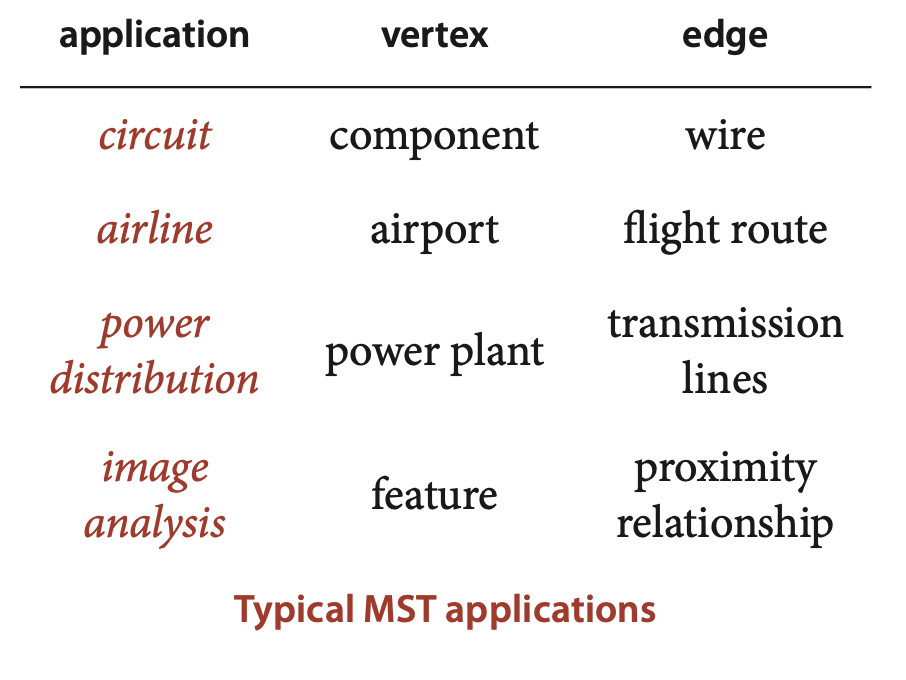
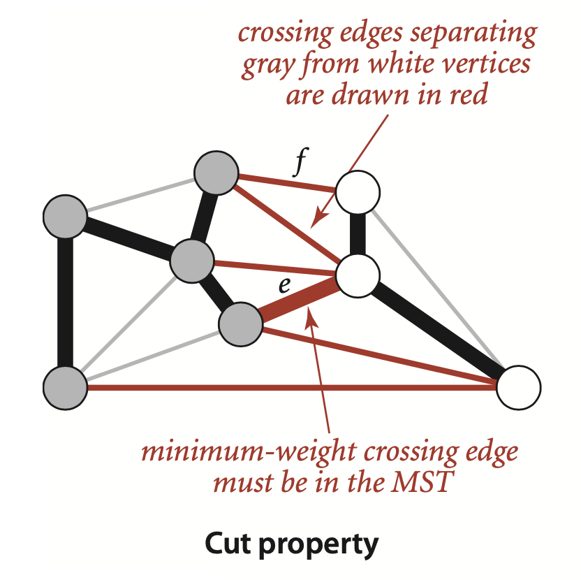
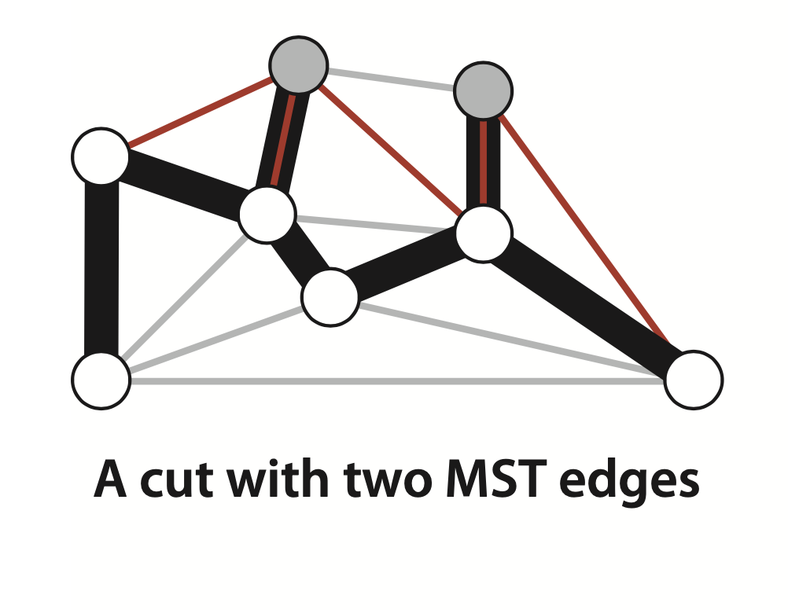
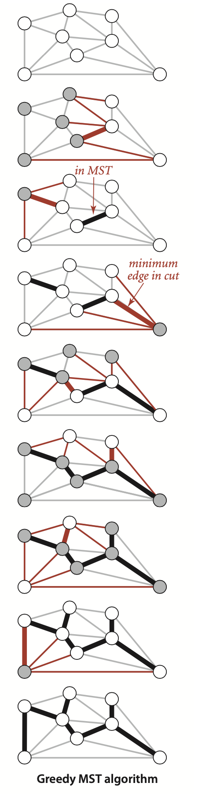
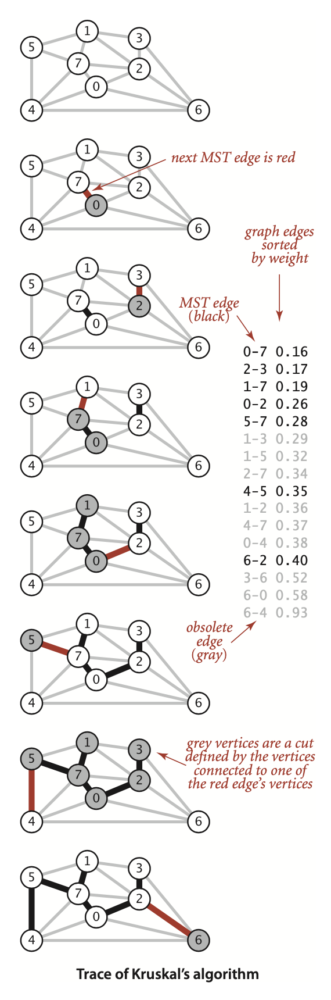

### 4.3 Minimum Spanning Trees


An edge-weighted graph is a graph model where we associate weights or costs with each edge. ... In an airline map where edges represent flight routes, these weights might represent distances or fares. In an electric circuit where edges represent wires, the weights might represent the length of the wire, its cost, or the time that it takes a signal to propagate through it. Minimizing cost is naturally of interest in such situations.

**Definition.** Recall that a *spanning tree* of a graph is a connected subgraph with no cycles that includes all the vertices. A *minimum spanning tree* (MST) of an edge-weighted graph is a spanning tree whose weight (the sum of the weights of its edges) is no larger than the weight of any other spanning tree.




#### Assumptions.
- *The graph is connected.* The spanning-tree condition in our definition implies that the graph must be connected for an MST to exist. Another way to pose the problem, recalling basic properties of trees from Section 4.1, is to find a minimal-weight set of $V-1$ edges that connect the graph. If a graph is not connected, we can adapt our algorithms to compute the MSTs of each of its connected components, collectively known as a *minimum spanning forest* (see Exercise 4.3.22).
- *The edge weights are not necessarily distances.*
- *The edge weights may be zero or negative.* If the edge weights are all positive, it suffices to define the MST as the subgraph with minimal total weight that connects all the vertices, as such a subgraph must form a spanning tree. The spanning-tree condition in the definition is included so that it applies for graphs that may have zero negative edge weights.
>Contributor's Note:  
>Any cycle in the subgraph will increase the total weight. When all edge weights are positive, the cheapest way to connect all vertices is automatically cycle-free.
- *The edge weights are all different.* If edges can have equal weights, the minimum spanning tree may not be unique (see Exercise 4.3.2). The possibility of multiple MSTs complicates the correctness proofs of some of our algorithms, so we rule out that possibility in the presentation. It turns out that this assumption is not restrictive because our algorithms work without modification in the presence of equal weights.


**Definition.** A *cut* of a graph is a partition of its vertices into two nonempty disjoint sets. A *crossing edge* of a cut is an edge that connects a vertex in one set with a vertex in the other.

**Proposition J. (Cut property)** Given any cut in an edgeweighted graph, the crossing edge of minimum weight is in the MST of the graph.  
**Proof:** Let $e$ be the crossing edge of minimum weight and let $T$ be the MST. The proof is by contradiction: Suppose that $T$ does not contain $e$. Now consider the graph formed by adding $e$ to $T$. This graph has a cycle that contains $e$, and that cycle must contain at least one other crossing edge— say, $f$, which has higher weight than $e$ (since e is minimal and all edge weights are different). We can get a spanning tree of strictly lower weight by deleting $f$ and adding $e4, contradicting the assumed minimality of $T$.




Under our assumption that edge weights are distinct, every connected graph has a unique MST (see Exercise 4.3.3); and the cut property says that the shortest crossing edge for every cut must be in the MST


Note that there is no requirement that the minimal edge be the only MST edge connecting the two sets; ...




##### Greedy algorithm.
 apply the cut property to accept an edge as an MST edge, continuing until finding all of the MST edges.


**Proposition K.** (Greedy MST algorithm) The following method colors black all edges in the the MST of any connected edgeweighted graph with $V$ vertices: starting with all edges colored gray, find a cut with no black edges, color its minimum-weight edge black, and continue until $V-1$ edges have been colored black.
**Proof:** For simplicity, we assume in the discussion that the edge weights are all different, though the proposition is still true when that is not the case (see Exercise 4.3.5). By the cut property, any edge that is colored black is in the MST. If fewer than $V-1$ edges are black, a cut with no black edges exists (recall that we assume the graph to be connected). Once $V-1$ edges are black, the black edges form a spanning tree.



#### Edge-weighted graph data type
... in the adjacency-matrix representation, the matrix can contain edge weights rather than boolean values; in the adjacency-lists representation, we can define a node that contains both a vertex and a weight field to put in the adjacency lists. (As usual, we focus on sparse graphs and leave the adjacency-matrix representation for exercises.)


**Weighted edge data type**
```java
public class Edge implements Comparable<Edge>
{
    private final int v;                          // one vertex
    private final int w;                          // the other vertex
    private final double weight;                  // edge weight
    public Edge(int v, int w, double weight)
    {
        this.v = v;
        this.w = w;
        this.weight = weight;
    }
    public double weight()
    {   return weight;  }
    public int either()
    {   return v;  }
    public int other(int vertex)
    {
        if      (vertex == v) return w;
        else if (vertex == w) return v;
        else throw new RuntimeException("Inconsistent edge");
    }
    public int compareTo(Edge that)
    {
        if      (this.weight() < that.weight()) return -1;
        else if (this.weight() > that.weight()) return +1;
        else                                    return  0;
    }
    public String toString()
    {   return String.format("%d-%d %.2f", v, w, weight);  }
}
```
**Edge-weighted graph data type
```java
public class EdgeWeightedGraph
{
    private final int V;        // number of vertices
    private int E;              // number of edges
    private Bag<Edge>[] adj;    // adjacency lists
    public EdgeWeightedGraph(int V)
    {
        this.V = V;
        this.E = 0;
        adj = (Bag<Edge>[]) new Bag[V];
        for (int v = 0; v < V; v++)
            adj[v] = new Bag<Edge>();
    }
    public EdgeWeightedGraph(In in)
    // See Exercise 4.3.9.
    public int V() {  return V;  }
    public int E() {  return E;  }
    public void addEdge(Edge e)
    {
        int v = e.either(), w = e.other(v);
        adj[v].add(e);
        adj[w].add(e);
        E++;
    }
    public Iterable<Edge> adj(int v)
    {   return adj[v];  }
    public Iterable<Edge> edges()
    {
        Bag<Edge> b = new Bag<Edge>();
        for (int v = 0; v < V; v++)
            for (Edge e : adj[v])
                if (e.other(v) > v) b.add(e);
        return b; 
    }
}
```

Our choice to use explicit Edge objects .... carries a small price: each adjacency-list node has a reference to an Edge object, with redundant information (all the nodes on v’s adjacency list have a v). We also pay object overhead cost. Although we have only one copy of each Edge, we do have two references to each Edge object. An alternative and widely used approach is to keep two list nodes corresponding to each edge, just as in Graph, each with a vertex and the edge weight in each list node. This alternative also carries a price—two nodes, including two copies of the weight for each edge.


#### MST API and test client

The MST of a graph G is a subgraph of G that is also a tree, so we have numerous options. Chief among them are
- A list of edges
- An edge-weighted graph
- A vertex-indexed array with parent links

#### Test client.
```java
public static void main(String[] args)
{
    In in = new In(args[0]);
    EdgeWeightedGraph G;
    G = new EdgeWeightedGraph(in);

    MST mst = new MST(G);
    for (Edge e : mst.edges())
        StdOut.println(e);
    StdOut.println(mst.weight());
}
```


#### Prim’s algorithm
Our first MST method, known as Prim’s algorithm, is to attach a new edge to a single growing tree at each step. Start with any vertex as a single-vertex tree; then add $V-1$ edges to it, always taking next (coloring black) the minimum-weight edge that connects a vertex on the tree to a vertex not yet on the tree (a crossing edge for the cut defined by tree vertices).

**Proposition L.** Prim’s algorithm computes the MST of any connected edge-weighted graph.  
**Proof:** Immediate from Proposition K. The growing tree defines a cut with no black edges; the algorithm takes the crossing edge of minimal weight, so it is successively coloring edges black in accordance with the greedy algorithm.

##### Data structures. 
... In particular, we represent the vertices on the tree, the edges on the tree, and the crossing edges, as follows:
- *Vertices* on the tree: We use a vertex-indexed boolean array marked[], where marked[v] is true if v is on the tree.
- *Edges* on the tree: We use one of two data structures: a queue mst to collect MST edges or a vertex-indexed array `edgeTo[]` of Edge objects, where `edgeTo[v]` is the Edge that connects v to the tree.
- *Crossing edges*: We use a `MinPQ<Edge>` priority queue that compares edges by weight (see page 610).


... But we must do more: any edge connecting the vertex just added to a tree vertex that is already on the priority queue now becomes *ineligible* (it is no longer a crossing edge because it connects two tree vertices).

> Contributor's Note:  
> The ineligible edges are marked in gray in the figure.


##### Implementation.
... The weight() method requires iterating through the tree edges to add up the edge weights (lazy approach) or keeping a running total in an instance variable (eager approach) and is left as Exercise 4.3.31.


```java
Lazy version of Prim’s MST algorithm
public class LazyPrimMST
{
    private boolean[] marked;       // MST vertices
    private Queue<Edge> mst;        // MST edges
    private MinPQ<Edge> pq;         // crossing (and ineligible) edges
    
    public LazyPrimMST(EdgeWeightedGraph G)
    {
        pq = new MinPQ<Edge>();
        marked = new boolean[G.V()];
        mst = new Queue<Edge>();
        visit(G, 0);   // assumes G is connected (see Exercise 4.3.22)
        while (!pq.isEmpty())
        {
            Edge e = pq.delMin();                  // Get lowest-weight
            int v = e.either(), w = e.other(v);    //    edge from pq.
            if (marked[v] && marked[w]) continue;  // Skip if ineligible.
            mst.enqueue(e);                        // Add edge to tree.
            if (!marked[v]) visit(G, v);           // Add vertex to tree
            if (!marked[w]) visit(G, w);           //   (either v or w).   
        } 

    private void visit(EdgeWeightedGraph G, int v)
    {  // Mark v and add to pq all edges from v to unmarked vertices.
        marked[v] = true;
        for (Edge e : G.adj(v))
            if (!marked[e.other(v)]) pq.insert(e);
    }
    public Iterable<Edge> edges()
    {   return mst;  }
    public double weight()   // See Exercise 4.3.31.
}
```


#### Eager version of Prim’s algorithm

... In short, we do not need to keep on the priority queue all of the edges from `w` to tree vertices—we just need to keep track of the minimum-weight edge and check whether the addition of `v` to the tree necessitates that we update that minimum (because of an edge v-w that has lower weight), which we can do as we process each edge in `v`’s adjacency list.  In other words, we maintain on the priority queue just one edge for each non-tree vertex `w`: the shortest edge that connects it to the tree. Any longer edge connecting `w` to the tree will become ineligible at some point, so there is no need to keep it on the priority queue.

... The `marked[]` array is not needed, since the condition `!marked[w]` is equivalent to the condition that `distTo[w]` is infinite (and that `edgeTo[w]` is null).


**ALGORITHM 4.7 Prim’s MST algorithm (eager version)**

```java
public class PrimMST
{
    private Edge[] edgeTo;              // shortest edge from tree vertex
    private double[] distTo;            // distTo[w] = edgeTo[w].weight()
    private boolean[] marked;           // true if v on tree
    private IndexMinPQ<Double> pq;      // eligible crossing edges
    
    public PrimMST(EdgeWeightedGraph G)
    {
        edgeTo = new Edge[G.V()];
        distTo = new double[G.V()];
        marked = new boolean[G.V()];
        for (int v = 0; v < G.V(); v++)
            distTo[v] = Double.POSITIVE_INFINITY;
        pq = new IndexMinPQ<Double>(G.V());
        distTo[0] = 0.0;
        pq.insert(0, 0.0);              // Initialize pq with 0, weight 0.
        while (!pq.isEmpty())
            visit(G, pq.delMin());       // Add closest vertex to tree.
    }
    private void visit(EdgeWeightedGraph G, int v)
    {  // Add v to tree; update data structures.
        marked[v] = true;
        for (Edge e : G.adj(v))
        {
            int w = e.other(v);
            if (marked[w]) continue;            // v-w is ineligible
            if (e.weight() < distTo[w])
            {  // Edge e is new best connection from tree to w.
                edgeTo[w] = e;
                distTo[w] = e.weight();
                if (pq.contains(w)) pq.change(w, distTo[w]);
                else                pq.insert(w, distTo[w]);
            }
        }
    }
    public Iterable<Edge> edges()       // See Exercise 4.3.21.
    public double weight()              // See Exercise 4.3.31.
}
```

> Contributor's Note:  
> The `IndexMinPQ` is used so we can find the closest vertex to visit.


**Proposition N.** The eager version of Prim’s algorithm uses extra space proportional to $V$ and time proportional to $E log V$ (in the worst case) to compute the MST of a connected edgeweighted graph with $E$ edges and $V$ vertices.  
**Proof:** The number of edges on the priority queue is at most $V$, and there are three vertex-indexed arrays, which implies the space bound. The algorithm uses $V$ insert operations, $V$ delete the minimum operations, and (in the worst case) $E$ change priority operations. These counts, coupled with the fact that our heap-based implementation of the index priority queue implements all these operations in time proportional to $log V$ (see page 321), imply the time bound.

> Contributor's Note:  
> Each operation on an `IndexMinPQ` costs $\sim log V$ time.  
> So total time is:
> $$V \log V + V \log V + E \log V \;\;=\;\; (2V + E)\log V.$$
> Since **E ≥ V–1** in any connected graph, the $E \log V$ term dominates, and they simplify the bound to:
> $$O(E \log V).$$


... For the huge sparse graphs that are typical in practice, there is no asymptotic difference in the time bound (because $lg E \sim lg V$ for sparse graphs); the space bound is a constant-factor (but significant) improvement. 

#### Kruskal’s algorithm
... process the edges in order of their weight values (smallest to largest), taking for the MST (coloring black) each edge that does not form a cycle with edges previously added, stopping after adding $V-1$ edges have been taken.

**Proposition O.** Kruskal’s algorithm computes the MST of any edge-weighted connected graph.  
**Proof:** Immediate from Proposition K. If the next edge to be considered does not form a cycle with black edges, it crosses a cut defined by the set of vertices connected to one of the edge’s vertices by tree edges (and its complement). Since the edge does not create a cycle, it is the only crossing edge seen so far, and since we consider the edges in sorted order, it is a crossing edge of minimum weight. Thus, the algorithm is successively taking a minimal-weight crossing edge, in accordance with the greedy algorithm.



**ALGORITHM 4.8 Kruskal’s MST algorithm**
```java 
public class KruskalMST
{
    private Queue<Edge> mst;
    public KruskalMST(EdgeWeightedGraph G)
    {
        mst = new Queue<Edge>();
        MinPQ<Edge> pq = new MinPQ<Edge>(G.edges());
        UF uf = new UF(G.V());
        while (!pq.isEmpty() && mst.size() < G.V()-1)
        {
            Edge e = pq.delMin();               // Get min weight edge on pq
            int v = e.either(), w = e.other(v); //   and its vertices.
            if (uf.connected(v, w)) continue;   // Ignore ineligible edges.
            uf.union(v, w);                     // Merge components.
            mst.enqueue(e);                     // Add edge to mst.
        }
       
    }
public Iterable<Edge> edges()
{  return mst;  }
public double weight()      // See Exercise 4.3.31.
}
```
```
% java KruskalMST tinyEWG.txt
0-7 0.16
2-3 0.17
1-7 0.19
0-2 0.26
5-7 0.28
4-5 0.35
6-2 0.40
1.81
```


#### Perspective
.. In 1984, M. L. Fredman and R. E. Tarjan developed the Fibonacci heap data structure, which improves the theoretical bound on the order of growth of the running time of Prim’s algorithm to $E + V log V$.


#### A linear-time algorithm? 
On the one hand, not heoretical results have been developed that deny the existence of an MST algorithm that is guaranteed to run in linear time for all graphs. ... Such research still holds the potential to lead us eventually to a practical linear-time MST algorithm and has even shown the existence of a randomized linear-time algorithm. ... B. Chazelle exhibited an algorithm in 1997 that certainly could never be distinguished from a linear-time algorithm in any conceivable practical situation (even though it is provably nonlinear), but is so complicated that no one would use it in practice. 
