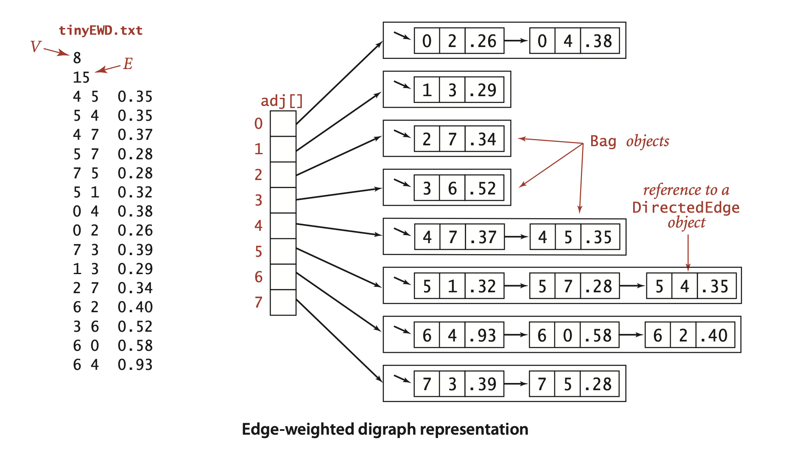
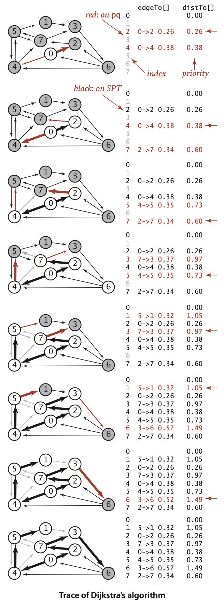
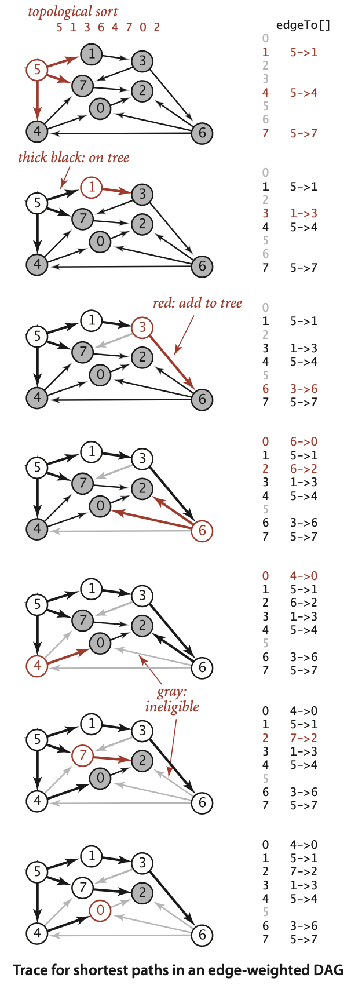
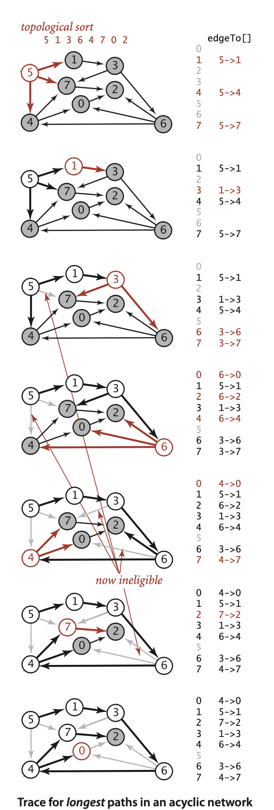
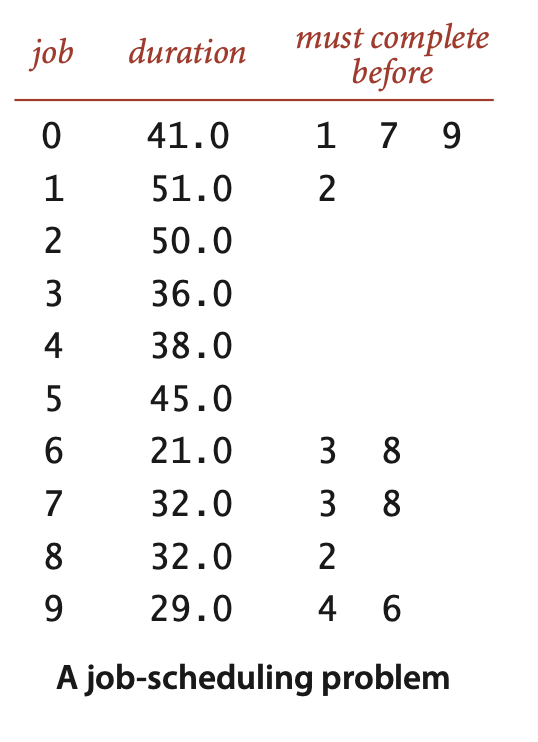
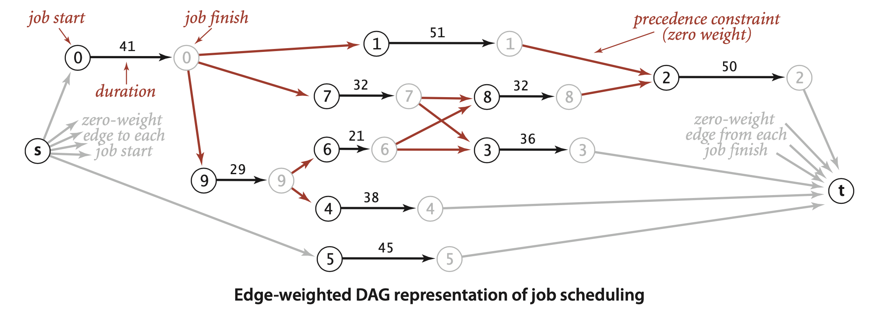
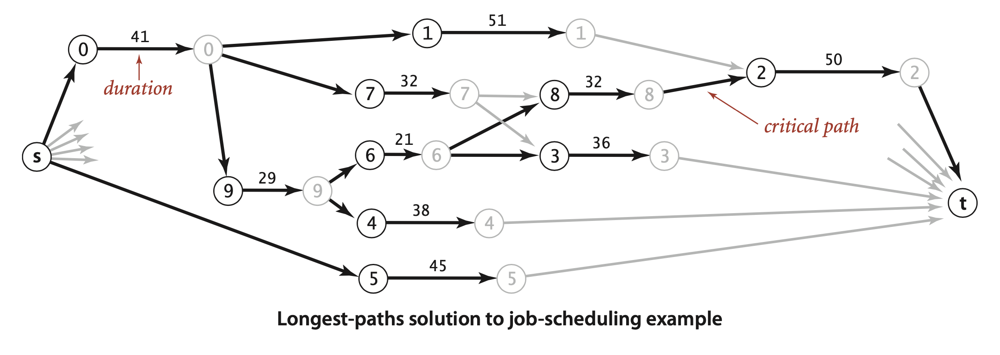
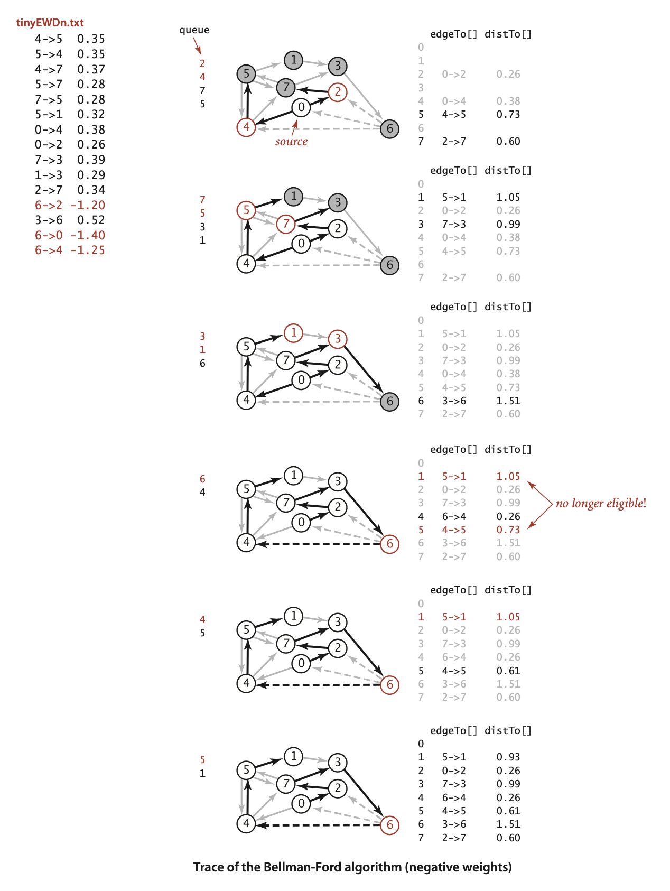

### 4.4 Shortest Paths


... The possibility of one-way roads means that we will need to consider edge-weighted *digraphs*. In this model, the problem is easy to formulate: *Find the lowest-cost way to get from one vertex to another.*


**Definition.** A *shortest* path from vertex s to vertex t in an edge-weighted digraph is a directed path from s to t with the property that no other such path has a lower weight.


- ... For simplicity, our small running example is strongly connected (every vertex is reachable from every other vertex).

- *Negative weights introduce complications.* For the moment, we assume that edge weights are positive (or zero). The surprising impact of negative weights is a major focus of the last part of this section.

- *Shortest paths are normally simple.* Our algorithms ignore zero-weight edges that form cycles, so that the shortest paths they find have no cycles.
- Shortest paths are not necessarily unique. There may be multiple paths of the lowest weight from one vertex to another; we are content to find any one of them.
- *Parallel edges and self-loops may be present.* Only the lowest-weight among a set of parallel edges will play a role, and no shortest path contains a self-loop (except possibly one of zero weight, which we ignore). In the text, we implicitly assume that parallel edges are not present for convenience in using the notation v->w to refer unambiguously to the edge from v to w, but our code handles them without difficulty.

#### Shortest-paths tree 
We focus on the *single-source shortest-paths problem*, where we are given a source vertex s. The result of the computation is a tree known as the *shortest-paths tree* (SPT), which gives a shortest path from s to every vertex reachable from s.

**Definition.** Given an edge-weighted digraph and a designated vertex s, a *shortest-paths* tree for a source s is a subgraph containing s and all the vertices reachable from s that forms a directed tree rooted at s such that every tree path is a shortest path in the digraph.


**Directed weighted edge data type**
```java
public class DirectedEdge
{
    private final int v;                // edge source
    private final int w;                // edge target
    private final double weight;        // edge weight

    public DirectedEdge(int v, int w, double weight)
    {
        this.v = v;
        this.w = w;
        this.weight = weight;
    }
    public double weight()
    {   return weight;  }
    public int from()
    {   return v;  }
    public int to()
    {   return w;  }
    public String toString()
    {   return String.format("%d->%d %.2f", v, w, weight);  }
}
```


**Edge-weighted digraph data type**
```java
public class EdgeWeightedDigraph
{
    private final int V;                // number of vertices
    private int E;                      // number of edges
    private Bag<DirectedEdge>[] adj;    // adjacency lists
    
    public EdgeWeightedDigraph(int V)
    {
        this.V = V;
        this.E = 0;
        adj = (Bag<DirectedEdge>[]) new Bag[V];
        for (int v = 0; v < V; v++)
            adj[v] = new Bag<DirectedEdge>();
    }
    public EdgeWeightedDigraph(In in)
    // See Exercise 4.4.2.

    public int V() {  return V;  }
    public int E() {  return E;  }

    public void addEdge(DirectedEdge e)
    {
        adj[e.from()].add(e);
        E++; 
    }

    public Iterable<Edge> adj(int v)
    {   return adj[v];  }

    public Iterable<DirectedEdge> edges()
    {
        Bag<DirectedEdge> bag = new Bag<DirectedEdge>();
        for (int v = 0; v < V; v++)
            for (DirectedEdge e : adj[v])
                bag.add(e);
        return bag; 
    }
}
```



*Shortest paths test client*
```java
public static void main(String[] args)
{
    EdgeWeightedDigraph G;
    G = new EdgeWeightedDigraph(new In(args[0]));
    int s = Integer.parseInt(args[1]);
    SP sp = new SP(G, s);

    for (int t = 0; t < G.V(); t++)
    {
        StdOut.print(s + " to " + t);
        StdOut.printf(" (%4.2f): ", sp.distTo(t));
        if (sp.hasPathTo(t))
            for (DirectedEdge e : sp.pathTo(t))
                StdOut.print(e + "   ");
        StdOut.println();
    }
```
```
% java SP tinyEWD.txt 0
0 to 0 (0.00):
0 to 1 (1.05): 0->4 0.38  4->5 0.35  5->1 0.32
0 to 2 (0.26): 0->2 0.26
0 to 3 (0.99): 0->2 0.26  2->7 0.34  7->3 0.39
0 to 4 (0.38): 0->4 0.38
0 to 5 (0.73): 0->4 0.38  4->5 0.35
0 to 6 (1.51): 0->2 0.26  2->7 0.34  7->3 0.39  3->6 0.52
0 to 7 (0.60): 0->2 0.26  2->7 0.34
```

#### Data structures for shortest paths.


#### Edge relaxation.
... As an algorithm proceeds, it gathers information about the shortest paths that connect the source to each vertex encountered in our edgeTo[] and distTo[] data structures. ... The best known distance to w through v is the sum of distTo[v] and e.weight()— if that value is not smaller than distTo[w], we say the edge is ineligible, and we ignore it; if it is smaller, we update the data structures.

```java
private void relax(DirectedEdge e)
{
    int v = e.from(), w = e.to();
    if (distTo[w] > distTo[v] + e.weight())
    {
        distTo[w] = distTo[v] + e.weight();
        edgeTo[w] = e;
    }
}
```


##### Vertex relaxation.

```java
private void relax(EdgeWeightedDigraph G, int v)
{
    for (DirectedEdge e : G.adj(v))
    {
        int w = e.to();
        if (distTo[w] > distTo[v] + e.weight())
        {
            distTo[w] = distTo[v] + e.weight();
            edgeTo[w] = e;
        }
    } 
}
```

##### Client query methods.

```java
public double distTo(int v)
{   return distTo[v];   }

public boolean hasPathTo(int v)
{   return distTo[v] < Double.POSITIVE_INFINITY;  }

public Iterable<DirectedEdge> pathTo(int v)
{
    if (!hasPathTo(v)) return null;
    Stack<DirectedEdge> path = new Stack<DirectedEdge>();
    for (DirectedEdge e = edgeTo[v]; e != null; e = edgeTo[e.from()])
        path.push(e);
    return path;
}
```


#### Theoretical basis for shortest-paths algorithms.
  


##### Optimality conditions.

*Proposition P.* (Shortest-paths optimality conditions) Let $G$ be an edge-weighted digraph, with s a source vertex in $G$ and distTo[] a vertex-indexed array of path lengths in $G$ such that, for all `v` reachable from `s`, the value of `distTo[v]` is the length of some path from `s` to `v` with `distTo[v]` equal to infinity for all `v` not reachable from `s`. These values are the lengths of shortest paths if and only if they satisfy `distTo[w] <= distTo[v] + e.weight()` for each edge `e` from `v` to `w` (or, in other words, no edge is eligible).  
**Proof:** Suppose that `distTo[w]` is the length of a shortest path from `s` to `w`. If `distTo[w] > distTo[v] + e.weight()` for some edge `e` from `v` to `w`, then e would give a path from `s` to `w` (through `v`) of length less than `distTo[w]`, a contradiction. Thus the optimality conditions are necessary.
To prove that the optimality conditions are sufficient, suppose that `w` is reachable from `s` and that `s = v0->v1->v2...->vk = w` is a shortest path from `s` to `w`, of weight `OPT_sw`. For `i` from `1` to `k`, denote the edge from `v_i-1` to `v_i` by `e_i`. By the optimality conditions, we have the following sequence of inequalities:
```
distTo[w] = distTo[vk] <= distTo[vk-1] + ek.weight() 
distTo[vk-1] <= distTo[vk-2] + ek-1.weight()
...
distTo[v2] <= distTo[v1] + e2.weight() 
distTo[v1] <= distTo[s] + e1.weight()
```
Collapsing these in equalities and eliminating `distTo[s] = 0.0`, we have 
```
distTo[w] <= e1.weight() + ... + ek.weight() = OPTsw.
```
Now, `distTo[w]` is the length of *some* path from `s` to `w`, so it cannot be smaller than the length of a *shortest* path. Thus, we have shown that
```
OPTsw <= distTo[w] <= OPTsw
```
and equality must hold.


##### Certification.
An important practical consequence of Proposition P is its applicability to certification. However an algorithm computes `distTo[]`, we can check whether it contains shortest-path lengths in a single pass through the edges of the graph, checking whether the optimality conditions are satisfied. Shortest-paths algorithms can be complicated, and this ability to efficiently test their outcome is crucial. 

##### Generic algorithm.

**Proposition Q. (Generic shortest-paths algorithm)** Initialize `distTo[s]` to 0 and all other `distTo[]` values to infinity, and proceed as follows:  
  
  *Relax any edge in G, continuing until no edge is eligible.*    

For all vertices `w` reachable from `s`, the value of `distTo[w]` after this computation is the length of a shortest path from `s` to `w` (and the value of `edgeTo[]` is the last edge on that path).  
**Proof:** Relaxing an edge `v->w` always sets `distTo[w]` to the length of some path from `s` (and `edgeTo[w]` to the last edge on that path). For any vertex `w` reachable from `s`, some edge on the shortest path to `w` is eligible as long as `distTo[w]` remains infinite, so the algorithm continues until the `distTo[]` value of each vertex reachable from `s` is the length of some path to that vertex. For any vertex `v` for which the shortest path is well-defined, throughout the algorithm `distTo[v]` is the length of some (simple) path from `s` to `v` and is strictly monotonically decreasing. Thus, it can decrease at most a finite number of times (once for each simple path from `s` to `v`). When no edge is eligible, Proposition P applies.


#### Dijkstra’s algorithm
**Proposition R.** Dijkstra’s algorithm solves the single-source shortest-paths problem in edge-weighted digraphs with nonnegative weights.  
**Proof:** If `v` is reachable from the source, every edge `v->w` is relaxed exactly once, when `v` is relaxed, leaving `distTo[w] <= distTo[v] + e.weight()`. This inequality holds until the algorithm completes, since `distTo[w]` can only decrease (any relaxation can only decrease a `distTo[]` value) and `distTo[v]` never changes (because edge weights are nonnegative and we choose the lowest `distTo[]` value at each step, no subsequent relaxation can set any `distTo[]` entry to a lower value than `distTo[v]`). Thus, after all vertices reachable from s have been added to the tree, the shortest-paths optimality conditions hold, and Proposition P applies.


**PropositionR(continued).** Dijkstra’s algorithm uses extra space proportional to $V$ and time proportional to $E log V$ (in the worst case) to compute the SPT rooted at a given source in an edge-weighted digraph with $E$ edges and $V$ vertices.  
**Proof:** Same as for Prim’s algorithm (see Proposition N).


**ALGORITHM 4.9 Dijkstra’s shortest-paths algorithm**  
```java
public class DijkstraSP
{
    private DirectedEdge[] edgeTo;
    private double[] distTo;
    private IndexMinPQ<Double> pq;

    public DijkstraSP(EdgeWeightedDigraph G, int s)
    {
        edgeTo = new DirectedEdge[G.V()];
        distTo = new double[G.V()];
        pq = new IndexMinPQ<Double>(G.V());

        for (int v = 0; v < G.V(); v++)
            distTo[v] = Double.POSITIVE_INFINITY;
        distTo[s] = 0.0;

        pq.insert(s, 0.0);
        while (!pq.isEmpty())
            relax(G, pq.delMin())
    }
    
    private void relax(EdgeWeightedDigraph G, int v)
    {
        for(DirectedEdge e : G.adj(v))
        {
            int w = e.to();
            if (distTo[w] > distTo[v] + e.weight())
            {
                distTo[w] = distTo[v] + e.weight();
                edgeTo[w] = e;
                if (pq.contains(w)) pq.change(w, distTo[w]);
                else                pq.insert(w, distTo[w]);
            }
        } 
    }

    public double distTo(int v)             // standard client query methods
    public boolean hasPathTo(int v)         //   for SPT implementatations
    public Iterable<Edge> pathTo(int v)     //   (See page 649.)
}
```



... Both algorithms build a rooted tree by adding an edge to a growing tree: Prim’s adds next the non-tree vertex that is closest to the tree; Dijkstra’s adds next the non-tree vertex that is closest to the source. The `marked[]` array is not needed, because the condition `!marked[w]` is equivalent to the condition that `distTo[w]` is infinite. In other words, switching to undirected graphs and edges and omitting the references to `distTo[v]` in the `relax()` code in Algorithm 4.9 gives an implementation of Algorithm 4.7, the eager version of Prim’s algorithm (!). Also, a lazy version of Dijkstra’s algorithm along the lines of LazyPrimMST (page 619) is not difficult to develop.


#### Variants.
... The solution to this problem is immediate if we view the undirected graph as a digraph. That is, given an undirected graph, build an edge-weighted digraph with the same vertices and with two directed edges (one in each direction) corresponding to each edge in the graph. 

*Source-sink shortest paths.* Given an edge-weighted digraph, a source vertex `s`, and a target vertex `t`, find the shortest path from `s` to `t`.  
To solve this problem, use Dijkstra’s algorithm, but terminate the search as soon as `t` comes off the priority queue.


The surprisingly compact implementation at right below solves the all-pairs shortest paths problem, using time and space proportional to $EVlogV$.
```java
public class DijkstraAllPairsSP
{
    private DijkstraSP[] all;

    DijkstraAllPairsSP(EdgeWeightedDigraph G)
    {
        all = new DijkstraSP[G.V()]
        for (int v = 0; v < G.V(); v++)
            all[v] = new DijkstraSP(G, v);
    }

    Iterable<Edge> path(int s, int t)
    {  return all[s].pathTo(t);  }

    double dist(int s, int t)
    {  return all[s].distTo(t);  }
}
```

#### Acyclic edge-weighted digraphs
... For economy, we use the equivalent term *edge-weighted* DAG to refer to an acyclic edge-weighted digraph. ... Specifically, vertex relaxation, in combination with topological sorting, immediately presents a solution to the single-source shortest-paths problem for edge-weighted DAGs. We initialize `distTo[s]` to 0 and all other `distTo[]` values to infinity, then relax the vertices, one by one, taking the vertices in topological order. 


**Proposition S.** By relaxing vertices in topological order, we can solve the singlesource shortest-paths problem for edge-weighted DAGs in time proportional to `E + V`.  
**Proof:** Every edge `v->w` is relaxed exactly once, when`v` is relaxed, leaving `distTo[w] <= distTo[v] + e.weight()`. This inequality holds until the algorithm completes, since `distTo[v]` never changes (because of the topological order, no edge pointing to `v` will be processed after v is relaxed) and `distTo[w]` can only decrease (any relaxation can only decrease a `distTo[]` value). Thus, after all vertices reachable from `s` have been added to the tree, the shortest-paths optimality conditions hold, and Proposition Q applies. The time bound is immediate: Proposition G on page 583 tells us that the topological sort takes time proportional to $E + V$, and the second relaxation pass completes the job by relaxing each edge once, again in time proportional to $E + V$.


**ALGORITHM 4.10 Shortest paths in edge-weighted DAGs**
```java
  public class AcyclicSP
  {
    private DirectedEdge[] edgeTo;
    private double[] distTo;

    public AcyclicSP(EdgeWeightedDigraph G, int s)
    {
        edgeTo = new DirectedEdge[G.V()];
        distTo = new double[G.V()];

        for (int v = 0; v < G.V(); v++)
            distTo[v] = Double.POSITIVE_INFINITY;
        distTo[s] = 0.0;

        Topological top = new Topological(G);

        for (int v : top.order())
            relax(G, v);
    }
    private void relax(EdgeWeightedDigraph G, int v)
    // See page 648.
    
    public double distTo(int v)          // standard client query methods
    public boolean hasPathTo(int v)      //   for SPT implementatations
    public Iterable<Edge> pathTo(int v)  //   (See page 649.)
}
```



... Note that our boolean array `marked[]` is not needed in this implementation: since we are processing vertices in an acyclic digraph in topological order, we never re-encounter a vertex that we have already relaxed. ... For shortest paths, the topological-sort-based method is faster than Dijkstra’s algorithm by a factor proportional to the cost of the priorityqueue operations in Dijkstra’s algorithm. 


**Proposition T.** We can solve the longest-paths problem in edge-weighted DAGs in time proportional to $E + V$.  
**Proof:** Given a longest-paths problem, create a copy of the given edge-weighted DAG that is identical to the original, except that all edge weights are negated. Then the *shortest* path in this copy is the *longest* path in the original. To transform the solution of the shortest-paths problem to a solution of the longest-paths problem, negate the weights in the solution. The running time follows immediately from Proposition S.





... An even simpler way to implement such a class is to copy `AcyclicSP`, then switch the `distTo[]` initialization to `Double.NEGATIVE_INFINITY` and switch the sense of the inequality in `relax()`. ... This result is to be compared with the fact that the best known algorithm for finding longest simple paths in general edge-weighted digraphs (where edge weights may be negative) requires exponential time in the worst case (see Chapter 6)! The possibility of cycles seems to make the problem exponentially more difficult.

##### Parallel job scheduling.
*Parallel precedence-constrained scheduling.* Given a set of jobs of specified duration to be completed, with precedence constraints that specify that certain jobs have to be completed before certain other jobs are begun, how can we schedule the jobs *on identical processors* (*as many as needed*) such that they are all completed *in the minimum amount of time* while still respecting the constraints?


... emarkably, a *linear*time algorithm is available—an approach known as the *critical path method* demonstrates that the problem is equivalent to a longestpaths problem in an edge-weighted DAG. This method has been used successfully in countless industrial applications.


**Definition.** The *critical path method* for parallel scheduling is to proceed as follows: Create an edge-weighted DAG with a source `s`, a sink `t`, and two vertices for each job (a *start* vertex and an *end* vertex). For each job, add an edge from its start vertex to its end vertex with weight equal to its duration. For each precedence constraint `v->w`, add a zero-weight edge from the end vertex corresponding to `v`s to the beginning vertex corresponding to `w`. Also add zero-weight edges from the source to each job’s start vertex and from each job’s end vertex to the sink. Now, schedule each job at the time given by the length of its longest path from the source.







**Critical path method for parallel precedence-constrained job scheduling**
```java
public class CPM
{
    public static void main(String[] args)
    {
        int N = StdIn.readInt(); StdIn.readLine();
        EdgeWeightedDigraph G;
        G = new EdgeWeightedDigraph(2*N+2);

        int s = 2*N, t = 2*N+1;
        for (int i = 0; i < N; i++)
        {
            String[] a = StdIn.readLine().split("\\s+");
            double duration = Double.parseDouble(a[0]);
            G.addEdge(new DirectedEdge(i, i+N, duration));
            G.addEdge(new DirectedEdge(s, i, 0.0));
            G.addEdge(new DirectedEdge(i+N, t, 0.0));
            for (int j = 1; j < a.length; j++)
            {
                int successor = Integer.parseInt(a[j]);
                G.addEdge(new DirectedEdge(i+N, successor, 0.0));
            }
        }
        AcyclicLP lp = new AcyclicLP(G, s);

        StdOut.println("Start times:");
        for (int i = 0; i < N; i++)
            StdOut.printf("%4d: %5.1f\n", i, lp.distTo(i));
        StdOut.printf("Finish time: %5.1f\n", lp.distTo(t));
    } 
}
```
```
% more jobsPC.txt 10
41.0 1 79
51.0 2
50.0
36.0
38.0
45.0
21.0  3 8
32.0  3 8
32.0  2
29.0  4 6
```
```
% java CPM < jobsPC.txt
Start times:
   0:   0.0
   1:  41.0
   2: 123.0
   3:  91.0
   4:  70.0
   5:   0.0
   6:  70.0
   7:  41.0
   8:  91.0
   9:  41.0
Finish time: 173.0
```


**Proposition U.** The critical path method solves the parallel precedenceconstrained scheduling problem in linear time.  
**Proof:** Why does the CPM approach work? The correctness of the algorithm rests on two facts. First, every path in the DAG is a sequence of job starts and job finishes, separated by zero-weight precedence constraints— the length of any path from the source s to any vertex v in the graph is a lower bound on the start/finish time represented by `v`, because we could not do better than scheduling those jobs one after another on the same machine. In particular, the length of the longest path from s to the sink t is a lower bound on the finish time of all the jobs. Second, all the start and finish times implied by longest paths are *feasible*—every job starts after the finish of all the jobs where it appears as a successor in a precedence constraint, because the start time is the length of the longest path from the source to it. In particular, the length of the longest path from `s` to `t` is an *upper* bound on the finish time of all the jobs. The linear-time performance is immediate from Proposition T.


##### Parallel job scheduling with relative deadlines.
... Suppose that we allow an additional type of constraint in the job-scheduling problem to specify that a job must begin before a specified amount of time has elapsed, relative to the start time of another job. ... For example, as shown at left, suppose that we need to add a constraint to our example that job 2 must start no later than 12 time units after job 4 starts.


**Proposition V.** Parallel job scheduling with relative deadlines is a shortest-paths problem in edge-weighted digraphs (with cycles and negative weights allowed).  
**Proof:** Use the same construction as in Proposition U, adding an edge for each deadline: if job `v` has to start within `d` time units of the start of job `w`, add an edge from `v` to `w` with *negative* weight d. Then convert to a shortest-paths problem by negating all the weights in the digraph. The proof of correctness applies, *provided that the schedule is feasible*. Determining whether a schedule is feasible is part of the computational burden, as you will see.


>Contributor's Note:  
> The constraint $\text{start}(v) \le \text{start}(w) + d$ can be formulated as a shortest-path problem.


#### Shortest paths in general edge-weighted digraphs

##### Strawman I. 
The first idea that suggests itself is to find the smallest (most negative) edge weight, then to add the absolute value of that number to all the edge weights to transform the digraph into one with no negative weights.


##### StrawmanII.
... The proof in Proposition R that the algorithm is correct assumes that adding an edge to a path makes that path longer. But any edge with negative weight makes the path shorter, so that assumption is unfounded (see Exercise 4.4.14).

##### Negative cycles
When we consider digraphs that could have negative edge weights, the concept of a shortest path is meaningless if there is a cycle in the digraph that has negative weight. ... We can spin around that cycle to generate arbitrarily short paths!  

**Definition.** A negative cycle in an edgeweighted digraph is a directed cycle whose total weight (sum of the weights of its edges) is negative.


**Proposition W.** There exists a shortest path from `s` to `v` in an edge-weighted digraph if and only if there exists at least one directed path from `s` to `v` and no vertex on any directed path from `s` to `v` is on a negative cycle.  
**Proof:** See discussion above and Exercise 4.4.29.


#### Strawman III.
Whether or not there are negative cycles, there exists a shortest *simple* path connecting the source to each vertex reachable from the source. Why not define shortest paths so that we seek such paths? Unfortunately, the best known algorithm for solving this problem takes exponential time in the worst case (see Chapter 6). Generally, we consider such problems “too difficult to solve” and study simpler versions.


Thus, a well-posed and tractable version of the shortest paths problem in edgeweighted digraphs is to require algorithms to
- Assign a shortest-path weight of $+\infty$ to vertices that are not reachable from the source
- Assign a shortest-path weight of $-\infty$ to vertices that are on a path from the source that has a vertex that is on a negative cycle
- Compute the shortest-path weight (and tree) for all other vertices

To summarize: while shortest paths in digraphs with directed cycles is an ill-posed problem and we cannot efficiently solve the problem of finding simple shortest paths in such digraphs, we can identify negative cycles in practical situations. For example, in a job-scheduling-with-deadlines problem, we might expect negative cycles to be relatively rare: constraints and deadlines derive from logical real-world constraints, so any negative cycles are likely to stem from an error in the problem statement.


**Proposition X.** (Bellman-Ford algorithm) The following method solves the singlesource shortest-paths problem from a given source s for any edge-weighted digraph with $V$ vertices and no negative cycles reachable from s: Initialize `distTo[s]` to 0 and all other `distTo[]` values to infinity. Then, considering the digraph’s edges in any order, relax all edges. Make $V$ such passes.  
**Proof:** For any vertex `t` that is reachable from `s` consider a specific shortest path from `s` to `t: v0->v1->...->vk`, where `v_0` is `s` and `v_k` is `t`. Since there are no negative cycles, such a path exists and `k` can be no larger than $V-1$. We show by induction on `i` that after the ith pass the algorithm computes a shortest path from `s` to `v_i`. The base case `(i = 0)` is trivial. Assuming the claim to be true fo `i`,`v_0->v_1->...->v_i` is a shortest path from `s` to `v_i`, and `distTo[vi]` is its length. Now, we relax every vertex in the ith pass, including `v_i`, so `distTo[vi+1]` is no greater than `distTo[vi]` plus the weight of `vi->vi+1`. Now, after the ith pass, `distTo[vi+1]` must be equal to `distTo[vi]` plus the weight of `vi->vi+1`. It cannot be greater because we relax every vertex in the ith pass, in particular `v_i`, and it cannot be less because that is the length of `v0->v1->...->vi+1`, a shortest path. Thus the algorithm computes a shortest path from s to `vi+1` after the `(i+1)`st pass.


**Proposition W (continued).** The Bellman-Ford algorithm takes time proportional to $EV$ and extra space proportional to $V$.  
**Proof:** Each of the $V$ passes relaxes $E$ edges.


##### Queue-based Bellman-Ford

....  the only edges that could lead to a change in `distTo[]` are those leaving a vertex whose `distTo[]` value changed in the previous pass. 

**ALGORITHM 4.11 Bellman-Ford algorithm (queue-based)** 
```java
public class BellmanFordSP
{
    private double[] distTo;                // length of path to v
    private DirectedEdge[] edgeTo;          // last edge on path to v
    private boolean[] onQ;                  // Is this vertex on the queue?
    private Queue<Integer> queue;           // vertices being relaxed
    private int cost;                       // number of calls to relax
    private Iterable<DirectedEdge> cycle;   // negative cycle in edgeTo[]?

    public BellmanFordSP(EdgeWeightedDigraph G, int s)
    {
        distTo = new double[G.V()];
        edgeTo = new DirectedEdge[G.V()];
        onQ = new boolean[G.V()];
        queue = new Queue<Integer>();
        for (int v = 0; v < G.V(); v++)
            distTo[v] = Double.POSITIVE_INFINITY;
        distTo[s] = 0.0;
        queue.enqueue(s);
        onQ[s] = true;
        while (!queue.isEmpty() && !this.hasNegativeCycle())
        {
            int v = queue.dequeue();
            onQ[v] = false;
            relax(v);
        } 
    }
    private void relax(int v)
    {
        for (DirectedEdge e : G.adj(v)
        {
            int w = e.to();
            if (distTo[w] > distTo[v] + e.weight())
            {
                distTo[w] = distTo[v] + e.weight();
                edgeTo[w] = e;
                if (!onQ[w])
                {
                    q.enqueue(w);
                    onQ[w] = true;
                }
            }
            if (cost++ % G.V() == 0)
                findNegativeCycle();
        } 
    }
    public double distTo(int v)                     // standard client query methods
    public boolean hasPathTo(int v)                 // for SPT implementatations
    public Iterable<Edge> pathTo(int v)             //  (See page 649.)
    private void findNegativeCycle()
    public boolean hasNegativeCycle()
    public Iterable<Edge> negativeCycle()
    // See page 677.
}
```

> Contributor's Note:  
> The queue ensures that only vertices whose distance was recently updated are relaxed.


... To complete the implementation, we need to ensure that the algorithm terminates after $V$ passes. One way to achieve this end is to explicitly keep track of the passes. Our implementation BellmanFordSP (Algorithm 4.11) uses a different approach that we will consider in detail on page 677: it checks for negative cycles in the subset of digraph edges in `edgeTo[]` and terminates if it finds one.


**Proposition Y.** The queue-based implementation of the Bellman-Ford algorithm solves the shortest-paths problem from a given source s (or finds a negative cycle reachable from `s`) for any edge-weighted digraph with $V$ vertices, in time proportional to $EV$ and extra space proportional to $V$, in the worst case.  
**Proof:** If there is no negative cycle reachable from `s`, the algorithm terminates after relaxations corresponding to the $(V–1)$st pass of the generic algorithm described in Proposition X (since all shortest paths have fewer than $V–1$ edges). If there does exist a negative cycle reachable from `s`, the queue never empties. After relaxations corresponding to the $V$th pass of the generic algorithm described in Proposition X the `edgeTo[]` array has a path with a cycle (connects some vertex `w` to itself) and that cycle must be negative, since the path from `s` to the second occurrence of `w` must be shorter that the path from `s` to the first occurrence of `w` for `w` to be included on the path the second time. In the worst case, the algorithm mimics the general algorithm and relaxes all $E$ edges in each of $V$ passes.


> Contributor's Note:  
> Queue optimization helps, but worst-case time is still $O(VE)$.




##### Negative cycle detection.
Our implementation BellmanFordSP checks for negative cycles to avoid an infinite loop ... the proof of Proposition Y tells us that the digraph has a negative cycle reachable from the source if and only if the queue is nonempty after the Vth pass through all the edges. Moreover, the subgraph of edges in our `edgeTo[]` array must contain a negative cycle.

```java
private void findNegativeCycle()
{
    int V = edgeTo.length;
    EdgeWeightedDigraph spt;
    spt = new EdgeWeightedDigraph(V);
    for (int v = 0; v < V; v++)
    if (edgeTo[v] != null)
        spt.addEdge(edgeTo[v]);

    EdgeWeightedCycleFinder cf;
    cf = new EdgeWeightedCycleFinder(spt);

    cycle = cf.cycle();
}
public boolean hasNegativeCycle()
{  return cycle != null;  }
public Iterable<Edge> negativeCycle()
{  return cycle;  }
```


##### Arbitrage.

```
% more rates.txt
5
USD 1       0.741       0.657       1.061       1.005
EUR 1.349   1           0.888       1.433       1.366
GBP 1.521   1.126       1           1.614       1.538
CHF 0.942   0.698       0.619       1           0.953
CAD 0.995   0.732       0.650       1.049       1
```

For example, our table says that 1,000 U.S. dollars will buy 741 euros. This table is equivalent to a complete edge-weighted digraph with a vertex corresponding to each currency and an edge corresponding to each conversion rate. An edge `s->t` with weight `x` corresponds to a conversion from `s` to `t` at exchange rate `x`. ... For example, combining the conversion just mentioned with an edge `t->u` with weight `y` gives a path `s->t->u` that represents a way to convert 1 unit of currency `s` into `xy` units of currency `u`. For example, we might buy 1,012.206 = 741×1.366 Canadian dollars with our euros. ... You might expect `xy` to be equal to the weight of `s->u` in all such cases, but such tables represent EUR a complex financial system where such consistency cannot be guaranteed. Thus, finding the path from `s` to `u` such that the product of the weights is maximal is certainly of interest. Even more interesting is a case where the product of the edge weights is smaller than the weight of the edge from the last vertex back to the first. In our example, suppose that the weight of `u->s` is `z` and `xyz > 1`.Then cycle `s->t->u->s` gives a way to convert 1 unit of currency `s` into more than 1 unit `(xyz)` of currency `s`. In other words, we can make a `100(xyz - 1)` percent profit by converting from `s` to `t` to `u` back to `s`. ... This situation is an example of an $arbitrage$ opportunity ... 


**Proposition Z.** The arbitrage problem is a negative-cycle-detection problem in edge-weighted digraphs.  
**Proof:** Replace each weight by its *logarithm*, negated. With this change, computing path weights by multiplying edge weights in the original problem corresponds to adding them in the transformed problem. Specifically, any product $w_1w_2 . . . w_k$ corresponds to a sum $- \ln(w_1)  - \ln(w_2) - . . . - \ln(w_k)$. The transformed edge weights might be negative or positive, a path from `v` to `w` gives a way of converting from currency `v` to currency `w`, and any negative cycle is an arbitrage opportunity.

In our example, where all transactions are possible, the digraph is a complete graph, so any negative cycle is reachable from any vertex. No efficient algorithm for finding the best arbitrage opportunity (the most negative cycle in a digraph) is known (and the graph does not have to be very big for this computational burden to be overwhelming), but the fastest algorithm to find any arbitrage opportunity is crucial—a trader with that algorithm is likely to systematically wipe out numerous opportunities before the second-fastest algorithm finds any.

Since the logarithm function is monotonic (and we negated the logarithms), the product is maximized precisely when the sum is minimized.


**Arbitrage in currency exchange**
```java
public class Arbitrage
{
    public static void main(String[] args)
    {
        int V = StdIn.readInt();
        String[] name = new String[V];
        EdgeWeightedDigraph G = new EdgeWeightedDigraph(V);
        for (int v = 0; v < V; v++)
        {
            name[v] = StdIn.readString();
            for (int w = 0; w < V; w++)
            {
                double rate = StdIn.readDouble();
                DirectedEdge e = new DirectedEdge(v, w, -Math.log(rate));
                G.addEdge(e);
            } 
        }

        BellmanFordSP spt = new BellmanFordSP(G, 0);
        if (spt.hasNegativeCycle())
        {
            double stake = 1000.0;
            for (DirectedEdge e : spt.negativeCycle())
            {
                StdOut.printf("%10.5f %s ", stake, name[e.from()]);
                stake *= Math.exp(-e.weight());
                StdOut.printf("= %10.5f %s\n", stake, name[e.to()]);
            } 
        }
        else StdOut.println("No arbitrage opportunity");
    }
}
```
```
% java Arbitrage < rates.txt
1000.00000 USD =  741.00000 EUR
 741.00000 EUR = 1012.20600 CAD
1012.20600 CAD = 1007.14497 USD
```


##### Historical notes.
... While the running time of the Bellman-Ford algorithm is likely to be linear for typical applications, its worst-case running time is $VE$. The development of a worst-case linear-time shortest-paths algorithm for sparse graphs remains an open problem. ... we have not yet seen algorithms with better worst-case performance for digraphs with negative edge weights (but no negative cycles).


**Q.** How can we find shortest paths in undirected (edge-weighted) graphs?
**A.** For positive edge weights, Dijkstra’s algorithm does the job. We just build an `EdgeWeightedDigraph` corresponding to the given EdgeWeightedGraph (by adding two directed edges corresponding to each undirected edge, one in each direction) and then run Dijkstra’s algorithm. If edge weights can be negative, efficient algorithms are available, but they are more complicated than the Bellman-Ford algorithm.
