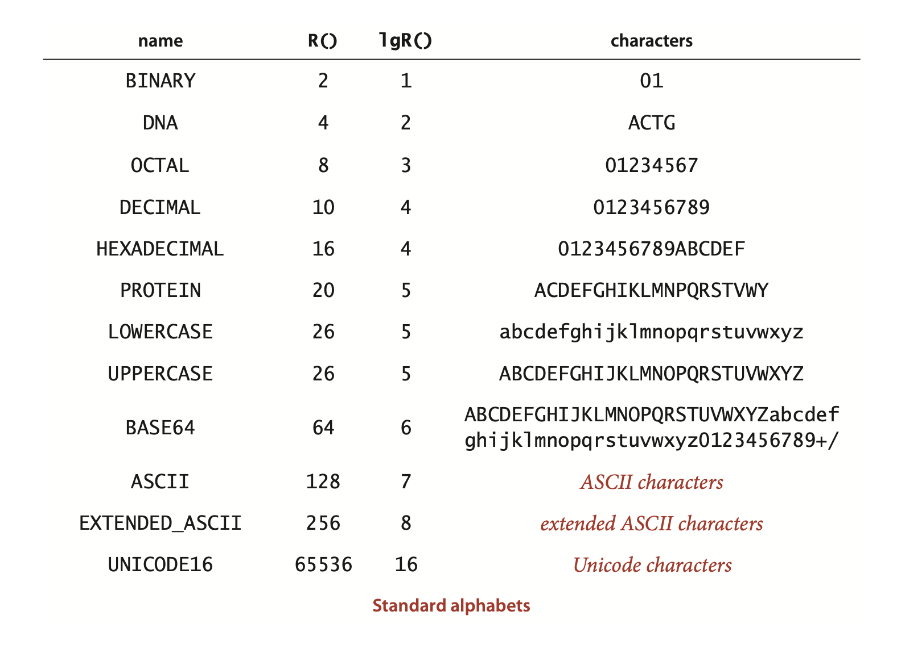
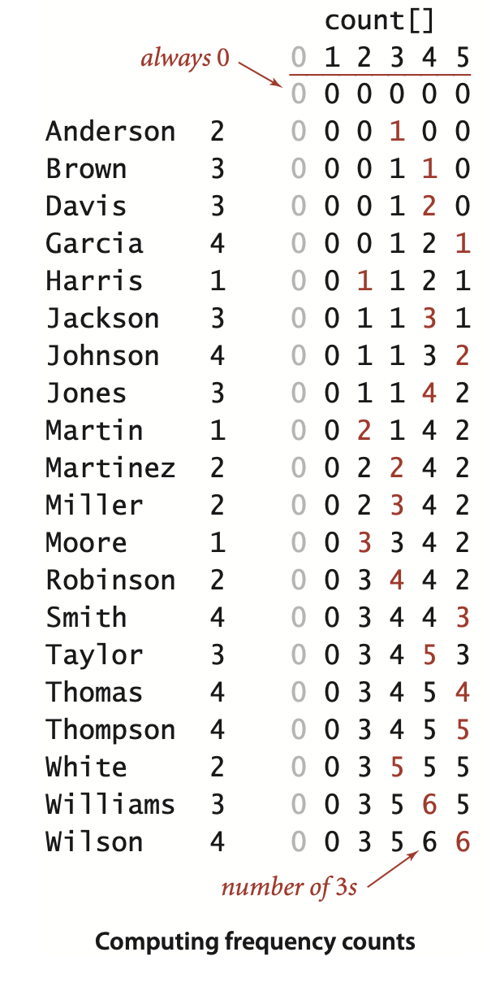
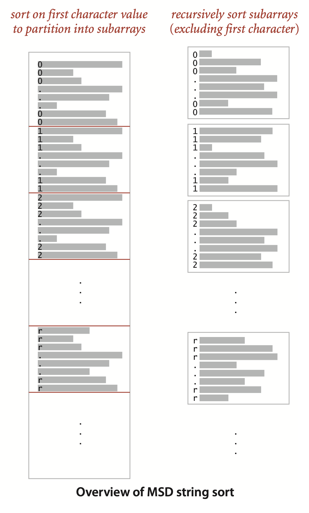
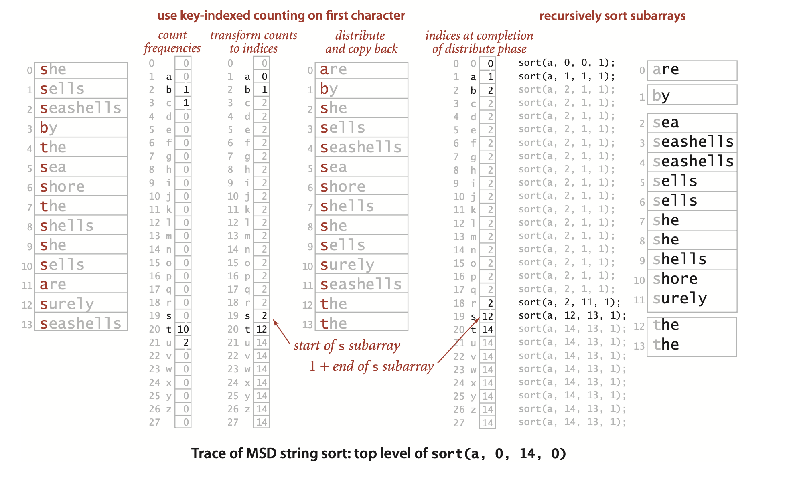
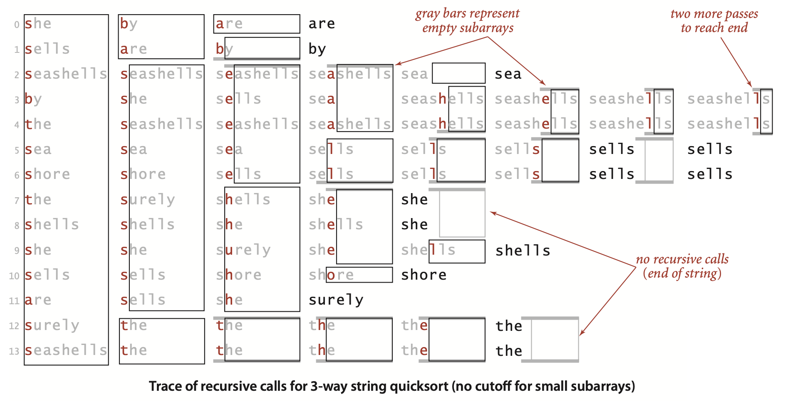
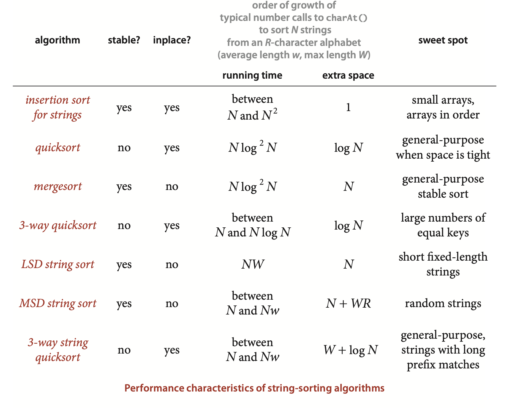

### 5.1 String Sorts


- Characters. ... Characters are of type `char` and can have one of 216 possible values.  ... but many modern applications call for 16-bit Unicode.
- Immutability. 
- Indexing. ... . We expect `charAt()` to complete its work in constant time, ...
- Length. ... Again, we expect length() to complete its work in constant time, ...
- Substring. ... Again, we expect a constant-time implementation of this method, as in Java’s standard implementation. 
- Concatenation. ...  takes time proportional to the length of the result. 

... For example, the substring operation and determining the length of a string take time proportional to the number of characters in the string in the widely used C programming language. 





**Typical Alphabet client**
```java
public class Count
{
    public static void main(String[] args)
    {
        Alphabet alpha = new Alphabet(args[0]);
        int R = alpha.R();
        int[] count = new int[R];

        String s = StdIn.readAll();
        int N = s.length();
        for (int i = 0; i < N;  i++)
            if (alpha.contains(s.charAt(i)))
                count[alpha.toIndex(s.charAt(i))]++;
        for (int c = 0; c < R; c++)
            StdOut.println(alpha.toChar(c)
                                + " " + count[c]);
    } 
}
```
```
% more abra.txt
ABRACADABRA!

% java Count ABCDR < abra.txt 
A 5
B 2
C 1
D 1
R 2
```

... In this context, we refer to R as the *radix*, the base of the number system.

... we do not develop our implementations in the book for strings taken from a general Alphabet because
- The preponderance of clients just use String
- Conversion to and from indices tends to fall in the inner loop and slow down
implementations considerably
- The code is more complicated, and therefore more difficult to understand 

Accordingly we use `String`, use the constant `R = 256` in the code and `R` as a parameter in the analysis, and discuss performance for general alphabets when appropriate.


...In this section, we look at methods that take advantage of special properties of strings to develop sorts for string keys that are more efficient than the general-purpose sorts that we considered in Chapter 2.


The first approach examines the characters in the keys in a right-to-left order. Such methods are generally referred to as least-significant-digit (LSD) string sorts. Use of the term *digit* instead of *character* traces back to the application of the same basic method to numbers of various types.

The second approach examines the characters in the keys in a left-to-right order, working with the most significant character first. These methods are generally referred to as most-significant-digit (MSD) string sorts—we will consider two such methods in this section. MSD string sorts are attractive because they can get a sorting job done without necessarily examining all of the input characters. MSD string sorts are similar to quicksort, because they partition the array to be sorted into independent pieces such that the sort is completed by recursively applying the same method to the subarrays.

#### Key-indexed counting
...  a simple method for sorting that is effective whenever the keys are small integers. ... Consider the following data-processing problem, which might be faced by a teacher maintaining grades for a class with students assigned to sections, which are numbered 1, 2, 3, and so forth.


```java
for (i = 0; i < N; i++)
  count[a[i].key() + 1]++;
```




##### Transform counts to indices.

... In general, to get the starting index for items with any given key value we sum the frequency counts of smaller values. For each key value r, the sum of the counts for key values less than r+1 is equal to the sum of the counts for key values less than r plus count[r], so it is easy to proceed from left to right to transform count[] into an index table that we can use to sort the data.

```java
for (int r = 0; r < R; r++)
   count[r+1] += count[r];
```


##### Distribute the data.


```java
for (int i = 0; i < N; i++)
   aux[count[a[i].key()]++] = a[i];
```


Note: In one of our applications, the fact that this implementation is *stable* is critical: items with equal keys are brought together but kept in the same relative order.
>Contributor's Note:  
> During the last loop, you take the keys in their original order, as they appear in `a[]`.


##### Copy back.


**Proposition A.** Key-indexed counting uses $8N + 3R - 1$ array accesses to stably sort N items whose keys are integers between 0 and $R - 1$.  
**Proof:** Immediate from the code. Initializing the arrays uses $N + R + 14$ array accesses. The first loop increments a counter for each of the $N$ items ($2N$ array accesses); the second loop does $R$ additions (2R array accesses); the third loop does $N$ counter increments and $N$ data moves ($3N $array accesses); and the fourth loop does $N$ data moves ($2N$ array accesses). Both moves preserve the relative order of equal keys.
**Key-indexed counting (a[].key is an int in [0, R).**
```java
int N = a.length;

String[] aux = new String[N];
int[] count = new int[R+1];

// Compute frequency counts.
for (int i = 0; i < N; i++)
    count[a[i].key() + 1]++;
// Transform counts to indices.
for (int r = 0; r < R; r++)
    count[r+1] += count[r];
// Distribute the records.
for (int i = 0; i < N; i++)
    aux[count[a[i].key()]++] = a[i];
// Copy back.
for (int i = 0; i < N; i++)
    a[i] = aux[i];
```

> Contributor's Note:  
> If +1 isn’t used, the count at each index is the number of elements less than or equal to the character at that index, which can go out of the range of `aux[]`. But if it is used, at each index, it represents the number of elements less than the character.


Proposition A implies that key-indexed counting breaks through the $N \log N$ lower bound that we proved for sorting. How does it manage to do so? Proposition I in Section 2.2 is a lower bound on the number of *compares* needed (when data is accessed only through `compareTo()`)—key-indexed counting does *no* compares (it accesses data only through `key()`). When $R$ is within a constant factor of $N$, we have a linear-time sort.


#### LSD string sort

... If the strings are each of length $W$, we sort the strings $W$ times with key-indexed counting, using each of the positions as the key, proceeding from right to left. 

**ALGORITHM 5.1 LSD string sort**  
```java
public class LSD
{
    public static void sort(String[] a, int W)
    {  // Sort a[] on leading W characters.
        int N = a.length;
        int R = 256;
        String[] aux = new String[N];

        for (int d = W-1; d >= 0; d--)
        { // Sort by key-indexed counting on dth char.
            int[] count = new int[R+1];     // Compute frequency counts.
            for (int i = 0; i < N; i++)
                count[a[i].charAt(d) + 1]++;

            for (int r = 0; r < R; r++)     // Transform counts to indices.
                count[r+1] += count[r];

            for (int i = 0; i < N; i++)     // Distribute.
                aux[count[a[i].charAt(d)]++] = a[i];

            for (int i = 0; i < N; i++)     // Copy back.
                a[i] = aux[i];
        } 
    }
}
```


**Proposition B.** LSD string sort stably sorts fixed-length strings.  
**Proof:** This fact depends crucially on the key-indexed counting implementation being *stable*, as indicated in Proposition A. After sorting keys on their i trailing characters (in a stable manner), we know that any two keys appear in proper order in the array (considering just those characters) either because the first of their i trailing characters is different, in which case the sort on that character puts them in order, or because the first of their ith trailing characters is the same, in which case they are in order because of stability (and by induction, for i-1).


... From a theoretical standpoint, LSD string sort is significant because it is a linear-time sort for typical applications. No matter how large the value of $N$, it makes $W$ passes through the data. 

**Proposition B (continued).** LSD string sort uses $\sim 7WN + 3WR$ array accesses and extra space proportional to $N+R$ to sort $N$ items whose keys are $W$-character strings taken from an $R$-character alphabet.  
**Proof:** The method is $W$ passes of key-indexed counting, except that the `aux[]` array is initialized just once. The total is immediate from the code and Proposition A.

> Contributor's Note:
> The `count[]` array is initialized for each `d`, but `aux[]` is initialized only once.


#### MSD string sort

To implement a general-purpose string sort, where strings are not necessarily all the same length, we consider the characters in left-to-right order.


##### End-of-string convention.
Weneedtopayparticularattentiontoreaching the ends of strings in MSD string sort. For a proper sort, we need the subarray for strings whose characters have all been examined to Sorting a card deck with MSD string sort appear as the first subarray, and we do not want to recursively sort this subarray. To facilitate these two parts of the computation we use a private twoargument `toChar()` method to convert from an indexed string character to an array index that returns -1 if the specified character position is past the end of the string. Then, we just add 1 to each returned value, to get a nonnegative int that we can use to index `count[]`. This convention means that we have `R+1` different possible character values at each string position: 0 to signify *end of string*, 1 for the first alphabet character, 2 for the second alphabet character, and so forth. Since key-indexed counting already needs one extra position, we use the code ‍‍`int count[] = new int[R+2]‍`; to create the array of frequency counts (and set all of its values to 0).
 


**ALGORITHM 5.2 MSD string sort **
```java
public class MSD
{
    private static int R = 256;         // radix
    private static final int M = 15;    // cutoff for small subarrays
    private static String[] aux;        // auxiliary array for distribution
    
    private static int charAt(String s, int d)
    {   if (d < s.length()) return s.charAt(d); else return -1;  }

    public static void sort(String[] a)
    {
        int N = a.length;
        aux = new String[N];
        sort(a, 0, N-1, 0);
    }

    private static void sort(String[] a, int lo, int hi, int d)
    {  // Sort from a[lo] to a[hi], starting at the dth character.
        if (hi <= lo + M)
        {  Insertion.sort(a, lo, hi, d); return;  }

        int[] count = new int[R+2];                   // Compute frequency counts.
        for (int i = lo; i <= hi; i++)
            count[charAt(a[i], d) + 2]++;

        for (int r = 0; r < R+1; r++)                 // Transform counts to indices.
            count[r+1] += count[r];

        for (int i = lo; i <= hi; i++)                // Distribute.
            aux[count[charAt(a[i], d) + 1]++] = a[i];

        for (int i = lo; i <= hi; i++)                // Copy back.
            a[i] = aux[i - lo];
        
        for (int r = 0; r < R; r++)                   // Recursively sort for each character value.
            sort(a, lo + count[r], lo + count[r+1] - 1, d+1);
    }
}
```




![Interpretation of count[] values during MSD string sort](images/01-string-sorts/image-7.png)


This trace uses a cutoff-for-smallsubarrays threshold value (M) of 0, so that you can see the sort to completion for this small example. The strings in this example are taken from `Alphabet.LOWERCASE`, with `R = 26`, ...




###### Small subarrays.
.... For example, suppose that you are sorting millions of ASCII strings (R = 256) that are all different, with no cutoff for small subarrays. Each string eventually finds its way to its own subarray, so you will sort millions of subarrays of size 1. ...  Accordingly, the switch to insertion sort for small subarrays is a must for MSD string sort. To avoid the cost of reexamining characters that we know to be equal, we use the version of insertion sort given at the top of the page, which takes an extra argument d and assumes that the first d characters of all the strings to be sorted are known to be equal. The efficiency of this code depends on substring() being a constant-time operation. As with quicksort and mergesort, most of the benefit of this improvement is achieved with a small value of the cutoff, but the savings here are much more dramatic. The diagram at right shows the results of experiments where using a cutoff to insertion sort for subarrays of size 10 or less decreases the running time by a factor of 10 for a typical application.


**Insertion sort for strings whose first d characters are equal**
```java
public static void sort(String[] a, int lo, int hi, int d)
{  // Sort from a[lo] to a[hi], starting at the dth character.
    for (int i = lo; i <= hi; i++)
        for (int j = i; j > lo && less(a[j], a[j-1], d); j--)
            exch(a, j, j-1);
}

private static boolean less(String v, String w, int d)
{   return v.substring(d).compareTo(w.substring(d)) < 0;  }
```


##### Equal keys. 
A second pitfall for MSD string sort is that it can be relatively slow for subarrays containing large numbers of equal keys. If a substring occurs sufficiently often that the cutoff for small subarrays does not apply, then a recursive call is needed for every character in all of the equal keys. 
> Contributor's Note:  
> When all the keys in the current subarray share the same character at position `d`, the recursive call is made with the same `lo` and `hi` boundaries, only `d` increases by `1`.

Moreover, key-indexed counting is an inefficient way to determine that the characters are all equal: not only does each character need to be examined and each string moved, but all the counts have to be initialized, converted to indices, and so forth. Thus, the worst case for MSD string sorting is when all keys are equal. The same problem arises when large numbers of keys have long common prefixes, a situation often found in applications.


##### Extra space.
To do the partitioning, MSD uses two auxiliary arrays: the temporary array for distributing keys (`aux[]`) and the array that holds the counts that are transformed into partition indices (`count[]`). The `aux[]` array is of size $N$ and can be created outside the recursive `sort()` method. This extra space can be eliminated by sacrificing stability (see Exercise 5.1.17), but it is often not a major concern in practical applications of MSD string sort. Space for the `count[]` array, on the other hand, can be an important issue (because it cannot be created outside the recursive `sort()` method) as addressed in Proposition D below.


##### Performance.

- For *random* inputs, MSD string sort examines just enough characters to distinguish among the keys, and the running time is sublinear in the number of characters in the data (it examines a small fraction of the input characters).
- For *nonrandom* inputs, MSD string sort still could be sublinear but might need to examine more characters than in the random case, depending on the data. In particular, it has to examine all the characters in equal keys, so the running time is nearly linear in the number of characters in the data when significant numbers of equal keys are present.
- In the *worst* case, MSD string sort examines all the characters in the keys, so the running time is linear in the number of characters in the data (like LSD string sort). A worst-case input is one with all strings equal.


**Proposition C.** To sort $N$ random strings from an R-character alphabet, MSD string sort examines about $N \log_R N$ characters, on average.  
**Proof sketch:** We expect the subarrays to be all about the same size, so the recurrence $C_N = RC_{N/R} + N$ approximately describes the performance, which leads to the stated result, generalizing our argument for quicksort in Chapter 2. Again, this description of the situation is not entirely accurate, because $N/R$ is not necessarily an integer, and the subarrays are the same size only on the average (and because the number of characters in real keys is finite). These effects turn out to be less significant for MSD string sort than for standard quicksort, so the leading term of the running time is the solution to this recurrence. The detailed analysis that proves this fact is a classical example in the analysis of algorithms, first done by Knuth in the early 1970s.


**Proposition D.** MSD string sort uses between $8N+3R$ and $\sim7wN+3WR$ array accesses to sort $N$ strings taken from an R-character alphabet, where `w` is the average string length.  
**Proof:** Immediatefromthecode,PropositionA,andPropositionB.Inthebest case MSD sort uses just one pass; in the worst case, it performs like LSD string sort.

Though precise analysis of the total cost becomes difficult and complicated, you can estimate the effect of this cost just by considering small subarrays when keys are distinct. With no cutoff for small subarrays, each key appears in its own subarray, so $NR$ array accesses are needed for just these subarrays. If we cut off to small subarrays of size $M$, we have about $N/M$ subarrays of size $M$, so we are trading off $NR/M$ array accesses with $NM/4$ compares, which tells us that we should choose M to be proportional to the square root of $R$.

>Contributor's Note:  
> In the average case with distinct keys, the number of positions it moves is about half of the elements before it.  
> Sum of shifts:
> $$
> 0 + \frac{1}{2} + 1 + \frac{3}{2} + \dots + \frac{M-1}{2} = \frac{1}{2} (0 + 1 + 2 + ... + M-1) = \frac{1}{2} \cdot \frac{(M-1)M}{2} = \frac{M(M-1)}{4} \approx \frac{M^2}{4}
> $$  
>Therefore:
>$$
> \text{Total array accesses} \approx \frac{N}{M} \cdot \frac{M^2}{4} = \frac{N M}{4}
>$$


**Proposition D (continued).** To sort $N$ strings taken from an $R$-character alphabet, the amount of space needed by MSD string sort is proportional to $R$ times the length of the longest string (plus $N$), in the worst case.
**Proof:** The `count[]` array must be created within `sort()`, so the total amount of space needed is proportional to $R$ times the depth of recursion (plus $N$ for the auxiliary array). Precisely, the depth of the recursion is the length of the longest string that is a prefix of two or more of the strings to be sorted.


#### Three-way string quicksort


**ALGORITHM 5.3 Three-way string quicksort**

```java
public class Quick3string
{
    private static int charAt(String s, int d)
    {   if (d < s.length()) return s.charAt(d); else return -1;  }

    public static void sort(String[] a)
    {   sort(a, 0, a.length - 1, 0);  }

    private static void sort(String[] a, int lo, int hi, int d)
    {   
        if (hi <= lo) return;

        int lt = lo, gt = hi;
        int v = charAt(a[lo], d);
        int i = lo + 1;
        while (i <= gt)
        {
            int t = charAt(a[i], d);
            if      (t < v) exch(a, lt++, i++);
            else if (t > v) exch(a, i, gt--);
            else            i++;
        }
        // a[lo..lt-1] < v = a[lt..gt] < a[gt+1..hi]

        sort(a, lo, lt-1, d);
        if (v >= 0) sort(a, lt, gt, d+1);
        sort(a, gt+1, hi, d);
    } 
}
```
>Contributor's Note:  
>If `v < 0`, it means the pivot has passed the strings equal to it, so the middle group of strings is finished.





...Three-way string quicksort divides the array into only three parts, so it involves more data movement than MSD string sort when the number of nonempty partitions is large because it has to do a series of 3-way partitions to get the effect of the multiway partition. On the other hand, MSD string sort can create large numbers of (empty) subarrays, whereas 3-way string quicksort always has just three. Thus, 3-way string quicksort adapts well to handling equal keys, keys with long common prefixes, keys that fall into a small range, and small arrays— all situations where MSD string sort runs slowly. ... Also, like quicksort, 3-way string quicksort does not use extra space (other than the implicit stack to support recursion), which is an important advantage over MSD string sort, which requires space for both frequency counts and an auxiliary array.


... The essential idea behind 3-way quicksort is to take special action when the leading characters are equal. Indeed, one way to think of Algorithm 5.3 is as a way for standard quicksort to keep track of leading characters that are known to be equal. In the small subarrays, where most of the compares in the sort are done, the strings are likely to have numerous equal leading characters. The standard algorithm has to scan over all those characters for each compare; the 3-way algorithm avoids doing so.

##### Performance.
Consider a case where the string keys are long (and are all the same length, for simplicity), but most of the leading characters are equal. In such a situation, the running time of standard quicksort is proportional to the string length times $2N ln N$, whereas the running time of 3-way string quicksort is proportional to $N$ times the string length (to discover all the leading equal characters) plus $2N$ ln N character comparisons (to do the sort on the remaining short keys). That is, 3-way string quicksort requires up to a factor of $2 ln N$ fewer character compares than normal quicksort.


**Proposition E.** To sort an array of N random strings, 3-way string quicksort uses ~ 2N ln N character compares, on the average.  
**Proof:** There are two instructive ways to understand this result. First, considering the method to be equivalent to quicksort partitioning on the leading character, then (recursively) using the same method on the subarrays, we should not be surprised that the total number of operations is about the same as for normal quicksort—but they are single-character compares, not full-key compares. Second, considering the method as replacing key-indexed counting by quicksort, we expect that the $N log R N$ running time from Proposition D should be multiplied by a factor of $2 ln R$ because it takes quicksort $2R ln R$ steps to sort $R$ characters, as opposed to $R$ steps for the same characters in the MSD string sort. We omit the full proof.


... Researchers have studied this algorithm in depth and have proved that no algorithm can beat 3-way string quicksort (measured by number of character compares) by more than a constant factor, under very general assumptions.




**Q.** What is explanation of the log2 N factors on the table in the previous page?
**A.** They reflect the idea that most of the comparisons for these algorithms wind up being between keys with a common prefix of length $log N$. Recent research has established this fact for random strings with careful mathematical analysis (see booksite for reference).
