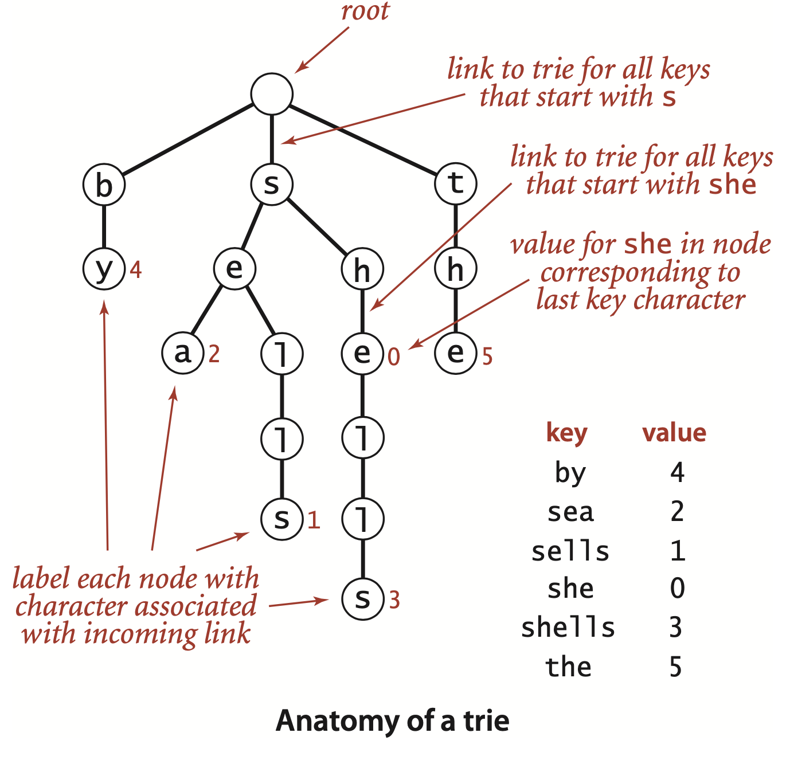
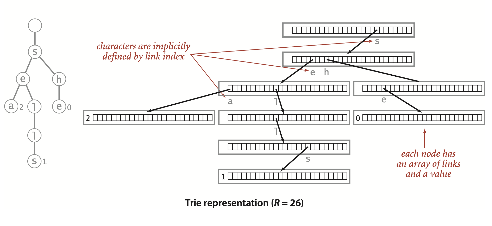
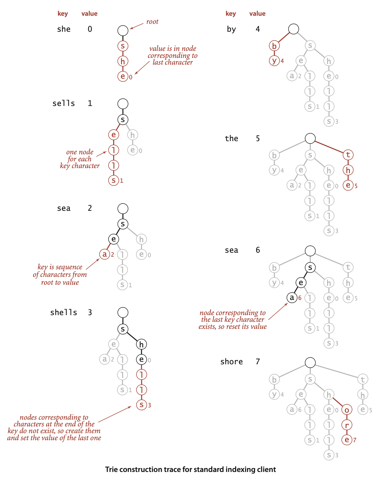
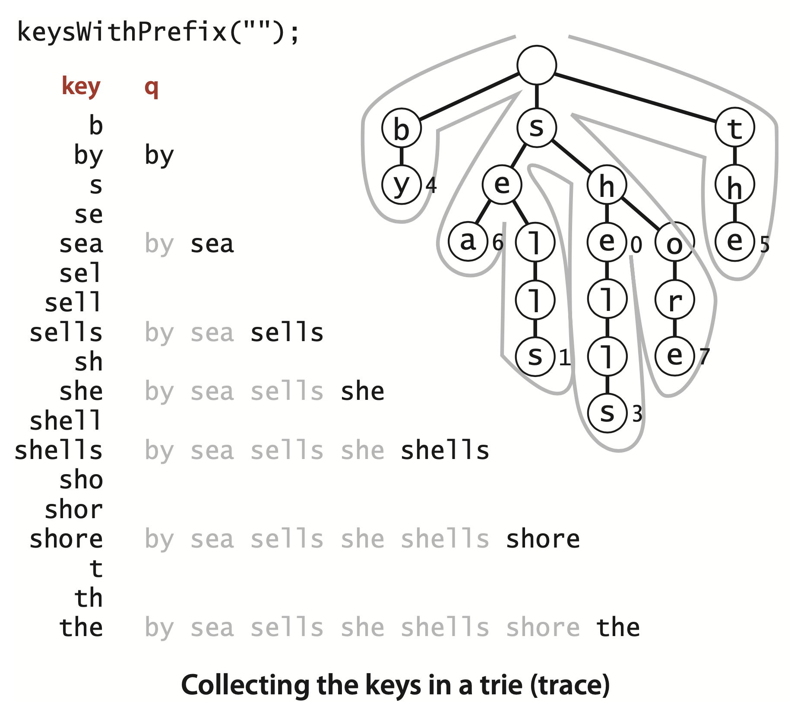
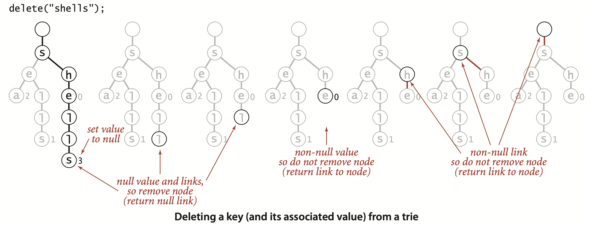
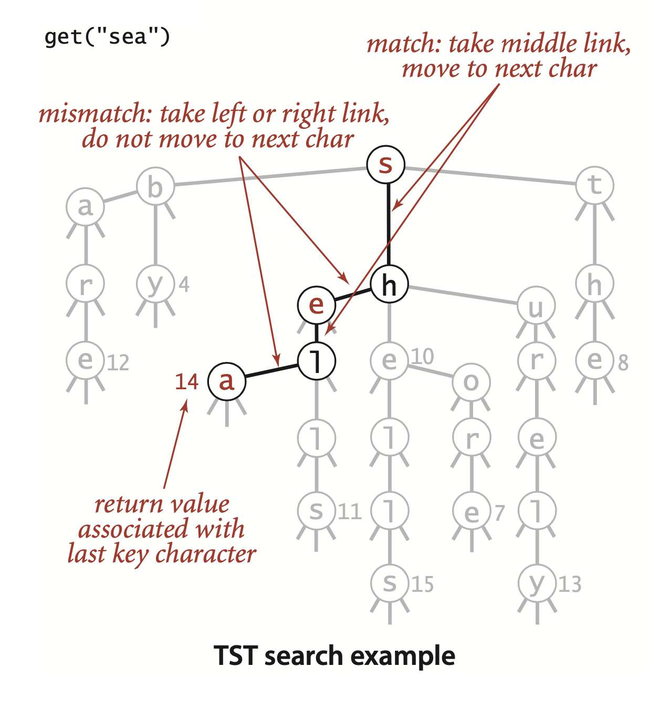

### 5.2 Tries

As with sorting, we can take advantage of properties of strings to develop search methods (symbol-table implementations) that can be more efficient than the general-purpose methods of Chapter 3 for typical applications where search keys are strings. ... even for huge tables:
- Search hits take time proportional to the length of the search key.
- Search misses involve examining only a few characters


... Simple and efficient implementations that are the method of choice for small alphabets turn out to be useless for large alphabets because they consume too much space.

- `longestPrefixOf(`) takes a string as argument and returns the longest key in the symbol table that is a prefix of that string. For the keys above, `longestPrefixOf("shell")` is she and `longestPrefixOf("shellsort")` is `shells`.
- `keysWithPrefix()` takes a string as argument and returns all the keys in the symbol table having that string as prefix. For the keys above, `keysWithPrefix("she")` is `she` and `shells`, and `keysWithPrefix("se")` is `sells` and `sea`.
- `keysThatMatch(`) takes a string as argument and returns all the keys in the symbol table that match that string, in the sense that a period (.) in the argument string matches any character. For the keys above, `keysThatMatch(".he")` returns `she` and `the`, and `keysThatMatch("s..")` returns `she` and `sea`.

#### Tries

In this section, we consider a search tree known as a *trie*, a data structure built from the characters of the string keys that allows us to use the characters of the search key to guide the search. The name “trie” is a bit of wordplay introduced by E. Fredkin in 1960 because the data structure is used for re*trie*val, but we pronounce it “try” to avoid confusion with “tree.”


##### Basic properties.
... and each node has R links, where R is the alphabet size ...  Each node also has a corresponding value, which may be null or the value associated with one of the string keys in the symbol table. Specifically, we store the value associated with each key in the node corresponding to its last character. ... *nodes with null values exist to facilitate search in the trie and do not correspond to keys.*




##### Search in a trie.







... Since the parameter R plays such a critical role, we refer to a trie for an R-character alphabet as an R-way trie.


**ALGORITHM 5.4 Trie symbol table**
```java
public class TrieST<Value>
{
    private static int R = 256; // radix
    private Node root;          // root of trie

    private static class Node
    {
        private Object val;
        private Node[] next = new Node[R];
    }

    public Value get(String key)
    {
        Node x = get(root, key, 0);
        if (x == null) return null;
        return (Value) x.val;
    }

    private Node get(Node x, String key, int d)
    {  // Return value associated with key in the subtrie rooted at x.
        if (x == null) return null;
        if (d == key.length()) return x;
        char c = key.charAt(d); // Use dth key char to identify subtrie.
        return get(x.next[c], key, d+1);
    }

    public void put(String key, Value val)
    {  root = put(root, key, val, 0);  }

    private Node put(Node x, String key, Value val, int d)
    {  // Change value associated with key if in subtrie rooted at x.
        if (x == null) x = new Node();
        if (d == key.length()) {  x.val = val; return x; }
        char c = key.charAt(d); // Use dth key char to identify subtrie.
        x.next[c] = put(x.next[c], key, val, d+1);
        return x;
    }   
}
```

##### Size.

As for the binary search trees of Chapter 3, three straightforward options are available for implementing size():
- An eager implementation where we maintain the number of keys in an instance variable `N`.
- A very eager implementation where we maintain the number of keys in a subtrie as a node instance variable that we update after the recursive calls in `put()` and `delete()`.
- A lazy recursive implementation like the one at right. It traverses all of the nodes in the trie, counting the number having a non-null value.

**Lazy recursive size() for tries**
```java
public int size()
{   return size(root);  }

private int size(Node x)
{
    if (x == null) return 0;

    int cnt = 0;
    if (x.val != null) cnt++;
    for (char c = 0; c < R; c++)
        cnt += size(x.next[c]);

    return cnt; 
}
```

As with binary search trees, the lazy implementation is instructive but should be avoided because it can lead to performance problems for clients. The eager implementations are explored in the exercises.

##### Collecting keys.

... Each time that we visit a node via a call to collect() with that node as first argument, the second argument is the string associated with that node (the sequence of characters on the path from the root to the node). 

**Collecting the keys in a trie**
```java
public Iterable<String> keys()
{   return keysWithPrefix("");  }
public Iterable<String> keysWithPrefix(String pre)
{
    Queue<String> q = new Queue<String>();
    collect(get(root, pre, 0), pre, q);
    return q;
}
private void collect(Node x, String pre,
                            Queue<String> q)
{
    if (x == null) return;
    if (x.val != null) q.enqueue(pre);
    for (char c = 0; c < R; c++)
        collect(x.next[c], pre + c, q);
}
```




##### Wildcard match.

```java
public Iterable<String> keysThatMatch(String pat)
{
    Queue<String> q = new Queue<String>();
    collect(root, "", pat, q);
    return q;
}

public void collect(Node x, String pre, String pat, Queue<String> q) {
    int d = pre.length();
    if (x == null) return;
    if (d == pat.length() && x.val != null) q.enqueue(pre);
    if (d == pat.length()) return;

    char next = pat.charAt(d);
    for (char c = 0; c < R; c++)
        if (next == '.' || next == c)
            collect(x.next[c], pre + c, pat, q);
}
```


##### Longest prefix.


**Matching the longest prefix of a given string**
```java
public String longestPrefixOf(String s)
{
    int length = search(root, s, 0, 0);
    return s.substring(0, length);
}

private int search(Node x, String s, int d, int length) {
    if (x == null) return length;
    if (x.val != null) length = d;
    if (d == s.length()) return length;
    char c = s.charAt(d);
    return search(x.next[c], s, d+1, length);
}
```


##### Deletion.



**Deleting a key (and its associated value) from a trie**
```java
public void delete(String key)
{   root = delete(root, key, 0);  }

private Node delete(Node x, String key, int d)
{
    if (x == null) return null;
    if (d == key.length())
        x.val = null;
    else
    {
        char c = key.charAt(d);
        x.next[c] = delete(x.next[c], key, d+1);
    }

    if (x.val != null) return x;

    for (char c = 0; c < R; c++)
    if (x.next[c] != null) return x;
    return null;
}
```


#### Properties of tries

**Proposition F.** The linked structure (shape) of a trie is independent of the key insertion/deletion order: there is a unique trie for any given set of keys.  
**Proof:** Immediate, by induction on the subtries.


**Proposition G**. The number of array accesses when searching in a trie or inserting a key into a trie is at most 1 plus the length of the key.  
**Proof:** Immediate from the code. The recursive `get()` and `put()` implementations carry an argument `d` that starts at 0, increments for each call, and is used to stop the recursion when it reaches the key length.

... we could not expect to do better than search time proportional to the length of the search key. Whatever algorithm or data structure we are using, we cannot know that we have found a key that we seek without examining all of its characters. From a practical standpoint this guarantee is important because it *does not depend on the number of keys* : when we are working with 7-character keys like license plate numbers, we know that we need to examine at most 8 nodes to search or insert; when we are working with 20-digit account numbers, we only need to examine at most 21 nodes to search or insert.


##### Expected time bound for search miss.


**Proposition H.** The average number of nodes examined for search miss in a trie built from $N$ random keys over an alphabet of size $R$ is $\sim \log_R N$.  
**Proof sketch** (for readers who are familiar with probabilistic analysis): The probability that each of the $N$ keys in a random trie differs from a random search key in at least one of the leading $t$ characters is $(1 - R^{-t})^N$. Subtracting this quantity from $1$ gives the probability that one of the keys in the trie matches the search key in all of the leading $t$ characters. In other words, $1 - (1 - R^{-t})^N$ is the probability that the search requires more than $t$ character compares. From probabilistic analysis, the sum for $t = 0, 1, 2, . . .$ of the probabilities that an integer random variable is $>t$ is the average value of that random variable, so the average search cost is
$$
1 - (1 - R^{-1})^N + 1 - (1 - R^{-2})^N +...+ 1 - (1 - R^{-t})^N + ...
$$
Using the elementary approximation $(1-1/x)^x \sim e^{-1}$, we find the search cost to be approximately
$$
(1 - e ^ {- N/R^1}) + (1 - e ^ {- N/R^2}) +...+ (1 - e ^ {- N/R^t}) +...
$$
The summand is extremely close to $1$ for approximately $\ln_R N$ terms with $R^t$ substantially smaller than $N$; it is extremely close to 0 for all the terms with $R^t$ substantially greater than $N$; and it is somewhere between 0 and 1 for the few terms with $R^t \approx N$. So the grand total is about $log_R N$.


> Contributor's Note:  
> $$E(X) = \sum_{k=1}^{b} E(I_k) = \sum_{k=1}^{b} P(X \geq k) = \sum_{n=0}^{b-1} P(X > n) = \sum_{n=0}^{\infty} G(n).$$


>Contributor's Note:  
>number of nodes of a trie with the depth $d$ is:
>
>$$
>\sum_{i=0}^{d-1} R^i = \frac{R^d - 1}{R - 1}.
>$$
>therefore:
>$$
>\ln_R \frac{R^d - 1}{R - 1} = \ln_R (R^d - 1) - \ln_R (R - 1)
>$$
>then
>$$
>d= \log_R​(1+N(R−1))
>$$
>For large $N$, $1 + N(R-1) \approx N R$, and again $d \sim \log_R N$.


From a practical standpoint, the most important implication of this proposition is that *search miss does not depend on the key length*. For example, it says that unsuccessful search in a trie built with 1 million random keys will require examining only three or four nodes, whether the keys are 7-digit license plates or 20-digit account numbers.


##### Space.

**Proposition I.** The number of links in a trie is between RN and RNw, where w is the average key length.  
**Proof:** Every key in the trie has a node containing its associated value that also has $R$ links, so the number of links is at least $RN$. If the first characters of all the keys are different, then there is a node with $R$ links for every key character, so the number of links is $R$ times the total number of key characters, or $RNw$.


> Contributor's Note
>```
>abcde
>fghij
>
>(root)
> ├─ a
> │   └─ b
> │       └─ c
> │           └─ d
> │               └─ e   [end of key 1]
> └─ f
>     └─ g
>         └─ h
>             └─ i
>                 └─ j   [end of key 2]
>
>
>abcd e
>abcd x
>
>
>(root)
> └─ a
>     └─ b
>         └─ c
>             └─ d
>               ├─ e   [end of key 1]
>               └─ x   [end of key 2]
>```
>In the worst case, there is a separate node with its R links for each character of the strings. In better cases, some of these nodes are shared.

##### One-way branching.
The primary reason that trie space is excessive for long keys is that long keys tend to have long tails in the trie, with each node having a single link to the next node (and, therefore, $R-1$ null links).


The bottom line is this: do not try to use Algorithm 5.4 for large numbers of long keys taken from large alphabets, because it will require space proportional to $R$ times the total number of key characters. Otherwise, if you can afford the space, trie performance is difficult to beat.


#### Ternary search tries (TSTs)
To help us avoid the excessive space cost associated with $R$-way tries, ... In a TST, each node has a character, three links, and a value. The three links correspond to keys whose current characters are less than, equal to, or greater than the node’s character.


##### Search and insert. 




```java
public class TST<Value>
{
    private Node root;          // root of trie

    private class Node
    {
        char c;                 // character
        Node left, mid, right;  // left, middle, and right subtries
        Value val;              // value associated with string
    }

    public Value get(String key)  // same as for tries (See page 737).
    
    private Node get(Node x, String key, int d)
    {
        if (x == null) return null;
        char c = key.charAt(d);
        if      (c < x.c) return get(x.left,  key, d);
        else if (c > x.c) return get(x.right, key, d);
        else if (d < key.length() - 1)
                          return get(x.mid, key, d+1);
        else return x;
    }

    public void put(String key, Value val)
    {   root = put(root, key, val, 0);  }

    private Node put(Node x, String key, Value val, int d)
    {
        char c = key.charAt(d);
        if (x == null) { x = new Node(); x.c = c; }
        if      (c < x.c) x.left  = put(x.left,  key, val, d);
        else if (c > x.c) x.right = put(x.right, key, val, d);
        else if (d < key.length() - 1)
                          x.mid   = put(x.mid,key, val, d+1);
        else x.val = val;
        return x; 
    }
}
```


we see that TSTs correspond to 3-way string quicksort in the same way that BSTs correspond to quicksort and tries correspond to MSD sorting.


#### Properties of TSTs

.. the BST representations of each trie node depend on the order of key insertion, as with any other BS

##### Space.

**Proposition J.** The number of links in a TST built from $N$ string keys of average length $w$ is between $3N$ and $3Nw$.  
**Proof.** Immediate, by the same argument as for Proposition I.

##### Search cost.


**Proposition K**. A search miss in a TST built from N random string keys requires $\sim ln N$ character compares, on the average. A search hit or an insertion in a TST uses a character compare for each character in the search key.
**Proof:** The search hit/insertion cost is immediate from the code. The search miss cost is a consequence of the same arguments discussed in the proof sketch of Proposition H. We assume that all but a constant number of the nodes on the search path (a few at the top) act as random BSTs on $R$ character values with average path length $\ln R$, so we multiply the time cost $\log_R N = \ln N / \ln R$ by $\ln R$.


... If space is available, R-way tries provide the fastest search, essentially completing the job with a constant number of character compares. For large alphabets, where space may not be available for R-way tries, TSTs are preferable,  since they use a logarithmic number of character compares, while BSTs use a logarithmic number of key compares.


>Contributor's Note:  
> For practice:


```java
public class TrieST<Value>
{
    private int R; 
    private Node root;

    private static class Node
    {}

    public Value get(String key)
    {}

    private Node get(Node x, String key, int d)
    {}

    public void put(String key, Value val)
    {}

    private Node put(Node x, String key, Value val, int d)
    {}   

    public int size()
    {}

    private int size(Node x)
    {}

    public Iterable<String> keys()
    {}

    public Iterable<String> keysWithPrefix(String pre)
    {}

    private void collect(Node x, String pre, Queue<String> q)
    {}

    public Iterable<String> keysThatMatch(String pat)
    {}

    public void collect(Node x, String pre, String pat, Queue<String> q) 
    {}

    public String longestPrefixOf(String s)
    {}

    private int search(Node x, String s, int d, int length) 
    {}

    public void delete(String key)
    {}

    private Node delete(Node x, String key, int d)
    {}
}
```

```java
public class TST<Value>
{
    private class Node
    {}

    public Value get(String key) 
    {}
    
    private Node get(Node x, String key, int d)
    {}

    public void put(String key, Value val)
    {}

    private Node put(Node x, String key, Value val, int d)
    {}
}
```
