### 5.3 Substring Search

 ... given a text string of length $N$ and a pattern string of length $M$, find an occurrence of the pattern within the text.

There is a simple brute-force algorithm for substring search that is in widespread use. While it has a worst-case running time proportional to $MN$, the strings that arise in many applications lead to a running time that is (except in pathological cases) proportional to $M + N$. ... an optimized version provides a standard benchmark that is difficult to beat, even with a clever algorithm.

#### Brute-force substring search

```java
public static int search(String pat, String txt)
{
    int M = pat.length();
    int N = txt.length();
    for (int i = 0; i <= N - M; i++)
    {
        int j;
        for (j = 0; j < M; j++)
            if (txt.charAt(i+j) != pat.charAt(j))
                break;
        if (j == M) return i;    // found
    }
    return N;                   // not found
}
```

... Our convention is to return the value $N$ to indicate a mismatch. ... For example, suppose that you search for the pattern pattern in the text of this paragraph. There are 191 characters up to the end of the first occurrence of the pattern, only 7 of which are the character p (and there are no occurrences of pa), so the total number of character compares is 191+7, for an average of 1.036 compares per character in the text.


**Proposition M.** Brute-force substring search requires $~NM$ character compares to search for a pattern of length M in a text of length N, in the worst case.  
**Proof:** A worst-case input is when both pattern and text are all `A`s followedby a `B`. Then for each of the $N - M + 1$ possible match positions, all the characters in the pattern are checked against the text, for a total cost of $M(N - M + 1)$. Normally $M$ is very small compared to $N$, so the total is $\sim NM$.

>Contributor's Note:  
>$N - M + 1$ is simply the number of possible starting positions in the text where a pattern of length $M$ could fit.

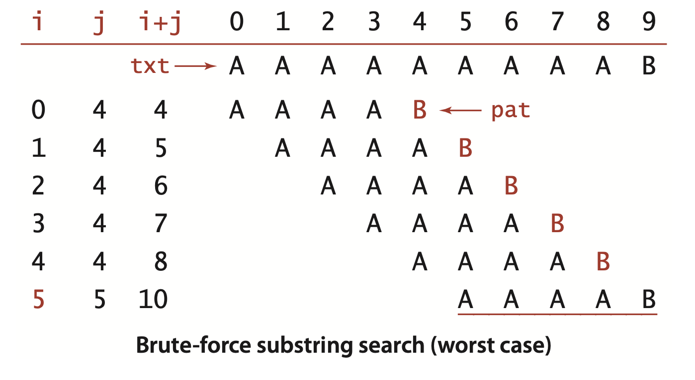


**Alternate implementation of brute-force substring search (explicit backup)**
```java
public static int search(String pat, String txt)
{
    int j, M = pat.length();
    int i, N = txt.length();
    for (i = 0, j = 0; i < N && j < M; i++)
    {
        if (txt.charAt(i) == pat.charAt(j)) j++;
        else { i -= j; j = 0;  }
    }
    if (j == M) return i - M;  // found
    else            return N;  // not found
}
```

> Contributor's Note:  
> After `i -= j`, the loop increases `i` through `i++`.

To understand it,
note that i in this code maintains the value of i+j in the previous code: it points to the end of the sequence of already-matched characters in the text (where i pointed to the beginning of the sequence before)


#### Knuth-Morris-Pratt substring search

... When the mismatch is detected, we know that the six previous characters in the text must be `B A A A A B` (the first five match and the sixth does not), with the text pointer now pointing at the `B` at the end. The key observation is that we need not back up the text pointer `i`, since the previous four characters in the text are all `A`s and do not match the first character in the pattern. Furthermore, the character currently pointed to by `i` is a `B` and does match the first character in the pattern, so we can increment `i` and compare the next character in the text with the second character in the pattern. ... Since the value of `i` does not change within the loop, this method does at most $N$ character compares. Surprisingly, it is *always* possible to find a value to set the `j` pointer to on a mismatch, so that the `i` pointer is never decremented.

Fully skipping past all the matched characters when detecting a mismatch will not work when the pattern could match itself at any position overlapping the point of the mismatch. For example, when searching for the pattern `A A B A A A` in the text `A A B A A *B* A A A A`, we first detect the mis match at position 5, but we had better restart at position 3 to continue the search, since otherwise we would miss the match.

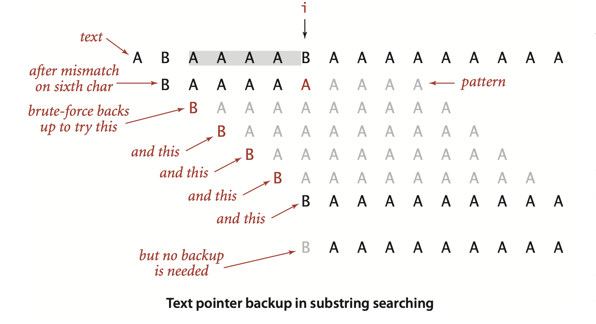


> Contributor's Note:
>
>The idea is that when a mismatch occurs, we move the pointer in the text by one position without resetting the pattern pointer back to the beginning.
>
>To avoid moving the `i` pointer backward in the text and also in the pattrn, we need extra memory that keeps track of previous and the current characters in both the text and the pattern whenever we encounter a mismatch at `j`. This is stored in an \$R \times M\$ matrix called `dfs`, where:
>
>* **Rows** represent all possible characters.
>* **Columns** represent positions in the pattern.
>* Each entry `dfs[c][j]` tells us where to move in the pattern if we see character `c` in the text when we are at position `j` in the pattern, to check with the character after `c` in the text. 
>
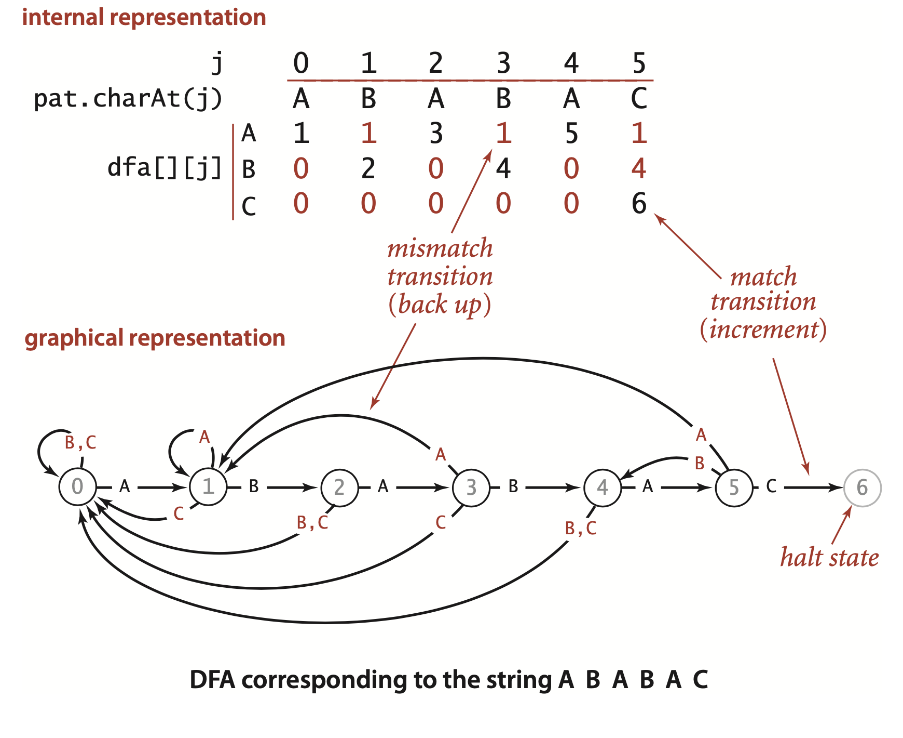
>
>For example, `dfs[3][4]` tells us where to go if the text character encoded as `3` is encountered while we are at the 5th character of the pattern.
>
>One key observation is that the entire `dfs` table is built **only from the pattern**, not from the text.
>
>There are two kinds of entries in `dfs`: **match** and **mismatch**.
> 
>* **Match case:**
>  If the current pattern character matches the text, we advance both `i` and `j` by one.
>
>  ```java
>  dfs[pat.charAt(j)][j] = j + 1;
>  ```
>
>* **Mismatch case:**
> This is where things become more involved. We introduce a variable `X`, which is the **LPS** (Longest Prefix Suffix). The LPS at position `j` is the length of the longest prefix of the pattern that would also appear as a suffix **if the text matched the pattern up to that position**. 
>
>  Examples:
>
>  * `ABA → LPS = 1`
>  * `ABAB → LPS = 2`
>  * `ABABA → LPS = 3`
>  * `ABABAB → LPS = 4`
>  * `ABABABC → LPS = 0`
>
>  Intuitively, when we have a prefix which is also a suffix, it means we have already partially matched the pattern by that length. At each index `j`, the value of `X` represents the LPS at `j-1` (The LPS value before the mismatch occurs). 
>
>  When a mismatch occurs at `j`, we don’t need to restart matching from the beginning of the pattern. Instead, we can continue from the next character of the prefix, since the prefix is already matched with the text (as suffix, the string ending at `j - 1`) and does not need to be rechecked. 
>
>  Therefore, if we see a mismatch at `j`, if increase `i` by one and for `j`, we go exactly where we would have gone if that character that caused mismatch had occurred at `X`. At each `j`, `X` is the number of already matched character before `j`.
>
> At `j`, `X` is prefix-suffix *length* at `j-i`, therefore as an index, it points to the one index after LPS at `j-1`. Important to note: at `j`, you're one character after the last string and `X` is the index of one character after LPS. 
>
> ```java
>   for (int c = 0; c < R; c++)
>       dfs[c][j] = dfs[c][X];
>  ```
>
>The only step left is to update the value of `X`. We need to obtain LPS length at position `j`, given that we already have an LPS of length `X` at position `j-1` (meaning we have matched `X` characters so far) and the `j`th character is `c`.
>
>The question becomes: *“If we currently have `X` matches, how many matches do we have if the next character is `c`?”*
>
>This is exactly what the `dfs` table encodes. When we have `X` matches, it is equivalent to being at index `j = X` in the pattern. Therefore:
>
> ```java
> X = dfs[pat.charAt(j)][X];
> ```
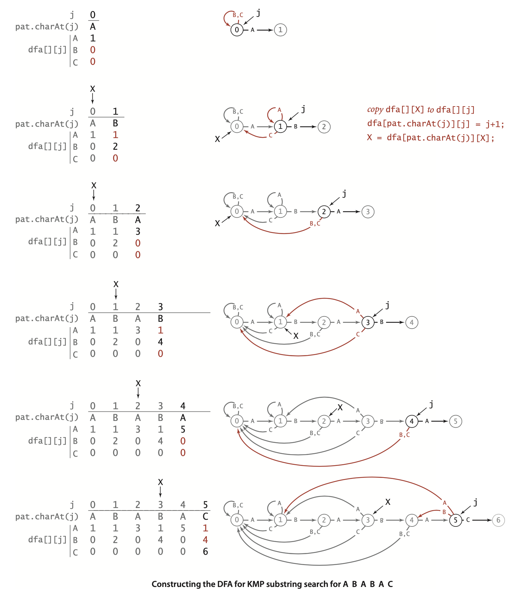


**ALGORITHM 5.6 Knuth-Morris-Pratt substring search**
```java
public class KMP
{
    private String pat;
    private int[][] dfa;
    public KMP(String pat)
    {  // Build DFA from pattern.
        this.pat = pat;
        int M = pat.length();
        int R = 256;
        dfa = new int[R][M];
        dfa[pat.charAt(0)][0] = 1;
        for (int X = 0, j = 1; j < M; j++)
        {  // Compute dfa[][j].
            for (int c = 0; c < R; c++)
                dfa[c][j] = dfa[c][X];          // Copy mismatch cases.
            dfa[pat.charAt(j)][j] = j+1;        // Set match case.
            X = dfa[pat.charAt(j)][X];          // Update restart state.
        }
    }

    public int search(String txt)
    {  // Simulate operation of DFA on txt.
        int i, j, N = txt.length(), M = pat.length();
        for (i = 0, j = 0; i < N && j < M; i++)
            j = dfa[txt.charAt(i)][j];
        if (j == M) return i - M;  // found (hit end of pattern)
        else        return N;      // not found (hit end of text)
    }
    public static void main(String[] args)
    {
        String pat = args[0];
        String txt = args[1];
        KMP kmp = new KMP(pat);
        StdOut.println("text:    " + txt);
        int offset = kmp.search(txt);
        StdOut.print("pattern: ");
        for (int i = 0; i < offset; i++)
            StdOut.print(" ");
        StdOut.println(pat);
     }
}
```
```
% java KMP AACAA AABRAACADABRAACAADABRA
text:    AABRAACADABRAACAADABRA
pattern:             AACAA
```

**Proposition N.** Knuth-Morris-Pratt substring search accesses no more than $M+N$ characters to search for a pattern of length $M$ in a text of length $N$.
Proof. Immediate from the code: we access each pattern character once when computing `dfa[][]` and each text character once (in the worst case) in `search()`.

Another parameter comes into play: for an $R$-character alphabet, the total running time (and space) required to build the DFA is proportional to $MR$. It is possible to remove the factor of $R$ by building a DFA where each state has a match transition and a mismatch transition (not transitions for each possible character), though the construction is somewhat more intricate.


In practice, the speedup over the brute-force method is not often important because few applications involve searching for highly self-repetitive patterns in highly self-repetitive text. Still, the method has the practical advantage that it never backs up in the input. This property makes KMP substring search more convenient for use on an input stream of undetermined length (such as standard input) than algorithms requiring backup, which need some complicated buffering in this situation. Ironically, when backup is easy, we can do significantly better than KMP. Next, we consider a method that generally leads to substantial performance gains precisely because it can back up in the text.


#### Boyer-Moore substring search

When backup in the text string is not a problem, we can develop a significantly faster substring-searching method by scanning the pattern from right to left when trying to match it against the text.


##### Mismatched character heuristic.

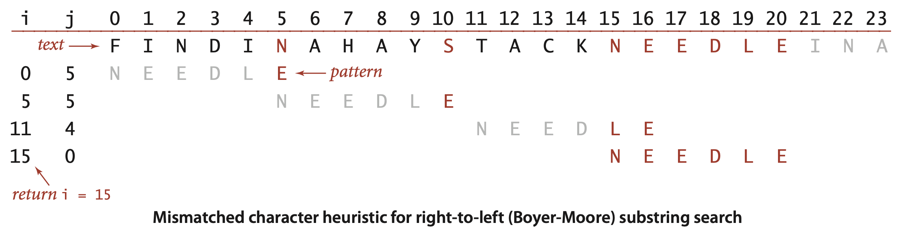


##### Starting point.
 To implement the mismatched character heuristic, we use an array right[] that gives, for each character in the alphabet, the index of its rightmost occurrence in the pattern (or -1 if the character is not in the pattern). 

 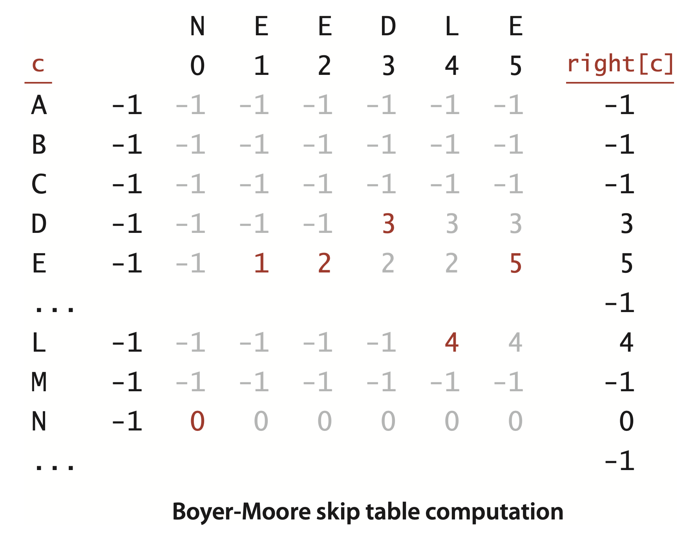


 ##### Substring search.
 If txt.charAt(i+j) is equal to pat.charAt(j) for all j from M-1 down to 0, then there is a match. Otherwise, there is a character mismatch, and we have one of the following three cases:

- If the character causing the mismatch is not found in the pattern, we can slide the pattern `j+1` positions to the right (increment `i` by `j+1`). ... we could further increase
i by precomputing a KMP-like table (see example at right).


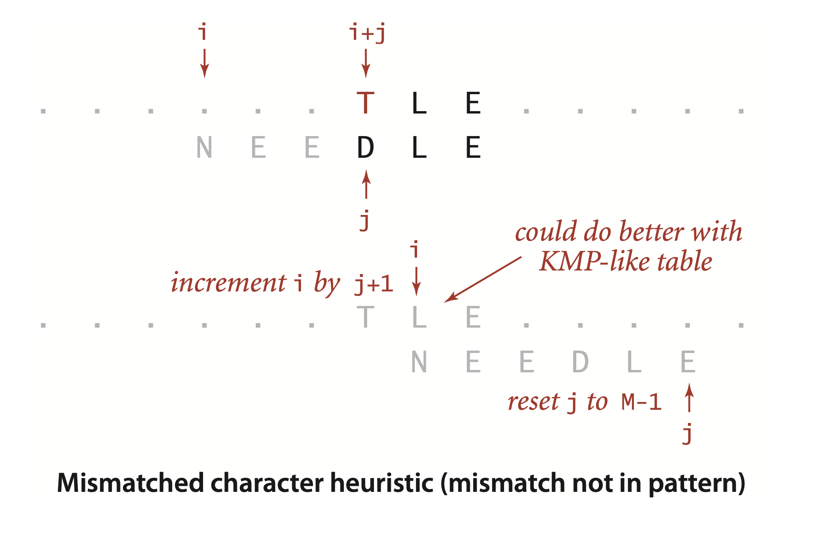


- If the character `c` causing the mismatch is found in the pattern, we use the right[] array to line up the pattern with the text so that character will match its rightmost occurrence in the pattern. To do so, we increment i by j minus right[c]. Again, anything less would align that text character with a pattern character it could not match (one to the right of its rightmost occurrence). Again, there is a possibility that we could do better with a KMP-like table, as indicated in the top example in the figure on page 773.

- If this computation would not increase i, we just increment i instead, to make sure that the pattern always slides at least one position to the right. The bottom example in the figure at right illustrates this situation.

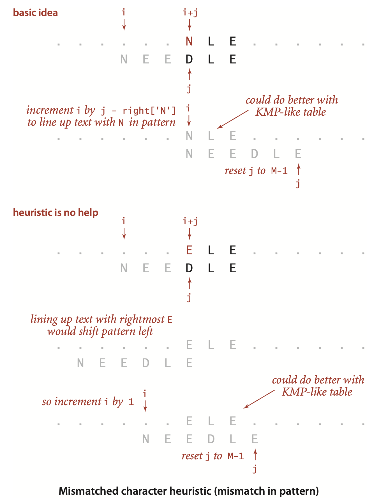


The full Boyer-Moore algorithm takes into account precomputed mismatches of the pattern with itself (in a manner similar to the KMP algorithm) and provides a linear-time worst-case guarantee (whereas Algorithm 5.7 can take time proportional to $NM$ in the worst case—see Exercise 5.3.19). We omit this computation because the mismatched character heuristic controls the performance in typical practical applications.

**Property O.** On typical inputs, substring search with the Boyer-Moore mismatched character heuristic uses $\sim N/M$ character compares to search for a pattern of length $M$ in a text of length $N$.  
**Discussion:** This result can be proved fo rvarious random string models, but such models tend to be unrealistic, so we shall skip the details. In many practical situations it is true that all but a few of the alphabet characters appear nowhere in the pattern, so nearly all compares lead to M characters being skipped, which gives the stated result.


**ALGORITHM 5.7 Boyer-Moore substring search (mismatched character heuristic)**
```java
public class BoyerMoore
{
    private int[] right;
    private String pat;

    BoyerMoore(String pat)
    {  // Compute skip table.
        this.pat = pat;
        int M = pat.length();
        int R = 256;
        right = new int[R];
        for (int c = 0; c < R; c++)
            right[c] = -1;                  // -1 for chars not in pattern
        for (int j = 0; j < M; j++)         // rightmost position for
            right[pat.charAt(j)] = j;       //   chars in pattern
    }

    public int search(String txt)
    {  // Search for pattern in txt.
        int N = txt.length();
        int M = pat.length();
        int skip;
        for (int i = 0; i <= N-M; i += skip)
        {  // Does the pattern match the text at position i ?
            skip = 0;
            for (int j = M-1; j >= 0; j--)
                if (pat.charAt(j) != txt.charAt(i+j))
                {
                    skip = j - right[txt.charAt(i+j)];
                    if (skip < 1) skip = 1;
                    break;
                }
            if (skip == 0) return i;        // found.
        }
        return N;                           // not found.
    }

    public static void main(String[] args)  // See page 769.
}
```


#### Rabin-Karp fingerprint search
... We compute a hash function for the pattern and then look for a match by using the same hash function for each possible M-character substring of the text. If we find a text substring with the same hash value as the pattern, we can check for a match. ... A straightforward implementation based on this description would be much slower than a brute-force search (since computing a hash function that involves every character is likely to be much more expensive than just comparing characters), but Rabin and Karp showed that it is easy to compute hash functions for M-character substrings in constant time (after some preprocessing), which leads to a linear-time substring search in practical situations.


##### Basic plan.

A string of length `M` corresponds to an `M`-digit base-`R` number.To use a hash table of size `Q` for keys of this type, we need a hash function to convert an `M`-digit base-`R` number to an int value between 0 and `Q-1`. Modular hashing (see Section 3.4) provides an answer: take the remainder when dividing the number by `Q`. In practice, we use a random prime `Q`, taking as large a value as possible while avoiding overflow (because we do not actually need to store a hash table). The method is simplest to understand for small `Q` and `R = 10`, shown in the example below. To find the pattern 2 6 5 3 5 in the text 3 1 4 1 5 9 2 6 5 3 5 8 9 7 9 3 , we choose a table size `Q` (997 in the example), compute the hash value `26535 % 997 = 613`,and thenl ook for a match by computing hashvalues for each five-digit substring in the text. In the example, we get the hash values 508, 201, 715, 971, 442, and 929 before finding the match 613.

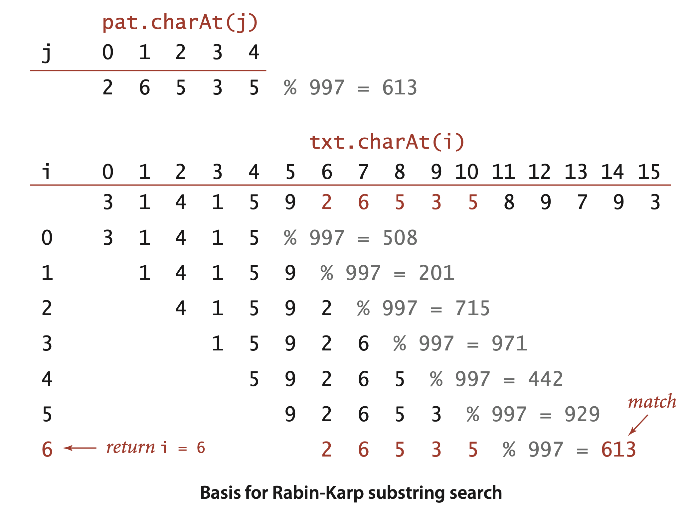


##### Computing the hash function.

**Horner’s method, applied to modular hashing**
```java
private long hash(String key, int M)
{  // Compute hash for key[0..M-1].
    long h = 0;
    for (int j = 0; j < M; j++)
        h = (R * h + key.charAt(j)) % Q;
    return h;
}
```
 ... The same method can work for computing the hash functions in the text, but the cost for the substring search would be a multiplication, addition, and remainder calculation for each text character, for a total of NM operations in the worst case, no improvement over the brute-force method.


 ##### Key idea.

Using the notation $t_i$  for `txt.charAt(i)`, the number corresponding to the `M`-character substring of `txt` that starts at position `i` is
$$
x_i = t_i R^{M-1} + t_{i+1} R^{M-2} + . . . + t_{i+M-1} R^0
$$
and we can assume that we know the value of $h(x_i) = x_i$ mod `Q` . Shifting one position right in the text corresponds to replacing $x_i$ by
$$
x_{i+1} = (x_i - t_iR^{M-1})R + t_{i+M} .
$$


Now, the crucial point is that we do not have to maintain the values of the numbers, just the values of their remainders when divided by `Q`. A fundamental property of the modulus operation is that if we take the remainder when divided by `Q` after each arithmetic operation, then we get the same answer as if we were to perform all of the arithmetic operations, then take the remainder when divided by `Q`. ... The result is that we can effectively move right one position in the text in constant time, whether M is 5 or 100 or 1,000.

> Contributor's Note:  
> Rolling hash is not $O(MN)$, unlike normal hashing where we would need to calculate $(N - M) \times M$ hashes.

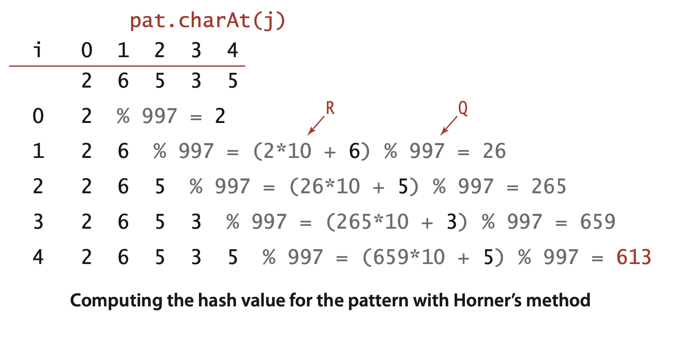

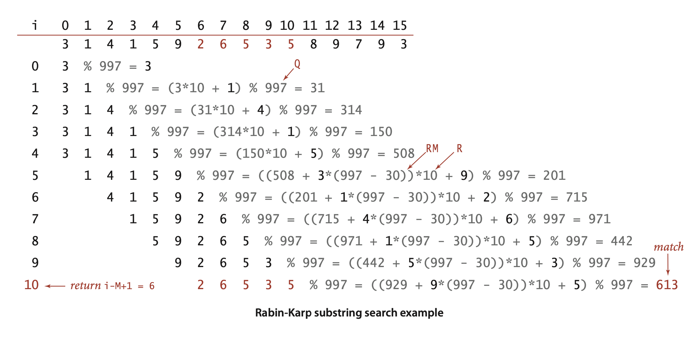


**ALGORITHM 5.8 Rabin-Karp fingerprint substring search **
```java
public class RabinKarp
{
    private String pat;         // pattern (only needed for Las Vegas)
    private long patHash;       // pattern hash value
    private int M;              // pattern length
    private long Q;             // a large prime
    private int R = 256;        // alphabet size
    private long RM;            // R^(M-1) % Q

    
    public RabinKarp(String pat)
    {
        this.pat = pat;        // save pattern (only needed for Las Vegas)
        this.M = pat.length(); // See Exercise 5.3.33.
        Q = longRandomPrime();
        RM = 1;
        for (int i = 1; i <= M-1; i++)      // Compute R^(M-1) % Q for use
            RM = (R * RM) % Q;              //   in removing leading digit.
        patHash = hash(pat, M);
    }

    public boolean check(int i)  // Monte Carlo (See text.)
    {  return true;  }  //   For Las Vegas, check pat vs txt(i..i-M+1).
    
    private long hash(String key, int M)
    {
        long h = 0;
        for (int j = 0; j < M; j++)
            h = (R * h + key.charAt(j)) % Q;
        return h;
    }
    
    private int search(String txt)
    {  // Search for hash match in text.
        int N = txt.length();
        long txtHash = hash(txt, M);
        if (patHash == txtHash) return 0;       // Match at beginning.
        for (int i = M; i < N; i++)
        {  // Remove leading digit, add trailing digit, check for match.
            txtHash = (txtHash + Q - RM*txt.charAt(i-M) % Q) % Q;
            txtHash = (txtHash*R + txt.charAt(i)) % Q;
            if (patHash == txtHash)
                if (check(i - M + 1)) return i - M + 1; // match
        }
        return N;                                       // no match found
    }
}
```
>Contributor's Note:
> Adding `Q` guarantees the value is non-negative before taking `% Q`.
 
 ##### A trick: Monte Carlo correctness.
 fter finding a hash value for an M-character substring of txt that matches the pattern hash value, you might expect to see code to compare those characters with the pattern to ensure that we have a true match, not just a hash collision. We do not do that test because using it requires backup in the text string. Instead, we make the hash table “size” Q as large as we wish, since we are not actually building a hash table, just testing for a collision with one key, our pattern. We will use a long value greater than 1020, making the probability that a random key hashes to the same value as our pattern less than 10–20, an exceedingly small value. If that value is not small enough for you, you could run the algorithms again to get a probability of failure of less than 10–40. This algorithm is an early and famous example of a Monte Carlo algorithm that has a guaranteed completion time but fails to output a correct answer with a small probability. 


**Property P.** The Monte Carlo version of Rabin-Karp substring search is linear-time and extremely likely to be correct, and the Las Vegas version of Rabin-Karp substring search is correct and extremely likely to be linear-time.  
**Discussion:** The use of the very large value of `Q`, made possible by the fact that we need not maintain an actual hash table, makes it extremely unlikely that a collision will occur. Rabin and Karp showed that when `Q` is properly chosen, we get a hash collision for random strings with probability `1/Q`, which implies that, for practical values of the variables, there are no hash matches when there are no substring matches and only one hash match if there is a substring match. Theoretically, a text position could lead to a hash collision and not a substring match, but in practice it can be relied upon to find a match.


Brute-force search is easy to implement and works well in typical cases (Java’s indexOf() method in String uses brute-force search); Knuth-Morris-Pratt is guaranteed linear-time with no backup in the input; Boyer-Moore is sublinear (by a factor of M) in typical situations; and RabinKarp is linear. Each also has drawbacks: brute-force might require time proportional to MN; Knuth-Morris-Pratt and Boyer-Moore use extra space; and Rabin-Karp has a relatively long inner loop (several arithmetic operations, as opposed to character compares in the other methods). 

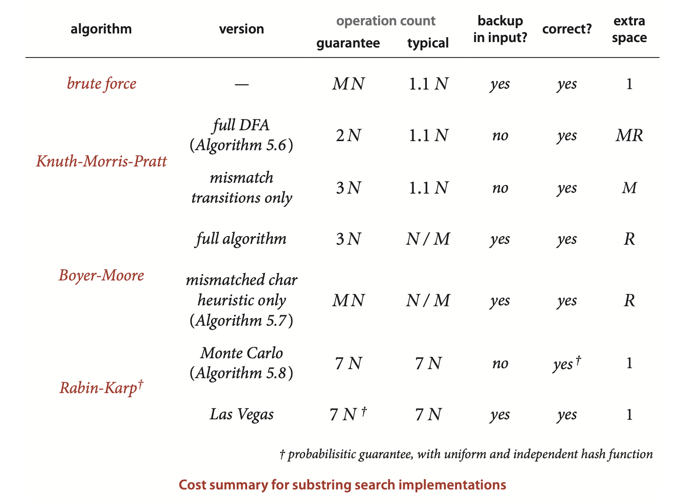


> Contributor's Note:

Brute-force substring search
```java
public static int search(String pat, String txt)
{}
```

Alternate implementation of brute-force substring search (explicit backup)
```java
public static int search(String pat, String txt)
{}
```


```java
public class KMP
{
    public KMP(String pat)
    {}
    public int search(String txt)
    {}
    public static void main(String[] args)
    {}
}
```


Boyer-Moore substring search (mismatched character heuristic)
```java
public class BoyerMoore
{
    BoyerMoore(String pat)
    {}

    public int search(String txt)
    {}

    public static void main(String[] args)  // See page 769.
}
```


Rabin-Karp fingerprint substring search
```java
public class RabinKarp
{
    public RabinKarp(String pat)
    {}

    public boolean check(int i)  // Monte Carlo (See text.)
    {  return true;  }  //   For Las Vegas, check pat vs txt(i..i-M+1).
    
    private long hash(String key, int M)
    {}
    
    private int search(String txt)
    {}
}
```
