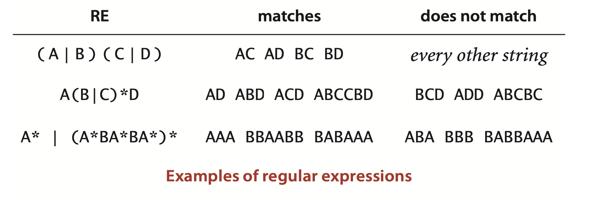
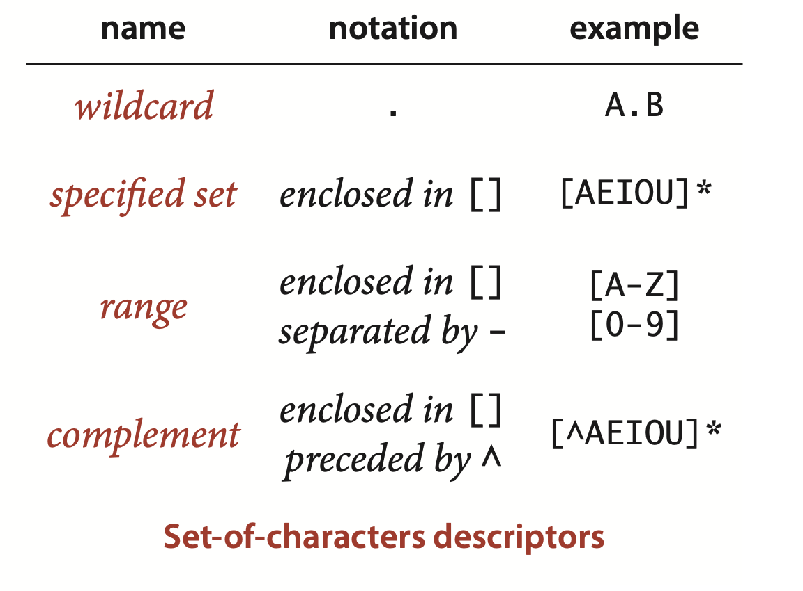
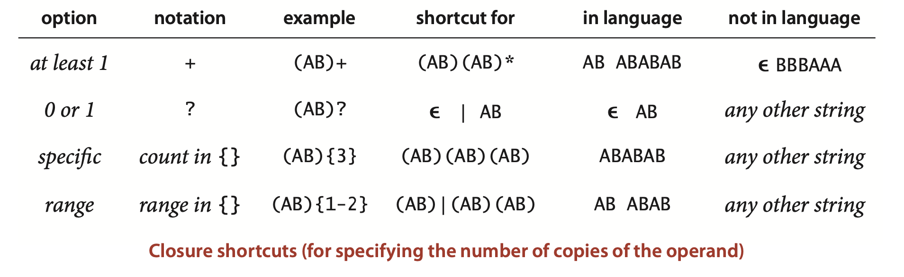
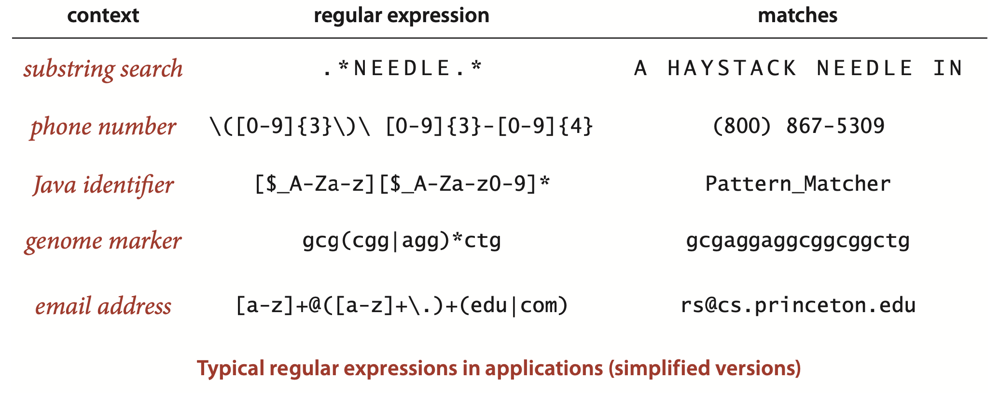
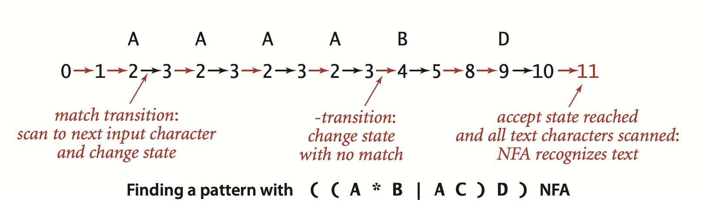
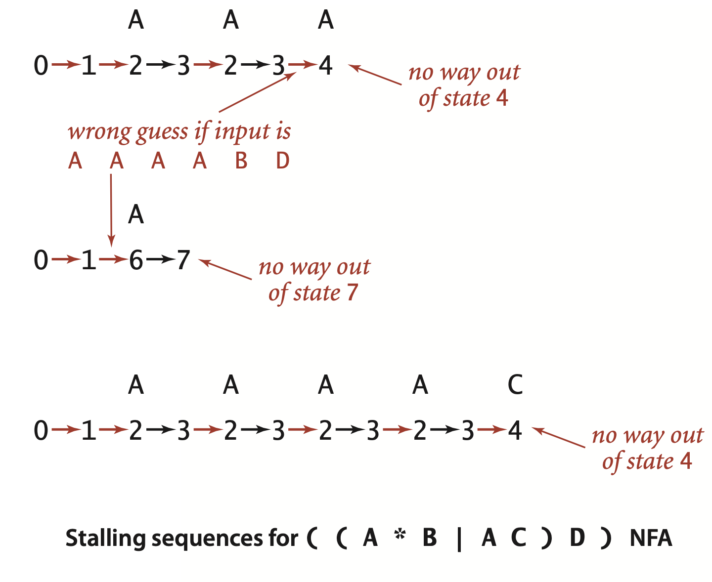
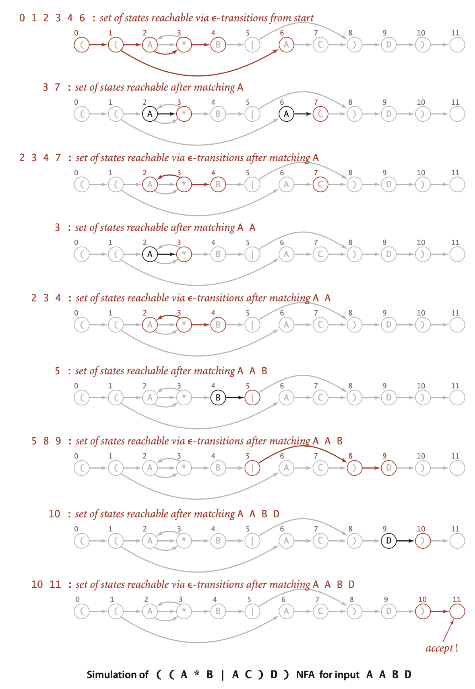
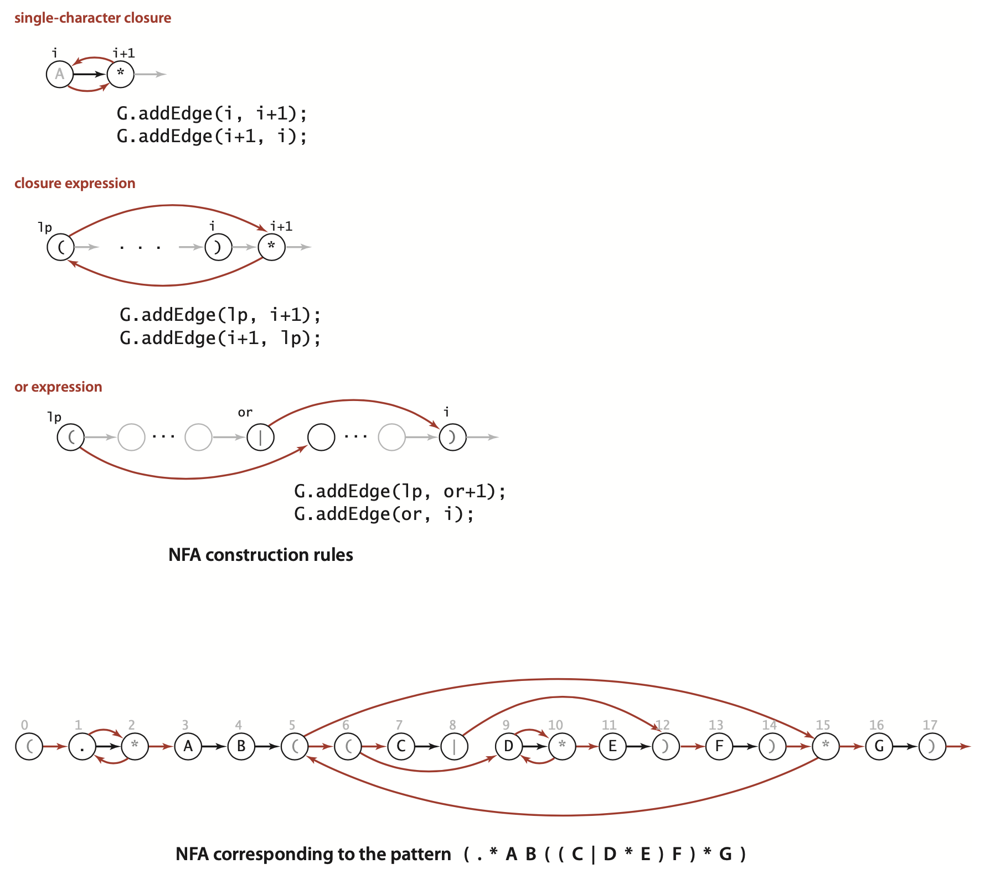
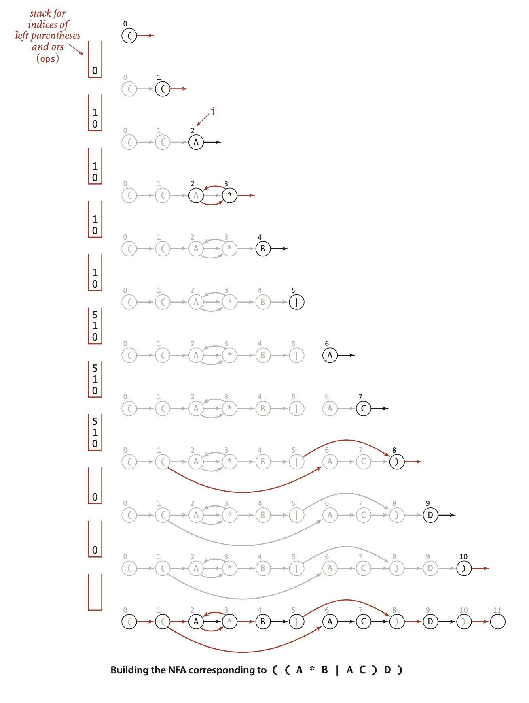

### 5.4 Regular Expressions


... The basic mechanisms we will consider make possible a very powerful string-searching facility that can match complicated $M$-character patterns in $N$-character text strings in time proportional to $MN$ in the worst case, and much faster for typical applications.


#### Describing patterns with regular expressions 
- *Concatenation.* ... When we write `A B` , we are specifying the language `{ A B }` that has one two-character string, formed by concatenating `A` and `B`.
- *Or.* The second fundamental operation allows us to specify alternatives in the pattern. ...  We will use the vertical bar symbol | to denote this operation. For example, `A | B` specifies the language `{A,B}` and `A|E|I|O|U` specifies the language `{A,E,I,O,U}`.Concatenation has higher precedence than or, so `A B | B C D` specifies the language `{ A B , B C D }` .
- *Closure.* ... The closure of a pattern is the language of strings formed by concatenating the pattern with itself any number of times (including zero). We denote closure by placing a * after the pattern to be repeated. Closure has higher precedence than concatenation, so `A B *` specifies the language consisting of strings with an `A` followed by 0 or more `B`s, while `A * B` specifies the language consisting of strings with 0 or more `A`s followed by a `B`. The empty string, which we denote by $\varepsilon$, is found in every text string (and in `A*)`.
- *Parentheses.* We use parentheses to override the default precedence rules. For example, `C(AC|B)D` specifies the language specifies the language `{ CACD, CBD}`; `(A|C)((B|C)D)` specifies the language `{ ABD, CBD, ACD, CCD}`;  and `(AB)*` specifies the language of strings formed by concatenating any number of occurrences of `AB`, including no occurrences: `{`$\varepsilon$`, AB, ABAB, ...}`.





**Definition.** A regular expression (RE) is either
- Empty
- A single character
- A regular expression enclosed in parentheses
- Two or more concatenated regular expressions
- Two or more regular expressions separated by the or operator (|)
- A regular expression followed by the closure operator (*)

... This definition describes the *syntax* of regular expressions, telling us what constitutes a legal regular expression. The *semantics* that tells us the meaning of a given regular expression...


**Definition (continued).** Each RE represents a set of strings, defined as follows:
- The empty RE represents the *empty* set of strings, with 0 elements.
- A character represents the set of strings with one element, itself.
- An RE enclosed in parentheses represents the same set of strings as the RE
without the parentheses.
- The RE consisting of two *concatenated* REs represents the cross product of the sets of strings represented by the individual components (all possible strings that can be formed by taking one string from each and concatenating them, in the same order as the REs).
- The RE consisting of the or of two REs represents the *union* of the sets represented by the individual components.
- The RE consisting of the *closure* of an RE represents $\varepsilon$ (the empty string) or the union of the sets represented by the concatenation of any number of copies of the RE.


#### Shortcuts

- *Set-of-characters descriptors.* 



- *Closure shortcuts.* 



- *Escape sequences.* Some characters, such as `\`, `.`, `|`, `*`, `(`, and `)`, are *metacharacters* that we use to form regular expressions. We use escape sequences that begin with a backslash character `\` separating metacharacters from characters in the alphabet. An escape sequence may be a `\` followed by a single metacharacter (which represents that character). For example, `\\` represents `\.` Other escape sequences represent special characters and whitespace. For example, `\t` represents a tab character, `\n` represents a newline, and `\s` represents any whitespace character.




*Possibilities.* ... for example, `(0 | 1(01*0)*1)*` describes all strings of `0`s and `1`s that are the binary represent a tons of numbers that are multiples of three (!) `11`, `110`, `1001`, and `1100` are in the language, but `10 , 1011` , and `10000` are not.


*Limitations.* Not all languages can be specified with REs. A thought-provoking example is that no RE can describe the set of all strings that specify legal REs. ...  we cannot use REs to check whether parentheses are balanced or to check whether a string has an equal number of As and Bs.


#### Nondeterministic finite-state automata
Recall that we can view the KnuthMorris-Pratt algorithm as a finite-state machine constructed from the search pattern that scans the text. For regular expression pattern matching, we will generalize this idea.  
The finite-state automaton for KMP changes from state to state by looking at a character from the text string and then changing to another state, depending on the character. The automaton reports a match if and only if it reaches the accept state. The algorithm itself is a simulation of the automaton. The characteristic of the machine that makes it easy to simulate is that it is *deterministic*: each state transition is completely determined by the next character in the text.

To handle regular expressions, we consider a more powerful abstract machine. Because of the or operation, the automaton cannot determine whether or not the pattern could occur at a given point by examining just one character; indeed, because of closure, it cannot even determine how many characters might need to be examined before a mismatch is discovered. To overcome these problems, we will endow the automaton with the power of *nondeterminism*:...


*Kleene’s Theorem,* a fundamental result of theoretical computer science, asserts that there is an NFA corresponding to any given RE (and vice versa).


...NFAs that we define have the following characteristics:
- The NFA corresponding to an RE of length `M` has exactly one state per pattern character, starts at state 0, and has a (virtual) accept state M.
- States corresponding to a character from the alphabet have an outgoing edge that goes to the state corresponding to the next character in the pattern (black edges in the diagram).
- States corresponding to the metacharacters `(`, `)`, `|`, and `*` have at least one outgoing edge (red edges in the diagram), which may go to any other state.
- Some states have multiple outgoing edges, but no state has more than one outgoing black edge.


By convention, we enclose all patterns in parentheses, so the first state corresponds to a left parenthesis and the final state corresponds to a right parenthesis (and has a transition to the accept state).


Our NFA recognizes a text string only after explicitly reading all its characters, whereas our DFA recognizes a pattern in a text without necessarily reading all the text characters.


... an NFA can do so in one of two ways:
- If the current state corresponds to a character in the alphabet and the current character in the text string matches the character, the automaton can scan past the character in the text string and take the (black) transition to the next state. We refer to such a transition as a *match transition*.
- The automaton can follow any red edge to another state without scanning any text character. We refer to such a transition as an $\varepsilon$-*transition*, referring to the idea that it corresponds to “matching” the empty string $\varepsilon$.




... it is also possible to find transition sequences that cause the NFA to stall, even for input text such as ‍‍‍`A A A A B D` that it should recognize. For example, if the NFA takes the transition to state 4 before scanning all the `A`s, it is left with nowhere to go, since the only way out of state 4 is to match a `B`. These two examples demonstrate the nondeterministic nature of the automaton. After scanning an A and finding itself in state 3, the NFA has two choices: it could go on to state 4 or it could go back to state 2. The choices make the difference between getting to the accept state (as in the first example just discussed) or stalling (as in the second example just discussed). This NFA also has a choice to make at state 1 (whether to take an $\varepsilon$-transition to state 2 or to state 6).




In other words, we say that *an NFA recognizes a text string if and only if there is some sequence of transitions that scans all the text characters and ends in the accept state when started at the beginning of the text in state 0.*


#### Simulating an NFA

... we make sure that we check all possible sequences of state transitions, so if there is one that gets to the accept state, we will find it.


##### Representation.
... We keep the RE itself in an array re[] of char values that defines the match transitions (if re[i] is in the alphabet, then there is a match transition from i to i+1). The natural representation for the $\varepsilon$-transitions is a digraph—they are directed edges (red edges in our diagrams) connecting vertices between 0 and M (one for each state). Accordingly, we represent all the $\varepsilon$-transitions as a digraph `G`. 


##### NFA simulation and reachability. 
... The key computation is the familiar multiple-source reachability computation that we addressed in Algorithm 4.4 (page 571). To initialize this set, we find the set of states reachable via $\varepsilon$-transitions from state 0. For each such state, we check whether a match transition for the first input character is possible. This check gives us the set of possible states for the NFA just after matching the first input character. To this set, we add all states that could be reached via $\varepsilon$-transitions from one of the states in the set. Given the set of possible states for the NFA just after matching the first character in the input, the solution to the multiple-source reachability problem in the
-transition digraph gives the set of states that could lead to match transitions for the *second* character in the input. 

Iterating this process until all text characters are exhausted leads to one of two outcomes:
- The set of possible states contains the accept state.
- The set of possible states does not contain the accept state.  

The first of these outcomes indicates that there is some sequence of transitions that takes the NFA to the accept state, so we report success. The second of these outcomes indicates that the NFA always stalls on that input, so we report failure.





...With our `SET` data type and the `DirectedDFS` class just described for computing multiple-source reachability in a digraph ...


**Proposition Q.** Determining whether an $N$-character text string is recognized by the NFA corresponding to an $M$-character RE takes time proportional to $NM$ in the worst case.  
**Proof:** For each of the N text characters, we iterate through a set of states of size no more than $M$ and run a DFS on the digraph of $\varepsilon$-transitions. The construction that we will consider next establishes that the number of edges in that digraph is no more than $2M$, so the worst-case time for each DFS is proportional to $M$.


Take a moment to reflect on this remarkable result. This worst-case cost, the product of the text and pattern lengths, is the * * as the worst-case cost of finding an exact substring match using the elementary algorithm that we started with at the beginning of Section 5.3.


**ALGORITHM 5.9 Regular expression pattern matching (grep). **
```java
public class NFA
{
    private char[] re;      // match transitions
    private Digraph G;      // epsilon transitions
    private int M;          // number of states
    
    public NFA(String regexp)
    {  // Create the NFA for the given regular expression.
        Stack<Integer> ops = new Stack<Integer>();
        re = regexp.toCharArray();
        M = re.length;
        G = new Digraph(M+1); // Contributor's Note: 1 extra state to represent the accept state

        for (int i = 0; i < M; i++)
        {
            int lp = i;
            if (re[i] == '(' || re[i] == '|')
                ops.push(i);
            else if (re[i] == ')')
            {
                int or = ops.pop();
                if (re[or] == '|')
                {
                    lp = ops.pop();
                    G.addEdge(lp, or+1);
                    G.addEdge(or, i);
                }
                else lp = or; 
            }
            if (i < M-1 && re[i+1] == '*')  // lookahead
            {
                G.addEdge(lp, i+1);
                G.addEdge(i+1, lp);
            }
            if (re[i] == '(' || re[i] == '*' || re[i] == ')')
                G.addEdge(i, i+1);
        } 
    }
        public boolean recognizes(String txt)
        {// Does the NFA recognize txt?
            Bag<Integer> pc = new Bag<Integer>();
            DirectedDFS dfs = new DirectedDFS(G, 0);
            for (int v = 0; v < G.V(); v++)
                if (dfs.marked(v)) pc.add(v);

            for (int i = 0; i < txt.length(); i++)
            {  // Compute possible NFA states for txt[i+1].
                Bag<Integer> match = new Bag<Integer>();
                for (int v : pc)
                if (v < M)
                    if (re[v] == txt.charAt(i) || re[v] == '.')
                        match.add(v+1);
                pc = new Bag<Integer>();
                dfs = new DirectedDFS(G, match);
                for (int v = 0; v < G.V(); v++)
                if (dfs.marked(v)) pc.add(v);
            }

            for (int v : pc) if (v == M) return true;
            return false;
        }
}
```






**Proposition R.** Building the NFA corresponding to an M-character RE takes time and space proportional to $M$ in the worst case.  
**Proof.** For each of the $M$ RE characters in the regular expression, we add at most three $\varepsilon$-transitions and perhaps execute one or two stack operations.


**Classic <u>G</u>eneralized <u>R</u>egular <u>E</u>xpression <u>P</u>attern-matching NFA client**
```java
public class GREP
{
    public static void main(String[] args)
    {
        String regexp = "(.*" + args[0] + ".*)";
        NFA nfa = new NFA(regexp);
        while (StdIn.hasNextLine())
        {
            String txt = StdIn.hasNextLine();
            if (nfa.recognizes(txt))
                StdOut.println(txt);
        } 
    }
}
```
```
% more tinyL.txt
AC
AD
AAA
ABD
ADD
BCD
ABCCBD
BABAAA
BABBAAA

% java GREP "(A*B|AC)D" < tinyL.txt
ABD
ABCCBD

% java GREP StdIn < GREP.java
     while (StdIn.hasNextLine())
        String txt = StdIn.hasNextLine();
```


>Contributor's Note:  
>For Practice:

```java
public class NFA
{
    public NFA(String regexp)
    {}

    public boolean recognizes(String txt)
    {}
}
```
