### 5.5 Data Compression

... There are two primary reasons to compress data: to save storage when saving information and to save time when communicating information. Note : Usually, in this book, we are referring to time when we speak of performance; with data compression we normally are referring to the compression they can achieve, although we will also pay attention to the time required to do the job. ... 


#### Rules of the game

##### Basic model.

Using the notation $| B |$ to denote the number of bits in a bitstream, we are interested in minimizing the quantity $| C (B ) | / | B |$, which is known as the *compression* ratio.

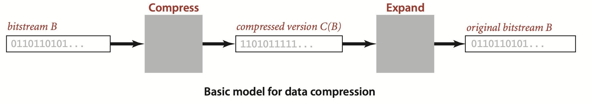

... Lossy methods have to be evaluated in terms of a subjective quality standard in addition to the compression ratio.We do not address lossy compression in this book.


####  Reading and writing binary data
These APIs, `BinaryStdIn` and `BinaryStdOut`, are modeled on the `StdIn` and `StdOut` APIs that you have been using, but their purpose is to read and write bits, where `StdIn` and `StdOut` are oriented toward character streams encoded in Unicode. An int value on `StdOut` is a sequence of characters (its decimal representation); an int value on `BinaryStdOut` is a sequence of bits (its binary representation).

##### Binary input and output.
A key feature of the abstraction is that, in marked constrast to `StdIn`, *the data on standard input is not necessarily aligned on byte boundaries*. If the input stream is a single byte, a client could read it 1 bit at a time with eight calls to `readBoolean()`. The `close()` method is not essential, but, for clean termination, clients should call `close()` to indicate that no more bits are to be read.

... For output, the `close()` method is essential: clients must call `close()` to ensure that all of the bits specified in prior `write()` calls make it to the bitstream and that the final byte is padded with 0s to byte-align the output for compatibility with the file system.

##### Example.

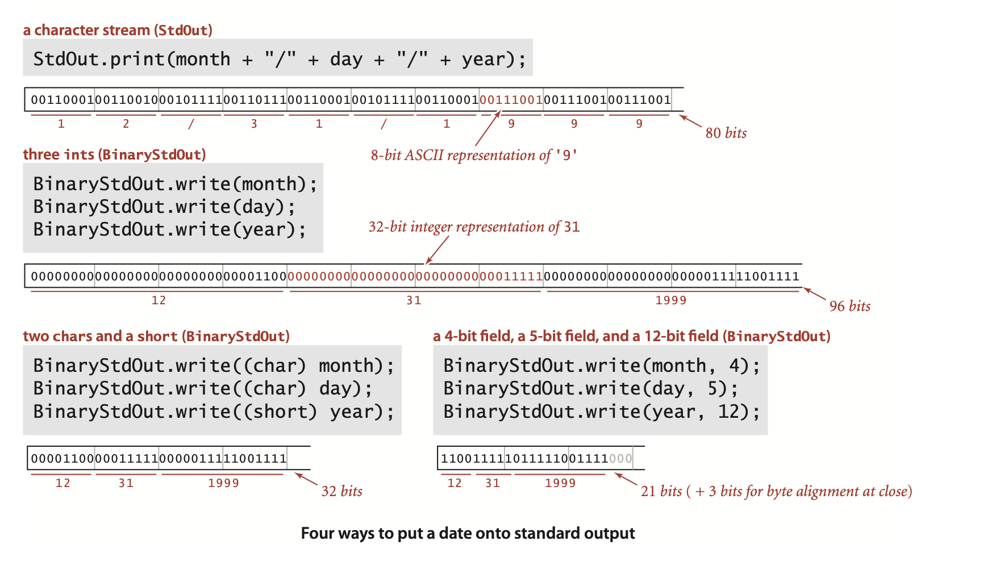


##### Binary dumps.
...  the term *dump* has been used since the early days of computing to describe a human-readable view of a bitstream.

**Printing a bitstream on standard (character) output**
```java
public class BinaryDump
{
    public static void main(String[] args)
    {
        int width = Integer.parseInt(args[0]);
        int cnt;
        for (cnt = 0; !BinaryStdIn.isEmpty(); cnt++)
        {
            if (width == 0) continue;
            if (cnt != 0 && cnt % width == 0)
                StdOut.println();
            if (BinaryStdIn.readBoolean())
                StdOut.print("1");
            else StdOut.print("0");
        }
        StdOut.println();
        StdOut.println(cnt + " bits");
    } 
}
```
```
% more abra.txt
ABRACADABRA!

% java BinaryDump 16 < abra.txt
0100000101000010
0101001001000001
0100001101000001
0100010001000001
0100001001010010
0100000100100001
96 bits
```


##### ASCII encoding.

... This table is for 7-bit ASCII, so the first hex digit must be 7 or less. Hex numbers starting with 0 and 1 (and the numbers `20` and `7F`) correspond to non-printing control characters. Many of the control characters are left over from the days when physical devices such as typewriters were controlled by ASCII input; the table highlights a few that you might see in dumps. For example, `SP` is the space character, `NUL` is the null character, `LF` is line feed, and `CR` is carriage return.

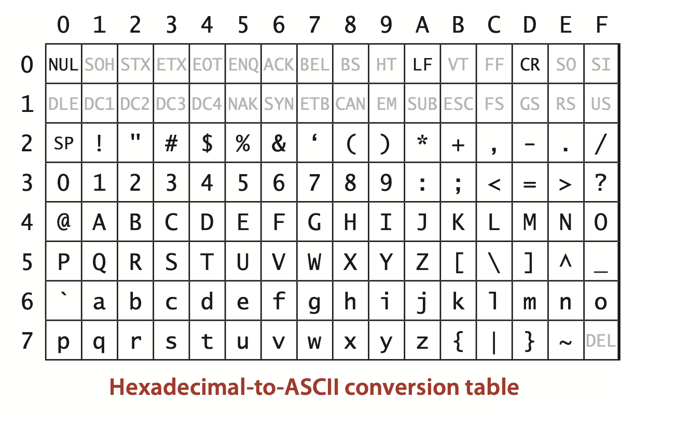


#### Limitations

**Proposition S.** No algorithm can compress every bit stream.  
**Proof:** We consider two proofs that each provide some insight. The first is by contradiction: Suppose that you have an algorithm that does compress every bitstream. Then you could use that algorithm to compress its output to get a still shorter bitstream, and continue until you have a bistream of length 0! The conclusion that your algorithm compresses every bitstream to 0 bits is absurd, and so is the assumption that it can compress every bitstream.  
The second proof is a counting argument. Suppose that you have an algorithm that claims lossless compression for every 1,000-bit stream. That is, every such stream must map to a different shorter one.But there are only $1 + 2 + 4 + ... + 2^{998} + 2^{999} =2^{1000} -1$ bitstreams with fewer than $1,000$ bits and $2^1000$ bitstreams with $1,000$ bits, so your algorithm cannot compress all of them. This argument becomes more persuasive if we consider stronger claims. Say your goal is to achieve better than a 50 percent compression ratio. You have to know that you will be successful for only about 1 out of $2^500$ of the 1,000-bit bitstreams!

... When you run across a new lossless compression algorithm, it is a sure bet that it will not achieve significant compression for a random bitstream. 


#### Undecidability.
... so you are not likely to find a lossless compression algorithm that will compress it. But there is a way to represent that string with just a few thousand bits, because it was produced by the program below. ...  For example, it is possible to prove that optimal data compression (find the shortest program to produce a given string) is an undecidable problem: not only can we not have an algorithm that compresses every bitstream, but also we cannot have a strategy for developing the best algorithm!

**A “compressed” million-bit stream**
```java
public class RandomBits
{
    public static void main(String[] args)
    {
        int x = 11111;
        for (int i = 0; i < 1000000; i++)
        {
            x = x * 314159 + 218281;
            BinaryStdOut.write(x > 0);
        }
        BinaryStdOut.close();
    }
}
```


#### Warmup: genomics


##### 2-bit code compression.

... Since it converts each 8-bit character to a 2-bit code and just adds 32 bits for the length, this program approaches a 25 percent compression ratio as the number of characters increases.


##### 2-bit code expansion.


```java
public class Genome
{
    public static void compress()
    {
        Alphabet DNA = new Alphabet("ACTG");
        String s = BinaryStdIn.readString();
        int N = s.length();
        BinaryStdOut.write(N); //Contributor's Note: required for decompression and ignoring extra padding bits.
        for (int i = 0; i < N; i++)
        {  // Write two-bit code for char.
            int d = DNA.toIndex(s.charAt(i));
            BinaryStdOut.write(d, DNA.lgR());
        }
        BinaryStdOut.close();
    }  
    public static void expand()
    {
        Alphabet DNA = new Alphabet("ACTG");
        int w = DNA.lgR();
        int N = BinaryStdIn.readInt();
        for (int i = 0; i < N; i++)
        {   // Read 2 bits; write char.
            char c = BinaryStdIn.readChar(w);
            BinaryStdOut.write(DNA.toChar(c));
        }
        BinaryStdOut.close();
    }
    public static void main(String[] args)
    {
        if (args[0].equals("-")) compress();
        if (args[0].equals("+")) expand();
    }
}
```

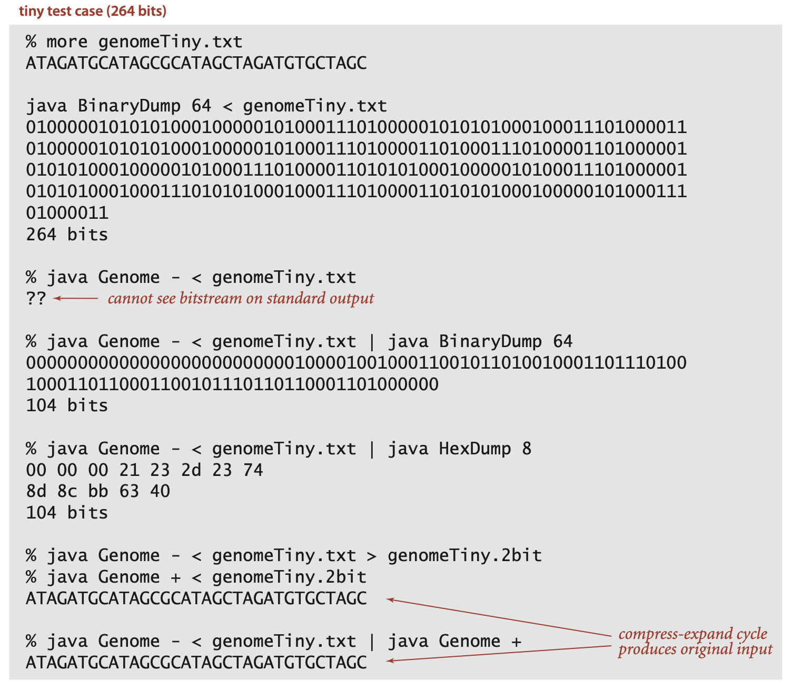


#### Run-length encoding
The simplest type of redundancy in a bitstream is long runs of repeated bits. ...


following 40-bit string:
```
0 0 0 0 0 0 0 0 0 0 0 0 0 0 0 1 1 1 1 1 1 1 0 0 0 0 0 0 0 1 1 1 1 1 1 1 1 1 1 1
```

In our example, if we use 4 bits to encode the numbers and start with a run of 0s, we get the 16-bit string
```
1 1 1 1 0 1 1 1 0 1 1 1 1 0 1 1 
```
(15 = 1111, then 7 = 0111, then 7 = 0111, then 11 = 1011) for a compression ratio of 16/40 = 40 percent. 


In order to turn this description into an effective data compression method, we have to consider the following issues:
- How many bits do we use to store the counts?
 What do we do when encountering a run that is longer than the maximum
count implied by this choice?
- What do we do about runs that are shorter than the number of bits needed to
store their length?

We are primarily interested in long bitstreams with relatively few short runs, so we address these questions by making the following choices:
- Counts are between 0 and 255, all encoded with 8 bits.
- We make all run lengths less than 256 by including runs of length 0 if needed.

>Contributor's Note:  
>Suppose you have a run of 300 A’s:  
>A      | 255  
>B      | 0   ← filler  
>A      | 45  

- We encode short runs, even though doing so might lengthen the output.


... They are *not* effective when short runs are numerous ...


##### Bitmaps.

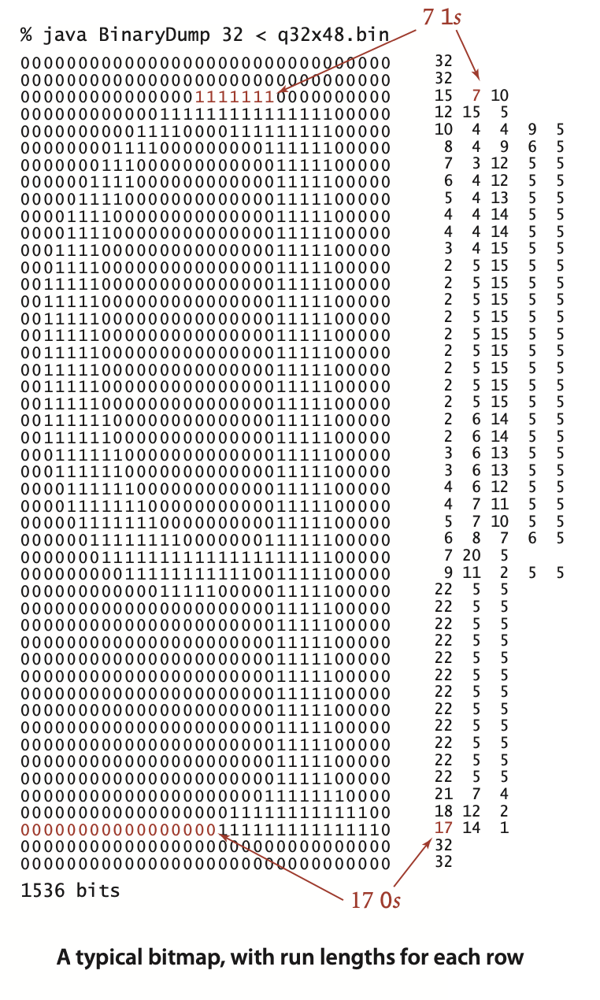

... For brevity and simplicity, we consider binary-valued bitmaps organized as bitstreams formed by taking the pixels in row-major order. To view the contents of a bitmap, we use `PictureDump`. 


... Since each row starts and ends with a 0, there is an odd number of run lengths on each row; 

... since the end of one row is followed by the beginning of the next, the corresponding run length in the bitstream is the sum of the last run length in each row and the first run length in the next (with extra additions corresponding to rows that are all 0).


##### Implementation. 

**Expand and compress methods for run-length encoding**
```java
public static void expand()
{
    boolean b = false;
    while (!BinaryStdIn.isEmpty())
    {
        char cnt = BinaryStdIn.readChar();
        for (int i = 0; i < cnt; i++)
            BinaryStdOut.write(b);
        b = !b;
    }
    BinaryStdOut.close();
}

public static void compress()
{
    char cnt = 0;
    boolean b, old = false;
    while (!BinaryStdIn.isEmpty())
    {
        b = BinaryStdIn.readBoolean();
        if (b != old)
        {
            BinaryStdOut.write(cnt);
            cnt = 0;
            old = !old;
        } 
        else 
        {
            if (cnt == 255)
            {
                BinaryStdOut.write(cnt);
                cnt = 0;
                BinaryStdOut.write(cnt);
            } 
        }
        cnt++; 
    }
    BinaryStdOut.write(cnt);
    BinaryStdOut.close();
}
```


#### Increasing resolution in bitmaps. 
The primary reason that run-length encoding is widely used for bitmaps is that its effectiveness increases dramatically as resolution increases. ... Suppose that we double the resolution for our example. Then the following facts are evident:
- The number of bits increases by a factor of 4.
- The number of runs increases by about a factor of 2.
- The run lengths increase by about a factor of 2.
- The number of bits in the compressed version increases by about a factor of 2.
- Therefore, the compression ratio is halved

Without run-length encoding, space requirements increase by a factor of 4 when the resolution is doubled; with run-length encoding, space requirements for the compressed bitstream just double when the resolution is doubled. That is, space grows and the compression ratio drops linearly with resolution.


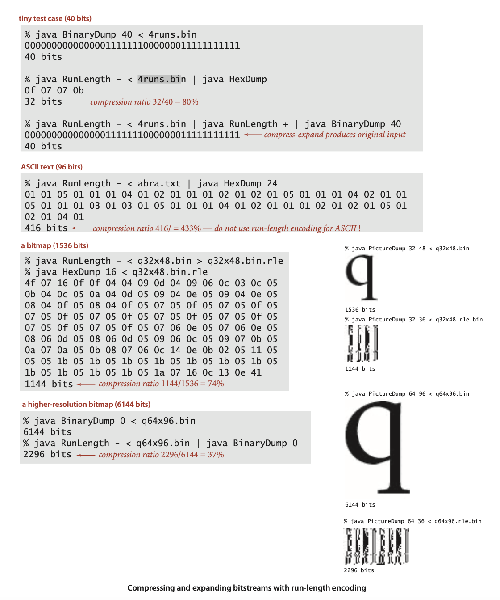


#### Huffman compression
... The idea is to abandon the way in which text files are usually stored: instead of using the usual 7 or 8 bits for each character, we use fewer bits for characters that appear often than for those that appear rarely


To introduce the basic ideas, we start with a small example. Suppose we wish to encode the string `ABRACADABRA!` Encoding it in 7-bit ASCII gives this bit string:
```
100000110000101010010100000110000111000001- 
100010010000011000010101001010000010100001.
```

To decode this bitstring, we simply read off 7 bits at a time and convert according to the ASCII coding table on page 815. In this standard code the D, which appears only once, requires the same number of bits as the A, which appears five times.


##### Variable-length prefix-free codes.
A code associates each character with a bitstring: a symbol table with characters as keys and bitstrings as values. As a start, we might try to assign the shortest bitstrings to the most commonly used letters, encoding `A` with `0`, `B` with `1`, `R` with `00`, `C` with `01`, `D` with `10`, and `!` with `11`, so `ABRACADABRA!` would been coded as `0 1 00 0 01 0 10 0 1 00 0 11`. ... Still, the count of 17 bits plus 10 delimiters is rather more compact than the standard code, primarily because no bits are used to encode letters not appearing in the message.

The next step is to take advantage of the fact that *delimiters are not needed if no character code is the prefix of another*. A code with this property is known as a *prefix-free* code.  The code just given is not prefix-free because `0`, the code for `A`, is a prefix of `00`, the code for `R`. For example, if we encode `A` with `0`, `B` with `11111`, `C` with `110`, `D` with `100`, `R` with `1110`, and `!` with `101`, there is only one way to decode the 30-bit string `A B R A C A D A B R A !`
```
0 1 1 1 1 1 1 1 0 0 1 1 0 0 1 0 0 0 1 1 1 1 1 1 1 0 0 1 0 1
```

All prefix-free codes are *uniquely decodable*. ... Note that fixedlength codes such as 7-bit ASCII are prefix-free.


##### Trie representation for prefix-free codes.


On top is the variable-length code just considered; below is a code that produces the string
```
1 1 0 0 0 1 1 1 1 0 1 0 1 1 1 0 0 1 1 0 0 0 1 1 1 1 1 0 1
```
which is 29 bits, 1 bit shorter.


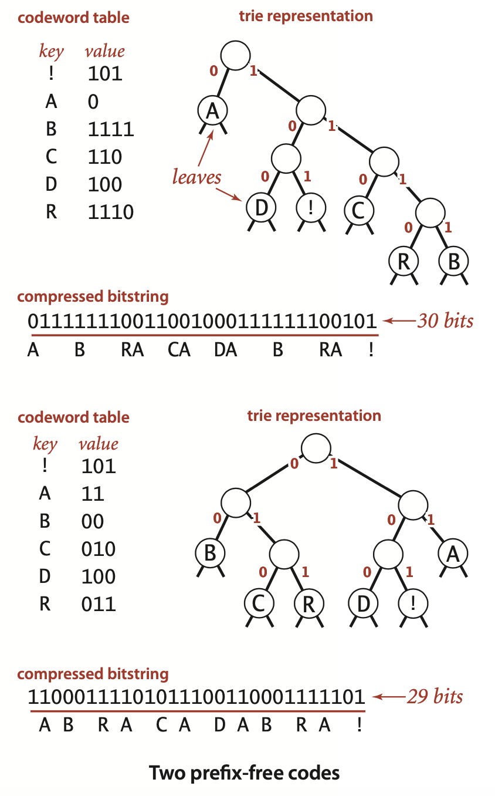


 ... The general method for finding the optimal prefix-free code was discovered by D. Huffman (while a student!) in 1952 and is called *Huffman* encoding.

 ##### Trie nodes.

**Trie node representation**
 ```java
private static class Node implements Comparable<Node>
{  // Huffman trie node
    private char ch;   // unused for internal nodes
    private int freq;  // unused for expand
    private final Node left, right;

    Node(char ch, int freq, Node left, Node right)
    {
        this.ch    = ch;
        this.freq  = freq;
        this.left  = left;
        this.right = right;
    }

    public boolean isLeaf()
    {  return left == null && right == null;  }

    public int compareTo(Node that)
    {  return this.freq - that.freq;  }
}
```


##### Expansion for prefix-free codes.
**Prefix-free code expansion (decoding)**
```java
public static void expand()
{
    Node root = readTrie();
    int N = BinaryStdIn.readInt();
    for (int i = 0; i < N; i++)
    {  // Expand ith codeword.
        Node x = root;
        while (!x.isLeaf())
            if (BinaryStdIn.readBoolean())
                x = x.right;
            else x = x.left;
        BinaryStdOut.write(x.ch);
    }
    BinaryStdOut.close();
}
```


##### Compression for prefix-free codes.

The coding table is a symbol table that associates a String with each character: we use a character-indexed array st[] instead of a general symbol table for efficiency, because the number of characters is not large. ... Once the coding table is built, compression is a simple matter: just look up the code for each character in the input. To use the encoding at right to compress `A B R A C A D A B R A !` we write `0` (the codeword associated with `A`), then `111` (the codeword associated with `B`), then `110` (the codeword associated with R), and so forth.

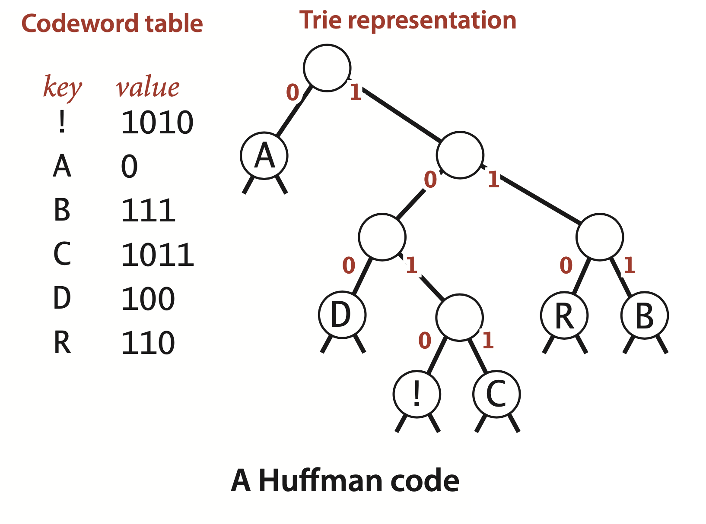

**Building an encoding table from a (prefix-free) code trie**
```java
private static String[] buildCode(Node root)
{  // Make a lookup table from trie.
    String[] st = new String[R];
    buildCode(st, root, "");
    return st;
}
private static void buildCode(String[] st, Node x, String s)
{  // Make a lookup table from trie (recursive).
    if (x.isLeaf())
    {  st[x.ch] = s; return; }
    buildCode(st, x.left,  s + '0');
    buildCode(st, x.right, s + '1');
}
```


**Building an encoding table from a (prefix-free) code trie**
```java
for (int i = 0; i < input.length; i++)
{
   String code = st[input[i]];
   for (int j = 0; j < code.length(); j++)
        if (code.charAt(j) == '1')
            BinaryStdOut.write(true);
        else BinaryStdOut.write(false);
}
```


##### Trie construction.

 ... (Important note: To obtain these frequencies, we need to read the whole input stream—Huffman encoding is a *two-pass* algorithm because we will need to read the input stream a second time to compress it.) Next, we build the coding trie from the bottom up according to the frequencies. The process works as follows: we find the two nodes with the smallest frequencies and then create a new node with those two nodes as children (and with frequency value set to the sum of the values of the children). This operation reduces the number of tries in the forest by one. 

**Building a Huffman encoding trie**
```java
private static Node buildTrie(int[] freq)
{
    // Initialize priority queue with singleton trees.
    MinPQ<Node> pq = new MinPQ<Node>();
    for (char c = 0; c < R; c++)
        if (freq[c] > 0)
            pq.insert(new Node(c, freq[c], null, null));

    while (pq.size() > 1)
    {  // Merge two smallest trees.
        Node x = pq.delMin();
        Node y = pq.delMin();
        Node parent = new Node('\0', x.freq + y.freq, x, y);
        pq.insert(parent);
    }
    return pq.delMin();
}
```

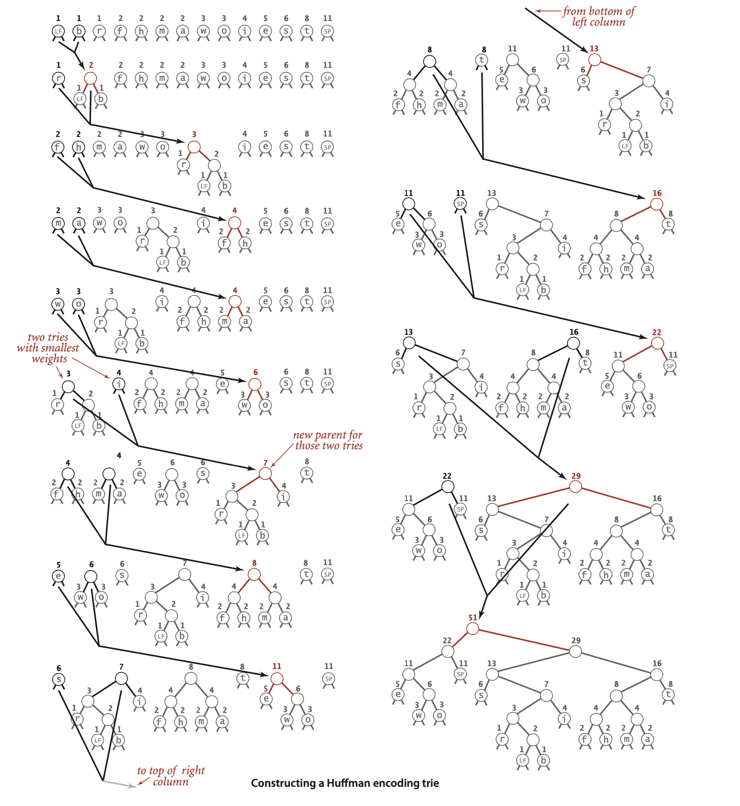


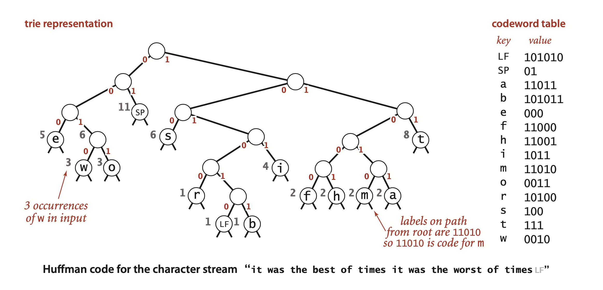


##### Optimality.
... we begin by defining the *weighted external path* length of a tree to be the sum of the weight (associated frequency count) times depth (see page 226) of all of the leaves.


**Proposition T.** For any prefix-free code,the length of the encoded bit string is equal to the weighted external path length of the corresponding trie.  
**Proof:** The depth of each leaf is the number of bits used to encode the character in the leaf. Thus, the weighted external path length is the length of encoded bitstring : it is equivalent to the sum over all letters of the number of occurrences times the number of bits per occurrence.


**Proposition U.** Given a set of $r$ symbols and frequencies, the Huffman algorithm builds an optimal prefix-free code.  
**Proof:** By induction on $r$. Assume that the Huffman code is optimal for any set of fewer than $r$ symbols. Let $T_H$ be the code computed by Huffman for the set of symbols and associated frequencies $(s_1, r_1), . . . , (s_r , f_r)$ and denote the length of the code (weighted external path length of the trie) by $W(T_H)$. Suppose that $(s_i, f_i)$ and $(s_j, f_j)$ are the first two symbols chosen. The algorithm then computes the code ${T_H}^*$ for the set of $n-1$ symbols with $(s_i, f_i)$ and $(s_i, f_j)$ replaced by $(s^*, f_i + f_j)$ where $s^*$ is a new symbol in a leaf at some depth d. Note that 
$$
W(T_H) = W({T_H}^*) - d(f_i + f_j) + (d + 1)(f_i + f_j) = W({T_H}^*) + (f_i + f_j )
$$
Now consider an optimal trie $T$ for $(s_1, r_1), . . . , (s_r , f_r)$, of height $h$. Note that that $(s_i, f_i)$ and $(s_j , f_j)$ must be at depth $h$ (else we could make a trie with lower external path length by swapping them with nodes at depth $h$). Also, assume $(s_i, f_i)$ and $(s_j, f_j)$ are siblings by swapping $(s_j, f_j)$ with $(s_i , f_i)$’s sibling. Now consider the tree $T^*$ obtained by replacing their parent with $(s^*, f_i + f_j)$. Note that (by the same argument as above) $W(T) = W(T^*) + (f_i + f_j)$.  
By the inductive hypothesis ${T_H}^*$ is optimal: $W({T_H}^*) \leq W(T^*)$. Therefore, 
$$
W(T_H) = W({T_H}^*) + (f_i + f_j) \leq W(T^*) + (f_i + f_j) = W(T)
$$
Since $T$ is optimal, equality must hold, and $T_H$ is optimal.


Whenever a node is to be picked, it can be the case that there are several nodes with the same weight. Huffman’s method does not specify how such ties are to be broken. It also does not specify the left/right positions of the children. Different choices lead to different Huffman codes, but all such codes will encode the message with the optimal number of bits among prefix-free codes.


##### Writing and reading the trie.
... because the compressed bitstream cannot be encoded without the trie, so we must account for the cost of including the trie in the compressed output, along with the bitstring. ... How can we encode a trie as a bitstream, and then expand it? Remarkably, both tasks can be achieved with simple recursive procedures, based on a *preorder traversal* of the trie.


**Writing a trie as a bitstring**
```java
private static void writeTrie(Node x)
{  // Write bitstring-encoded trie.
    if (x.isLeaf())
    {
        BinaryStdOut.write(true);
        BinaryStdOut.write(x.ch);
        return;
    }
    BinaryStdOut.write(false);
    writeTrie(x.left);
    writeTrie(x.right);
}
```

**Reconstructing a trie from the preorder bitstring representation**
```java
private static Node readTrie()
{
    if (BinaryStdIn.readBoolean())
        return new Node(BinaryStdIn.readChar(), 0, null, null);
    return new Node('\0', 0, readTrie(), readTrie());
}
```
> Contributor's Note:
> At the decode stage the actual frequencies are no longer needed.

**ALGORITHM 5.10 Huffman compression**
```java
public class Huffman
{
    private static int R = 256;   // ASCII alphabet
    // See page 828 for inner Node class.
    // See text for helper methods and expand().

    public static void compress()
    {
        // Read input.
        String s = BinaryStdIn.readString();
        char[] input = s.toCharArray();

        // Tabulate frequency counts.
        int[] freq = new int[R];
        for (int i = 0; i < input.length; i++)
            freq[input[i]]++;
            
        // Build Huffman code trie.
        Node root = buildTrie(freq);
        // Build code table (recursive).
        String[] st = new String[R];
        buildCode(st, root, "");

        // Print trie for decoder (recursive).
        writeTrie(root);

        // Print number of chars.
        BinaryStdOut.write(input.length);

        // Use Huffman code to encode input.
        for (int i = 0; i < input.length; i++)
        {
            String code = st[input[i]];
            for (int j = 0; j < code.length(); j++)
                if (code.charAt(j) == '1')
                    BinaryStdOut.write(true);
                else BinaryStdOut.write(false);
        }
        BinaryStdOut.close();
    }
}
```
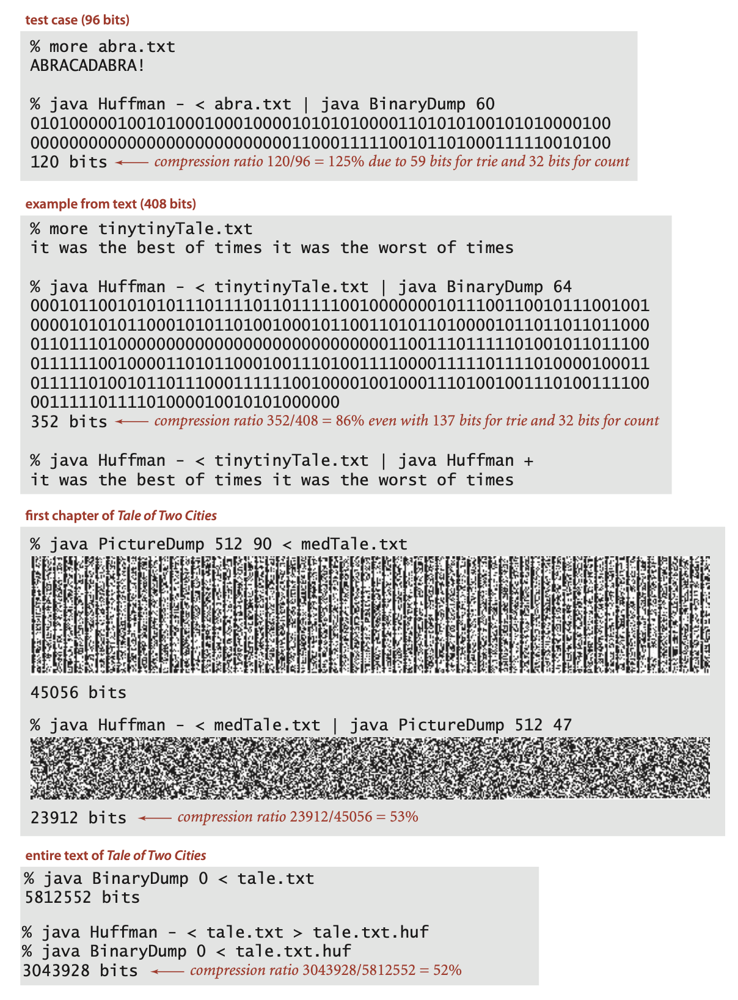

One reason for the popularity of Huffman compression is that it is effective for various types of files, not just natural language text. We have been careful to code the method so that it can work properly for any 8-bit value in each 8-bit character. In the case of genomic data, Huffman compression essentially discovers a 2-bit code, as the four letters appear with approximately equal frequency so that the Huffman trie is balanced, with each character assigned a 2-bit code. In the case of run-length encoding, 0 0 0 0 0 0 0 0 and 1 1 1 1 1 1 1 1 are likely to be the most frequently occurring characters,so they are likely to be encoded with 2 or 3 bits, leading to substantial compression.


##### LZW compression. 

To fix ideas, we will consider a compression example where we read the input as a stream of 7-bit ASCII characters and write the output as a stream of 8-bit bytes. .... The basic plan complements the basic plan for Huffman coding. Rather than maintain a table of *variable*-length codewords for fixed-length patterns in the input, we maintain a table of *fixed*-length codewords for *variable*-length patterns in the input. ...  by contrast with Huffman encoding, *we do not have to encode the table*.


We refer to input bytes as *characters*, sequences of input bytes as *strings*, and output bytes as *codewords*, even though these terms have slightly different meanings in other contexts. 


... To compress, we perform the following steps as long as there are unscanned input characters:
- Find the longest string `s` in the symbol table that is a prefix of the unscanned input.
- Write the 8-bit value (codeword) associated with `s`.
- Scan one character past `s` in the input.
- Associate the next codeword value with `s + c` (c appended to `s`) in the symbol table, where `c` is the next character in the input.

... so we refer to that character c as the *lookahead* character.

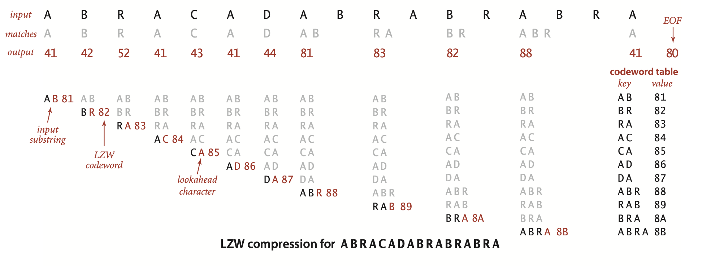


The input is 17 ASCII characters of 7 bits each for a total of 119 bits; the output is 12 codewords of 8 bits each for a total of 96 bits—a compression ratio of 82 percent even for this tiny example.


##### LZW trie representation.

... To find a longest prefix match, we traverse the trie from the root, matching node labels with input characters; to add a new codeword, we connect a new node labeled with the next codeword and the lookahead character to the node where the search terminated. 

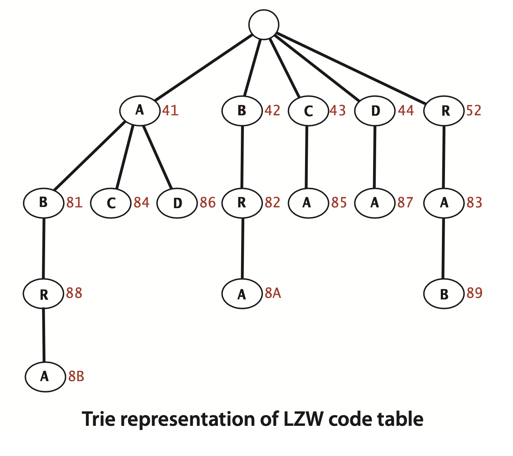

... for Huffman encoding, tries are useful because no prefix of a codeword is also a codeword; for LZW tries are useful because *every* prefix of an input-substring key is also a key.

##### LZW expansion. 
The input for LZW expansion in our example is a sequence of 8-bit codewords; the output is a string of 7-bit ASCII characters. 

... We fill the table entries from 00 to 7F with one-character strings, one for each ASCII character, set the first unassigned codeword value to 81 (reserving 80 for end of file), set the current string `val` to the onecharacter string consisting of the first character, and perform the following steps until reading codeword 80 (end of file):  
- Write the current string `val`.
- Read a codeword `x` from the input.
- Set `s` to the value associated with `x` in the symbol table.
- Associate the next unasssigned codeword value to `val + c` in the symbol table,
where `c` is the first character of `s`.
- Set the current string `val` to `s`.


...  For the first seven codewords, we just look up and write the appropriate character, then look ahead one character and add a two-character entry to the symbol table, as before. Then we read 81 (so we write A B and add A B R to the table), 83(so we write R A and add R A B to the table), 82(so we write B R and add B R A to the table), and 88 (so we write A B R and add A B R A to the table), leaving 41. Finally we read the end-of-file character 80 (so we write A). 


##### Tricky situation.


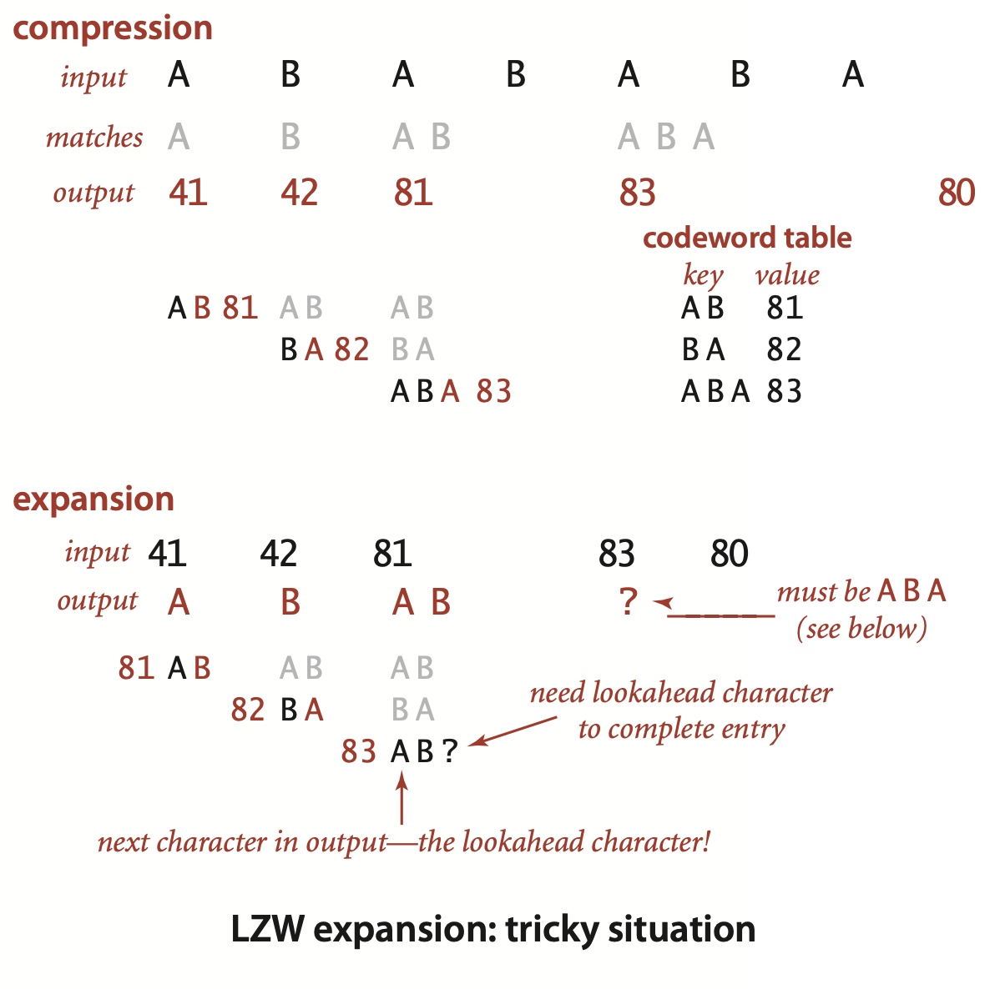

... But when we read the codeword 83 to get the lookahead character, we are stuck, because the reason that we are reading that codeword is to complete table entry 83! Fortunately, it is easy to test for that condition (it happens precisely when the codeword is the same as the table entry to be completed) and to correct it (the lookahead character must be the first character in that table entry, since that will be the next character to be output). In this example, this logic tells us that the lookahead character must be A (the first character in ABA). Thus, both the next output string and table entry 83 should be ABA.

>Contributor's Note:  
>When you encounter a code that hasn’t been recorded before (such as 83 in this case), and it equals `i`, that means it is the next code to be registered. At this point, you already have the current LPS of `val`. The new code (83) should then be assigned to `val + c`, where `c` is an unknown character. However, when you actually see 83 in the stream, it means it was also immediately followed in the text. Therefore, the next LFS should also be `val + c`, and the first character we need must be `val + c[0] = val[0]`.


**ALGORITHM 5.11 LZW compression**
```java
public class LZW
{
    private static final int R = 256;   // number of input chars
    private static final int L = 4096;  // number of codewords = 2^12
    private static final int W = 12;    // codeword width

    public static void compress()
    {
        String input = BinaryStdIn.readString();
        TST<Integer> st = new TST<Integer>();

        for (int i = 0; i < R; i++)
            st.put("" + (char) i, i);
        int code = R+1;  // R is codeword for EOF.

        while (input.length() > 0)
        {
            String s = st.longestPrefixOf(input); // Find max prefix match.
            BinaryStdOut.write(st.get(s), W);     // Print s's encoding.
            int t = s.length();
            if (t < input.length() && code < L)   // Add s to symbol table.
                st.put(input.substring(0, t + 1), code++);
            input = input.substring(t);           // Scan past s in input.
        }
        BinaryStdOut.write(R, W);       // Write EOF.
        BinaryStdOut.close();
    }
    
    public static void expand()
    {
        String[] st = new String[L];

        int i; // next available codeword value

        for (i = 0; i < R; i++)            // Initialize table for chars.
            st[i] = "" + (char) i;
        st[i++] = " ";  // (unused) lookahead for EOF

        int codeword = BinaryStdIn.readInt(W);
        String val = st[codeword];
        while (true)
        {
            BinaryStdOut.write(val);        // Write current substring.
            codeword = BinaryStdIn.readInt(W);
            if (codeword == R) break;
            String s = st[codeword];        // Get next codeword.
            if (i == codeword)              // If lookahead is invalid,
                s = val + val.charAt(0);    //    make codeword from last one.
            if (i < L)
                st[i++] = val + s.charAt(0); // Add new entry to code table.
            val = s;                         // Update current codeword.
        }
        BinaryStdOut.close();
     }
}
```


>Contributor's Note:  
>For Practice:

```java
public class Genome
{
    public static void compress()
    {}  
    public static void expand()
    {}
    public static void main(String[] args)
    {}
}


//Expand and compress methods for run-length encoding**
public static void expand() {}
public static void compress() {}

//Printing a bitstream on standard (character) output
public class BinaryDump
{}

public class Huffman
{   
    private static class Node implements Comparable<Node>
    {}
    public static void expand()
    {}
    private static String[] buildCode(Node root)
    {}
    private static void buildCode(String[] st, Node x, String s)
    {}
    private static Node buildTrie(int[] freq)
    {}
    private static void writeTrie(Node x)
    {}
    private static Node readTrie()
    {}
    public static void compress()
    {}
    
}

public class LZW
{
    public static void compress()
    {}
    
    public static void expand()
    {}
}
```
