### 6 Context

... They knew that scalable algorithms are the key to the future; the developments of the past several decades have validated that vision. 


#### Event-driven simulation
Our first example is a fundamental scientific application: simulate the motion of a system of moving particles that behave according to the laws of elastic collision.

##### Hard-disc model. 
- Moving particles interact via elastic collisions with each other and with walls.
- Each particle is a disc with known position, velocity, mass, and radius.
- No other forces are exerted.


##### Time-driven simulation.
... we want to be able to keep track of the positions and velocities of all the particles as time passes. ... given the positions and velocities for a specific time $t$, update them to reflect the situation at a future time $t+dt$ for a specific amount of time $dt$. Now, if the particles are sufficiently far from one another and from the walls that no collision will occur before $t+dt$, then the calculation is easy: since particles travel in a straight-line trajectory, we use each particle’s velocity to update its position.  
The challenge is to take the collisions into account. One approach, known as *time-driven simulation*, is based on using a fixed value of $dt$. To do each update, we need to check all pairs of particles, determine whether or not any two occupy the same position, and then back up to the moment of the first such collision.  
This approach is computationally intensive when simulating a large number of particles: if $dt$ is measured in seconds (fractions of a second, usually), it takes time proportional to $N^2/dt$ to simulate an $N$-particle system for 1 second. This cost is prohibitive (even worse than usual for quadratic algorithms)—in the applications of interest, $N$ is very large and $dt$ is very small. The challenge is that if we make $dt$ too small, the computational cost is high, and if we make $dt$ too large, we may miss collisions.


##### Event-driven simulation.
... Therefore, we maintain a priority queue of *events*, where an event is a potential collision sometime in the future, either between two particles or between a particle and a wall. The priority associated with each event is its time, so when we *remove the minimum* from the priority queue, we get the next potential collision.


##### Collision prediction. 

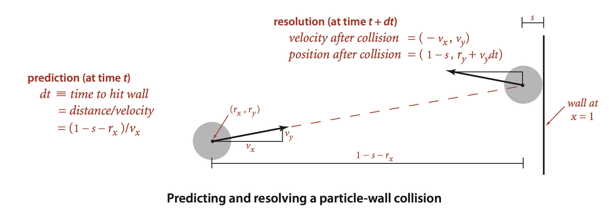

... Accordingly, we put an entry on the priority queue with priority $t + dt$ (and appropriate information describing the particle-wall collision event). ...  To handle another typical situation where the predicted collision might be too far in the future to be of interest, we include a parameter `limit` that specifies the time period of interest, so we can also ignore any events that are predicted to happen at a time later than `limit`.

##### Collision resolution. 
 In our example where the particle hits the vertical wall, if the collision does occur, the velocity of the particle will change from $(v_x, v_y)$ to $(–v_x , v_y)$ at that time. The collision-resolution calculations for other walls are similar, as are the calculations for two particles colliding, but these are more complicated (see Exercise 6.1).

##### Invalidated events.
... To handle this situation, we maintain an instance variable for each particle that counts the number of collisions in which it has been involved. When we remove an event from the priority queue for processing, we check whether the counts corresponding to its particle(s) have changed since the event was created. This approach to handling invalidated collisions is the so-called *lazy* approach: when a particle is involved in a collision, we leave the now-invalid events associated with it on the priority queue and essentially ignore them when they come off. An alternative approach, the so-called *eager* approach, is to remove from the priority queue all events involving any colliding particle before calculating all of the new potential collisions for that particle. This approach requires a more sophisticated priority queue (that implements the *remove* operation).


##### Particles.

... Exercise 6.1 outlines the implementation of a data type particles ...

##### Events.
We encapsulate in a private class the description of the objects to be placed on the priority queue (events).

... A slight twist in the implementation of Event is that we use the fact that particle values may be null to encode these four different types of events, as follows:
- Neither `a` nor `b` null: particle-particle collision
- `a` not null and `b` null: collision between `a` and a vertical wall
- `a` null and `b` not null: collision between `b` and a horizontal wall
- Both `a` and `b` null: redraw event (draw all particles)

...we maintain the instance variables countA and countB to record the number of collisions involving each of the particles *at the time the event is created*. 

**Event class for particle simulation**
```java
private class Event implements Comparable<Event>
{
    private final double time;
    private final Particle a, b;
    private final int countA, countB;

    public Event(double t, Particle a, Particle b)
    {  // Create a new event to occur at time t involving a and b.
        this.time = t;
        this.a = a;
        this.b = b;
        if (a != null) countA = a.count(); else countA = -1;
        if (b != null) countB = b.count(); else countB = -1;
    }

    public int compareTo(Event that)
    {
        if      (this.time < that.time) return -1;
        else if (this.time > that.time) return +1;
        else return 0;
    }

    public boolean isValid()
    {
        if (a != null && a.count() != countA) return false;
        if (b != null && b.count() != countB) return false;
        return true;
    } 
}
```


##### Simulation code.


**Predicting collisions with other particles**
```java
private void predictCollisions(Particle a, double limit)
{
    if (a == null) return;
    for (int i = 0; i < particles.length; i++)
    {  // Put collision with particles[i] on pq.
        double dt = a.timeToHit(particles[i]);
        if (t + dt <= limit)
            pq.insert(new Event(t + dt, a, particles[i]));
    }
    double dtX = a.timeToHitVerticalWall();
    if (t + dtX <= limit)
        pq.insert(new Event(t + dtX, a, null));
    double dtY = a.timeToHitHorizontalWall();
    if (t + dtY <= limit)
        pq.insert(new Event(t + dtY, null, a));
}
```


**Event-based simulation of colliding particles (scaffolding)**
```java
public class CollisionSystem
{
    private class Event implements Comparable<Event>
    {  /* See text. */  }
    private MinPQ<Event> pq;        // the priority queue
    private double t  = 0.0;        // simulation clock time
    private Particle[] particles;   // the array of particles
    
    public CollisionSystem(Particle[] particles)
    {  this.particles  = particles;  }

    private void predictCollisions(Particle a, double limit)
    {  /* See text. */  }

    public void redraw(double limit, double Hz)
    { // Redraw event: redraw all particles.
        StdDraw.clear();
        for(int i = 0; i < particles.length; i++) particles[i].draw();
        StdDraw.show(20);
        if (t < limit)
            pq.insert(new Event(t + 1.0 / Hz, null, null));
    }

    public void simulate(double limit, double Hz)
    { 
        pq = new MinPQ<Event>();
        for (int i = 0; i < particles.length; i++)
            predictCollisions(particles[i], limit);
        pq.insert(new Event(0, null, null));  // Add redraw event.

        while (!pq.isEmpty())
        {  // Process one event to drive simulation.
            Event event = pq.delMin();
            if (!event.isValid()) continue;
            for (int i = 0; i < particles.length; i++)
                particles[i].move(event.time - t); // Update particle positions
            t = event.time;                       //   and time.
            Particle a = event.a, b = event.b;
            if      (a != null && b != null) a.bounceOff(b);
            else if (a != null && b == null) a.bounceOffHorizontalWall();
            else if (a == null && b != null) b.bounceOffVerticalWall();
            else if (a == null && b == null) redraw(limit, Hz);
            predictCollisions(a, limit);
            predictCollisions(b, limit);
        } 
    }

    public static void main(String[] args)
    {
        StdDraw.show(0);
        int N = Integer.parseInt(args[0]);
        Particle[] particles = new Particle[N];
        for (int i = 0; i < N; i++)
            particles[i] = new Particle();
        CollisionSystem system = new CollisionSystem(particles);
        system.simulate(10000, 0.5);
    } 
}
```

##### Performance.
**Proposition A.** An event-based simulation of $N$ colliding particles requires at most $N^2$ priority queue operations for initialization, and at most $N$ priority queue operations per collision (with one extra priority queue operation for each invalid collision).  
**Proof** Immediate from the code.


Using our standard guaranteed-logarithmic-time-per operation priority-queue implementation from Section 2.4, the time needed per collision is linearithmic.


#### B-trees 

...  In this section, we describe a further extension of the balanced-tree algorithms from Section 3.3 that can support *external search* in symbol tables that are kept on a disk or on the web and are thus potentially far larger than those we have been considering (which have to fit in addressable memory)


##### Cost model.

... We use the term *page* to refer to a contiguous block of data and the term *probe* to refer to the first access to a page. We assume that accessing a page involves reading its contents into local memory, so that subsequent accesses are relatively inexpensive. A page could be a file on your local computer or a web page on a distant computer or part of a file on a server, or whatever. Our goal is to develop search implementations that use a small number of probes to find any given key.


**B-tree cost model.** When studying algorithms for external searching, we count *page accesses* (the number of times a page is accessed, for read or write).

##### B-trees.
...  rather than store the data in the tree, we build a tree with *copies* of the keys, each key copy associated with a link. ... As with 2-3 trees, we enforce upper and lower bounds on the number of key-link pairs .... we choose a parameter $M$ (an even number, by convention) and build multiway trees where every node must have at most $M - 1$ key-link pairs (we assume that $M$ is sufficiently small that an $M$-way node will fit on a page) and at least $M/2$ key-link pairs (to provide the branching that we need to keep search paths short), except possibly the root, which can have fewer than $M/2$ key-link pairs but must have at least 2 (Contributor's Note: otherwise, we wouldn't be able to initialize the root.). Such trees were named B-trees by ... We specify the value of M by using the terminology *“B-tree of order $M$.”* In a B-tree of order 4, each node has at most 3 and at least 2 key-link pairs;


##### Conventions.

... For B-trees, we do so by using two different kinds of nodes:
- *Internal* nodes, which associate copies of keys with pages
- *External* nodes, which have references to the actual data


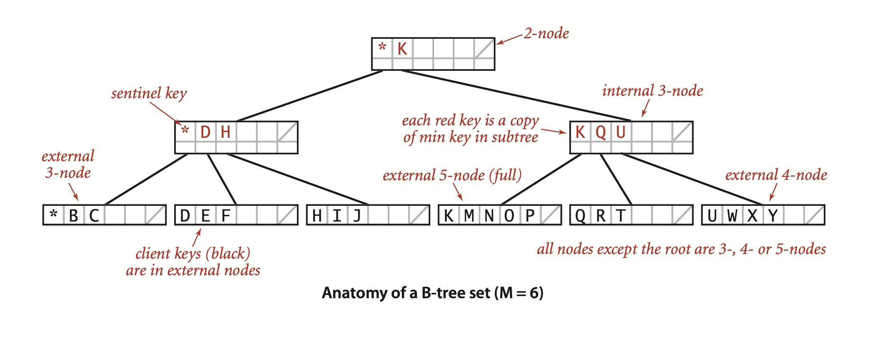


... It is convenient to use a special key, known as a sentinel, that is defined to be less than all other keys, and to start with a root node containing that key, associated with the tree containing all the keys. The symbol table does not contain duplicate keys, but we use copies of keys (in internal nodes) to guide the search. (In our examples, we use single-letter keys and the character * as the sentinel that is less than all other keys.) These conventions simplify the code somewhat and thus represent a convenient (and widely used) alternative to mixing all the data with links in the internal nodes, as we have done for other search trees.


##### Search and insert.


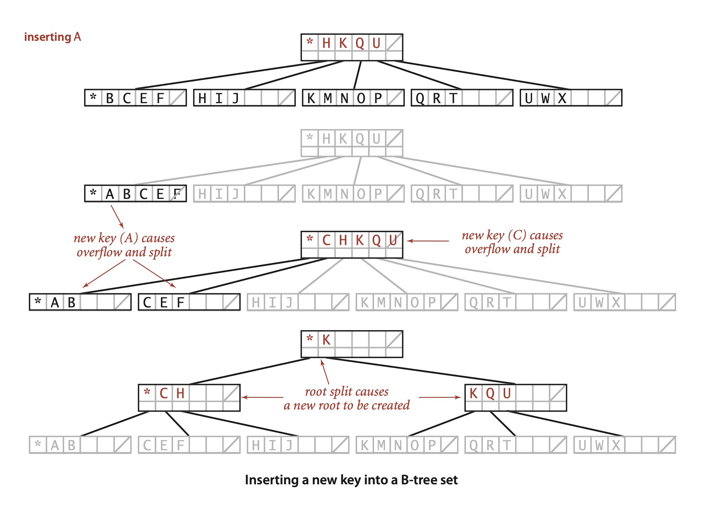

**Definition.** A *B-tree of order $M$* (where $M$ is an even positive integer) is a tree that either is an external $k$-node (with $k$ keys and associated information) or comprises internal $k$-nodes (each with $k$ keys and $k$ links to B-trees representing each of the $k$ intervals delimited by the keys), having the following structural properties: every path from the root to an external node must be the same length (perfect balance); and $k$ must be between 2 and $M - 1$ at the root and between $M/2$ and $M-1$ at every other node.


##### Representation.

**ALGORITHM 6.12 B-tree set implementation**
```java
public class BTreeSET<Key extends Comparable<Key>>
{
    private Page root = new Page(true);

    public BTreeSET(Key sentinel)
    {  put(sentinel);  }

    public boolean contains(Key key)
    {  return contains(root, key);  }

    private boolean contains(Page h, Key key)
    {
        if (h.isExternal()) return h.contains(key);
            return contains(h.next(key), key);
    }
    public void add(Key key)
    {
        put (root, key);
        if (root.isFull())
        {
            Page lefthalf = root;
            Page righthalf = root.split();
            root = new Page(false);
            root.put(lefthalf);
            root.put(righthalf);
        } 
    }
    
    public void add(Page h, Key key)
    {
        if (h.isExternal()) {  h.put(key); return;  }
        Page next = h.next(key);
        put(next, key);
        if (next.isFull())
            h.put(next.split());
        next.close();
    } 
}
```


##### Performance. 
**Proposition B.** A search or an insertion in a B-tree of order $M$ with $N$ items requires between $\log_M N$ and $log_{M/2} N$ probes—a constant number, for practical purposes.  
**Proof** This property follows from the observation that all the nodes in the interior of the tree (nodes that are not the root and are not external) have between $M/2$ and $M - 1$ links, since they are formed from a split of a full node with $M$ keys and can only grow in size (when a child is split). In the best case, these nodes form a complete tree of branching factor $M - 1$, which leads immediately to the stated bound. In the worst case, we have a root with two entries each of which refers to a complete tree of degree $M/2$. Taking the logarithm to the base $$M$ results in a very small number—for example, when $M$ is 1,000, the height of the tree is less than 4 for $N$ less than 62.5 billion.

In typical situations, we can reduce the cost by one probe by keeping the root in internal memory.


##### Space.
The space usage of B-trees is also of interest in practical applications. By construction, the pages are at least half full, so, in the worst case, B-trees use about double the space that is absolutely necessary for keys, plus extra space for links. For random keys, A. Yao proved in 1979 (using mathematical analysis that is beyond the scope of this book) that the average number of keys in a node is about M ln 2, so about 44 percent of the space is unused. 


#### Suffix arrays


##### Longest repeated substring.
What is the longest substring that appears at least twice in a given string? For example, the longest repeated substring in the string `"to be or not to be"` is the string `"to be"`.


##### Brute-force solution.
**Longest common prefix of two strings**
```java
private static int lcp(String s, String t)
{
    int N = Math.min(s.length(), t.length());
    for (int i = 0; i < N; i++)
        if (s.charAt(i) != t.charAt(i)) return i;
    return N;
}
```

With `lcp()`, the following brute-force solution immediately suggests itself: we compare the substring starting at each string position `i` with the substring starting at each other starting position `j`, keeping track of the longest match found. This code is not useful for long strings, because its running time is at least quadratic in the length of the string: as usual, the number of different pairs `i` and `j` is $N (N - 1) / 2$, so the number of calls on `lcp()` for this approach would be $\sim N^2/2$.


##### Suffix sort solution. 
... we use Java’s substring() method to make an array of strings that consists of the suffixes of `s` (the substrings starting at each position and going to the end), and then we sort this array. The key to the algorithm is that every substring appears somewhere as a prefix of one of the suffixes in the array. After sorting, the longest repeated substrings will appear in adjacent positions in the array. 

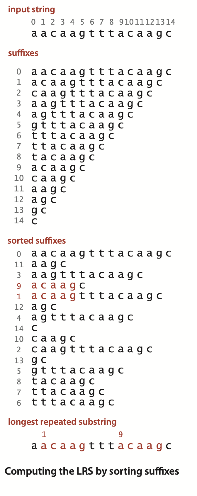


##### Indexing a string.
... For that problem, we assume the text to be relatively large and focus on preprocessing the substring, with the goal of being able to efficiently find that substring in any given text. 

Your search engine must precompute an index, since it cannot afford to scan all the pages in the web for your keys. As we discussed in Section 3.5 (see FileIndex on page 501), this would ideally be an inverted index associating each possible search string with all web pages that contain it—a symbol table where each entry is a string key and each value is a set of pointers (each pointer giving the information necessary to locate an occurrence of the key on the web—perhaps a URL that names a web page and an integer offset within that page).


... In practice, such a symbol table would be far too big, so your search engine uses various sophisticated algorithms to reduce its size. One approach is to rank web pages by importance (perhaps using an algorithm like the PageRank algorithm that we discussed on page 507)and work only with highly-ranked pages, not all pages. Another approach to cutting down on the size of a symbol table to support search with string keys is to associate URLs with *words* (substrings delimited by whitespace) as keys in the precomputed index. Then, when you search for a word, the search engine can use the index to find the (important) pages containing your search keys (words) and then use substring search within each page to find them.  But with this approach, if the text were to contain `"everything"` and you were to search for `"thing"`, you would not find it.  For some applications, it is worthwhile to build an index to help find *any substring* within a given text. Doing so might be justified for a linguistic study of an important piece of literature, for a genomic sequence that might be an object of study for many scientists, or just for a widely accessed web page.

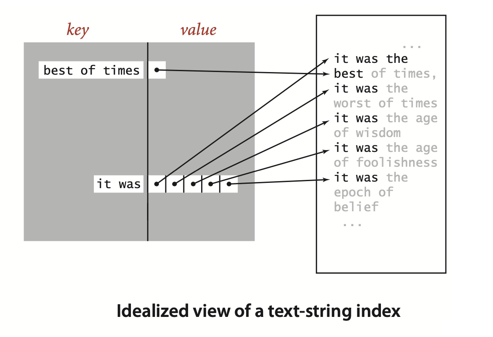


The ba-sic problem with this ideal is that the number of possible substrings is too large to have a symbol-table entry for each of them (an N-character text has $N(N - 1) / 2$ substrings).
>Contributor's Note:
>* A substring is defined by its **starting index** and **ending index** (with start ≤ end).
>* There are $N$ choices for the starting index.
>* For a given starting index $i$, the ending index can go from $i$ to $N$.
>  That gives $(N - i + 1)$ substrings.
>
>So, the **total number of substrings** is:
>
>$$
>\sum_{i=1}^{N} (N - i + 1) = 1 + 2 + 3 + ... + N = \frac{N \cdot (N+1)}{2}
>$$
 

 ... We consider each of the $N$ suffixes to be keys, create a sorted array of our keys (the suffixes), and use binary search to search in that array, comparing the search key with each suffix.

 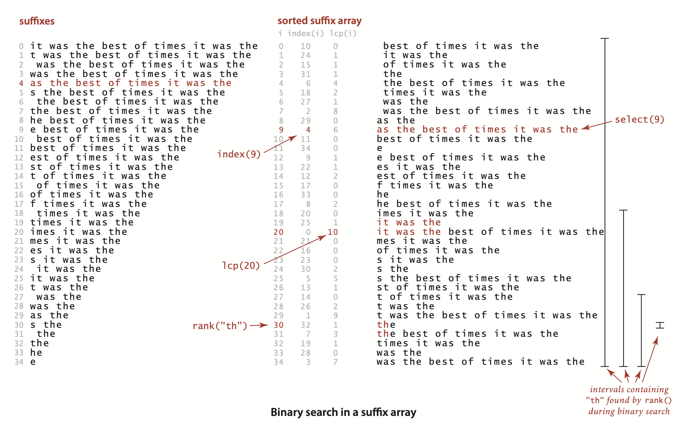


**Longest repeated substring client**
```java
public class LRS
{
    public static void main(String[] args)
    {
        String text = StdIn.readAll();
        int N = text.length();
        SuffixArray sa = new SuffixArray(text);
        String lrs = "";
        for (int i = 1; i < N; i++)
        {
            int length = sa.lcp(i);
            if (length > substring.length()) // Contributor's Note: length > lsr.length()
                lrs = sa.select(i).substring(0, length);
        }
        StdOut.println(lrs);
    }
}
```
```
% more tinyTale.txt
it was the best of times it was the worst of times
it was the age of wisdom it was the age of foolishness
it was the epoch of belief it was the epoch of incredulity
it was the season of light it was the season of darkness
it was the spring of hope it was the winter of despair

% java LRS < tinyTale.txt
st of times it was the
```

**Keyword-in-context indexing client**
```java
public class KWIC
{
    public static void main(String[] args)
    {
        In in = new In(args[0]);
        int context = Integer.parseInt(args[1]);

        String text = in.readAll().replaceAll("\\s+", " ");;
        int N = text.length();
        SuffixArray sa = new SuffixArray(text);

        while (StdIn.hasNextLine())
        {
            String q = StdIn.readLine();
            for (int i = sa.rank(q); i < N && sa.select(i).startsWith(q); i++)
            {
                int from = Math.max(0, sa.index(i) - context);
                int to   = Math.min(N-1, from + q.length() + 2*context);
                StdOut.println(text.substring(from, to));
            }
            StdOut.println();
        }
    } 
}
```
```
% java KWIC tale.txt 15
search
o st giless to search for contraband
her unavailing search for your fathe
le and gone in search of her husband
t provinces in search of impoverishe
 dispersing in search of other carri
n that bed and search the straw hold

better thing
t is a far far better thing that i do than
 some sense of better things else forgotte
was capable of better things mr carton ent
```


##### Implementation.

**ALGORITHM 6.13 Suffix array (elementary implementation)**
```java
public class SuffixArray
{
    private final String[] suffixes;    // suffix array
    private final int N;                // length of string (and array)

    public SuffixArray(String s)
    {
        N = s.length();
        suffixes = new String[N];
        for (int i = 0; i < N; i++)
            suffixes[i] = s.substring(i);
        Quick3way.sort(suffixes);
    }
        public int length()         { return N; }
        public String select(int i) { return suffixes[i]; }
        public int index(int i)     { return N - suffixes[i].length(); }

        private static int lcp(String s, String t)
        {
            int N = Math.min(s.length(), t.length());
            for (int i = 0; i < N; i++)
                if (s.charAt(i) != t.charAt(i)) return i;
            return N;
        }

        public int lcp(int i)
        {  return lcp(suffixes[i], suffixes[i-1]); }

        public int rank(String key)
        {  // binary search
            int lo = 0, hi = N - 1;
            while (lo <= hi)
            {
                int mid = lo + (hi - lo) / 2;
                int cmp = key.compareTo(suffixes[mid]);
                if      (cmp < 0) hi = mid - 1;
                else if (cmp > 0) lo = mid + 1;
                else return mid;
            }
            return lo; 
        }
}
```


##### Performance.
The efficiency of suffix sorting depends on the fact that Java substring extraction uses a constant amount of space—each substring is composed of standard object overhead, a pointer into the original, and a length. Thus, the size of the index is linear in the size of the string. ... when we exchange two strings, we are exchanging only references, not the whole string. Now, the cost of comparing two strings may be proportional to the length of the strings in the case when their common prefix is very long, but most comparisons in typical applications involve only a few characters. If so, the running time of the suffix sort is linearithmic. 


**Proposition C.** Using 3-way string quicksort, we can build a suffix array from a random string of length $N$ with space proportional to $N$ and $\sim 2N ln N$ character compares, on the average.  
**Discussion:** The space bound is immediate, but the time bound is follows from a a detailed and difficult research result by P. Jacquet and W. Szpankowski, which implies that the cost of sorting the suffixes is asymptotically the same as the cost of sorting $N$ random strings (see Proposition E on page 723).


##### Improved implementations.
Our elementary implementation of SuffixArray has poor worst-case performance. For example, if all the characters are equal, the sort examines every character in each substring and thus takes *quadratic* time.

Another way of looking at the problem is to observe that the cost of finding the longest repeated substring is quadratic in the length of the substring because all of the prefixes of the repeat need to be checked (see the diagram at right). 

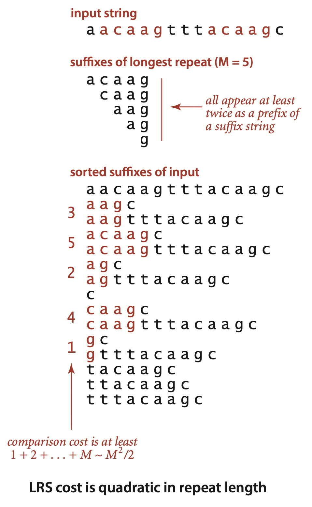


... Re-markably, research by P. Weiner in 1973 showed that it is possible to solve the longest repeated substring problem in guaranteed linear time. Weiner’s algorithm was based on building a suffix tree data structure (essentially a trie for suffixes).  With multiple pointers per character, suffix trees consume too much space for many practical problems, which led to the development of suffix arrays. In the 1990s, U. Manber and E. Myers presented a linearithmic algorithm for building suffix arrays directly and a method that does preprocessing at the same time as the suffix sort to support *constant-time* `lcp()`. Several linear-time suffix sorting algorithms have been developed since. With a bit more work, the Manber-Myers implementation can also support a two-argument `lcp()` that finds the longest common prefix of two given suffixes that are not necessarily adjacent in guaranteed constant time, again a remarkable improvement over the straightforard implementation. 


**Proposition D.** With suffix arrays, we can solve both the suffix sorting and longest repeated substring problems in linear time.  
*Proof:* The remarkable algorithms for these tasks are just beyond our scope, but you can find on the booksite code that implements the `SuffixArray` constructor in linear time and `lcp()` queries in constant time


#### Network-flow algorithms
... The solution that we consider illustrates the tension between our quest for implementations of general applicability and our quest for efficient solutions to specific problems. ... As you will see, we have straightforward implementations that are guaranteed to run in time proportional to a polynomial in the size of the network.


##### A physical model.
... Specifically, imagine a collection of interconnected oil pipes of varying sizes, with switches controlling the direction of flow at junctions, as in the example illustrated at right. Suppose further that the network has a single *source* (say, an oil field) and a single *sink* (say, a large refinery) to which all the pipes ultimately connect. At each vertex, the flowing oil reaches an equilibrium where the amount of oil flowing in is equal to the amount flowing out. We measure both flow and pipe capacity in the same units (say, gallons per second). If every switch has the property that the total capacity of the ingoing pipes is equal to the total capacity of the outgoing pipes, then there is no problem to solve: we simply fill all pipes to full capacity. Otherwise, not all pipes are full, but oil flows through the network, controlled by switch settings at the junctions, satisfying a *local equilibrium* condition at the junctions: the amount of oil flowing into each junction is equal to the amount of oil flowing out.

... for a complicated network, we are clearly interested in the following question: What switch settings will maximize the amount of oil flowing from source to sink? 


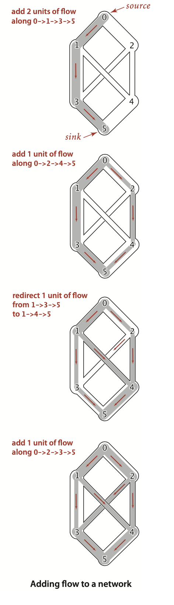


... We can model this situation directly with an edge-weighted digraph ...

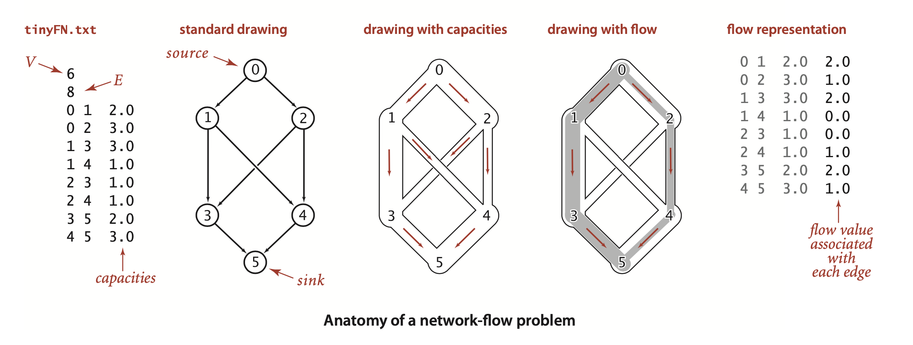


##### Definitions.

**Definition.** *A flow network* is an edge-weighted digraph with positive edge weights (which we refer to as capacities). An *st-flow* network has two identified vertices, a source *s* and a sink *t*.


**Definition.** An *st-flow* in an *st-flow* network is a set of nonnegative values associated with each edge, which we refer to as *edge* flows. We say that a flow is *feasible* if it satisfies the condition that no edge’s flow is greater than that edge’s capacity and the local equilibrium condition that the every vertex’s netflow is zero (except *s* and *t*).


We refer to the sink’s inflow as the st-flow *value*. We will see in Proposition C that the value is also equal to the source’s outflow.


**Maximum st-flow.** Given an *st*-flow network, find an *st*-flow such that no other flow from *s* to *t* has a larger value.


For brevity, we refer to such a flow as a *maxflow* and the problem of finding one in a network as the *maxflow problem*.


##### APIs.

... The implementation of `FlowNetwork` is virtually identical to our `EdgeWeightedGraph` implementation on page 611, so we omit it. 


**Checking that a flow is feasible in a flow network**
```java
private boolean localEq(FlowNetwork G, int v)
{  // Check local equilibrium at each vertex.
    double EPSILON = 1E-11;
    double netflow = 0.0;
    for (FlowEdge e : G.adj(v))
        if (v == e.from()) netflow -= e.flow();
        else               netflow += e.flow();

    return Math.abs(netflow) < EPSILON;
}

private boolean isFeasible(FlowNetwork G)
{
    // Check that flow on each edge is nonnegative
    //   and not greater than capacity.
    for (int v = 0; v < G.V(); v++)
        for (FlowEdge e : G.adj(v))
            if (e.flow() < 0 || e.flow() > e.cap())
                return false;

    // Check local equilibrium at each vertex.
    for (int v = 0; v < G.V(); v++)
        if (v !=s && v != t && !localEq(v))
            return false;

    return true;
}
```


##### Ford-Fulkerson algorithm.
...  It is a generic method for increasing flows incrementally along paths from source to sink that serves as the basis for a family of algorithms.  ... the more descriptive term *augmenting-path algorithm* is also widely used. 

... Let $x$ be the minimum of the unused capacities of the edges on the path. We can increase the network’s flow value by at least $x$ by increasing the flow in all edges on the path by that amount. Iterating this action, we get a first attempt at computing flow in a network: find another path, increase the flow along that path, and continue until all paths from source to sink have at least one full edge (so that we can no longer increase flow in this way). ... Toimprove the algorithm such that it always finds a maxflow, we consider a more general way to increase the flow, along a path from source to sink through the network’s underlying *undirected* graph. ... Now, for any path with no full forward edges and no empty backward edges, we can increase the amount of flow in the network by increasing flow in forward edges and decreasing flow in backward edges. ... The amount by which the flow can be increased is limited by the minimum of the unused capacities `(Contributor's Note: bottlenecks)` in the forward edges and the flows in the backward edges. Such a path is called an *augmenting path*.

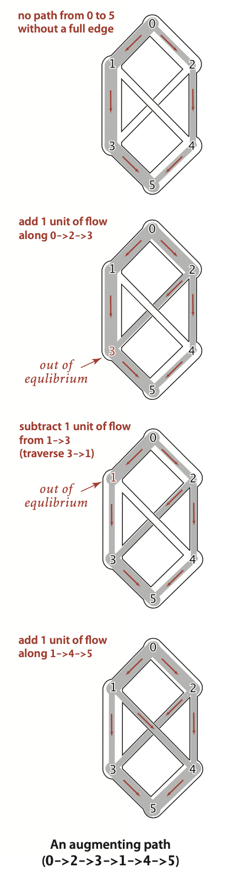

**Ford-Fulkerson maxflow algorithm.** Start with zero flow everywhere. Increase the flow along any augmenting path from source to sink (with no full forward edges or empty backward edges), continuing until there are no such paths in the network.

##### Maxflow-mincut theorem.

**Definition.** An *st-cut* is a cut that places vertex *s* in one of its sets and vertex *t* in the other.


Each crossing edge corresponding to an *st*-cut is either an *st-edge* that goes from a vertex in the set containing *s* to a vertex in the set containing *t*, or a *ts-edge* that goes in the other direction. We sometimes refer to the set of crossing *st*-edges as a *cut set*. The *capacity* of an *st*-cut in a flow network is the sum of the capacities of that cut’s *st*-edges, and the flow across an *st*-cut is the difference between the sum of the flows in that cut’s *st*-edges and the sum of the flows in that cut’s *ts*-edges. Removing all the *st*-edges (the cut set) in an *st*-cut of a network leaves no path from *s* to *t*, but adding any one of them back could create such a path.


**Minimum st-cut.** Given an *st*-network, find an *st*-cut such that the capacity of no other cut is smaller. For brevity, we refer to such a cut as a *mincut* and to the problem of finding one in a network as the *mincut* problem.


... On the contrary, the maxflow and mincut problems are intimately related. 


**Proposition E.** For any *st*-flow, the flow across each *st*-cut is equal to the value of the flow.  
**Proof:** Let $C_s$ be the vertex set containing $s$ and $C_t$ the vertex set containing $t$. This fact follows immediately by induction on the size of $C_t$. The property is true by definition when $C_t$ is $t$ and when a vertex is moved from $C_s$ to $C_t$, local equilibrium at that vertex implies that the stated property is preserved. Any *st*-cut can be created by moving vertices in this way.

**Corollary.** The outflow from $s$ is equal to the inflow to $t$ (the value of the *st*-flow).  
**Proof:** Let $C_s$ be ${s}$.*


**Corollary.** No *st*-flow’s value can exceed the capacity of any *st*-cut.


**Proposition F. (Maxflow-mincut theorem)** Let $f$ be an *st*-flow. The following three conditions are equivalent:  
i. There exists an *st*-cut whose capacity equals the value of the flow $f$.  
ii. $f$ is a maxflow.  
iii. There is no augmenting path with respect to $f$.  
**Proof:** Condition *i.* implies condition *ii.* by the corollary to Proposition E. Condition *ii.* implies condition *iii.* because the existence of an augmenting path implies the existence of a flow with a larger flow value, contradicting the maximality of $f$.  
It remains to prove that condition *iii.* implies condition *i.* Let $C_s$ be the set of all vertices that can be reached from $s$ with an undirected path that does not contain a full forward or empty backward edge, and let $C_t$ be the remaining vertices. Then, $t$ must be in $C_t$ , so $(Cs, Ct)$ is an *st*-cut, whose cut set consists entirely of full forward or empty backward edges. The flow across this cut is equal to the cut’s capacity (since forward edges are full and the backward edges are empty) and also to the value of the network flow (by Proposition E).


**Corollary.(Integrality property)** When capacities are integers, there exists an integer-valued maxflow, and the Ford-Fulkerson algorithm finds it.  
**Proof:** Each augmenting path increases the flow by a positive integer (the minimum of the unused capacities in the forward edges and the flows in the backward edges, all of which are always positive integers).


##### Residual network. 

**Definition.** Given a *st*-flow network and an *st*-flow, the *residual network* for the flow has the same vertices as the original and one or two edges in the residual network for each edge in the original, defined as follows: For each edge $e$ from $v$ to $w$ in the original, let $f_e$ be its flow and $c_e$ its capacity. If $f_e$ is positive, include an edge `w->v` in the residual with capacity $f_e$ ; and if $f_e$ is less than $c_e$, include an edge `v->w` in the residual with capacity $c_e - f_ e$.

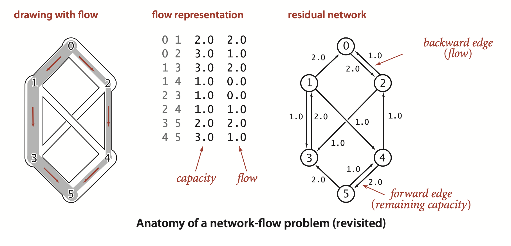

Flow edge data type (residual network)
```java
public class FlowEdge
{
    private final int v;            // edge source
    private final int w;            // edge target
    private final double capacity;  // capacity
    private double flow;            // flow

    public FlowEdge(int v, int w, double capacity)
    {
        this.v = v;
        this.w = w;
        this.capacity = capacity;
        this.flow = 0.0;
    }

    public int from()         {  return v;          }
    public int to()           {  return w;          }
    public double capacity()  {  return capacity;   }
    public double flow()      {  return flow;       }
    public int other(int vertex)
    // same as for Edge
        
    public double residualCapacityTo(int vertex)
    {
        if      (vertex == v) return flow;
        else if (vertex == w) return cap - flow;
        else throw new RuntimeException("Inconsistent edge");
    }

    public void addResidualFlowTo(int vertex, double delta)
    {
        if      (vertex == v) flow -= delta;
        else if (vertex == w) flow += delta;
        else throw new RuntimeException("Inconsistent edge");
    }

    public String toString()
    {  return String.format("%d->%d %.2f %.2f", v, w, capacity, flow);  }
}
```


##### Shortest-augmenting-path method.

 Perhaps the simplest Ford-Fulkerson implementation is to use a *shortest* augmenting path (as measured by the number of edges on the path, not flow or capacity). 

... This method was suggested by J. Edmonds and R. Karp in 1972. In this case, the search for an augmenting path amounts to breadth-first search (BFS) in the residual network ...

**Finding an augmenting path in the residual network via breadth-first search**
```java
private boolean hasAugmentingPath(FlowNetwork G, int s, int t)
{
    marked = new boolean[G.V()];  // Is path to this vertex known?
    edgeTo = new FlowEdge[G.V()]; // last edge on path
    Queue<Integer> q = new Queue<Integer>();

    marked[s] = true;             // Mark the source
    q.enqueue(s);                 //   and put it on the queue.
    while (!q.isEmpty())
    {
        int v = q.dequeue();
        for (FlowEdge e : G.adj(v))
        {
            int w = e.other(v);
            if (e.residualCapacityTo(w) > 0 && !marked[w])
            {  // For every edge to an unmarked vertex (in residual)
                edgeTo[w] = e;
                marked[w] = true;
                q.enqueue(w);
            }
        }
    }
    return marked[t];
}
```

**ALGORITHM 6.14 Ford-Fulkerson shortest-augmenting path maxflow algorithm **
```java
public class FordFulkerson
{
    private boolean[] marked;       // Is s->v path in residual graph?
    private FlowEdge[] edgeTo;      // last edge on shortest s->v path
    private double value;           // current value of maxflow

    public FordFulkerson(FlowNetwork G, int s, int t)
    {  // Find maxflow in flow network G from s to t.
        while (hasAugmentingPath(G, s, t))
        {  // While there exists an augmenting path, use it.
            // Compute bottleneck capacity.
            double bottle = Double.POSITIVE_INFINITY;
            for (int v = t; v != s; v = edgeTo[v].other(v))
                bottle = Math.min(bottle, edgeTo[v].residualCapacityTo(v));
            // Augment flow.
            for (int v = t; v != s; v = edgeTo[v].other(v))
                edgeTo[v].addResidualFlowTo(v, bottle);
            value += bottle;
        }
    }

    public double value()        {  return value;      }
    public boolean inCut(int v)  {  return marked[v];  }
    
    public static void main(String[] args)
    {
        FlowNetwork G = new FlowNetwork(new In(args[0]));
        int s = 0, t = G.V() - 1;
        FordFulkerson maxflow = new FordFulkerson(G, s, t);

        StdOut.println("Max flow from " + s + " to " + t);
        for (int v = 0; v < G.V(); v++)
            for (FlowEdge e : G.adj(v))
                if ((v == e.from()) && e.flow() > 0)
                    StdOut.println("   " + e);
        StdOut.println("Max flow value = " +  maxflow.value());
    } 
}
```
```
% java FordFulkerson tinyFN.txt
Max flow from 0 to 5
  0->2 3.0 2.0
  0->1 2.0 2.0
  1->4 1.0 1.0
  1->3 3.0 1.0
  2->3 1.0 1.0
  2->4 1.0 1.0
  3->5 2.0 2.0
  4->5 3.0 2.0
Max flow value = 4.0
```

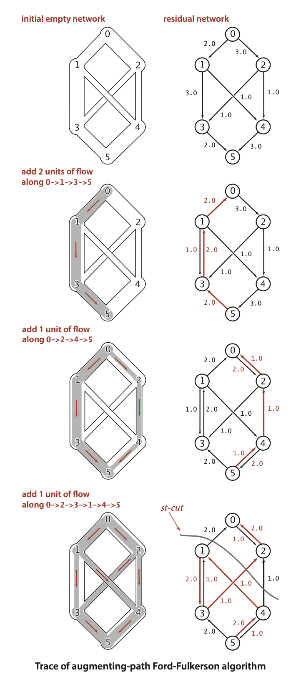


##### Performance.
**Proposition G.** The number of augmenting paths needed in the shortest-augmenting-path implementation of the Ford-Fulkerson maxflow algorithm for a flow network with $V$ vertices and $E$ edges is at most $EV/2$.  
**Proof sketch:** Every augmenting path has a *critical edge*—an edge that is deleted from the residual network because it corresponds either to a forward edge that becomes filled to capacity or a backward edge that is emptied. Each time an edge is a critical edge, the length of the augmenting path through it must increase by 2 (see Exercise 6.39). Since an augmenting path is of length at most $V$ each edge can be on at most $V/2$ augmenting paths, and the total number of augmenting paths is at most $EV/2$.


**Corollary.** The shortest-augmenting-path implementation of the Ford-Fulkerson maxflow algorithm takes time proportional to $VE^2/2$ in the worst case.  
**Proof:** Breadth-first search examines at most $E$ edges.


##### Other implementations.
Another Ford-Fulkerson implementation, suggested by Edmonds and Karp, is the following: Augment along the path that increases the flow by the largest amount. For brevity, we refer to this method as the *maximum-capacityaugmenting-path* maxflow algorithm. We can implement this (and other approaches) by using a priority queue and slightly modifying our implementation of Dijkstra’s shortest-paths algorithm, choosing edges from the priority queue to give the maximum amount of flow that can be pushed through a forward edge or diverted from a backward edge. Or, we might look for a longest augmenting path, or make a random choice.


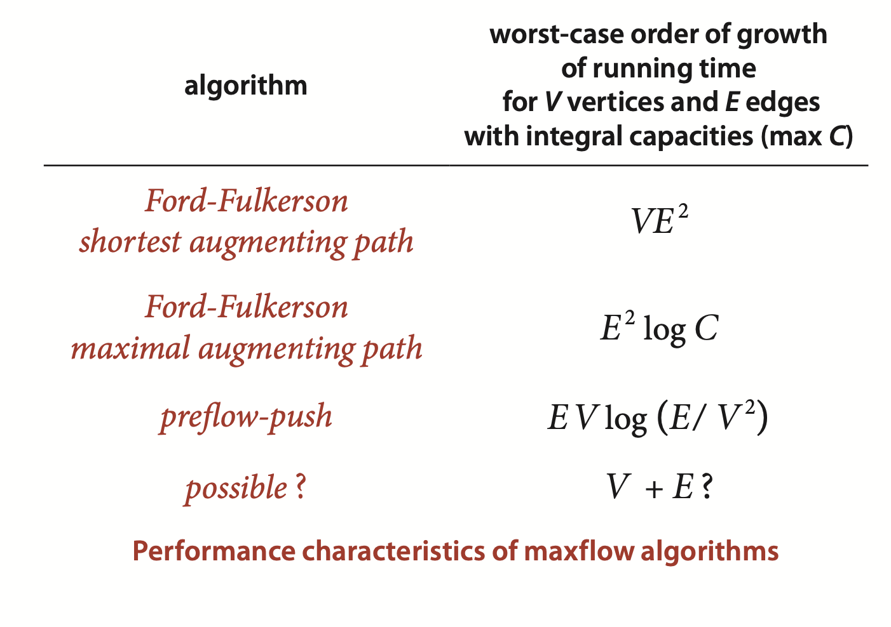


#### Reduction

**Definition.** We say that a problem $A$ *reduces* to another problem $B$ if we can use an algorithm that solves $B$ to develop an algorithm that solves $A$.

...  For example, we can find the median of a set of numbers in linear time, but using the reduction to sorting will end up costing linearithmic time. Even so, such extra cost might be acceptable, since we can use an exisiting sort implementation. Sorting is valuable for three reasons:
- It is useful in its own right.
- We have an efficient algorithms for solving it.
- Many problems reduce to it.


##### Maxflow reductions.


**Proposition J.** The following problems reduce to the maxflow problem:
- Job placement
- Product distribution
- Network reliability
- [many other problems] 

**Proof example:** We prove the first (which is known as the *maximum bipartite matching problem*) and leave the others for exercises. Given a job-placement problem, construct an instance of the maxflow problem by directing all edges from students to companies, adding a source vertex with edges directed to all the students and adding a sink vertex with edges directed from all the companies. Assign each edge capacity 1. Now, any integral solution to the maxflow problem for this network provides a solution to the corresponding bipartite matching problem (see the corollary to Proposition F). The matching corresponds exactly to those edges between vertices in the two sets that are filled to capacity by the maxflow algorithm. First, the network flow always gives a legal matching: since each vertex has an edge of capacity 1 either coming in (from the sink) or going out (to the source), at most 1 unit of flow can go through each vertex, implying in turn that each vertex will be included at most once in the matching. Second, no matching can have more edges, since any such matching would lead directly to a better flow than that produced by the maxflow algorithm.

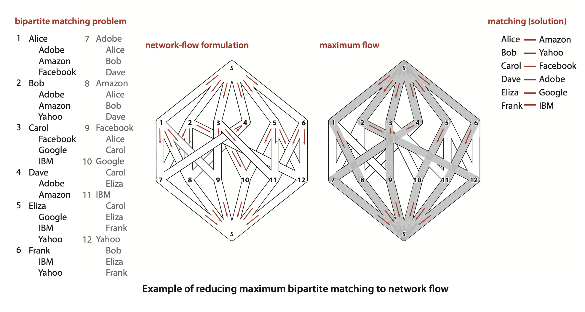


For example, as illustrated in the figure at right, an augmenting-path maxflow algorithm might use the paths s->1->7->t, s->2->8->t, s->3->9->t, s->5->10->t, s->6->11->t, and s->4->7->1->8->2->12->t to compute the matching 1-8, 2-12, 3-9, 4-7, 5-10, and 6-11. Thus, there is a way to match all the students to jobs in our example. Each augmenting path fills one edge from the source and one edge into the sink. Note that these edges are never used as back edges, so there are at most $V$ augmenting paths. and a total running time proportional to $VE$.

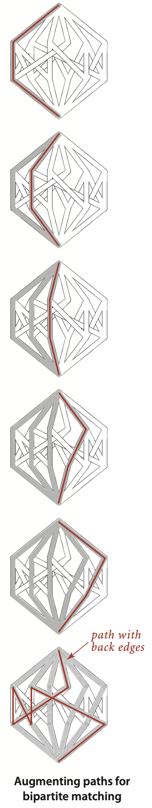


###### Linear programming. 

**Linear programming.** Given a set of $M$ *linear inequalities* and linear equations involving $N$ variables, and a linear *objective function* of the $N$ variables, find an assignment of values to the variables that maximizes the objective function, or report that no feasible assignment exists.

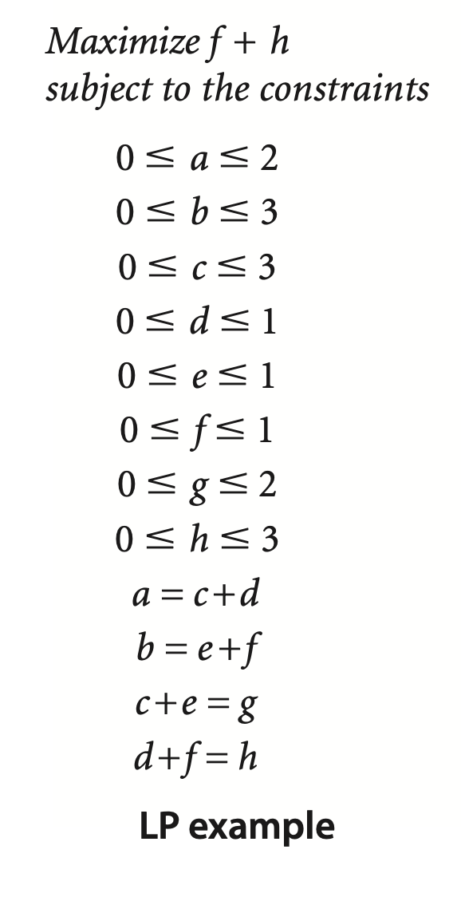


**Proposition K.** The following problems reduce to linear programming
- Maxflow
- Shortest paths
- [many, many other problems]

*Proof example:* We prove the first and leave the second to Exercise 6.49. We consider a system of inequalities and equations that involve one variable corresponding to each edge, two inequalities corresponding to each edge, and one equation corresponding to each vertex (except the source and the sink). The value of the variable is the edge flow, the inequalities specify that the edge flow must be between 0 and the edge’s capacity, and the equations specify that the total flow on the edges that go into each vertex must be equal to the total flow on the edges that go out of that vertex. Any max flow problem can be converted into an instance of a linear programming problem in this way, and the solution is easily converted to a solution of the maxflow problem. The illustration below gives the details for our example.


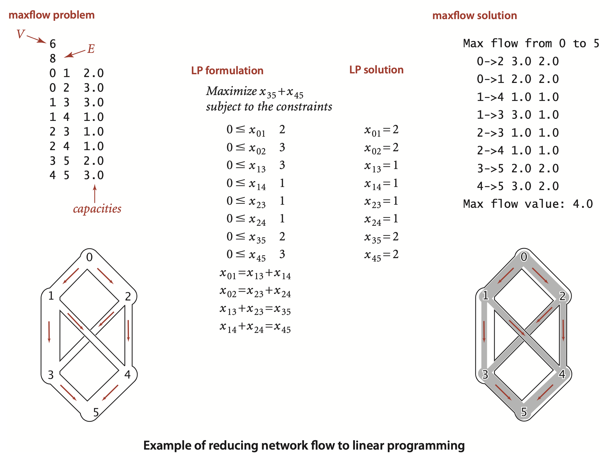


In a very real sense, linear programming is the parent of problem-solving models, since so many problems reduce to it. 


What sorts of problems do not reduce to linear programming? Here is an example of such a problem:


**Load balancing.** Given a set of jobs of specified duration to be completed, how can we schedule the jobs on two identical processors so as to minimize the completion time of all the jobs?


#### Intractability

... there exist problems for which no one knows any algorithm that is guaranteed to be efficient.


##### Groundwork. 


... Turing machines form the foundation of theoretical computer science, starting with the following two ideas:
- *Universality* . All physically realizable computing devices can be simulated by a Turing machine. This idea is known as the *Church-Turing thesis*. This is a statement about the natural world and cannot be proven (but it can be falsified).
- *Computability* . There exist problems that cannot be solved by a Turing machine (or by any other computing device, by universality). This is a mathematical truth. The halting problem (no program can guarantee to determine whether a given program will halt) is a famous example of such a problem.


... a third idea, ....  
*Extended Church-Turing thesis.* The order of growth of the running time of a program to solve a problem on any computing device is within a polynomial factor of some program to solve the problem on a Turing machine (or any other computing device). ... In recent years, the idea of *quantum computing* has given some researchers reason to doubt the extended Church-Turing thesis.


##### Exponential running time. 
The purpose of the theory of intractability is to separate problems that can be solved in polynomial time from problems that (probably) require *exponential* time to solve in the worst case.  It is useful to think of an exponential-time algorithm as one that, for some input of size $N$, takes time proportional to $2^N$ (at least). The substance of the argument does not change if we replace 2 by any number $ \alpha > 1$. We generally take as granted that an exponential-time algorithm cannot be guaranteed to solve a problem of size 100 (say) in a reasonable amount of time, because no one can wait for an algorithm to take $2^100@ steps, regardless of the speed of the computer.

... *Longest-path length.* What is the length of the longest simple path from a given vertex `s` to a given vertex `t` in a given graph? ... but all known algorithms for the second problem take *exponential* time in the worst case.

```java
public class LongestPath
{
    private boolean[] marked;
    private int max;

    public LongestPath(Graph G, int s, int t)
    {
        marked = new boolean[G.V()];
        dfs(G, s, t, 0);
    }

    private void dfs(Graph G, int v, int t, int i)
    {
        if (v == t && i > max) max = i;
        if (v == t) return;
        marked[v] = true;
        for (int w : G.adj(v))
            if (!marked[w]) dfs(G, w, t, i+1);
        marked[v] = false; // Contributor's Note: So it visits this node in the next round also.
    }
    public int maxLength()
    {  return max;  }
}
```


##### Search problems.

**Definition.** A search problem is a problem having solutions with the property that the time needed to *certify* that any solution is correct is bounded by a polynomial in the size of the input. We say that an algorithm *solves* a search problem if, given any input, it either produces a solution or reports that none exists.


*Definition.* **NP** is the set of all search problems.

>Contributor's Note:  
> $NP$ refers to the class of decision problems (yes/no problems) for which a solution, if given, can be verified in polynomial time by a deterministic Turing machine.

##### Selected search problems
*Linear equation satisfiability.* Given a set of $M$ linear equations involving $N$ variables, find an assignment of values to the variables that satisfies all of the equations, or report that none exists.  
*Linear inequality satisfiability (search formulation of linear programming).* Given a set of $M$ linear inequalities involving $N$ variables, find an assignment of values to the variables that satisfies all of the inequalities, or report that none exists.  
*0-1 integer linear inequality satisfiability (search formulation of 0-1 integer linear programming).* Given a set of $M$ linear inequalities involving $N$ integer variables, find an assignment of the values 0 or 1 to the variables that satisfies all of the inequalities, or report that none exists.  
*Boolean satisfiability.* Given a set of $M$ equations involving and and or operations on $N$ boolean variables, find an assignment of values to the variables that satisfies all of the equations, or report that none exists.


##### Other types of problems.
... For example, the longest-paths length problem on page 911 is an optimization problem, not a search problem (given a solution, we have no way to verify that it is a longest-path length). A search version of this problem is to find a simple path connecting all the vertices (this problem is known as the *Hamiltonian path problem*). ... While not technically equivalent, search, decision, and optimization problems typically reduce to one another (see Exercise 6.58 and 6.59) and the main conclusions we draw apply to all three types of problems.


###### Easy search problems.

**Definition.** $P$ is the set of all search problems that can be solved in polynomial time.


##### Nondeterminism.
The **N** in **NP** stands for *nondeterminism*. .... For the purposes of our discussion, we can think of an algorithm for a nondeterministic machine as “guessing” the solution to a problem, then certifying that the solution is valid.


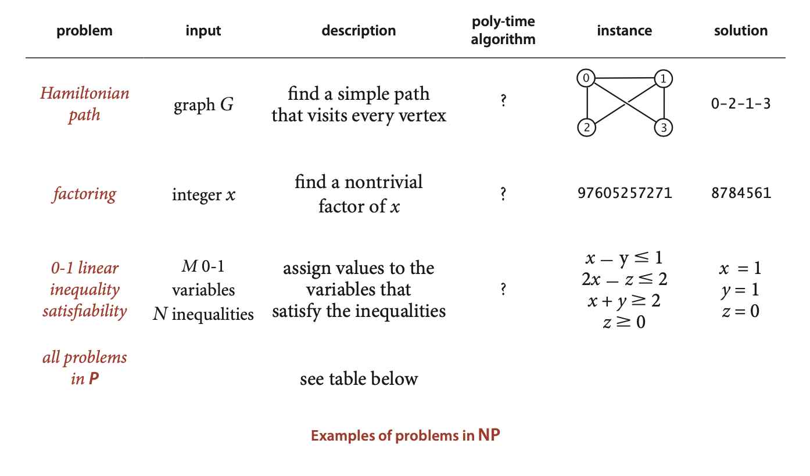

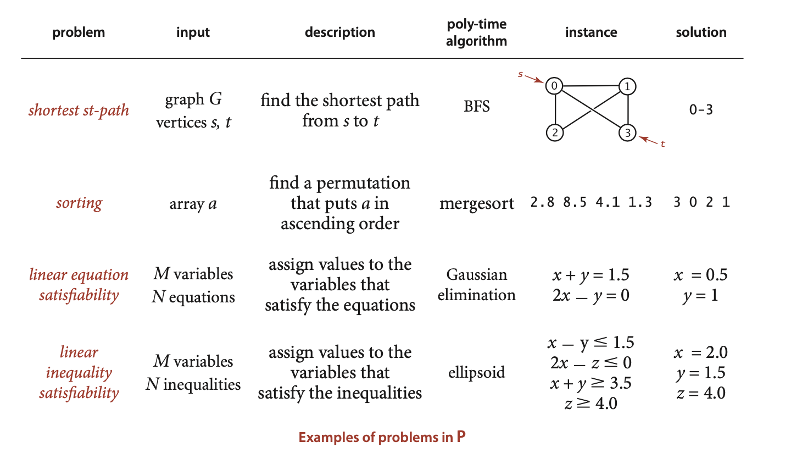


##### The main question.
... Virtually no one believes that **P** = **NP**, and a considerable amount of effort has gone into proving the contrary, but this remains the outstanding open research problem in computer science.


##### Poly-time reductions.
.... Now, we use reduction in another sense: to prove a problem to be hard to solve. If a problem A is known to be hard to solve, and A poly-time reduces to B, then B must be hard to solve, too. Otherwise, a guaranteed polynomial-time solution to B would give a guaranteed polynomial-time solution to A.


**Proposition L.** Boolean satisfiability poly-time reduces to 0-1 integer linear inequality satisfiability.  
**Proof:** Given an instance of boolean satisfiability, define a set of inequalities with one 0-1 variable corresponding to each boolean variable and one 0-1 variable corresponding to each clause, as illustrated in the example at right. With this construction, we can tranform a solution to the integer 0-1 linear inequality satisfiability problem to a solution to the boolean satisfiability problem by assigning each boolean variable to be true if the corresponding integer variable is 1 and *false* if it is 0.


**Corollary.** If satisfiability is hard to solve,then so is integer linear programming.


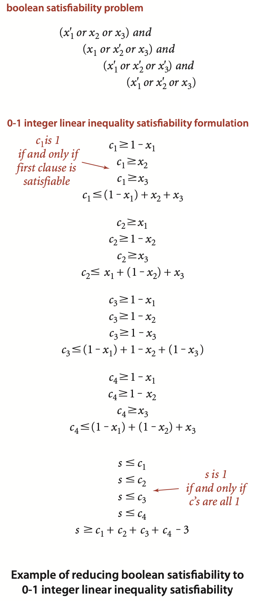


... In the present context, by “hard to solve,” we mean “not in P.” We generally use the word *intractable* to refer to problems that are not in P. 


##### NP-completeness.

**Definition.** A search problem $A$ is said to be ***NP**-complete* if all problems in **NP** polytime reduce to $A$.


... If *any* **NP**-complete problem can be solved in polynomial time on a deterministic machine, then so can *all problems* in **NP** (i.e., **P** = **NP**). ... **NP**-complete problems, meaning that we do not expect to find guaranteed polynomial-time algorithms.  


##### Cook-Levin theorem.

**Proposition M. (Cook-Levintheorem)** Boolean satisfiability is **NP**-complete.  
**Extremely brief proof sketch:** The goal is to show that if there is a polynomial time algorithm for boolean satisfiability, then all problems in **NP** can be solved in polynomial time. Now, a nondeterministic Turing machine can solve any problem in **NP**, so the first step in the proof is to describe each feature of the machine in terms of logical formulas such as appear in the boolean satisfiability problem. This construction establishes a correspondence between every problem in **NP** (which can be expressed as a program on the nondeterministic Turing machine) and some instance of satisfiability (the translation of that program into a logical formula). Now, the solution to the satisfiability problem essentially corresponds to a simulation of the machine running the given program on the given input, so it produces a solution to an instance of the given problem. Further details of this proof are well beyond the scope of this book. Fortunately, only one such proof is really necessary: it is much easier to use reduction to prove **NP**-completeness.


.... The fact that no good algorithm has been found for any of these problems is surely strong evidence that **P ≠ NP**, and most researchers certainly believe this to be the case. 

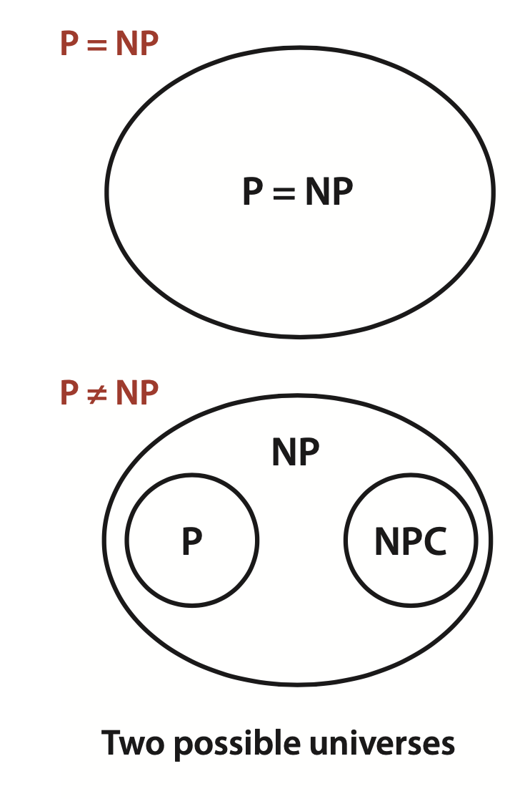


###### Classifying problems.
... To prove that a problem in **NP** is **NP**-complete, we need to show that some known **NP**-complete problem is poly-time reducible to it: that is, that a polynomialtime algorithm for the new problem could be used to solve the **NP**-complete problem, and then could, in turn, be used to solve all problems in **NP**.


... Classifying problems as being easy to solve (in **P**) or hard to solve (**NP**-complete) can be:
- *Straightforward.* For example, the venerable Gaussian elimination algorithm proves that linear equation satisfiability is in P.
- *Tricky but not difficult.* For example, developing a proof like the proof of Proposition A takes some experience and practice, but it is easy to understand.
- *Extremely challenging.* For example, linear programming was long unclassified, but Khachian’s ellipsoid algorithm proves that linear programming is in P.
- *Open.* For example, *graph isomorphism* (given two graphs, find a way to rename the vertices of one to make it identical to the other) and *factor* (given an integer, find a nontrivial factor) are still unclassified.


###### Coping with NP-completeness.
 ... One approach is to change the problem and find an “approximation” algorithm that finds not the best solution but a solution guaranteed to be close to the best. ... Another approach is to develop an algorithm that solves efficiently virtually all of the instances that do arise in practice, even though there exist worst-case inputs for which finding a solution is infeasible. The most famous example of this approach are the integer linear programming solvers, ... A third approach is to work with “efficient” exponential algorithms, using a technique known as *backtracking* to avoid having to check all possible solutions. Finally, there is quite a large gap between polynomial and exponential time that is not addressed by the theory. What about an algorithm that runs in time proportional to $N^{\log N}$ or $2^{\sqrt N}$ ?


 ... The most important practical contribution of the theory of **NP**-completeness is that it provides a mechanism to discover whether a new problem from any of these diverse areas is “easy” or “hard.”
