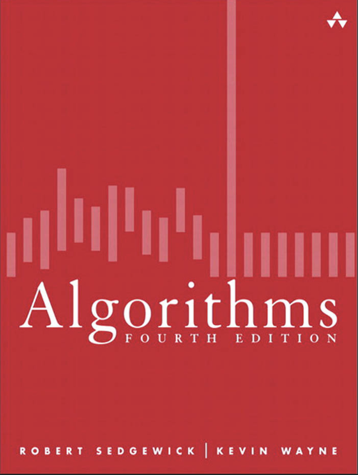

# Sedgewick’s *Algorithms* Notes

This repository contains Markdown (`.md`) notes based on the classic book *“Algorithms, 4th Edition”* by Robert Sedgewick and Kevin Wayne.

The book is a great candidate for condensation, as it offers clear implementations and excellent illustrations serving as an abstract way of conveying information. With just the right amount of explanatory text added, these notes make the material more concise and accessible, ideal for refreshing key concepts and preparing for interviews.

I’ve also included personal notes where I found they help clarify certain ideas or provide additional intuition.

To maintain orthogonality and conciseness, I included content related to the Java language selectively. For the complete material, see Chapters 1.1, 1.2, and 1.3 of the book.

## Table of Contents

### 1. Fundamentals
- [1.1 Basic Programming Model](./01-fundamentals/01-basic-programming-model.md)
- [1.2 Data Abstraction](./01-fundamentals/02-data-abstraction.md)
- [1.3 Bags, Queues, and Stacks](./01-fundamentals/03-bags-queues-and-stacks.md)
- [1.4 Analysis of Algorithms](./01-fundamentals/04-analysis-of-algorithms.md)
- [1.5 Case Study: Union-Find](./01-fundamentals/05-case-study-union-find.md)

### 2. Sorting
- [2.1 Elementary Sorts](./02-sorting/01-elementary-sorts.md)
- [2.2 Mergesort](./02-sorting/02-mergesort.md)
- [2.3 Quicksort](./02-sorting/03-quicksort.md)
- [2.4 Priority Queues](./02-sorting/04-priority-queues.md)
- [2.5 Applications](./02-sorting/05-applications.md)

### 3. Searching
- [3.1 Symbol Tables](./03-searching/01-symbol-tables.md)
- [3.2 Binary Search Trees](./03-searching/02-binary-search-trees.md)
- [3.3 Balanced Search Trees](./03-searching/03-balanced-search-trees.md)
- [3.4 Hash Tables](./03-searching/04-hash-tables.md)
- [3.5 Applications](./03-searching/05-applications.md)

### 4. Graphs
- [4.1 Undirected Graphs](./04-graphs/01-undirected-graphs.md)
- [4.2 Directed Graphs](./04-graphs/02-directed-graphs.md)
- [4.3 Minimum Spanning Trees](./04-graphs/03-minimum-spanning-trees.md)
- [4.4 Shortest Paths](./04-graphs/04-shortest-path.md)

### 5. Strings
- [5.1 String Sorts](./05-strings/01-string-sorts.md)
- [5.2 Tries](./05-strings/02-tries.md)
- [5.3 Substring Search](./05-strings/03-substring-search.md)
- [5.4 Regular Expressions](./05-strings/04-regular-expressions.md)
- [5.5 Data Compression](./05-strings/05-data-compression.md)

### 6. Context
- [6.1 Context](./06-context/01-context.md)

---

If you find any errors or inconsistencies, feel free to open an issue, and I’ll correct them promptly :)
